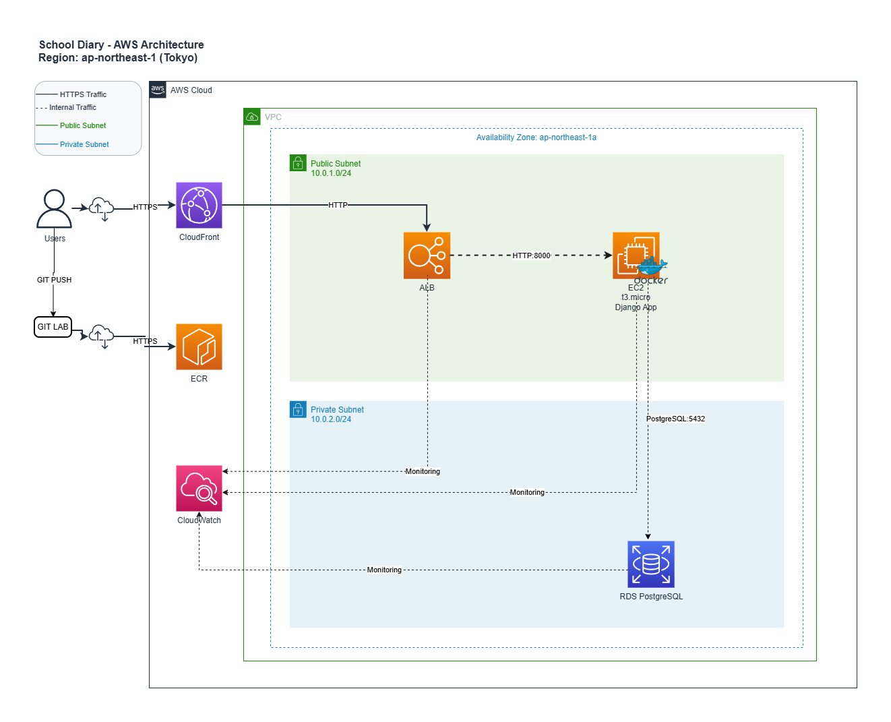

# 連絡帳管理システム

生徒の体調・メンタル・振り返りを記録し、担任が確認・フィードバックを行う中学校向け Web アプリケーション。

---

## ✨ デモを試す

**本番環境**: https://d2wk3j2pacp33b.cloudfront.net

**テストアカウント**（全て password123）:

- 生徒: `student_001@example.com`（1 年 A 組 山田太郎）
- 担任: `teacher_1_b@example.com`（1 年 B 組担任）
- 学年主任: `teacher_1_a@example.com`（1 年 A 組担任 兼 1 年学年主任）
- 校長: `principal@example.com`
- 管理者: `admin@example.com`

[全アカウント一覧](doc/MANUAL_FOR_CLIENT.md)

---

## 主要機能

- ✅ **連絡帳の記録・管理** - 体調・メンタル・振り返りを ★1-5 で記録
- ✅ **Inbox Pattern** - 優先度別分類（P0-P3）で効率的に確認
- ✅ **早期警告システム** - 3 日連続メンタル低下を自動検知し学年主任に通知
- ✅ **担任メモの学年共有** - 気づいた情報をタイムリーに共有
- ✅ **統計ダッシュボード** - 学年主任・校長向けの全体把握機能
- ✅ **5 ロール対応** - 生徒・担任・学年主任・校長・管理者

詳細: [機能仕様](doc/FEATURES.md)

---

## 技術スタック

**Backend**: Python 3.12 / Django 5.1 / PostgreSQL 16 / Gunicorn

**Frontend**: Bootstrap 5.3 / Django Templates / AJAX

**Infrastructure**: Docker / Terraform / AWS (CloudFront, ALB, EC2, RDS)

**Development**: pytest / Ruff / mypy

---

## アーキテクチャ

詳細: [アーキテクチャ設計](terraform/ARCHITECTURE.md) / [データモデル](doc/ER_DIAGRAM.md)

---

## ドキュメント

### 利用者向け

- [操作マニュアル](doc/MANUAL_FOR_CLIENT.md) - 各ロールの使い方、全アカウント一覧

### 開発者向け

- [ローカル環境構築](doc/LOCAL_DEPLOYMENT.md) - Docker Compose で 10 分セットアップ
- [機能仕様](doc/FEATURES.md) - 機能一覧、画面一覧、セキュリティポリシー
- [データモデル](doc/ER_DIAGRAM.md) - ER 図、テーブル設計、リレーション

### 運用者向け

- [本番環境デプロイ記録](doc/PRODUCTION_DEPLOYMENT.md) - Terraform、AWS 構築実績
- [技術仕様](doc/TECHNICAL_SPECIFICATION.md) - アーキテクチャ、監視、セキュリティ

### 提出資料

- [プレゼンテーション](doc/PRESENTATION.md) - 課題の工夫点、感想

---

**作成日**: 2025-10-06
**最終更新**: 2025-10-30
