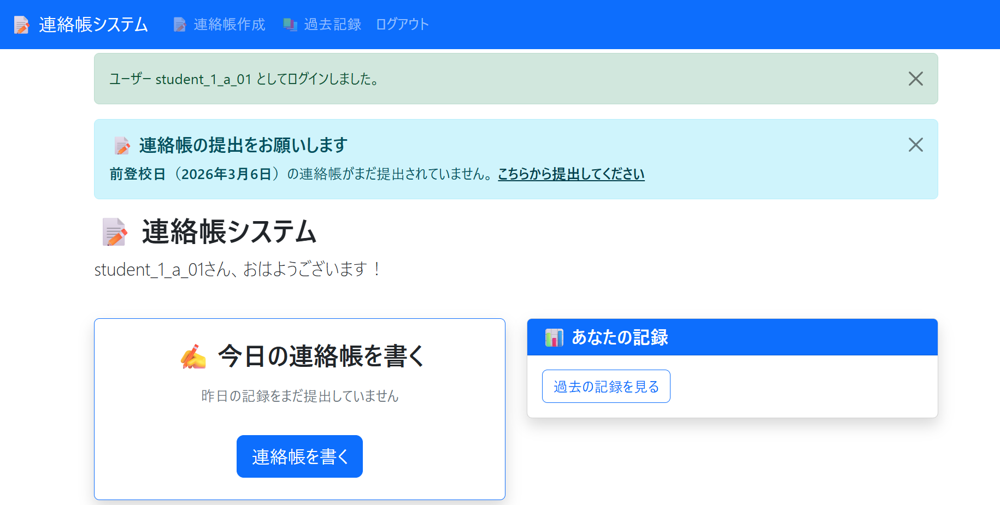
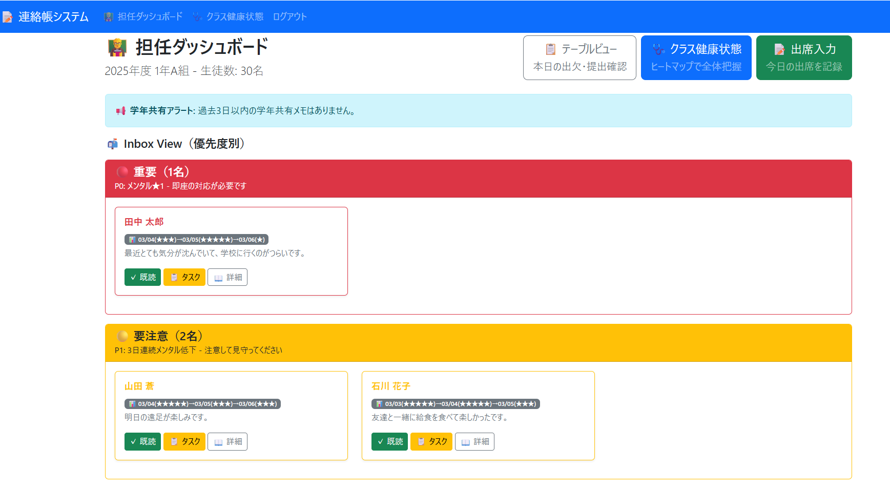
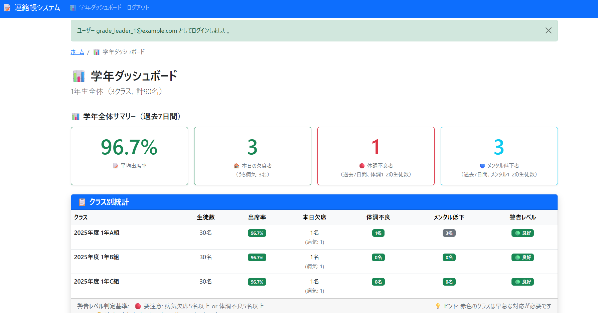
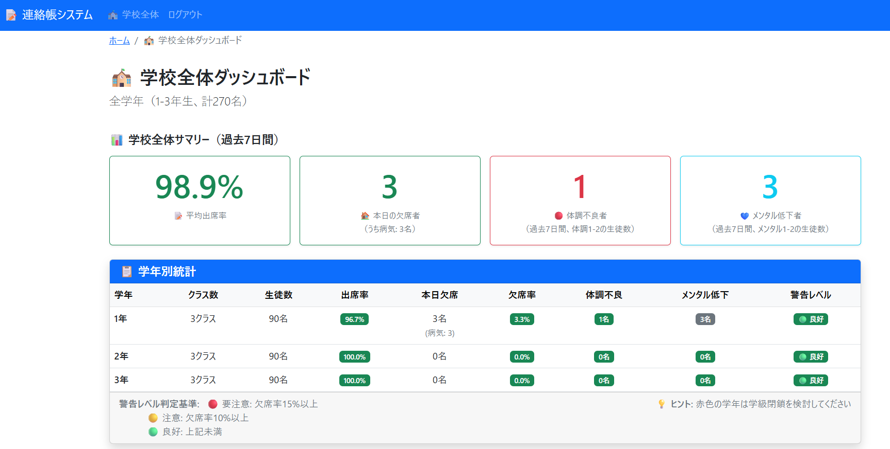
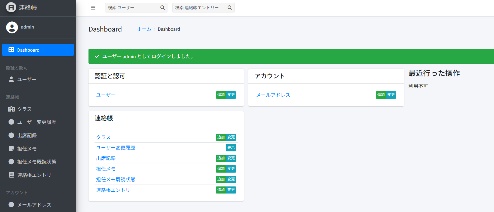
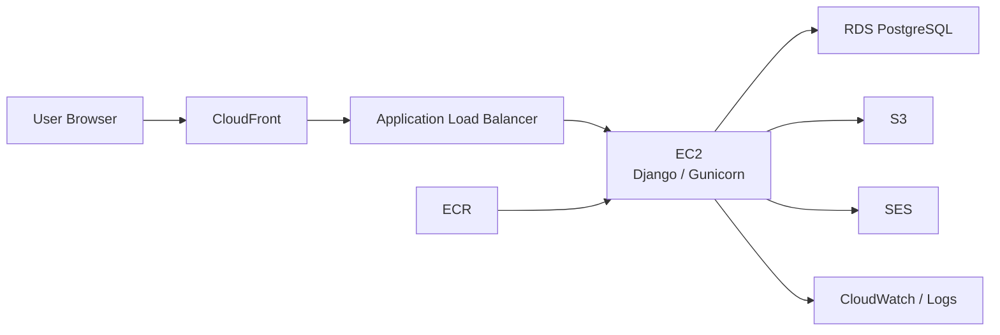

# 連絡帳管理システム

中学校向けの連絡帳管理を題材にした学校向け業務 Web アプリケーションです。  
生徒の体調・メンタル・振り返りを記録し、担任が優先度順に状況を確認できるように設計しています。  
単なる紙の連絡帳のデジタル化ではなく、「忙しい担任が生徒の SOS を見逃しにくくすること」を軸に、ダッシュボード、共有メモ、統計画面まで含めて実装しています。

---

## この制作物でできること

- 生徒が日々の体調・メンタル・振り返りを 1 日 1 件で記録できる
- 担任が既読処理、対応記録、担任メモ、出席記録を一元管理できる
- 学年主任・校長が学年/学校単位の傾向をダッシュボードで把握できる
- AWS 上に公開環境を構築し、Terraform で再構築可能な形にしている

---

## 見どころ

- **Inbox Pattern**: 担任が重要な生徒から確認できるよう、P0-P3 で優先度分類
- **ロールベース認可**: 生徒、担任、学年主任、校長、管理者でアクセス範囲を分離
- **ダッシュボード集計**: 担任向け、学年主任向け、校長向けに見たい粒度を分けて設計
- **担任メモ共有**: 学年内でタイムリーに状況共有できるメモ機能を実装
- **AWS + Terraform**: アプリだけでなく公開環境まで含めて一貫して構築

---

## 主要機能

- ✅ **連絡帳の記録・管理** - 体調・メンタル・振り返りを ★1-5 で記録
- ✅ **Inbox Pattern** - 優先度別分類（P0-P3）で効率的に確認
- ✅ **早期警告システム** - 3 日連続メンタル低下を自動検知し、ダッシュボード上で alert 表示
- ✅ **担任メモの学年共有** - 気づいた情報をタイムリーに共有
- ✅ **統計ダッシュボード** - 学年主任・校長向けの全体把握機能
- ✅ **5 ロール対応** - 生徒・担任・学年主任・校長・管理者

詳細: [機能仕様](docs/FEATURES.md)

---

## スクリーンショット

### 生徒ダッシュボード

日々の連絡帳提出状況と過去記録への導線をまとめた画面です。

### 担任ダッシュボード

Inbox Pattern による優先度分類と、既読・タスク化をまとめた画面です。

### 学年主任ダッシュボード

学年全体の出席率、体調不良、メンタル低下を俯瞰できる画面です。

### 校長/教頭ダッシュボード

学校全体の傾向を学年別に把握できる管理職向け画面です。

### 管理画面

ユーザー、クラス、連絡帳関連データを管理できる Django Admin 画面です。

---

## 技術スタック

**Backend**: Python 3.12 / Django 5.1 / Gunicorn

**Frontend**: Bootstrap 5.3 / Django Templates / AJAX

**Database**: PostgreSQL 16（AWS RDS）

**Infrastructure**: AWS CloudFront / ALB / EC2 / RDS / S3 / ECR / SES / Terraform

**Quality**: pytest / Ruff / mypy

---

## 技術的な工夫

- 認可判定を共通化し、ロールとアクセス範囲の判定を分散させない構成にしている
- 連絡帳の状態遷移を service 層へ寄せ、view から直接状態を書き換えないようにしている
- 担任/管理職ダッシュボードの集計を service に分離し、view を薄くしている
- URL の正本を 1 か所に集約し、公開環境を再構築しても更新箇所を最小化している
- AWS/Terraform で公開環境をコード管理し、手作業依存を減らしている
- CloudWatch を起点にした運用監視や、ServiceNow / ITOM 連携を見据えた改善方針を docs 化している

---

## 担当範囲

個人制作として、以下を一貫して担当しています。

- 企画と要件整理
- 画面設計、データモデル設計、権限設計
- Django アプリケーション実装
- AWS / Terraform による公開環境構築
- テスト、ドキュメント整備、README 整理

---

## アーキテクチャ

現在のインフラ構成は Terraform 定義を正本としています。

詳細: [アーキテクチャ設計](docs/TERRAFORM_ARCHITECTURE.md) / [データモデル](docs/ER_DIAGRAM.md)

---

## Continuous Improvement

運用品質とコスト最適化の継続的な改善に取り組んでいます。

| カテゴリ | 取り組み | ステータス |
|---------|---------|----------|
| 監視基盤 | アラーム重大度分類（P1/P2/P3） + CloudWatch ダッシュボード整備 | 完了 |
| イベント管理 | EventBridge → Lambda によるイベント正規化 | 予定 |
| ITSM 連携 | 正規化イベントを ServiceNow PDI へ自動起票 | 予定 |
| コスト最適化 | タグベース EC2 夜間自動停止 | 予定 |
| コスト最適化 | コスト異常検知 → ServiceNow 起票 | 予定 |
| 可用性制御 | CloudFront オリジン切替によるメンテナンスページ | 予定 |

詳細: [Continuous Improvement](docs/improvements/OVERVIEW.md)

---

## ドキュメント

### 制作物確認用

- [制作物概要](docs/PRESENTATION.md) - 背景、設計意図、主要機能をまとめた概要資料

### 利用・操作用

- [操作マニュアル](docs/MANUAL_FOR_CLIENT.md) - 各ロールの使い方、画面操作の確認用
- [機能仕様](docs/FEATURES.md) - 機能一覧、画面一覧、役割ごとの提供機能

### 技術確認用

- [技術仕様](docs/TECHNICAL_SPECIFICATION.md) - 技術スタック、AWS/Terraform 構成、運用の事実
- [アプリ構成解説](docs/SYSTEM_ARCHITECTURE.md) - Django アプリの責務分割と構成理解の入口
- [データモデル](docs/ER_DIAGRAM.md) - ER 図、テーブル設計、リレーション
- [Continuous Improvement](docs/improvements/OVERVIEW.md) - 運用品質・コスト最適化の継続的改善

---

**作成日**: 2025-10-06
**最終更新**: 2026-03-09
