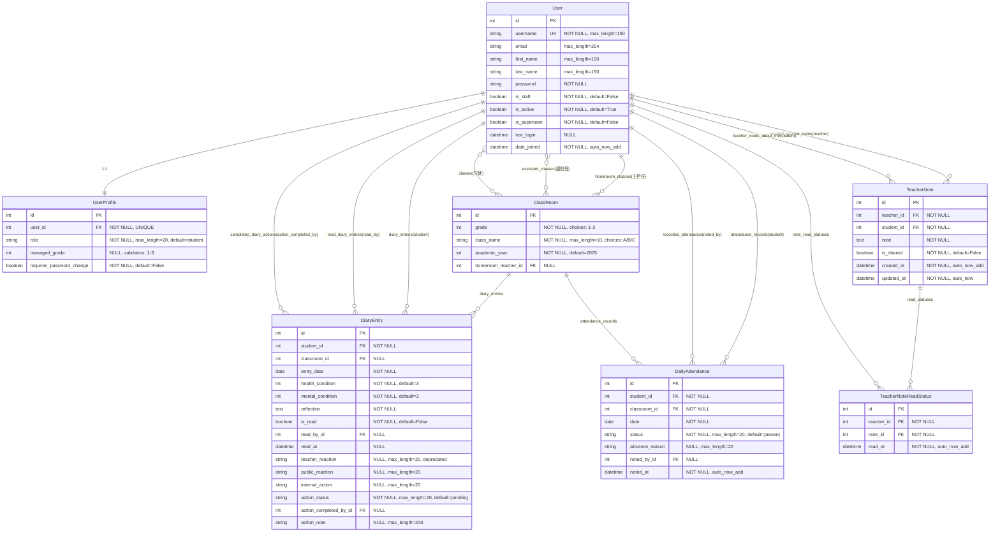

# データモデル設計（ER 図）

本書は連絡帳管理システムのデータベース設計を図解したものです。

---

## 概要

連絡帳管理システムは 7 つのエンティティで構成されています。

| エンティティ              | 役割                           | レコード数目安 |
| ------------------------- | ------------------------------ | -------------- |
| **User**                  | ユーザー（生徒・担任・管理者） | 500-1000       |
| **UserProfile**           | 役割ベースの権限管理           | 500-1000       |
| **ClassRoom**             | クラス情報（学年・組）         | 10-20          |
| **DiaryEntry**            | 連絡帳エントリー（健康記録）   | 100,000/年     |
| **TeacherNote**           | 担任メモ（長期観察記録）       | 1,000-5,000    |
| **TeacherNoteReadStatus** | 担任メモ既読管理               | 10,000-50,000  |
| **DailyAttendance**       | 出席記録                       | 100,000/年     |

### 設計方針

1. **正規化**: 第 3 正規形まで正規化、冗長性を排除
2. **パフォーマンス**: 頻繁なクエリには INDEX、N+1 問題対策
3. **保守性**: 明示的な命名、related_name で逆参照を明確化
4. **データ整合性**: unique_together、外部キー制約

---

## ER 図

---

## エンティティ詳細

### 1. User（ユーザー）

Django 標準の認証ユーザーモデル（AbstractUser）。

| カラム       | データ型    | NULL     | 説明                                  |
| ------------ | ----------- | -------- | ------------------------------------- |
| id           | Integer     | NOT NULL | 主キー                                |
| username     | String(150) | NOT NULL | ユーザー名（ログイン ID）※UNIQUE      |
| email        | String(254) | -        | メールアドレス                        |
| first_name   | String(150) | -        | 名                                    |
| last_name    | String(150) | -        | 姓                                    |
| password     | String      | NOT NULL | パスワード（ハッシュ化）              |
| is_staff     | Boolean     | NOT NULL | 管理画面アクセス権限（default=False） |
| is_active    | Boolean     | NOT NULL | アカウント有効状態（default=True）    |
| is_superuser | Boolean     | NOT NULL | システム管理者（default=False）       |
| last_login   | DateTime    | NULL     | 最終ログイン日時                      |
| date_joined  | DateTime    | NOT NULL | 登録日時（auto_now_add）              |

**ordering**: `["-date_joined"]`

**用途**: 生徒、担任、管理者すべてのユーザーを管理

---

### 2. UserProfile（ユーザープロフィール）

役割ベースの権限管理。変更履歴を自動記録（django-simple-history）。

| カラム                   | データ型   | NULL     | 説明                                      |
| ------------------------ | ---------- | -------- | ----------------------------------------- |
| id                       | Integer    | NOT NULL | 主キー                                    |
| user_id                  | Integer    | NOT NULL | ユーザー（FK）※UNIQUE                     |
| role                     | String(20) | NOT NULL | 役割（default=student）                   |
| managed_grade            | Integer    | NULL     | 学年主任の管理学年（1-3）※validators: 1-3 |
| requires_password_change | Boolean    | NOT NULL | パスワード変更が必要（default=False）     |

**カスタム Manager**: UserProfileManager - N+1 問題対策（with_related）

**変更履歴**: HistoricalRecords（role 変更を追跡可能）

**リレーション**: User ↔ UserProfile（1:1, CASCADE）

**role choices**:

- `admin`: システム管理者
- `student`: 生徒
- `teacher`: 担任
- `grade_leader`: 学年主任
- `school_leader`: 教頭/校長

**用途**: 5 つの役割（生徒、担任、学年主任、校長/教頭、システム管理者）を管理

---

### 3. ClassRoom（クラス）

学年・組の単位。

| カラム              | データ型   | NULL     | 説明                           |
| ------------------- | ---------- | -------- | ------------------------------ |
| id                  | Integer    | NOT NULL | 主キー                         |
| grade               | Integer    | NOT NULL | 学年（1-3）                    |
| class_name          | String(10) | NOT NULL | クラス名（A/B/C）              |
| academic_year       | Integer    | NOT NULL | 年度（例: 2025, default=2025） |
| homeroom_teacher_id | Integer    | NULL     | 主担任（FK, SET_NULL）         |

**カスタム Manager**: ClassRoomManager - N+1 問題対策（with_related）

**M2M（多対多）**:

- assistant_teachers: 副担任（複数）
- students: 生徒（複数）

**UNIQUE 制約**: (grade, class_name, academic_year)

**ordering**: `["academic_year", "grade", "class_name"]`

**grade choices**: 1（1 年生）, 2（2 年生）, 3（3 年生）

**class_name choices**: A（A 組）, B（B 組）, C（C 組）

**用途**: 1 年 A 組、2 年 B 組などのクラス単位を管理

---

### 4. DiaryEntry（連絡帳エントリー）

生徒の健康・メンタル記録。

| カラム                 | データ型    | NULL     | 説明                         |
| ---------------------- | ----------- | -------- | ---------------------------- |
| id                     | Integer     | NOT NULL | 主キー                       |
| student_id             | Integer     | NOT NULL | 生徒（FK, CASCADE）          |
| classroom_id           | Integer     | NULL     | 所属クラス（FK, PROTECT）    |
| entry_date             | Date        | NOT NULL | 記載日                       |
| health_condition       | Integer     | NOT NULL | 体調（1-5, default=3）       |
| mental_condition       | Integer     | NOT NULL | メンタル（1-5, default=3）   |
| reflection             | Text        | NOT NULL | 今日の振り返り               |
| is_read                | Boolean     | NOT NULL | 既読（default=False）        |
| read_by_id             | Integer     | NULL     | 既読者（FK, SET_NULL）       |
| read_at                | DateTime    | NULL     | 既読日時                     |
| teacher_reaction       | String(20)  | NULL     | 担任の対応（非推奨、旧仕様） |
| public_reaction        | String(20)  | NULL     | 生徒への反応（👍 など）      |
| internal_action        | String(20)  | NULL     | 対応記録（保護者連絡など）   |
| action_status          | String(20)  | NOT NULL | 対応状況（default=pending）  |
| action_completed_by_id | Integer     | NULL     | 対応者（FK, SET_NULL）       |
| action_note            | String(200) | NULL     | 対応内容メモ                 |

**カスタム Manager**: DiaryEntryManager - N+1 問題対策（with_related）

**UNIQUE 制約**: (student_id, entry_date) ※1 人 1 日 1 件

**INDEX**: entry_date, is_read, action_status, internal_action

**ordering**: `["-entry_date", "student__last_name", "student__first_name"]`

**health_condition/mental_condition choices**:

- 1: とても悪い / とても落ち込んでいる
- 2: 悪い / 落ち込んでいる
- 3: 普通
- 4: 良い / 元気
- 5: とても良い / とても元気

**public_reaction choices**: thumbs_up, well_done, good_effort, excellent, support, checked

**internal_action choices**: needs_follow_up, urgent, parent_contacted, individual_talk, shared_meeting, monitoring

**action_status choices**: pending, in_progress, completed, not_required

**用途**: 毎日の連絡帳（健康記録、振り返り、担任からの反応）

---

### 5. TeacherNote（担任メモ）

生徒の長期的な観察記録・引継ぎ情報。

| カラム     | データ型 | NULL     | 説明                            |
| ---------- | -------- | -------- | ------------------------------- |
| id         | Integer  | NOT NULL | 主キー                          |
| teacher_id | Integer  | NOT NULL | 担任（FK, CASCADE）             |
| student_id | Integer  | NOT NULL | 対象生徒（FK, CASCADE）         |
| note       | Text     | NOT NULL | メモ内容                        |
| is_shared  | Boolean  | NOT NULL | 学年会議で共有（default=False） |
| created_at | DateTime | NOT NULL | 作成日時（auto_now_add）        |
| updated_at | DateTime | NOT NULL | 更新日時（auto_now）            |

**カスタム Manager**: TeacherNoteManager - N+1 問題対策（with_related）

**ordering**: `["-updated_at"]`

**用途**: 担任が生徒について記録（個人メモ・学年共有メモ）

---

### 6. TeacherNoteReadStatus（担任メモ既読状態）

学年共有メモの既読管理。

| カラム     | データ型 | NULL     | 説明                     |
| ---------- | -------- | -------- | ------------------------ |
| id         | Integer  | NOT NULL | 主キー                   |
| teacher_id | Integer  | NOT NULL | 担任（FK, CASCADE）      |
| note_id    | Integer  | NOT NULL | 担任メモ（FK, CASCADE）  |
| read_at    | DateTime | NOT NULL | 既読日時（auto_now_add） |

**カスタム Manager**: TeacherNoteReadStatusManager - N+1 問題対策（with_related）

**UNIQUE 制約**: (teacher_id, note_id)

**INDEX**: 複合 INDEX（teacher, note）

**ordering**: `["-read_at"]`

**用途**: 学年共有メモを誰が既読したか管理（学年会議で活用）

---

### 7. DailyAttendance（出席記録）

学級閉鎖判断の基礎データ。

| カラム         | データ型   | NULL     | 説明                        |
| -------------- | ---------- | -------- | --------------------------- |
| id             | Integer    | NOT NULL | 主キー                      |
| student_id     | Integer    | NOT NULL | 生徒（FK, CASCADE）         |
| classroom_id   | Integer    | NOT NULL | クラス（FK, PROTECT）       |
| date           | Date       | NOT NULL | 日付                        |
| status         | String(20) | NOT NULL | 出席状況（default=present） |
| absence_reason | String(20) | NULL     | 欠席理由（欠席時のみ必須）  |
| noted_by_id    | Integer    | NULL     | 記録者（FK, SET_NULL）      |
| noted_at       | DateTime   | NOT NULL | 記録日時（auto_now_add）    |

**カスタム Manager**: DailyAttendanceManager - N+1 問題対策（with_related）

**UNIQUE 制約**: (student_id, date) ※1 人 1 日 1 件

**INDEX**: date, status, absence_reason

**ordering**: `["-date", "student__last_name", "student__first_name"]`

**status choices**:

- `present`: 出席
- `absent`: 欠席
- `late`: 遅刻
- `early_leave`: 早退

**absence_reason choices**:

- `illness`: 病気
- `family`: 家庭の都合
- `other`: その他

**用途**: 出席記録、学級閉鎖判断（欠席理由が illness の生徒数を集計）

---

## 主要リレーション

### 1. User ↔ UserProfile（1:1）

ユーザーには必ず 1 つの役割（role）がある。

**実装**: UserProfile.user (FK, CASCADE)

---

### 2. User ↔ ClassRoom（1:N、主担任）

担任教員は複数のクラスを主担任として持てる（年度ごと）。

**実装**: ClassRoom.homeroom_teacher (FK, SET_NULL)

---

### 3. User ↔ ClassRoom（N:M、副担任）

クラスには複数の副担任、副担任は複数のクラスを担当可能。

**実装**: ClassRoom.assistant_teachers (M2M)

---

### 4. User ↔ ClassRoom（N:M、生徒）

クラスには複数の生徒、生徒は複数のクラスに所属可能（年度ごと）。

**実装**: ClassRoom.students (M2M)

---

### 5. User ↔ DiaryEntry（1:N、student）

生徒は複数の連絡帳を記入（毎日）。

**実装**: DiaryEntry.student (FK, CASCADE)

**制約**: (student_id, entry_date) UNIQUE ※1 人 1 日 1 件

---

### 6. User ↔ DiaryEntry（1:N、read_by）

担任は複数の連絡帳を既読処理。

**実装**: DiaryEntry.read_by (FK, SET_NULL, nullable)

---

### 7. ClassRoom ↔ DiaryEntry（1:N）

クラスには複数の連絡帳（生徒 × 日数）。

**実装**: DiaryEntry.classroom (FK, PROTECT, nullable)

---

### 8. User ↔ TeacherNote（1:N、teacher）

担任は複数の生徒についてメモを作成。

**実装**: TeacherNote.teacher (FK, CASCADE)

---

### 9. User ↔ TeacherNote（1:N、student）

生徒について複数の担任がメモを記録（年度ごと）。

**実装**: TeacherNote.student (FK, CASCADE)

---

### 10. TeacherNote ↔ TeacherNoteReadStatus（1:N）

学年共有メモは複数の担任が既読（学年の担任人数分）。

**実装**: TeacherNoteReadStatus.note (FK, CASCADE)

---

### 11. User ↔ DailyAttendance（1:N、student）

生徒は複数の出席記録を持つ（毎日）。

**実装**: DailyAttendance.student (FK, CASCADE)

---

### 12. ClassRoom ↔ DailyAttendance（1:N）

クラスには複数の出席記録（生徒 × 日数）。

**実装**: DailyAttendance.classroom (FK, PROTECT)

---

## 設計のポイント

### 1. 正規化による冗長性排除

- DiaryEntry に classroom_id を持たせて、生徒のクラス移動に対応
- User と UserProfile を分離し、役割変更履歴を記録可能に

### 2. パフォーマンス最適化

- 頻繁なクエリに INDEX（entry_date, is_read, action_status）
- N+1 問題対策としてカスタム Manager/QuerySet 実装（select_related/prefetch_related）

### 3. データ整合性

- unique_together 制約（1 人 1 日 1 件の連絡帳、1 人 1 日 1 件の出席記録）
- 外部キー制約（CASCADE/SET_NULL/PROTECT）
- カスタムバリデーション（clean()メソッド）

### 4. 拡張性

- UserProfile の role フィールドで 5 つの役割を管理（将来的に追加可能）
- ClassRoom の M2M（assistant_teachers）で複数担任に対応
- TeacherNote の is_shared で学年共有メモを管理

---

## 技術実装

- **ORM**: Django ORM（Python）
- **データベース**: PostgreSQL 16
- **マイグレーション**: Django Migrations
- **カスタム Manager**: N+1 問題対策（with_related()メソッド）
  - DiaryEntryManager
  - ClassRoomManager
  - TeacherNoteManager
  - TeacherNoteReadStatusManager
  - DailyAttendanceManager
- **変更履歴**: django-simple-history（UserProfile の役割変更を追跡）

---
