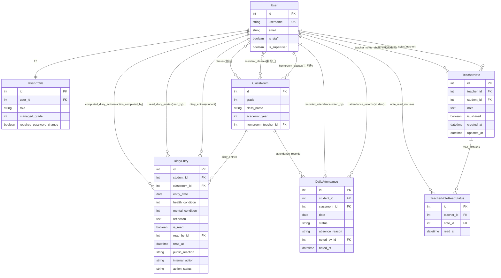

# データモデル設計（ER図）

本書は連絡帳管理システムのデータベース設計を図解したものです。

---

## 概要

連絡帳管理システムは7つのエンティティで構成されています。

| エンティティ | 役割 | レコード数目安 |
|------------|------|--------------|
| **User** | ユーザー（生徒・担任・管理者） | 500-1000 |
| **UserProfile** | 役割ベースの権限管理 | 500-1000 |
| **ClassRoom** | クラス情報（学年・組） | 10-20 |
| **DiaryEntry** | 連絡帳エントリー（健康記録） | 100,000/年 |
| **TeacherNote** | 担任メモ（長期観察記録） | 1,000-5,000 |
| **TeacherNoteReadStatus** | 担任メモ既読管理 | 10,000-50,000 |
| **DailyAttendance** | 出席記録 | 100,000/年 |

### 設計方針

1. **正規化**: 第3正規形まで正規化、冗長性を排除
2. **パフォーマンス**: 頻繁なクエリにはINDEX、N+1問題対策
3. **保守性**: 明示的な命名、related_nameで逆参照を明確化
4. **データ整合性**: unique_together、外部キー制約

---

## ER図

---

## エンティティ詳細

### 1. User（ユーザー）

Django標準の認証ユーザーモデル。

| カラム | データ型 | 説明 |
|--------|---------|------|
| id | Integer | 主キー |
| username | String(150) | ユーザー名（ログインID）※UNIQUE |
| email | String(254) | メールアドレス |
| is_staff | Boolean | 管理画面アクセス権限 |
| is_superuser | Boolean | システム管理者 |

**用途**: 生徒、担任、管理者すべてのユーザーを管理

---

### 2. UserProfile（ユーザープロフィール）

役割ベースの権限管理。

| カラム | データ型 | 説明 |
|--------|---------|------|
| id | Integer | 主キー |
| user_id | Integer | ユーザー（FK）※UNIQUE |
| role | String(20) | 役割（admin/student/teacher/grade_leader/school_leader） |
| managed_grade | Integer | 学年主任の管理学年（1-3） |
| requires_password_change | Boolean | パスワード変更が必要 |

**リレーション**: User ↔ UserProfile（1:1）

**用途**: 5つの役割（生徒、担任、学年主任、校長/教頭、システム管理者）を管理

---

### 3. ClassRoom（クラス）

学年・組の単位。

| カラム | データ型 | 説明 |
|--------|---------|------|
| id | Integer | 主キー |
| grade | Integer | 学年（1-3） |
| class_name | String(10) | クラス名（A/B/C） |
| academic_year | Integer | 年度（例: 2025） |
| homeroom_teacher_id | Integer | 主担任（FK） |

**M2M（多対多）**:
- assistant_teachers: 副担任（複数）
- students: 生徒（複数）

**UNIQUE制約**: (grade, class_name, academic_year)

**用途**: 1年A組、2年B組などのクラス単位を管理

---

### 4. DiaryEntry（連絡帳エントリー）

生徒の健康・メンタル記録。

| カラム | データ型 | 説明 |
|--------|---------|------|
| id | Integer | 主キー |
| student_id | Integer | 生徒（FK） |
| classroom_id | Integer | 所属クラス（FK） |
| entry_date | Date | 記載日 |
| health_condition | Integer | 体調（1-5） |
| mental_condition | Integer | メンタル（1-5） |
| reflection | Text | 今日の振り返り |
| is_read | Boolean | 既読 |
| read_by_id | Integer | 既読者（FK） |
| public_reaction | String(20) | 生徒への反応（👍など） |
| internal_action | String(20) | 対応記録（保護者連絡など） |
| action_status | String(20) | 対応状況（pending/in_progress/completed/not_required） |

**UNIQUE制約**: (student_id, entry_date) ※1人1日1件

**INDEX**: entry_date, is_read, action_status

**用途**: 毎日の連絡帳（健康記録、振り返り、担任からの反応）

---

### 5. TeacherNote（担任メモ）

生徒の長期的な観察記録・引継ぎ情報。

| カラム | データ型 | 説明 |
|--------|---------|------|
| id | Integer | 主キー |
| teacher_id | Integer | 担任（FK） |
| student_id | Integer | 対象生徒（FK） |
| note | Text | メモ内容 |
| is_shared | Boolean | 学年会議で共有 |
| created_at | DateTime | 作成日時 |
| updated_at | DateTime | 更新日時 |

**用途**: 担任が生徒について記録（個人メモ・学年共有メモ）

---

### 6. TeacherNoteReadStatus（担任メモ既読状態）

学年共有メモの既読管理。

| カラム | データ型 | 説明 |
|--------|---------|------|
| id | Integer | 主キー |
| teacher_id | Integer | 担任（FK） |
| note_id | Integer | 担任メモ（FK） |
| read_at | DateTime | 既読日時 |

**UNIQUE制約**: (teacher_id, note_id)

**用途**: 学年共有メモを誰が既読したか管理（学年会議で活用）

---

### 7. DailyAttendance（出席記録）

学級閉鎖判断の基礎データ。

| カラム | データ型 | 説明 |
|--------|---------|------|
| id | Integer | 主キー |
| student_id | Integer | 生徒（FK） |
| classroom_id | Integer | クラス（FK） |
| date | Date | 日付 |
| status | String(20) | 出席状況（present/absent/late/early_leave） |
| absence_reason | String(20) | 欠席理由（illness/family/other） |
| noted_by_id | Integer | 記録者（FK） |

**UNIQUE制約**: (student_id, date) ※1人1日1件

**INDEX**: date, status

**用途**: 出席記録、学級閉鎖判断（欠席理由がillnessの生徒数を集計）

---

## 主要リレーション

### 1. User ↔ UserProfile（1:1）

ユーザーには必ず1つの役割（role）がある。

**実装**: UserProfile.user (FK, CASCADE)

---

### 2. User ↔ ClassRoom（1:N、主担任）

担任教員は複数のクラスを主担任として持てる（年度ごと）。

**実装**: ClassRoom.homeroom_teacher (FK, SET_NULL)

---

### 3. User ↔ ClassRoom（N:M、副担任）

クラスには複数の副担任、副担任は複数のクラスを担当可能。

**実装**: ClassRoom.assistant_teachers (M2M)

---

### 4. User ↔ ClassRoom（N:M、生徒）

クラスには複数の生徒、生徒は複数のクラスに所属可能（年度ごと）。

**実装**: ClassRoom.students (M2M)

---

### 5. User ↔ DiaryEntry（1:N、student）

生徒は複数の連絡帳を記入（毎日）。

**実装**: DiaryEntry.student (FK, CASCADE)

**制約**: (student_id, entry_date) UNIQUE ※1人1日1件

---

### 6. User ↔ DiaryEntry（1:N、read_by）

担任は複数の連絡帳を既読処理。

**実装**: DiaryEntry.read_by (FK, SET_NULL, nullable)

---

### 7. ClassRoom ↔ DiaryEntry（1:N）

クラスには複数の連絡帳（生徒×日数）。

**実装**: DiaryEntry.classroom (FK, PROTECT, nullable)

---

### 8. User ↔ TeacherNote（1:N、teacher）

担任は複数の生徒についてメモを作成。

**実装**: TeacherNote.teacher (FK, CASCADE)

---

### 9. User ↔ TeacherNote（1:N、student）

生徒について複数の担任がメモを記録（年度ごと）。

**実装**: TeacherNote.student (FK, CASCADE)

---

### 10. TeacherNote ↔ TeacherNoteReadStatus（1:N）

学年共有メモは複数の担任が既読（学年の担任人数分）。

**実装**: TeacherNoteReadStatus.note (FK, CASCADE)

---

### 11. User ↔ DailyAttendance（1:N、student）

生徒は複数の出席記録を持つ（毎日）。

**実装**: DailyAttendance.student (FK, CASCADE)

---

### 12. ClassRoom ↔ DailyAttendance（1:N）

クラスには複数の出席記録（生徒×日数）。

**実装**: DailyAttendance.classroom (FK, PROTECT)

---

## 設計のポイント

### 1. 正規化による冗長性排除

- DiaryEntryにclassroom_idを持たせて、生徒のクラス移動に対応
- UserとUserProfileを分離し、役割変更履歴を記録可能に

### 2. パフォーマンス最適化

- 頻繁なクエリにINDEX（entry_date, is_read, action_status）
- N+1問題対策としてカスタムManager/QuerySet実装（select_related/prefetch_related）

### 3. データ整合性

- unique_together制約（1人1日1件の連絡帳、1人1日1件の出席記録）
- 外部キー制約（CASCADE/SET_NULL/PROTECT）
- カスタムバリデーション（clean()メソッド）

### 4. 拡張性

- UserProfileのroleフィールドで5つの役割を管理（将来的に追加可能）
- ClassRoomのM2M（assistant_teachers）で複数担任に対応
- TeacherNoteのis_sharedで学年共有メモを管理

---

## 技術実装

- **ORM**: Django ORM（Python）
- **データベース**: PostgreSQL 16
- **マイグレーション**: Django Migrations
- **カスタムManager**: N+1問題対策（with_related()メソッド）

