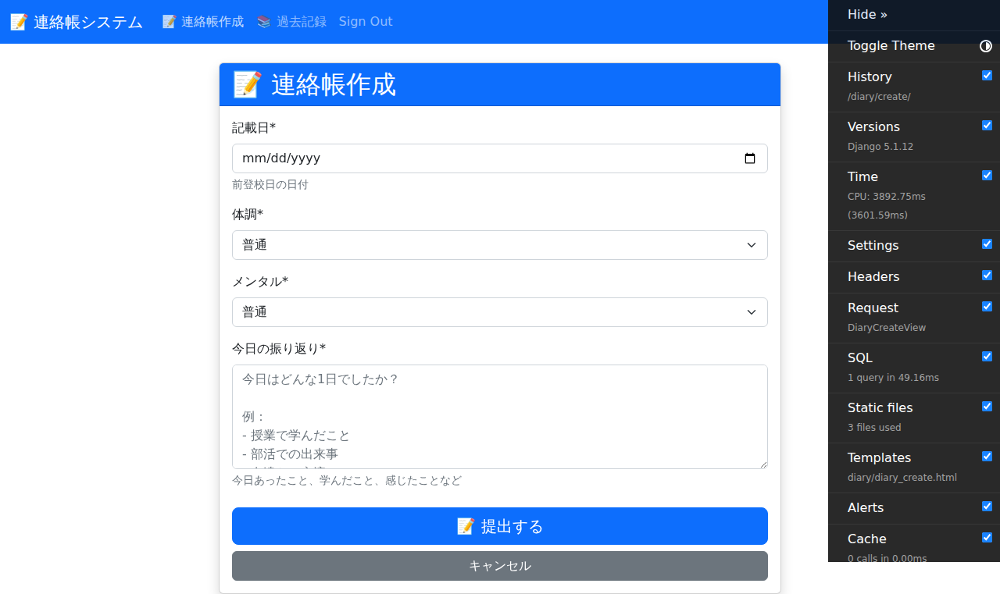
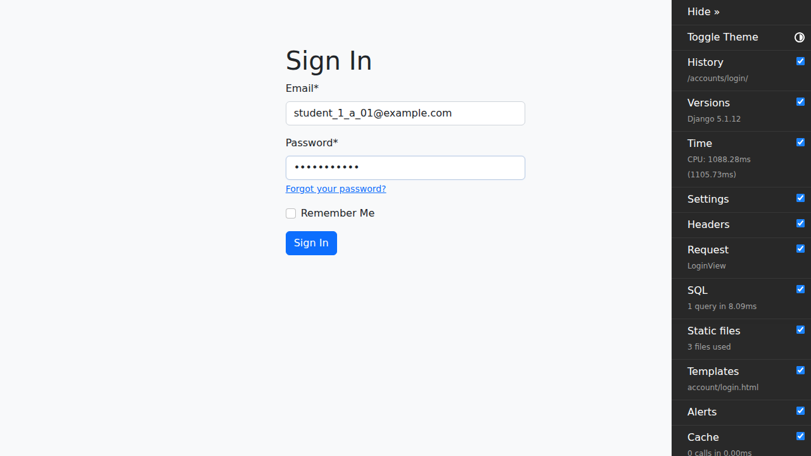
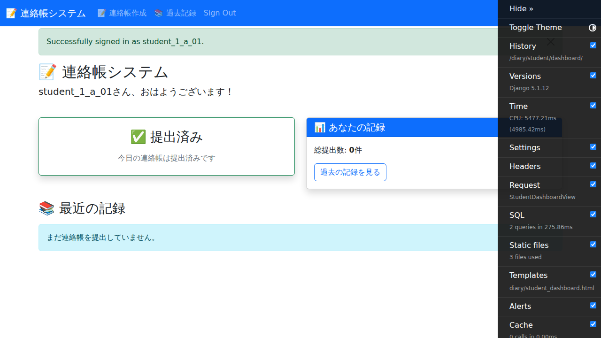

# 生徒用マニュアル

このマニュアルは、E2Eテストから自動生成されました。

作成日: 2025-10-27

---

## 目次

- [1. ログイン画面を表示](#1-)
- [2. メールアドレスとパスワードを入力](#2-)
- [3. ログインボタンをクリック](#3-)
- [4. 生徒ダッシュボードを確認](#4-)
- [1. 連絡帳作成ボタンをクリック](#1-)
- [1. 連絡帳作成ボタンをクリック](#1-)
- [1. 連絡帳作成ボタンをクリック](#1-)

---

## 操作手順

### 1. ログイン画面を表示

ブラウザでシステムにアクセスします。未認証の場合、自動的にログイン画面にリダイレクトされます。

---

### 2. メールアドレスとパスワードを入力

生徒用のメールアドレスとパスワードを入力します。テストアカウントは student_1_a_01@example.com / password123 です。

---

### 3. ログインボタンをクリック

ログインボタンをクリックしてログインします。

---

### 4. 生徒ダッシュボードを確認

ログインに成功すると、生徒ダッシュボードに自動的にリダイレクトされます。過去7日分の連絡帳が表示されます。

---

### 1. 連絡帳作成ボタンをクリック

生徒ダッシュボードから「新しい連絡帳を作成」ボタンをクリックします。

---

### 1. 連絡帳作成ボタンをクリック

生徒ダッシュボードから「新しい連絡帳を作成」ボタンをクリックします。

---

### 1. 連絡帳作成ボタンをクリック

生徒ダッシュボードから「新しい連絡帳を作成」ボタンをクリックします。

---

## トラブルシューティング

### ログインできない

- メールアドレスとパスワードが正しいか確認してください
- パスワードは大文字・小文字を区別します
- テストアカウント一覧は [TEST_ACCOUNTS.md](../TEST_ACCOUNTS.md) を参照してください

### 画面が表示されない

- ブラウザのキャッシュをクリアしてください
- 推奨ブラウザ（Chrome, Edge, Firefox, Safari）を使用してください

