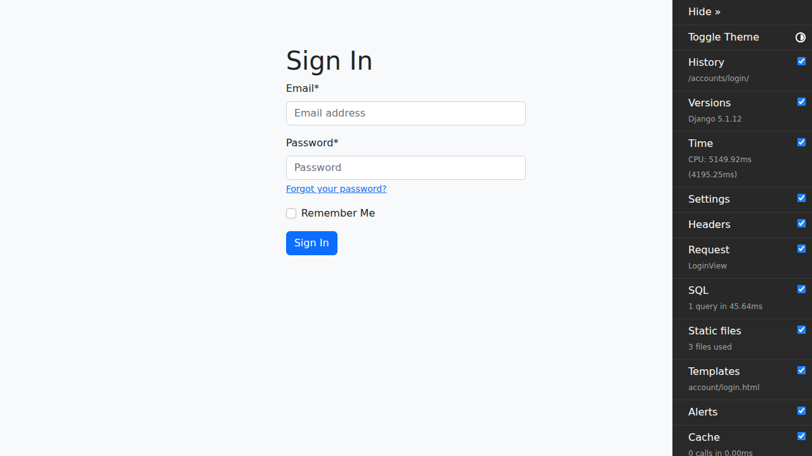
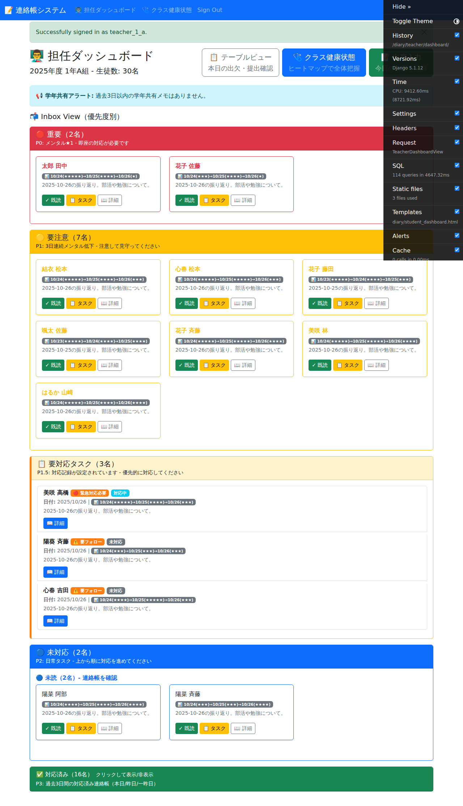

# 学年主任用マニュアル

このマニュアルは、E2Eテストから自動生成されました。

作成日: 2025-10-27

---

## 目次

- [1. ログイン画面を表示](#1-)
- [2. 学年主任アカウントでログイン](#2-)
- [3. 学年統計画面を確認](#3-)
- [1. ログイン画面を表示](#1-)
- [2. 学年主任アカウントでログイン](#2-)
- [3. 学年統計画面を確認](#3-)
- [1. ログイン画面を表示](#1-)
- [2. 学年主任アカウントでログイン](#2-)
- [3. 学年統計画面を確認](#3-)

---

## 操作手順

### 1. ログイン画面を表示

ブラウザでシステムにアクセスします。

---

### 2. 学年主任アカウントでログイン

学年主任用のメールアドレスとパスワードを入力します。テストアカウントは teacher_1_a@example.com / password123 です（学年主任権限付与済み）。

---

### 3. 学年統計画面を確認

ログインに成功すると、学年統計画面に自動的にリダイレクトされます。担当学年の統計情報が表示されます。

---

### 1. ログイン画面を表示

ブラウザでシステムにアクセスします。

---

### 2. 学年主任アカウントでログイン

学年主任用のメールアドレスとパスワードを入力します。テストアカウントは teacher_1_a@example.com / password123 です（学年主任権限付与済み）。

---

### 3. 学年統計画面を確認

ログインに成功すると、学年統計画面に自動的にリダイレクトされます。担当学年の統計情報が表示されます。

---

### 1. ログイン画面を表示

ブラウザでシステムにアクセスします。

---

### 2. 学年主任アカウントでログイン

学年主任用のメールアドレスとパスワードを入力します。テストアカウントは teacher_1_a@example.com / password123 です（学年主任権限付与済み）。

---

### 3. 学年統計画面を確認

ログインに成功すると、学年統計画面に自動的にリダイレクトされます。担当学年の統計情報が表示されます。

---

## トラブルシューティング

### ログインできない

- メールアドレスとパスワードが正しいか確認してください
- パスワードは大文字・小文字を区別します
- テストアカウント一覧は [TEST_ACCOUNTS.md](../TEST_ACCOUNTS.md) を参照してください

### 画面が表示されない

- ブラウザのキャッシュをクリアしてください
- 推奨ブラウザ（Chrome, Edge, Firefox, Safari）を使用してください

