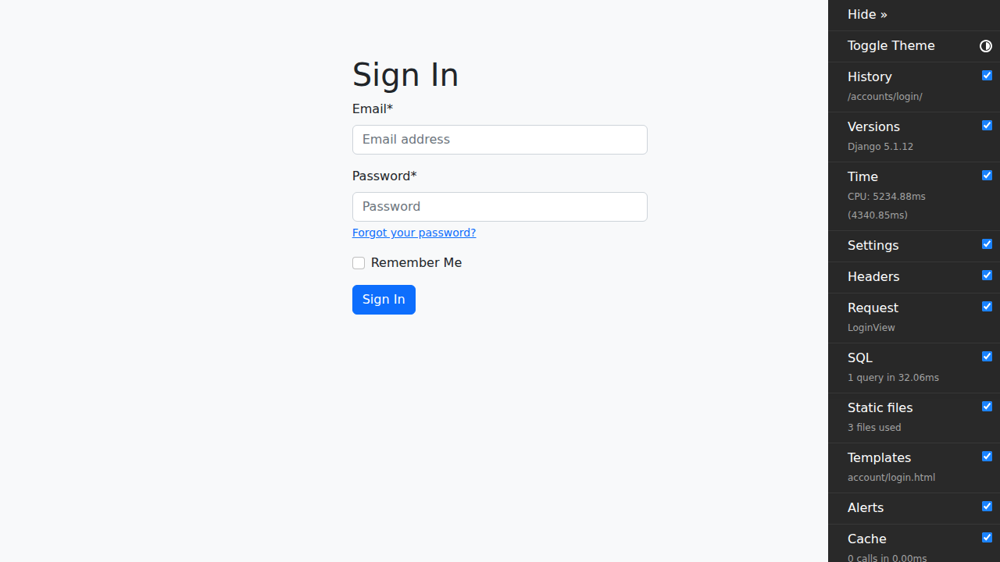
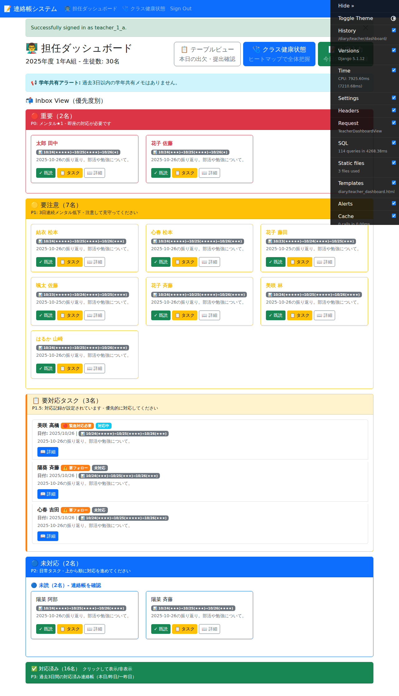
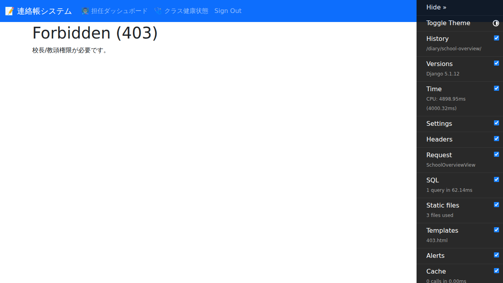

# 教頭/校長用マニュアル

このマニュアルは、E2Eテストから自動生成されました。

作成日: 2025-10-27

---

## 目次

- [1. ログイン画面を表示](#1-)
- [2. 教頭/校長アカウントでログイン](#2-)
- [1. ログイン画面を表示](#1-)
- [2. 教頭/校長アカウントでログイン](#2-)
- [3. 学校統計画面にアクセス](#3-)
- [1. ログイン画面を表示](#1-)
- [2. 教頭/校長アカウントでログイン](#2-)
- [3. 学校統計画面にアクセス](#3-)

---

## 操作手順

### 1. ログイン画面を表示

ブラウザでシステムにアクセスします。

---

### 2. 教頭/校長アカウントでログイン

教頭/校長用のメールアドレスとパスワードを入力します。テストアカウントは teacher_1_a@example.com / password123 です（校長権限付与済み）。

---

### 1. ログイン画面を表示

ブラウザでシステムにアクセスします。

---

### 2. 教頭/校長アカウントでログイン

教頭/校長用のメールアドレスとパスワードを入力します。テストアカウントは teacher_1_a@example.com / password123 です（校長権限付与済み）。

---

### 3. 学校統計画面にアクセス

学校統計画面にアクセスすると、学校全体の統計情報が表示されます。

---

### 1. ログイン画面を表示

ブラウザでシステムにアクセスします。

---

### 2. 教頭/校長アカウントでログイン

教頭/校長用のメールアドレスとパスワードを入力します。テストアカウントは teacher_1_a@example.com / password123 です（校長権限付与済み）。

---

### 3. 学校統計画面にアクセス

学校統計画面にアクセスすると、学校全体の統計情報が表示されます。

---

## トラブルシューティング

### ログインできない

- メールアドレスとパスワードが正しいか確認してください
- パスワードは大文字・小文字を区別します
- テストアカウント一覧は [TEST_ACCOUNTS.md](../TEST_ACCOUNTS.md) を参照してください

### 画面が表示されない

- ブラウザのキャッシュをクリアしてください
- 推奨ブラウザ（Chrome, Edge, Firefox, Safari）を使用してください

