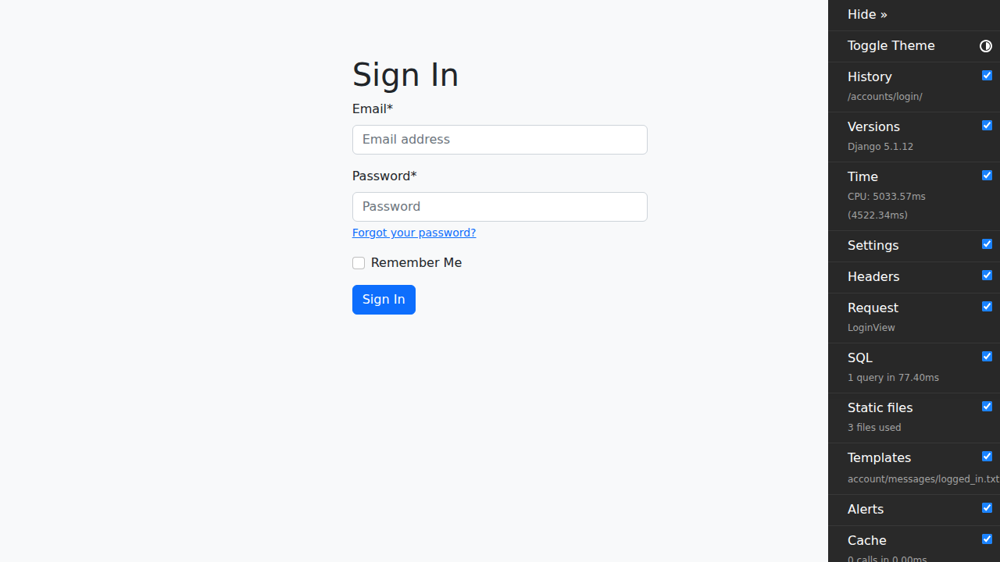
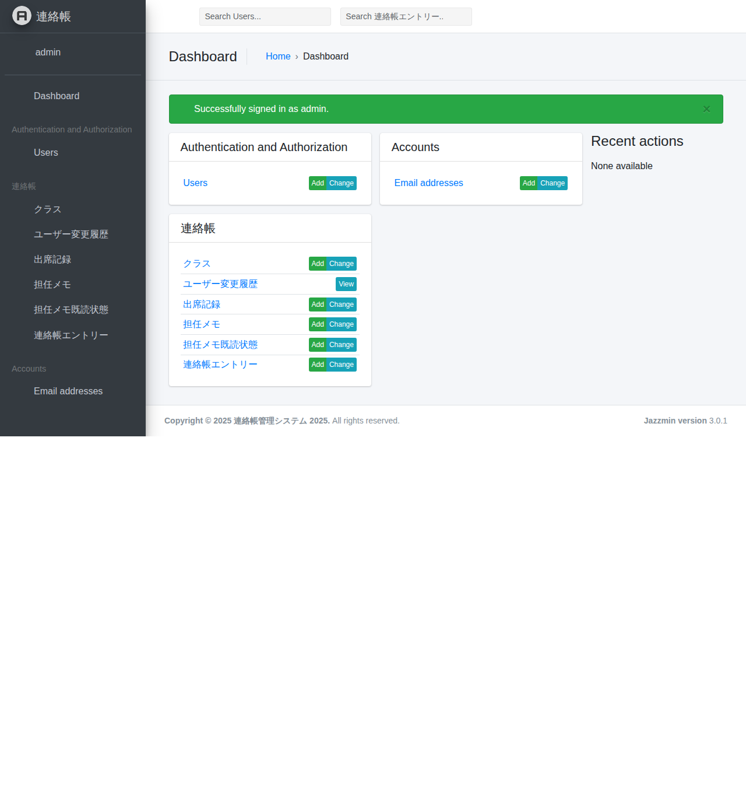
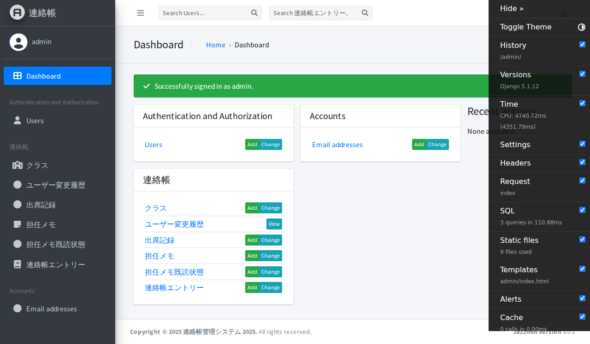

# 管理者用マニュアル

このマニュアルは、E2Eテストから自動生成されました。

作成日: 2025-10-27

---

## 目次

- [1. ログイン画面を表示](#1-)
- [2. 管理者アカウントでログイン](#2-)
- [3. 管理画面にリダイレクト](#3-)
- [1. ログイン画面を表示](#1-)
- [2. 管理者アカウントでログイン](#2-)
- [3. 管理画面にリダイレクト](#3-)
- [1. ログイン画面を表示](#1-)
- [2. 管理者アカウントでログイン](#2-)
- [3. 管理画面にリダイレクト](#3-)

---

## 操作手順

### 1. ログイン画面を表示

ブラウザでシステムにアクセスします。

---

### 2. 管理者アカウントでログイン

管理者用のメールアドレスとパスワードを入力します。テストアカウントは admin@example.com / password123 です。

---

### 3. 管理画面にリダイレクト

ログインに成功すると、Django管理画面に自動的にリダイレクトされます。

---

### 1. ログイン画面を表示

ブラウザでシステムにアクセスします。

---

### 2. 管理者アカウントでログイン

管理者用のメールアドレスとパスワードを入力します。テストアカウントは admin@example.com / password123 です。

---

### 3. 管理画面にリダイレクト

ログインに成功すると、Django管理画面に自動的にリダイレクトされます。

---

### 1. ログイン画面を表示

ブラウザでシステムにアクセスします。

---

### 2. 管理者アカウントでログイン

管理者用のメールアドレスとパスワードを入力します。テストアカウントは admin@example.com / password123 です。

---

### 3. 管理画面にリダイレクト

ログインに成功すると、Django管理画面に自動的にリダイレクトされます。

---

## トラブルシューティング

### ログインできない

- メールアドレスとパスワードが正しいか確認してください
- パスワードは大文字・小文字を区別します
- テストアカウント一覧は [TEST_ACCOUNTS.md](../TEST_ACCOUNTS.md) を参照してください

### 画面が表示されない

- ブラウザのキャッシュをクリアしてください
- 推奨ブラウザ（Chrome, Edge, Firefox, Safari）を使用してください

