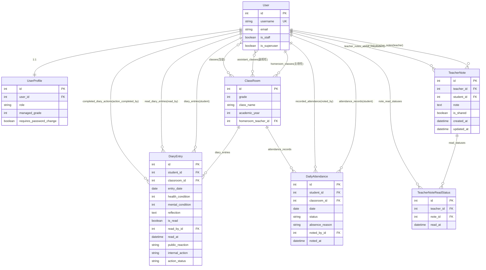

# データモデル設計書

> **作成日**: 2025-10-23
> **対象バージョン**: v0.3.0-map
> **ステータス**: As-Built（実装済み仕様）

---

## 概要

連絡帳管理システムのデータモデル設計書。Django ORMを使用したリレーショナルデータベース設計。

### 設計方針

1. **正規化**: 第3正規形まで正規化、冗長性を排除
2. **パフォーマンス**: 頻繁なクエリにはINDEX、N+1問題対策のカスタムManager
3. **保守性**: 明示的な命名、related_nameで逆参照を明確化
4. **データ整合性**: unique_together、外部キー制約、カスタムバリデーション

---

## ER図



---

## エンティティ一覧

| No | エンティティ | 役割 | レコード数目安 |
|----|------------|------|--------------|
| 1 | User | ユーザー（生徒・担任・管理者） | 500-1000 |
| 2 | UserProfile | 役割ベースの権限管理 | 500-1000 |
| 3 | ClassRoom | クラス情報（学年・組） | 10-20 |
| 4 | DiaryEntry | 連絡帳エントリー（健康記録） | 100,000/年 |
| 5 | TeacherNote | 担任メモ（長期観察記録） | 1,000-5,000 |
| 6 | TeacherNoteReadStatus | 担任メモ既読管理 | 10,000-50,000 |
| 7 | DailyAttendance | 出席記録 | 100,000/年 |

---

## リレーション一覧

### 1. User ↔ UserProfile（1:1）

**カーディナリティ**: User ||--|| UserProfile

**ビジネス意味**: ユーザーには必ず1つの役割（role）がある

**実装**:
- UserProfile.user (FK, CASCADE)
- related_name: "profile"

---

### 2. User ↔ ClassRoom（1:N、主担任）

**カーディナリティ**: User ||--o{ ClassRoom

**ビジネス意味**: 担任教員は複数のクラスを主担任として持てる（年度ごと）

**実装**:
- ClassRoom.homeroom_teacher (FK, SET_NULL)
- related_name: "homeroom_classes"

---

### 3. User ↔ ClassRoom（N:M、副担任）

**カーディナリティ**: User }o--o{ ClassRoom

**ビジネス意味**: クラスには複数の副担任、副担任は複数のクラスを担当可能

**実装**:
- ClassRoom.assistant_teachers (M2M)
- related_name: "assistant_classes"

---

### 4. User ↔ ClassRoom（N:M、生徒）

**カーディナリティ**: User }o--o{ ClassRoom

**ビジネス意味**: クラスには複数の生徒、生徒は複数のクラスに所属可能（年度ごと）

**実装**:
- ClassRoom.students (M2M)
- related_name: "classes"

---

### 5. User ↔ DiaryEntry（1:N、student）

**カーディナリティ**: User ||--o{ DiaryEntry

**ビジネス意味**: 生徒は複数の連絡帳を記入（毎日）

**実装**:
- DiaryEntry.student (FK, CASCADE)
- related_name: "diary_entries"

---

### 6. User ↔ DiaryEntry（1:N、read_by）

**カーディナリティ**: User ||--o{ DiaryEntry

**ビジネス意味**: 担任は複数の連絡帳を既読処理

**実装**:
- DiaryEntry.read_by (FK, SET_NULL, nullable)
- related_name: "read_diary_entries"

---

### 7. User ↔ DiaryEntry（1:N、action_completed_by）

**カーディナリティ**: User ||--o{ DiaryEntry

**ビジネス意味**: 担任は複数の連絡帳の対応を完了処理

**実装**:
- DiaryEntry.action_completed_by (FK, SET_NULL, nullable)
- related_name: "completed_diary_actions"

---

### 8. ClassRoom ↔ DiaryEntry（1:N）

**カーディナリティ**: ClassRoom ||--o{ DiaryEntry

**ビジネス意味**: クラスには複数の連絡帳（生徒×日数）

**実装**:
- DiaryEntry.classroom (FK, PROTECT, nullable)
- related_name: "diary_entries"

---

### 9. User ↔ TeacherNote（1:N、teacher）

**カーディナリティ**: User ||--o{ TeacherNote

**ビジネス意味**: 担任は複数の生徒についてメモを作成

**実装**:
- TeacherNote.teacher (FK, CASCADE)
- related_name: "created_teacher_notes"

---

### 10. User ↔ TeacherNote（1:N、student）

**カーディナリティ**: User ||--o{ TeacherNote

**ビジネス意味**: 生徒について複数の担任がメモを記録（年度ごと）

**実装**:
- TeacherNote.student (FK, CASCADE)
- related_name: "teacher_notes_about_me"

---

### 11. TeacherNote ↔ TeacherNoteReadStatus（1:N）

**カーディナリティ**: TeacherNote ||--o{ TeacherNoteReadStatus

**ビジネス意味**: 学年共有メモは複数の担任が既読（学年の担任人数分）

**実装**:
- TeacherNoteReadStatus.note (FK, CASCADE)
- related_name: "read_statuses"

---

### 12. User ↔ TeacherNoteReadStatus（1:N）

**カーディナリティ**: User ||--o{ TeacherNoteReadStatus

**ビジネス意味**: 担任は複数のメモを既読処理

**実装**:
- TeacherNoteReadStatus.teacher (FK, CASCADE)
- related_name: "note_read_statuses"

---

### 13. User ↔ DailyAttendance（1:N、student）

**カーディナリティ**: User ||--o{ DailyAttendance

**ビジネス意味**: 生徒は複数の出席記録を持つ（毎日）

**実装**:
- DailyAttendance.student (FK, CASCADE)
- related_name: "attendance_records"

---

### 14. User ↔ DailyAttendance（1:N、noted_by）

**カーディナリティ**: User ||--o{ DailyAttendance

**ビジネス意味**: 担任は複数の出席記録を記録

**実装**:
- DailyAttendance.noted_by (FK, SET_NULL, nullable)
- related_name: "recorded_attendance"

---

### 15. ClassRoom ↔ DailyAttendance（1:N）

**カーディナリティ**: ClassRoom ||--o{ DailyAttendance

**ビジネス意味**: クラスには複数の出席記録（生徒×日数）

**実装**:
- DailyAttendance.classroom (FK, PROTECT)
- related_name: "attendance_records"

---

## テーブル定義詳細

### User（Django標準）

Django標準の `auth.User` モデルを使用。

| カラム | データ型 | 制約 | 説明 |
|--------|---------|------|------|
| id | Integer | PK, AUTO | 主キー |
| username | String(150) | UNIQUE, NOT NULL | ユーザー名（ログインID） |
| email | String(254) | - | メールアドレス |
| first_name | String(150) | - | 名 |
| last_name | String(150) | - | 姓 |
| is_staff | Boolean | DEFAULT False | 管理画面アクセス権限 |
| is_superuser | Boolean | DEFAULT False | システム管理者 |
| is_active | Boolean | DEFAULT True | アクティブ |
| date_joined | DateTime | DEFAULT now | 登録日時 |

**INDEX**:
- username (UNIQUE)

---

### UserProfile

ユーザープロフィール（役割ベースの権限管理）。AuditMixinを継承し、変更履歴を自動記録。

**対応ファイル**: school_diary/diary/models.py (UserProfile)

| カラム | データ型 | 制約 | 説明 |
|--------|---------|------|------|
| id | Integer | PK, AUTO | 主キー |
| user_id | Integer | FK(User), UNIQUE | ユーザー |
| role | String(20) | NOT NULL, DEFAULT 'student' | 役割（admin/student/teacher/grade_leader/school_leader） |
| managed_grade | Integer | NULL | 学年主任の管理学年（1-3） |
| requires_password_change | Boolean | DEFAULT False | パスワード変更が必要 |

**CHOICES**:
- role: admin, student, teacher, grade_leader, school_leader

**バリデーション**:
- 学年主任の場合は `managed_grade` 必須
- 学年主任以外の場合は `managed_grade` 不要

**AuditMixin自動フィールド**:
- created_at (DateTime) - 作成日時
- updated_at (DateTime) - 更新日時
- created_by (FK) - 作成者
- updated_by (FK) - 更新者

---

### ClassRoom

クラス情報（学年・組の単位）。

**対応ファイル**: school_diary/diary/models.py (ClassRoom)

| カラム | データ型 | 制約 | 説明 |
|--------|---------|------|------|
| id | Integer | PK, AUTO | 主キー |
| grade | Integer | NOT NULL | 学年（1-3） |
| class_name | String(10) | NOT NULL | クラス名（A/B/C） |
| academic_year | Integer | NOT NULL, DEFAULT 2025 | 年度 |
| homeroom_teacher_id | Integer | FK(User), NULL | 主担任 |

**M2M**:
- assistant_teachers: User（副担任）
- students: User（生徒）

**UNIQUE**:
- (grade, class_name, academic_year)

**カスタムManager**: ClassRoomManager（with_related()でN+1解消）

---

### DiaryEntry

連絡帳エントリー（生徒の健康・メンタル記録）。

**対応ファイル**: school_diary/diary/models.py (DiaryEntry)

| カラム | データ型 | 制約 | 説明 |
|--------|---------|------|------|
| id | Integer | PK, AUTO | 主キー |
| student_id | Integer | FK(User), NOT NULL | 生徒 |
| classroom_id | Integer | FK(ClassRoom), NULL | 所属クラス |
| entry_date | Date | NOT NULL | 記載日 |
| submission_date | DateTime | DEFAULT now | 提出日時 |
| health_condition | Integer | NOT NULL, DEFAULT 3 | 体調（1-5） |
| mental_condition | Integer | NOT NULL, DEFAULT 3 | メンタル（1-5） |
| reflection | Text | NOT NULL | 今日の振り返り |
| is_read | Boolean | DEFAULT False | 既読 |
| read_by_id | Integer | FK(User), NULL | 既読者（担任） |
| read_at | DateTime | NULL | 既読日時 |
| teacher_reaction | String(20) | NULL | 担任の対応（非推奨） |
| public_reaction | String(20) | NULL | 生徒への反応 |
| internal_action | String(20) | NULL | 対応記録（先生のみ） |
| action_status | String(20) | DEFAULT 'pending' | 対応状況 |
| action_completed_at | DateTime | NULL | 対応完了日時 |
| action_completed_by_id | Integer | FK(User), NULL | 対応者 |
| action_note | String(200) | NULL | 対応内容メモ |

**CHOICES**:
- health_condition / mental_condition: 1(とても悪い) - 5(とても良い)
- public_reaction: thumbs_up, well_done, good_effort, excellent, support, checked
- internal_action: needs_follow_up, urgent, parent_contacted, individual_talk, shared_meeting, monitoring
- action_status: pending, in_progress, completed, not_required

**UNIQUE**:
- (student_id, entry_date)

**INDEX**:
- entry_date
- is_read
- action_status
- internal_action

**カスタムManager**: DiaryEntryManager（with_related()でN+1解消）

**バリデーション**:
- 対応完了の場合は action_completed_at, action_completed_by 必須

---

### TeacherNote

担任メモ（生徒の長期的な観察記録・引継ぎ情報）。

**対応ファイル**: school_diary/diary/models.py (TeacherNote)

| カラム | データ型 | 制約 | 説明 |
|--------|---------|------|------|
| id | Integer | PK, AUTO | 主キー |
| teacher_id | Integer | FK(User), NOT NULL | 担任 |
| student_id | Integer | FK(User), NOT NULL | 対象生徒 |
| note | Text | NOT NULL | メモ内容 |
| is_shared | Boolean | DEFAULT False | 学年会議で共有 |
| created_at | DateTime | AUTO | 作成日時 |
| updated_at | DateTime | AUTO | 更新日時 |

**カスタムManager**: TeacherNoteManager（with_related()でN+1解消）

---

### TeacherNoteReadStatus

担任メモの既読状態管理（学年共有アラート用）。

**対応ファイル**: school_diary/diary/models.py (TeacherNoteReadStatus)

| カラム | データ型 | 制約 | 説明 |
|--------|---------|------|------|
| id | Integer | PK, AUTO | 主キー |
| teacher_id | Integer | FK(User), NOT NULL | 担任 |
| note_id | Integer | FK(TeacherNote), NOT NULL | 担任メモ |
| read_at | DateTime | AUTO | 既読日時 |

**UNIQUE**:
- (teacher_id, note_id)

**INDEX**:
- (teacher_id, note_id)

**カスタムManager**: TeacherNoteReadStatusManager（with_related()でN+1解消）

---

### DailyAttendance

出席記録（学級閉鎖判断の基礎データ）。

**対応ファイル**: school_diary/diary/models.py (DailyAttendance)

| カラム | データ型 | 制約 | 説明 |
|--------|---------|------|------|
| id | Integer | PK, AUTO | 主キー |
| student_id | Integer | FK(User), NOT NULL | 生徒 |
| classroom_id | Integer | FK(ClassRoom), NOT NULL | クラス |
| date | Date | NOT NULL | 日付 |
| status | String(20) | NOT NULL, DEFAULT 'present' | 出席状況 |
| absence_reason | String(20) | NULL | 欠席理由 |
| noted_by_id | Integer | FK(User), NULL | 記録者（担任） |
| noted_at | DateTime | AUTO | 記録日時 |

**CHOICES**:
- status: present, absent, late, early_leave
- absence_reason: illness, family, other

**UNIQUE**:
- (student_id, date)

**INDEX**:
- date
- status
- absence_reason

**カスタムManager**: DailyAttendanceManager（with_related()でN+1解消）

**バリデーション**:
- 欠席の場合は absence_reason 必須
- 欠席以外の場合は absence_reason 不要

---

## インデックス戦略

### 高頻度クエリとINDEX

| テーブル | カラム | 用途 | INDEX |
|---------|--------|------|-------|
| DiaryEntry | entry_date | 日付範囲検索 | ✅ |
| DiaryEntry | is_read | 未読一覧表示 | ✅ |
| DiaryEntry | action_status | 対応待ち一覧 | ✅ |
| DiaryEntry | internal_action | アクション別フィルタ | ✅ |
| DailyAttendance | date | 日付範囲検索 | ✅ |
| DailyAttendance | status | 出席状況別集計 | ✅ |
| TeacherNoteReadStatus | (teacher, note) | 既読チェック | ✅ |

### N+1問題対策

すべての主要モデルにカスタムManager/QuerySetを実装：

```python
# 例: DiaryEntry
DiaryEntry.objects.with_related()  # select_related/prefetch_related
```

**実装詳細**: models.py各モデルのManagerクラス参照

---

## 制約・バリデーション

### unique_together制約

| テーブル | カラム | ビジネスルール |
|---------|--------|--------------|
| DiaryEntry | (student, entry_date) | 1人1日1件のみ |
| ClassRoom | (grade, class_name, academic_year) | 年度・学年・組で一意 |
| DailyAttendance | (student, date) | 1人1日1件のみ |
| TeacherNoteReadStatus | (teacher, note) | 担任1人につきメモ1件の既読状態 |

### カスタムバリデーション（clean()メソッド）

| テーブル | バリデーションルール |
|---------|-------------------|
| DiaryEntry | 対応完了の場合は action_completed_at, action_completed_by 必須 |
| UserProfile | 学年主任の場合は managed_grade 必須 |
| DailyAttendance | 欠席の場合は absence_reason 必須 |

**実装**: 各モデルの `clean()` メソッド参照

---

## Enum定義

### ConditionLevel（体調・メンタルレベル）

**対応ファイル**: school_diary/diary/constants.py

```python
VERY_BAD = 1
BAD = 2
NORMAL = 3
GOOD = 4
VERY_GOOD = 5
```

### PublicReaction（生徒への反応）

**対応ファイル**: school_diary/diary/models.py (PublicReaction)

```python
THUMBS_UP = "thumbs_up"
WELL_DONE = "well_done"
GOOD_EFFORT = "good_effort"
EXCELLENT = "excellent"
SUPPORT = "support"
CHECKED = "checked"
```

### InternalAction（対応記録）

**対応ファイル**: school_diary/diary/models.py (InternalAction)

```python
NEEDS_FOLLOW_UP = "needs_follow_up"
URGENT = "urgent"
PARENT_CONTACTED = "parent_contacted"
INDIVIDUAL_TALK = "individual_talk"
SHARED_MEETING = "shared_meeting"
MONITORING = "monitoring"
```

### ActionStatus（対応状況）

**対応ファイル**: school_diary/diary/models.py (ActionStatus)

```python
PENDING = "pending"
IN_PROGRESS = "in_progress"
COMPLETED = "completed"
NOT_REQUIRED = "not_required"
```

---

## 関連情報

### 関連ファイル

- school_diary/diary/models.py - メインモデル定義
- school_diary/diary/constants.py - Enum定義
- kits/audit/models.py - AuditMixin（変更履歴自動記録）

### 設計判断記録

- D-002: DiaryEntry.teacher_reaction を非推奨化、public_reaction と internal_action に分離（生徒と先生の情報を分離）
- D-003: すべての主要モデルにカスタムManager/QuerySet実装（N+1問題対策、パフォーマンス最適化）
- D-004: UserProfile に AuditMixin を適用（ロール変更履歴を自動記録、セキュリティ監査）

---

**作成日**: 2025-10-23
**作成者**: AI（Claude Code）+ hirok
**バージョン**: 1.0
**作成方法**: Code Reading Workshop + Sequential Thinking
