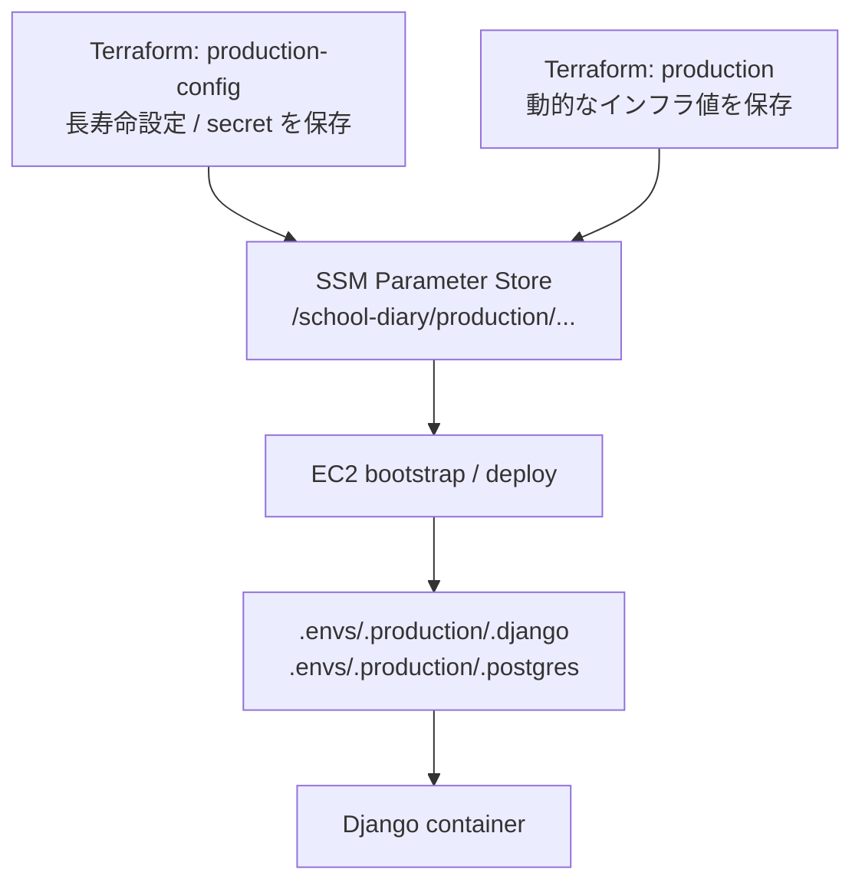
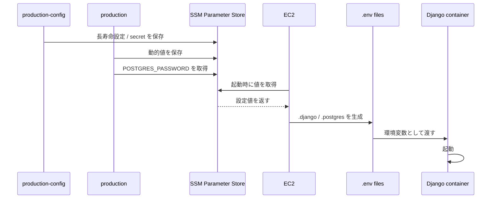
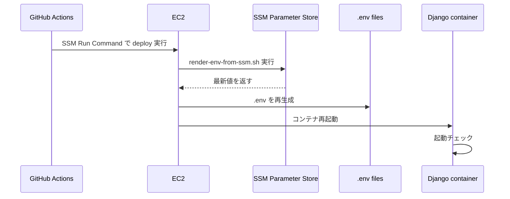

# SSM Parameter Store の全体像

このドキュメントは、**このシステムで SSM Parameter Store がどう使われているか**を、自分向け学習用に整理したものです。  
「SSM に何が入っているのか」「誰がいつそれを取るのか」「最終的に Django 起動までどうつながるのか」を、最初に全体像から説明します。

先に「このアプリ全体で設定値がどこにあるか」を見たい場合は、  
[このアプリの設定値マップ](./10-configuration-map.md) を先に読むと理解しやすいです。

---

## まず 3 行で全体像

- `production-config` が、**長く残したい設定や secret** を SSM に保存する
- `production` が、**インフラ作成のたびに変わる値** を SSM に保存・更新する
- EC2 が SSM から値を取って `.env` を作り、Django コンテナはその `.env` を読んで起動する

---

## 1. なぜこのドキュメントが必要か

この章で分かること: なぜ `.env` ではなく SSM を使っているのか。

このシステムでは、学習用・ポートフォリオ用として `terraform destroy` と `terraform apply` を繰り返すことを想定しています。  
そのたびに毎回 secret や設定値を手で入れ直すのは、かなり大変です。

たとえば次のような値は、毎回変えたくありません。

- `DJANGO_SECRET_KEY`
- `POSTGRES_PASSWORD`
- `DJANGO_ADMIN_URL`

逆に、次のような値はインフラ再作成のたびに変わることがあります。

- ALB の DNS 名
- CloudFront のドメイン名
- RDS の接続先ホスト名

この「**消したくない値**」と「**毎回変わる値**」をまとめて置いているのが、SSM Parameter Store です。

---

## 2. まず全体像

この章で分かること: どのコンポーネントが SSM に書き込み、どのコンポーネントが SSM から読み取るのか。



一言でいうと:

1. Terraform が SSM に値を入れる
2. EC2 が SSM から値を取る
3. EC2 が `.env` を作る
4. Django が `.env` を読んで起動する

重要なのは、**Django 自体は SSM を直接読まない**ことです。  
先に EC2 側で `.env` を作ってから、Django は普段どおり環境変数を読むだけです。

---

## 3. SSM の保存先パス

この章で分かること: SSM にどんな名前で保存されているか。

このシステムでは、SSM のプレフィックスは次です。

```text
/school-diary/production
```

その下を用途ごとに分けています。

```text
/school-diary/production/django/...
/school-diary/production/postgres/...
```

つまり、たとえば `DJANGO_SECRET_KEY` はこういう名前になります。

```text
/school-diary/production/django/DJANGO_SECRET_KEY
```

`POSTGRES_PASSWORD` はこうです。

```text
/school-diary/production/postgres/POSTGRES_PASSWORD
```

正本:

- [terraform/environments/production-config/main.tf](/home/hirok/work/ANSWER_KEY/school_diary/terraform/environments/production-config/main.tf#L1)
- [terraform/environments/production/parameter_store.tf](/home/hirok/work/ANSWER_KEY/school_diary/terraform/environments/production/parameter_store.tf#L1)

---

## 4. SSM にある値一覧

この章で分かること: どの値が長寿命で、どの値が再生成されるのか。

### 4-1. 長寿命の設定・secret

これは `terraform/environments/production-config` が登録する値です。  
基本的に、「destroy しても残したいもの」をここに置きます。

| カテゴリ | パラメータ名 | 型 | 役割 |
|---|---|---|---|
| Django | `DJANGO_SETTINGS_MODULE` | `String` | 本番設定モジュール |
| Django | `DJANGO_ADMIN_URL` | `String` | 管理画面の URL |
| Django | `DJANGO_SECURE_SSL_REDIRECT` | `String` | HTTPS リダイレクト有無 |
| Django | `DJANGO_DEFAULT_FROM_EMAIL` | `String` | 送信元メール |
| Django | `DJANGO_SERVER_EMAIL` | `String` | エラー通知用メール |
| Django | `DJANGO_ACCOUNT_ALLOW_REGISTRATION` | `String` | 登録許可設定 |
| Django | `WEB_CONCURRENCY` | `String` | Gunicorn ワーカー数 |
| Django | `DJANGO_SECRET_KEY` | `SecureString` | Django の secret key |
| PostgreSQL | `POSTGRES_PASSWORD` | `SecureString` | DB パスワード |

正本: [terraform/environments/production-config/main.tf](/home/hirok/work/ANSWER_KEY/school_diary/terraform/environments/production-config/main.tf#L4)

### 4-2. 再生成される動的な値

これは `terraform/environments/production` が登録・更新する値です。  
「インフラを作った結果決まる値」が中心です。

| カテゴリ | パラメータ名 | 型 | どこから決まるか |
|---|---|---|---|
| Django | `DJANGO_ALLOWED_HOSTS` | `String` | ALB DNS + CloudFront ドメイン |
| Django | `DJANGO_SITE_URL` | `String` | CloudFront ドメイン |
| Django | `DJANGO_AWS_STORAGE_BUCKET_NAME` | `String` | S3 バケット名 |
| Django | `DJANGO_AWS_S3_REGION_NAME` | `String` | AWS リージョン |
| Django | `AWS_REGION` | `String` | AWS リージョン |
| Django | `AWS_DEFAULT_REGION` | `String` | AWS リージョン |
| Django | `AWS_SES_REGION` | `String` | AWS リージョン |
| PostgreSQL | `POSTGRES_HOST` | `String` | RDS endpoint |
| PostgreSQL | `POSTGRES_PORT` | `String` | RDS port |
| PostgreSQL | `POSTGRES_DB` | `String` | DB 名 |
| PostgreSQL | `POSTGRES_USER` | `String` | DB ユーザー名 |

正本: [terraform/environments/production/parameter_store.tf](/home/hirok/work/ANSWER_KEY/school_diary/terraform/environments/production/parameter_store.tf#L4)

### 4-3. `String` と `SecureString` の違い

初心者向けにざっくり言うと:

- `String`: 普通の設定値
- `SecureString`: パスワードや secret のような隠したい値

このシステムでは、少なくとも次を `SecureString` にしています。

- `DJANGO_SECRET_KEY`
- `POSTGRES_PASSWORD`

---

## 5. 誰がいつ取得するのか

この章で分かること: 「SSM にある」だけで終わらず、実際に誰がどのタイミングで読むのか。

### 5-1. Terraform `production` が読む

まず、`production` 側 Terraform は `POSTGRES_PASSWORD` を SSM から読みます。

```text
production-config が SSM に POSTGRES_PASSWORD を保存
  ↓
production が SSM から POSTGRES_PASSWORD を取得
  ↓
RDS をそのパスワードで作る
```

正本: [terraform/environments/production/parameter_store.tf](/home/hirok/work/ANSWER_KEY/school_diary/terraform/environments/production/parameter_store.tf#L22)

ここが重要です。  
RDS のパスワードは `production` の `terraform.tfvars` に毎回書くのではなく、**先に SSM にあるものを読む**形になっています。

### 5-2. EC2 起動時に読む

EC2 が最初に起動するとき、`user_data` が走ります。  
この `user_data` の中で `render-env-from-ssm.sh` が呼ばれます。

正本: [terraform/files/user_data.sh.tftpl](/home/hirok/work/ANSWER_KEY/school_diary/terraform/files/user_data.sh.tftpl#L62)

流れ:

1. EC2 が起動する
2. bootstrap 用スクリプトを GitHub から取得する
3. `render-env-from-ssm.sh` を実行する
4. SSM から必要な値を取る
5. `.env` を作る
6. Django コンテナを初回起動する

### 5-3. GitHub Actions のデプロイ時にも読む

GitHub Actions は、SSM Parameter Store を直接読んでいません。  
代わりに **SSM Run Command** を使って EC2 に命令を送ります。

正本: [ .github/workflows/deploy.yml ](/home/hirok/work/ANSWER_KEY/school_diary/.github/workflows/deploy.yml#L57)

流れ:

1. GitHub Actions が Docker イメージを build / push
2. GitHub Actions が EC2 に SSM Run Command を送る
3. EC2 上で `render-env-from-ssm.sh` を再実行する
4. EC2 が SSM から最新値を取り直す
5. Django コンテナを再起動する

つまり、順番としてはこうです。

```text
GitHub Actions -> EC2 -> SSM
```

**GitHub Actions -> SSM -> EC2** ではありません。

---

## 6. 取得の流れを図で見る

この章で分かること: 起動時とデプロイ時の順番を図で追えるようになる。



デプロイ時は、これに GitHub Actions が追加されます。



---

## 7. `.env` と Django 起動の関係

この章で分かること: SSM から取った値がどこに入り、Django が何を読むのか。

`render-env-from-ssm.sh` は 2 つのファイルを作ります。

- `/opt/app/.envs/.production/.django`
- `/opt/app/.envs/.production/.postgres`

正本: [scripts/bootstrap/render-env-from-ssm.sh](/home/hirok/work/ANSWER_KEY/school_diary/scripts/bootstrap/render-env-from-ssm.sh#L52)

### `.django` に入る主な値

- `DJANGO_SETTINGS_MODULE`
- `DJANGO_SECRET_KEY`
- `DJANGO_ADMIN_URL`
- `DJANGO_ALLOWED_HOSTS`
- `DJANGO_SITE_URL`
- `DJANGO_SECURE_SSL_REDIRECT`
- `DJANGO_DEFAULT_FROM_EMAIL`
- `DJANGO_SERVER_EMAIL`
- `DJANGO_AWS_STORAGE_BUCKET_NAME`
- `DJANGO_AWS_S3_REGION_NAME`
- `AWS_REGION`
- `AWS_DEFAULT_REGION`
- `AWS_SES_REGION`
- `DJANGO_ACCOUNT_ALLOW_REGISTRATION`
- `WEB_CONCURRENCY`

### `.postgres` に入る主な値

- `POSTGRES_HOST`
- `POSTGRES_PORT`
- `POSTGRES_DB`
- `POSTGRES_USER`
- `POSTGRES_PASSWORD`

### `DATABASE_URL` はどこで作られるのか

いまは `DATABASE_URL` を SSM に置いていません。  
代わりに、Django コンテナの entrypoint が `POSTGRES_*` から組み立てます。

正本: [compose/production/django/entrypoint](/home/hirok/work/ANSWER_KEY/school_diary/compose/production/django/entrypoint#L7)

流れ:

```text
SSM から POSTGRES_* を取得
  ↓
.postgres に書く
  ↓
entrypoint が DATABASE_URL を組み立てる
  ↓
Django が DATABASE_URL を読む
```

---

## 8. SSM に置いていないもの

この章で分かること: 「なんでも SSM に置く」わけではない理由。

今の想定では、次は SSM に置いていません。

- `AWS_ACCESS_KEY_ID`
- `AWS_SECRET_ACCESS_KEY`
- `DATABASE_URL`

理由は次です。

### AWS Access Key を置かない理由

EC2 には IAM ロールが付いています。  
その IAM ロールに SSM 読み取り権限や S3 操作権限があるので、Access Key を環境変数で配る必要がありません。

正本: [terraform/modules/iam/main.tf](/home/hirok/work/ANSWER_KEY/school_diary/terraform/modules/iam/main.tf#L97)

### `DATABASE_URL` を置かない理由

もし `DATABASE_URL` と `POSTGRES_*` を両方持つと、接続情報の正本が 2 つになります。  
すると「どっちが本当なのか」が分かりにくくなります。

今は `POSTGRES_*` を正本にして、最後に entrypoint で `DATABASE_URL` を作る方針です。

---

## 9. よくある混乱ポイント

この章で分かること: 初学者が混乱しやすい点を先に整理する。

### Q1. Django は SSM を直接読んでいるの？

いいえ。  
**EC2 が SSM から値を取って `.env` を作り、Django は `.env` を読む**だけです。

### Q2. GitHub Actions は SSM Parameter Store を直接読んでいるの？

いいえ。  
GitHub Actions は **SSM Run Command で EC2 に命令を送っている**だけです。  
実際に値を SSM から取得しているのは EC2 側です。

### Q3. じゃあ SSM にある値はいつ最新になるの？

2 パターンあります。

- 長寿命設定: `production-config` を apply したとき
- 動的値: `production` を apply したとき

### Q4. `destroy` しても secret が残るのはなぜ？

長寿命の secret は `production-config` が管理していて、  
VPC / EC2 / RDS などを消す `production` とは分離しているからです。

---

## 10. まとめ

このドキュメントの一番大事なポイントは次です。

```text
Terraform が SSM に値を保存する
  ↓
EC2 が SSM から値を取って .env を作る
  ↓
Django は .env を読んで起動する
```

もう少し具体的に言うと:

- `production-config` は、消したくない設定や secret を SSM に残す
- `production` は、ALB / CloudFront / RDS など作り直すと変わる値を SSM に更新する
- EC2 は起動時やデプロイ時に SSM から取り直す
- Django 自体は SSM を直接触らない

関連ドキュメント:

- [環境変数の自動生成](./05-generate-env.md)
- [Terraform による全環境構築](./07-terraform-apply.md)
- [現状の GitHub Actions CD フロー](./08-current-cd-flow.md)
