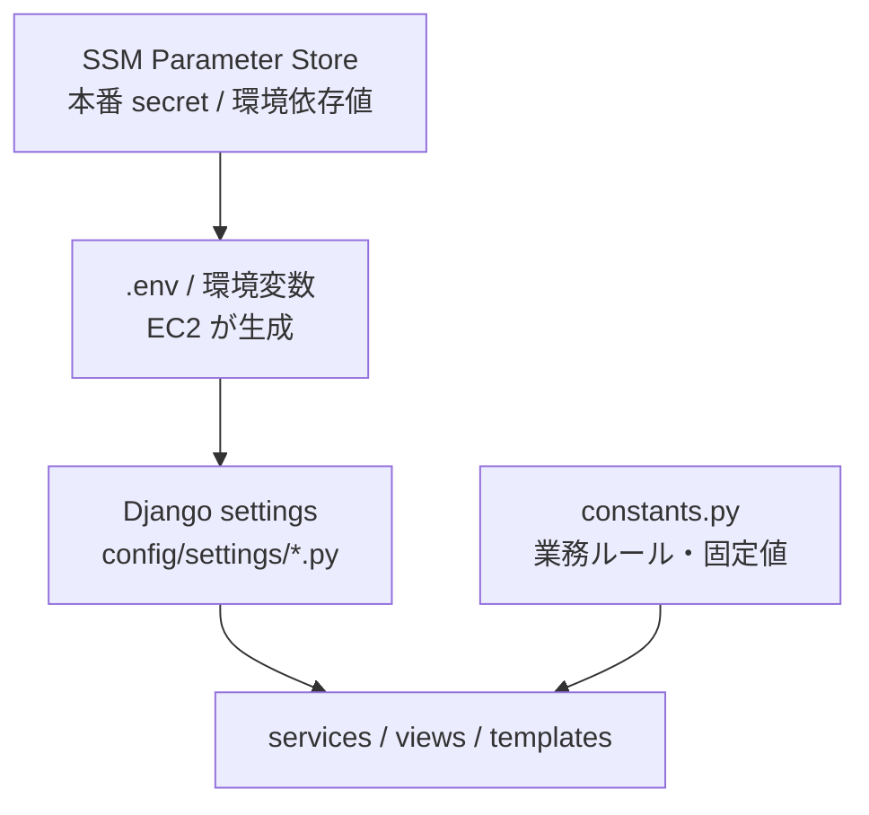

# このアプリの設定値マップ

このドキュメントは、**このアプリにある設定値がどこに存在し、何のためにあり、誰が読むのか**を初心者向けに整理した入口資料です。  
「SSM の話の前に、そもそも設定値とは何か」「どこを見れば何が分かるのか」を理解することが目的です。

SSM の詳細な流れは、次のガイドを参照してください。  
[SSM Parameter Store の全体像](./09-ssm-overview.md)

---

## 1. なぜこの資料が必要か

この章で分かること: 設定値を理解しないと、コードのどこを見ればよいか迷う理由。

このアプリには、たくさんの「値」があります。  
ただし、それらは全部同じ種類ではありません。

たとえば次の値は、見た目はどれも「ただの文字や数字」に見えます。

- `DJANGO_SECRET_KEY`
- `DJANGO_ALLOWED_HOSTS`
- `TIME_ZONE`
- `CLASS_ALERT_THRESHOLD = 5`
- `ConditionLevel.VERY_BAD = 1`

でも実務では、これらは役割がまったく違います。

- secret
- 本番環境で変わる設定
- アプリ全体の基本設定
- 運用で調整したい閾値
- アプリ仕様そのもの

この違いが分からないと、

- どこを見ればいいか分からない
- 何を SSM に置くべきか判断できない
- 何をコード固定にすべきか分からない

という状態になります。

---

## 2. まず全体像

この章で分かること: 設定値の置き場所と流れの全体像。



一言でいうと:

1. 本番の secret や環境依存値は SSM にある
2. EC2 が SSM から値を取って `.env` を作る
3. Django settings が `.env` を読む
4. アプリ本体は `settings` または `constants.py` から値を使う

重要なのは、**アプリの値は全部 SSM にあるわけではない**ことです。

---

## 3. 設定値の種類

この章で分かること: どの値をどこに置くべきかの判断軸。

このアプリの設定値は、大きく 4 種類に分けて考えると分かりやすいです。

| 種類 | 例 | 置き場所 | どういう意味か |
|---|---|---|---|
| secret / 本番環境依存値 | `DJANGO_SECRET_KEY`, `POSTGRES_PASSWORD`, `DJANGO_ALLOWED_HOSTS` | SSM | 環境ごとに変わる、本番で安全に持ちたい値 |
| アプリ設定の入口 | `SECRET_KEY`, `ALLOWED_HOSTS`, `EMAIL_BACKEND` | Django settings | Django が実際に読む設定 |
| 業務ルール・運用閾値 | `CLASS_ALERT_THRESHOLD`, `SHARED_NOTE_DAYS` | `constants.py` | アプリ内で使うルール値 |
| 開発/テスト専用上書き | `DEBUG=True`, `EMAIL_HOST=mailpit` | `local.py`, `test.py` | 本番ではなく開発・テストだけで使う値 |

### 置き場所の意味

#### SSM

- secret
- 本番環境依存値
- インフラ作成で決まる値

#### Django settings

- Django が読む設定の入口
- `.env` や環境変数から受け取る場所

#### `constants.py`

- 業務ルール
- 固定の数値
- 仕様としての定義

#### `local.py` / `test.py`

- 開発中だけ使う
- テスト中だけ使う
- 本番設定とは分けて考える

---

## 4. 本番で重要な設定値一覧

この章で分かること: 本番運用で効く設定値が、どこにあり、誰が読むか。

### 4-1. セキュリティ・認証

この表で分かること: secret やセキュリティ系の設定の所在。

| 設定名 | カテゴリ | 現在の置き場所 | 実際の定義場所 | 誰が読むか | 何に使うか | 外だし方針 |
|---|---|---|---|---|---|---|
| `DJANGO_SECRET_KEY` | セキュリティ | SSM | `terraform/environments/shared/main.tf` | EC2 → Django settings | Django の secret key | SSM で良い |
| `SECRET_KEY` | セキュリティ | Django settings | `config/settings/production.py` | Django | 実際に Django が使う secret key | settings 入口で良い |
| `DJANGO_ALLOWED_HOSTS` | セキュリティ | SSM | `terraform/environments/app/parameter_store.tf` | EC2 → Django settings | 許可ホスト | SSM で良い |
| `ALLOWED_HOSTS` | セキュリティ | Django settings | `config/settings/production.py` | Django | Host header 制御 | settings 入口で良い |
| `DJANGO_SECURE_SSL_REDIRECT` | セキュリティ | SSM | `terraform/environments/shared/main.tf` | EC2 → Django settings | HTTPS リダイレクト | SSM で良い |
| `SECURE_SSL_REDIRECT` | セキュリティ | Django settings | `config/settings/production.py` | Django | HTTP→HTTPS 強制 | settings 入口で良い |
| `DJANGO_SECURE_HSTS_INCLUDE_SUBDOMAINS` | セキュリティ | env default | `config/settings/production.py` | Django | HSTS サブドメイン適用 | 本番で調整したいなら env/SSM 候補 |
| `DJANGO_SECURE_HSTS_PRELOAD` | セキュリティ | env default | `config/settings/production.py` | Django | HSTS preload | 本番で調整したいなら env/SSM 候補 |
| `DJANGO_SECURE_CONTENT_TYPE_NOSNIFF` | セキュリティ | env default | `config/settings/production.py` | Django | MIME sniff 防止 | 本番で調整したいなら env/SSM 候補 |
| `DJANGO_ADMIN_URL` | セキュリティ/管理 | SSM | `terraform/environments/shared/main.tf` | EC2 → Django settings | 管理画面 URL | SSM で良い |
| `ADMIN_URL` | セキュリティ/管理 | Django settings | `config/settings/production.py`, `config/urls.py` | Django | 実際の管理画面 path | settings 入口で良い |

### 4-2. DB 接続

この表で分かること: DB に接続する値がどこにあり、どうつながるか。

| 設定名 | カテゴリ | 現在の置き場所 | 実際の定義場所 | 誰が読むか | 何に使うか | 外だし方針 |
|---|---|---|---|---|---|---|
| `POSTGRES_PASSWORD` | DB接続 | SSM | `terraform/environments/shared/main.tf` | Terraform, EC2 | DB パスワード | SSM で良い |
| `POSTGRES_HOST` | DB接続 | SSM | `terraform/environments/app/parameter_store.tf` | EC2, entrypoint | DB ホスト | SSM で良い |
| `POSTGRES_PORT` | DB接続 | SSM | `terraform/environments/app/parameter_store.tf` | EC2, entrypoint | DB ポート | SSM で良い |
| `POSTGRES_DB` | DB接続 | SSM | `terraform/environments/app/parameter_store.tf` | EC2, entrypoint | DB 名 | SSM で良い |
| `POSTGRES_USER` | DB接続 | SSM | `terraform/environments/app/parameter_store.tf` | EC2, entrypoint | DB ユーザー | SSM で良い |
| `DATABASE_URL` | DB接続 | entrypoint で生成 | `compose/production/django/entrypoint` | Django settings | Django の DB 接続文字列 | SSM に持たない方針で良い |
| `DATABASES["default"]` | DB接続 | Django settings | `config/settings/base.py` | Django | 実際の DB 設定 | settings 入口で良い |
| `CONN_MAX_AGE` | DB接続 | env default | `config/settings/production.py` | Django | DB コネクション再利用 | 本番調整候補 |

### 4-3. メール

この表で分かること: メール送信や通知に関わる設定の所在。

| 設定名 | カテゴリ | 現在の置き場所 | 実際の定義場所 | 誰が読むか | 何に使うか | 外だし方針 |
|---|---|---|---|---|---|---|
| `DJANGO_DEFAULT_FROM_EMAIL` | メール | SSM | `terraform/environments/shared/main.tf` | EC2 → Django settings | 送信元メール | SSM で良い |
| `DJANGO_SERVER_EMAIL` | メール | SSM | `terraform/environments/shared/main.tf` | EC2 → Django settings | エラー通知送信元 | SSM で良い |
| `DEFAULT_FROM_EMAIL` | メール | Django settings | `config/settings/production.py` | Django | 実際の送信元 | settings 入口で良い |
| `SERVER_EMAIL` | メール | Django settings | `config/settings/production.py` | Django | 管理者通知送信元 | settings 入口で良い |
| `DJANGO_EMAIL_SUBJECT_PREFIX` | メール | env default | `config/settings/production.py` | Django | 件名 prefix | 調整候補 |
| `EMAIL_BACKEND` | メール | Django settings | `config/settings/base.py`, `config/settings/production.py` | Django | メール送信 backend | settings で良い |
| `AWS_SES_REGION` | メール/AWS | SSM | `terraform/environments/app/parameter_store.tf` | EC2 → Django settings | SES リージョン | SSM で良い |
| `EMAIL_TIMEOUT` | メール | code | `config/settings/base.py` | Django | メール送信タイムアウト | settings 化候補 |
| `ADMINS` | メール/運用 | code | `config/settings/base.py` | Django | 500 エラー通知先 | env/SSM 候補 |

### 4-4. AWS / S3 / SES

この表で分かること: AWS 関連設定の所在。

| 設定名 | カテゴリ | 現在の置き場所 | 実際の定義場所 | 誰が読むか | 何に使うか | 外だし方針 |
|---|---|---|---|---|---|---|
| `DJANGO_AWS_STORAGE_BUCKET_NAME` | AWS/S3 | SSM | `terraform/environments/app/parameter_store.tf` | EC2 → Django settings | S3 バケット名 | SSM で良い |
| `DJANGO_AWS_S3_REGION_NAME` | AWS/S3 | SSM | `terraform/environments/app/parameter_store.tf` | EC2 → Django settings | S3 リージョン | SSM で良い |
| `AWS_REGION` | AWS | SSM | `terraform/environments/app/parameter_store.tf` | EC2, scripts | AWS リージョン | SSM で良い |
| `AWS_DEFAULT_REGION` | AWS | SSM | `terraform/environments/app/parameter_store.tf` | EC2, scripts | AWS CLI 標準リージョン | SSM で良い |
| `AWS_STORAGE_BUCKET_NAME` | AWS/S3 | Django settings | `config/settings/production.py` | Django | 実際に storages が使うバケット | settings 入口で良い |
| `AWS_S3_REGION_NAME` | AWS/S3 | Django settings | `config/settings/production.py` | Django | S3 region | settings 入口で良い |
| `AWS_S3_CUSTOM_DOMAIN` | AWS/S3 | env default | `config/settings/production.py` | Django | CloudFront/S3 カスタムドメイン | 将来 env/SSM 候補 |
| `AWS_S3_MAX_MEMORY_SIZE` | AWS/S3 | env default | `config/settings/production.py` | Django | アップロード上限メモリ | 運用調整候補 |

### 4-5. アプリ運用

この表で分かること: 環境や運用方針で変わるアプリ設定の所在。

| 設定名 | カテゴリ | 現在の置き場所 | 実際の定義場所 | 誰が読むか | 何に使うか | 外だし方針 |
|---|---|---|---|---|---|---|
| `DJANGO_SETTINGS_MODULE` | アプリ運用 | SSM | `terraform/environments/shared/main.tf` | EC2 / Django 起動 | 使用 settings module | SSM で良い |
| `DJANGO_ACCOUNT_ALLOW_REGISTRATION` | アプリ運用 | SSM | `terraform/environments/shared/main.tf` | EC2 → Django settings | 自己登録許可 | SSM で良い |
| `ACCOUNT_ALLOW_REGISTRATION` | アプリ運用 | Django settings | `config/settings/base.py` | Django / templates | 画面と認証フロー制御 | settings 入口で良い |
| `DJANGO_ADMIN_FORCE_ALLAUTH` | アプリ運用 | env default | `config/settings/base.py` | Django | 管理画面ログインフロー | env 候補 |
| `ACCOUNT_EMAIL_VERIFICATION` | アプリ運用 | code | `config/settings/base.py` | Django / signals | メール認証方式 | settings 化候補 |
| `WEB_CONCURRENCY` | アプリ運用 | SSM | `terraform/environments/shared/main.tf` | EC2 / Gunicorn | worker 数 | SSM で良い |
| `DEBUG` | アプリ運用 | env | `config/settings/base.py` | Django | デバッグモード | env で良い |
| `SITE_URL` | アプリ運用 | env | `config/settings/base.py` | Django / メール URL 生成 | 外部公開 URL | SSM 経由で良い |
| `TIME_ZONE` | アプリ基本 | code | `config/settings/base.py` | Django | タイムゾーン | code 固定で良い |
| `LANGUAGE_CODE` | アプリ基本 | code | `config/settings/base.py` | Django / templates | 言語設定 | code 固定で良い |

---

## 5. アプリ内部の閾値一覧

この章で分かること: コード内の数字ルールがどこにあり、何に使われているか。

### 5-1. 運用・業務ルールの閾値

これらは主に [school_diary/diary/constants.py](/home/hirok/work/ANSWER_KEY/school_diary/school_diary/diary/constants.py) にあります。  
「本番で使われる数字ルール」ですが、今は Django settings ではなくコード定数として置かれています。

| 設定名 | カテゴリ | 現在の置き場所 | 実際の定義場所 | 誰が読むか | 何に使うか | 外だし方針 |
|---|---|---|---|---|---|---|
| `HealthThresholds.POOR_CONDITION = 2` | 業務ルール閾値 | `constants.py` | `school_diary/diary/constants.py` | `utils.py`, dashboard services | 「低下」とみなす閾値 | settings 化候補 |
| `HealthThresholds.CONSECUTIVE_DAYS = 3` | 業務ルール閾値 | `constants.py` | `school_diary/diary/constants.py` | `utils.py`, dashboard services | 連続低下判定日数 | settings 化候補 |
| `HealthThresholds.CLASS_ALERT_THRESHOLD = 5` | 業務ルール閾値 | `constants.py` | `school_diary/diary/constants.py` | dashboard services | クラス警告人数閾値 | settings 化候補 |
| `NoteSettings.MIN_NOTE_LENGTH = 10` | 業務ルール閾値 | `constants.py` | `school_diary/diary/constants.py` | `teacher_note_service.py` | メモ最低文字数 | settings 化候補 |
| `NoteSettings.SHARED_NOTE_DAYS = 3` | 業務ルール閾値 | `constants.py` | `school_diary/diary/constants.py` | `teacher_dashboard_service.py` | 共有メモ表示日数 | settings 化候補 |
| `NoteSettings.SHARED_NOTE_LIMIT = 5` | 業務ルール閾値 | `constants.py` | `school_diary/diary/constants.py` | `teacher_dashboard_service.py` | 共有メモ表示件数 | settings 化候補 |
| `DashboardSettings.SUBMISSION_RATE_WARNING = 80` | 業務ルール閾値 | `constants.py` | `school_diary/diary/constants.py` | `management_dashboard_service.py` | 提出率警告閾値 | settings 化候補 |
| `DashboardSettings.HEALTH_DASHBOARD_DAYS = [7, 14]` | 業務ルール閾値 | `constants.py` | `school_diary/diary/constants.py` | `views/management.py` | ダッシュボード表示日数候補 | settings 化候補 |
| `DashboardSettings.HEALTH_DASHBOARD_DEFAULT_DAYS = 7` | 業務ルール閾値 | `constants.py` | `school_diary/diary/constants.py` | `views/management.py` | ダッシュボード初期日数 | settings 化候補 |

### 5-2. 固定値として持ってよいもの

この表で分かること: 「数字でも外だししなくてよい」代表例。

| 設定名 | カテゴリ | 現在の置き場所 | 実際の定義場所 | 誰が読むか | 何に使うか | 外だし方針 |
|---|---|---|---|---|---|---|
| `ConditionLevel.VERY_BAD=1 ... VERY_GOOD=5` | ドメイン定義 | `constants.py` | `school_diary/diary/constants.py` | models/forms/services/templates | 体調・メンタルの意味定義 | code 固定で良い |
| `GradeLevel.GRADE_1=1 ... GRADE_3=3` | ドメイン定義 | `constants.py` | `school_diary/diary/constants.py` | models/forms | 学年定義 | code 固定で良い |
| `GRADE_CHOICES` | ドメイン定義 | `constants.py` | `school_diary/diary/constants.py` | forms/models | 学年選択肢 | code 固定で良い |
| 学年開始月 4 月 | ドメイン定義 | code | `school_diary/diary/academic_year.py` | app logic | 学校年度ロジック | code 固定で良い |

---

## 6. ローカル / テスト設定一覧

この章で分かること: 開発・テスト用の値を本番設定と混同しないようにする。

### 6-1. ローカル開発用

これは [config/settings/local.py](/home/hirok/work/ANSWER_KEY/school_diary/config/settings/local.py) にある、開発専用の上書きです。  
**本番では使いません。**

| 設定名 | 現在の置き場所 | 実際の定義場所 | 何に使うか | 補足 |
|---|---|---|---|---|
| `DEBUG = True` | `local.py` | `config/settings/local.py` | 開発時の詳細表示 | 本番では使わない |
| `SECRET_KEY` の default | `local.py` | `config/settings/local.py` | 開発用 secret | 本番では使わない |
| `ALLOWED_HOSTS = ["*"]` | `local.py` | `config/settings/local.py` | 開発用の全許可 | 本番では危険 |
| `EMAIL_HOST = "mailpit"` | `local.py` | `config/settings/local.py` | ローカルメール確認 | Mailpit 用 |
| `EMAIL_PORT = 1025` | `local.py` | `config/settings/local.py` | ローカルメールポート | Mailpit 用 |
| `EMAIL_BACKEND = smtp` | `local.py` | `config/settings/local.py` | ローカル送信 backend | 開発用 |
| `DEBUG_TOOLBAR_CONFIG` | `local.py` | `config/settings/local.py` | debug toolbar 設定 | 開発専用 |
| `INTERNAL_IPS` | `local.py` | `config/settings/local.py` | debug toolbar 表示制御 | 開発専用 |
| `USE_DOCKER` | env | `config/settings/local.py` | Docker 時の IP 調整 | 開発専用 |
| `ACCOUNT_EMAIL_VERIFICATION = "none"` | `local.py` | `config/settings/local.py` | メール認証スキップ | 開発専用 |

### 6-2. テスト用

これは [config/settings/test.py](/home/hirok/work/ANSWER_KEY/school_diary/config/settings/test.py) にある、テスト専用の上書きです。  
**本番では使いません。**

| 設定名 | 現在の置き場所 | 実際の定義場所 | 何に使うか | 補足 |
|---|---|---|---|---|
| `SECRET_KEY` の default | `test.py` | `config/settings/test.py` | テスト用 secret | 本番では使わない |
| `TEST_RUNNER` | `test.py` | `config/settings/test.py` | テスト実行設定 | テスト専用 |
| `PASSWORD_HASHERS = MD5` | `test.py` | `config/settings/test.py` | テスト高速化 | 本番では危険 |
| `EMAIL_BACKEND = locmem` | `test.py` | `config/settings/test.py` | メール送信をメモリ化 | テスト専用 |
| `TEMPLATES[0][OPTIONS][debug] = True` | `test.py` | `config/settings/test.py` | テンプレートデバッグ | テスト専用 |
| `MEDIA_URL = "http://media.testserver/"` | `test.py` | `config/settings/test.py` | テスト用 media URL | テスト専用 |
| `ACCOUNT_EMAIL_VERIFICATION = "none"` | `test.py` | `config/settings/test.py` | テスト簡略化 | テスト専用 |

---

## 7. よくある混乱ポイント

この章で分かること: 初心者が混乱しやすい言葉の違い。

### `DJANGO_SECRET_KEY` と `SECRET_KEY` の違い

- `DJANGO_SECRET_KEY`
  - 環境変数名 / SSM 上の名前
- `SECRET_KEY`
  - Django settings の中で実際に使う設定名

つまり、

```text
SSM にある名前 -> DJANGO_SECRET_KEY
Django が使う名前 -> SECRET_KEY
```

### `SSM` と `.env` の違い

- `SSM`
  - AWS 上の保管庫
- `.env`
  - EC2 上で一時的に使う設定ファイル

つまり、

```text
SSM に保存
  ↓
EC2 が取得
  ↓
.env を生成
  ↓
Django settings が読む
```

### `settings` と `constants.py` の違い

- `settings`
  - Django 全体の設定
  - 環境で変わりうる値の入口
- `constants.py`
  - アプリの業務ルールや固定値

### なぜ `DATABASE_URL` は SSM にないのか

このアプリでは、接続情報の正本を `POSTGRES_*` に寄せています。  
そのあと、entrypoint で `DATABASE_URL` を組み立てます。

理由は、`DATABASE_URL` と `POSTGRES_*` を両方持つと、  
「どっちが本当の値なのか」が分かりにくくなるからです。

---

## 8. まとめ

このドキュメントの一番大事なポイントは、**設定値には種類がある**ということです。

- secret や環境依存値は SSM
- Django が読む入口は settings
- 業務ルールは `constants.py`
- 開発・テスト用は `local.py` / `test.py`

この整理が分かると、次に `09-ssm-overview.md` を読んだときに、
「SSM は設定値のどの部分を担当しているのか」がかなり追いやすくなります。

次に読む資料:

- [SSM Parameter Store の全体像](./09-ssm-overview.md)
- [環境変数の自動生成](./05-generate-env.md)
