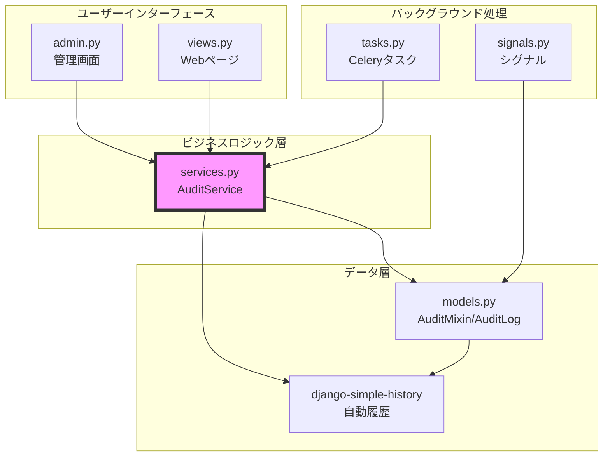

# 📁 kits.audit - 実装の全体像

> **読了時間**: 約8分
>
> このドキュメントでは、kits.auditの**ファイル構成**と**各ファイルの役割**を解説します。
> 「どこに何が書いてあるか」が分かるようになります。

**最終更新**: 2025-10-05

---

## 🗂️ ディレクトリ構造

kits.auditは3つの場所にファイルが分散しています：

```
/home/hirok/work/school_diary/
│
├── kits/audit/                      # ← メインコード（合計1456行）
│   ├── __init__.py                 # パッケージ初期化
│   ├── apps.py                     # Django設定（32行）
│   ├── models.py                   # データモデル（161行）
│   ├── services.py                 # ビジネスロジック（321行）
│   ├── admin.py                    # Django管理画面（190行）
│   ├── tasks.py                    # Celeryタスク（288行）
│   ├── signals.py                  # Djangoシグナル（117行）
│   ├── examples.py                 # 使用例（379行）
│   └── migrations/                 # データベースマイグレーション
│       └── 0001_initial.py
│
├── school_diary/templates/audit/          # ← HTMLテンプレート（将来追加）
│   └── reports/                    # レポート用テンプレート
│
└── tests/kits/audit/                # ← テストコード
    ├── test_models.py              # モデルテスト（7テスト）
    └── test_services.py            # サービステスト（11テスト）
```

### なぜ3箇所に分かれている？

**理由**: Djangoのベストプラクティスに従っているため

```
kits/         → 再利用可能なPythonコード
templates/    → HTML（レポート出力用、将来追加予定）
tests/        → テストコード（開発時のみ使用）
```

---

## 📄 各ファイルの役割

### 1. models.py（データモデル）

**役割**: データベースのテーブル定義と履歴記録用Mixin

**何が定義されている？**
- `AuditMixin` - 履歴記録を追加するMixin（抽象クラス）
- `AuditLog` - カスタム監査ログモデル
- イベントタイプの選択肢定義

**行数**: 161行

**データベースに作られるテーブル**:
```sql
-- カスタム監査ログテーブル
CREATE TABLE audit_auditlog (
    id SERIAL PRIMARY KEY,
    event_type VARCHAR(20),      -- "create", "approve"など
    event_name VARCHAR(200),      -- "残業申請承認"など
    description TEXT,
    model_name VARCHAR(100),      -- "overtimerequest"
    object_id VARCHAR(100),       -- "123"
    object_repr VARCHAR(255),
    changes JSONB,                -- {"status": {"from": "draft", "to": "approved"}}
    metadata JSONB,               -- {"ip": "192.168.1.1", ...}
    user_id INTEGER REFERENCES auth_user(id),
    user_ip VARCHAR(45),
    user_agent VARCHAR(255),
    created_at TIMESTAMP
);

-- django-simple-historyが自動生成するテーブル
-- （AuditMixinを継承したモデルごとに作られる）
CREATE TABLE historical_overtimerequest (
    history_id SERIAL PRIMARY KEY,
    id INTEGER,
    -- 元モデルの全フィールド
    history_date TIMESTAMP,
    history_change_reason VARCHAR(100),
    history_type VARCHAR(1),
    history_user_id INTEGER
);
```

**初心者向け解説**:
```python
# models.pyの役割 = データの「箱」と「記録方法」を定義

# 箱の定義
class AuditLog(models.Model):
    event_type = models.CharField(...)  # どんな種類のイベント？
    changes = models.JSONField(...)     # 何が変わった？

# 記録方法の定義
class AuditMixin(models.Model):
    history = HistoricalRecords()  # 「これをつけたら履歴記録する」という印
    class Meta:
        abstract = True  # これ自体はテーブルにならない
```

---

### 2. services.py（ビジネスロジック）

**役割**: 監査ログの記録・検索・レポート生成のロジック

**何が定義されている？**
- `AuditService` - 監査操作のメインクラス

**行数**: 321行

**主なメソッド**:
```python
class AuditService:
    # 基本操作
    def log_event(...)              # イベントをログに記録
    def get_object_history(...)     # オブジェクトの履歴取得

    # 検索・フィルタ
    def search_logs(...)            # ログを検索
    def get_user_activity(...)      # ユーザーの活動履歴
    def get_object_audit_logs(...)  # 特定オブジェクトの監査ログ

    # レポート生成
    def generate_audit_report(...)  # 監査レポート生成
    def export_to_csv(...)          # CSV出力

    # ユーティリティ
    def compare_versions(...)       # バージョン間の差分比較
    def get_change_summary(...)     # 変更内容のサマリー
```

**初心者向け解説**:
```python
# services.pyの役割 = 「手順書」のようなもの

# 例: イベントを記録する手順
def log_event(self, event_type, obj, user):
    # 1. イベントの情報を集める
    # 2. AuditLogに保存する
    # 3. ログに出力する
    # 4. 結果を返す
```

---

### 3. admin.py（管理画面）

**役割**: Django管理画面でのUI定義

**何が定義されている？**
- `AuditLogAdmin` - 監査ログの管理画面

**行数**: 190行

**主な機能**:
```python
@admin.register(AuditLog)
class AuditLogAdmin(admin.ModelAdmin):
    # 一覧表示
    list_display = ["event_name", "event_type", "user", "created_at"]
    list_filter = ["event_type", "created_at", "user"]
    search_fields = ["event_name", "description", "user__email"]

    # 詳細表示
    readonly_fields = [...]  # 編集不可（ログは改ざん防止）

    # JSON表示
    def changes_display(self, obj):
        # 変更内容を見やすく表示
        return format_html("<pre>{}</pre>", json.dumps(obj.changes, indent=2))
```

**初心者向け解説**:
```
管理画面（http://localhost:8000/admin/）で：
- 監査ログの一覧を見る
- 検索・フィルタリング
- 詳細を確認
- でも編集はできない（ログは改ざん防止のため）
```

---

### 4. tasks.py（非同期処理）

**役割**: Celeryタスク（バックグラウンド処理）

**何が定義されている？**
- `cleanup_old_audit_logs` - 古いログの削除
- `generate_scheduled_report` - 定期レポート生成
- `export_audit_logs` - 大量ログのエクスポート
- `analyze_suspicious_activity` - 不審なアクティビティの検知

**行数**: 288行

**タスクの例**:
```python
@shared_task
def cleanup_old_audit_logs(days=365):
    """1年以上前のログを削除"""
    cutoff_date = timezone.now() - timedelta(days=days)
    deleted_count = AuditLog.objects.filter(
        created_at__lt=cutoff_date
    ).delete()[0]
    return f"Deleted {deleted_count} old audit logs"
```

**初心者向け解説**:
```
タスク = 時間のかかる処理を裏で実行
例：
- 夜中に古いログを削除
- 月末にレポートを自動生成
- ユーザーを待たせずに処理
```

---

### 5. signals.py（イベントハンドラー）

**役割**: モデルの保存・削除時の自動処理

**何が定義されている？**
- `log_model_changes` - モデル変更の自動記録
- `log_state_transition` - FSM状態遷移の記録

**行数**: 117行

**シグナルの例**:
```python
from django_fsm import post_transition

@receiver(post_transition)
def log_state_transition(sender, instance, name, source, target, **kwargs):
    """FSMの状態遷移を自動的に記録"""
    if hasattr(instance, "_history_user"):
        # 履歴に遷移情報を追加
        instance._change_reason = f"State: {source} → {target}"
```

**初心者向け解説**:
```
シグナル = 「何かが起きたら自動的に実行」
例：
- 承認されたら → 自動的にログ記録
- データ削除されたら → 自動的に削除ログ記録
```

---

### 6. examples.py（使用例）

**役割**: 実際の使い方のサンプルコード

**何が定義されている？**
- 基本的な使用例
- 応用的な使用例
- カスタマイズ例

**行数**: 379行

---

## 🔄 モジュール間の関係



### データの流れ

1. **ユーザー操作** → admin.py or views.py
2. **サービス呼び出し** → services.py
3. **データ保存** → models.py
4. **履歴記録** → django-simple-history（自動）
5. **非同期処理** → tasks.py（必要に応じて）
6. **自動記録** → signals.py（FSM遷移時など）

---

## 📝 実装の順序（なぜこの順番？）

### Phase 1: データモデル（models.py）

**なぜ最初？**: データ構造が決まらないと何も始まらない

```python
# 1. まずAuditMixinを定義
class AuditMixin(models.Model):
    history = HistoricalRecords()

# 2. 次にAuditLogを定義
class AuditLog(models.Model):
    event_type = models.CharField(...)
```

### Phase 2: サービス層（services.py）

**なぜ2番目？**: データ操作のロジックを集約

```python
# モデルができたら、それを操作する方法を定義
class AuditService:
    def log_event(self, ...):
        AuditLog.objects.create(...)
```

### Phase 3: 管理画面（admin.py）

**なぜ3番目？**: 動作確認のUIが必要

```python
# サービスができたら、管理画面で確認できるように
@admin.register(AuditLog)
class AuditLogAdmin(admin.ModelAdmin):
    list_display = [...]
```

### Phase 4: シグナル（signals.py）

**なぜ4番目？**: 自動化は基本機能の後

```python
# 基本機能が動いたら、自動化を追加
@receiver(post_transition)
def log_state_transition(...):
    pass
```

### Phase 5: 非同期処理（tasks.py）

**なぜ最後？**: 最適化は最後に

```python
# すべて動いたら、パフォーマンス改善
@shared_task
def cleanup_old_audit_logs():
    pass
```

---

## 🎯 ファイルを探すときの指針

### 「〇〇したい」→「どのファイル？」

| やりたいこと | 見るべきファイル | 理由 |
|------------|--------------|------|
| 新しいフィールドを追加 | models.py | データ構造の定義 |
| ログの記録方法を変更 | services.py | ビジネスロジック |
| 管理画面の表示を変更 | admin.py | UI定義 |
| 定期的な処理を追加 | tasks.py | Celeryタスク |
| 自動記録を追加 | signals.py | イベントハンドラー |
| 使い方を知りたい | examples.py | サンプルコード |
| テストを追加 | tests/ | テストコード |

---

## 📊 コード統計

### 行数内訳

```
kits/audit/
├── models.py       161行
├── services.py     321行
├── admin.py        190行
├── tasks.py        288行
├── signals.py      117行
├── examples.py     379行
└── 合計          1,456行

tests/kits/audit/
├── test_models.py    (7テスト)
├── test_services.py  (11テスト)
└── 合計             18テスト
```

### 複雑度

- **シンプル**: models.py, admin.py
- **中程度**: signals.py, tasks.py
- **複雑**: services.py（ビジネスロジックが集中）

---

## 🔗 他のkitsとの連携

```python
# kits.approvalsとの連携
from kits.approvals.signals import post_transition
# → FSM状態遷移を自動記録

# kits.notificationsとの連携（将来）
from kits.notifications.services import NotificationService
# → 不審なアクティビティを通知

# kits.reportsとの連携（将来）
from kits.reports.services import ReportService
# → 監査レポートをPDF出力
```

---

## 📝 まとめ

kits.auditの実装は、**責務の明確な分離**を重視しています：

- **models.py**: データ構造（What）
- **services.py**: ビジネスロジック（How）
- **admin.py**: ユーザーインターフェース（UI）
- **tasks.py**: 非同期処理（When）
- **signals.py**: 自動処理（Auto）

この構造により、**どこを見れば何が分かるか**が明確になっています。

---

**次のドキュメント**: [04_コード解説.md](./04_コード解説.md) - 各クラス・関数の詳細解説

#kits #audit #実装 #Django #アーキテクチャ