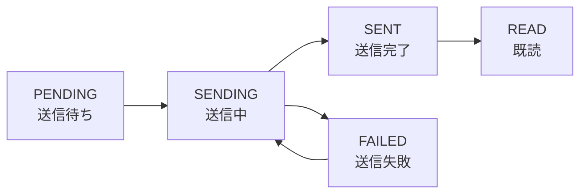

# 🏗️ kits.notifications - 設計思想

> **読了時間**: 約10分
>
> このドキュメントでは、「なぜこう設計したのか」「他の選択肢はなかったのか」を
> 初心者の方にも分かるように解説します。設計の背景にある**判断理由**を理解できます。

**最終更新**: 2025-10-05

---

## 🎯 設計の大原則

kits.notificationsは以下の3つの原則に基づいて設計されています：

### 1. **シンプルさ優先** 🎨
複雑な構造を避け、ファイル数を最小限に保つ

### 2. **疎結合** 🔗
他のアプリケーションに依存しない、再利用可能な設計

### 3. **Django標準に従う** 📘
Djangoの慣習やベストプラクティスに準拠

---

## 📐 設計判断の記録

### 判断1: データモデルの設計

#### 選択した設計

```python
# 2つのモデルで構成
class NotificationTemplate(models.Model):
    """通知の型（テンプレート）"""
    code = models.CharField(...)           # テンプレート識別子
    subject_template = models.CharField(...)  # 件名テンプレート
    body_template = models.TextField(...)     # 本文テンプレート

class Notification(models.Model):
    """個々の通知インスタンス"""
    recipient = models.ForeignKey(User, ...)  # 受信者
    template = models.ForeignKey(NotificationTemplate, ...)
    status = models.CharField(...)            # 送信状態
    sent_at = models.DateTimeField(...)       # 送信日時
```

#### なぜこの設計？

**理由1: テンプレートの再利用**
```
❌ 悪い設計: 毎回メール内容を書く
for user in users:
    send_email(
        to=user.email,
        subject="ようこそ！",  # 100回書く😓
        body="..."            # 100回書く😓
    )

✅ 良い設計: テンプレートを1回作るだけ
# テンプレート作成（1回だけ）
NotificationTemplate.objects.create(
    code="welcome",
    subject_template="ようこそ、{{user.name}}さん！",
    ...
)

# 使用（何度でも）
for user in users:
    service.create_from_template("welcome", user, context)
```

**理由2: 通知の履歴管理**
- 誰にいつ送ったか記録が残る
- 送信失敗の原因を追跡できる
- 未読・既読の管理ができる

**理由3: データベース設計のベストプラクティス**
- テンプレート（マスターデータ）と通知（トランザクションデータ）を分離
- 正規化された設計

#### 他の選択肢は？

**選択肢A: テンプレートなし（却下）**
```python
# すべて直接指定
Notification.objects.create(
    recipient=user,
    subject="件名",  # 毎回書く必要がある
    body="本文",     # 毎回書く必要がある
)
```
❌ 却下理由: 同じ内容を何度も書くのは非効率

**選択肢B: 1つのモデルにまとめる（却下）**
```python
class Notification(models.Model):
    # テンプレート情報
    template_code = models.CharField(...)
    template_subject = models.CharField(...)
    template_body = models.TextField(...)
    # 通知情報
    recipient = models.ForeignKey(...)
    sent_at = models.DateTimeField(...)
```
❌ 却下理由: データの重複が発生（1000件の通知 = 1000回テンプレート保存）

---

### 判断2: ステータス管理の設計

#### 選択した設計

```python
class NotificationStatus(models.TextChoices):
    PENDING = "pending"   # 送信待ち
    SENDING = "sending"   # 送信中
    SENT = "sent"         # 送信完了
    FAILED = "failed"     # 送信失敗
    READ = "read"         # 既読
```

#### なぜこの設計？

**理由: 通知のライフサイクルを表現**



このフローにより：
- ✅ リトライ処理が実装できる（FAILED → SENDING）
- ✅ 送信中のステータスを追跡できる
- ✅ ユーザーが既読にしたか分かる

#### 他の選択肢は？

**選択肢A: シンプルなBoolean（却下）**
```python
class Notification(models.Model):
    is_sent = models.BooleanField()  # 送信したか？
    is_read = models.BooleanField()  # 既読か？
```
❌ 却下理由:
- 送信失敗を表現できない
- リトライ処理が実装できない
- 送信中の状態が分からない

**選択肢B: 詳細すぎるステータス（却下）**
```python
class NotificationStatus(models.TextChoices):
    PENDING = "pending"
    QUEUED = "queued"           # Celeryキューに追加
    PROCESSING = "processing"   # 処理中
    SENDING = "sending"         # SMTP送信中
    SENT = "sent"
    DELIVERED = "delivered"     # 配信確認
    OPENED = "opened"           # 開封確認
    CLICKED = "clicked"         # リンククリック
    # ...さらに増える
```
❌ 却下理由: 複雑すぎる、school_diaryの要件に対してオーバースペック

---

### 判断3: サービス層の設計

#### 選択した設計

```python
# services.py - ビジネスロジックを集約
class NotificationService:
    def create_from_template(self, template_code, recipient, context):
        """テンプレートから通知を作成"""
        pass

    def get_unread_count(self, user):
        """未読数を取得"""
        pass

# models.py - データとシンプルなメソッドのみ
class Notification(models.Model):
    def mark_as_sent(self):
        """送信完了マーク"""
        self.status = NotificationStatus.SENT
        self.save()
```

#### なぜこの設計？

**理由1: 責務の分離（単一責任の原則）**

```
models.py の責務:
  ├─ データ構造の定義
  ├─ データベース操作
  └─ シンプルな状態変更

services.py の責務:
  ├─ ビジネスロジック
  ├─ 複数モデルの操作
  └─ 外部サービス連携
```

**理由2: テストが書きやすい**

```python
# サービス層をモックできる
def test_notification():
    service = NotificationService()
    notification = service.create_from_template(...)
    assert notification.status == "pending"
```

**理由3: Fat Modelアンチパターンの回避**

```python
❌ 悪い例: モデルにビジネスロジックを詰め込む
class Notification(models.Model):
    def create_from_template(self, ...):  # 100行
        pass
    def send_email(self, ...):            # 50行
        pass
    def render_template(self, ...):       # 80行
        pass
    # ...300行以上のコード😓

✅ 良い例: サービス層に分離
class Notification(models.Model):
    # データ定義のみ（30行程度）
    pass

class NotificationService:
    # ビジネスロジック（100行）
    pass
```

#### 他の選択肢は？

**選択肢A: すべてモデルに実装（却下）**
❌ モデルが肥大化し、テストが困難に

**選択肢B: 関数ベース（却下）**
```python
def send_notification(recipient, subject, body):
    pass
def create_from_template(template_code, recipient):
    pass
```
❌ 状態を持てない、再利用性が低い

---

### 判断4: テンプレートエンジンの選択

#### 選択した設計

**Djangoテンプレート言語を使用**

```python
# テンプレート
subject_template = "{{user.name}}さん、申請が承認されました"

# レンダリング
from django.template import Template, Context

template = Template(subject_template)
rendered = template.render(Context({"user": user}))
# 結果: "太郎さん、申請が承認されました"
```

#### なぜこの設計？

**理由1: Django標準との統一**
- 学習コスト不要（Djangoを知っていれば使える）
- 追加ライブラリ不要

**理由2: セキュリティ**
- 自動エスケープ機能
- XSS攻撃を防げる

**理由3: 豊富な機能**
```django
件名: {{user.name}}さん、{{request.date|date:"Y年m月d日"}}の申請が承認されました


※ 緊急案件です

```

#### 他の選択肢は？

**選択肢A: Jinja2（却下）**
✅ 高機能で速い
❌ Djangoテンプレートと文法が異なる（混乱の元）

**選択肢B: 単純な文字列置換（却下）**
```python
subject = "{{name}}さん、承認されました".replace("{{name}}", user.name)
```
❌ 条件分岐やフィルターが使えない

---

### 判断5: Markdown対応

#### 選択した設計

**Markdownを自動的にHTMLに変換**

```python
# テンプレート（Markdown記法）
body_template = """
## 承認のお知らせ

こんにちは、{{user.name}}さん。

あなたの申請が**承認**されました。

- 申請日: {{date}}
- 承認者: {{approver}}
"""

# 自動的にHTMLに変換
rendered_html = """
<h2>承認のお知らせ</h2>
<p>こんにちは、太郎さん。</p>
<p>あなたの申請が<strong>承認</strong>されました。</p>
<ul>
<li>申請日: 2025-10-05</li>
<li>承認者: 上司</li>
</ul>
"""
```

#### なぜこの設計？

**理由1: 書きやすい**
```markdown
✅ Markdown: 見たままを書ける
## 見出し
**太字** *斜体*
- リスト1
- リスト2

❌ HTML: タグを書く必要がある
<h2>見出し</h2>
<strong>太字</strong> <em>斜体</em>
<ul>
  <li>リスト1</li>
  <li>リスト2</li>
</ul>
```

**理由2: セキュリティ（bleachでサニタイズ）**
```python
# 悪意のあるコード
body = "<script>alert('XSS')</script>"

# bleachが自動除去
safe_body = bleach.clean(body, ...)
# 結果: ""（スクリプトタグは削除される）
```

**理由3: プレーンテキストも使える**
```python
# Markdownを使わない場合
renderer.render_body(template, context, use_markdown=False)
```

---

## 🧩 アーキテクチャパターン

### レイヤー構造

```
┌─────────────────────────────────────┐
│  Views / APIs (アプリケーション層)  │  ← 各アプリから呼び出し
├─────────────────────────────────────┤
│  Services (ビジネスロジック層)      │  ← kits.notifications
│  ├─ NotificationService             │
│  └─ NotificationTemplateRenderer    │
├─────────────────────────────────────┤
│  Models (データアクセス層)          │  ← kits.notifications
│  ├─ NotificationTemplate            │
│  └─ Notification                    │
├─────────────────────────────────────┤
│  Tasks (非同期処理層)               │  ← kits.notifications
│  └─ Celery Tasks                    │
├─────────────────────────────────────┤
│  Database (PostgreSQL)              │  ← Django ORM
└─────────────────────────────────────┘
```

### なぜこの構造？

**メリット:**
1. ✅ 各層の責務が明確
2. ✅ テストが書きやすい（モック可能）
3. ✅ 変更の影響範囲が限定的

**具体例:**
```python
# メール送信方法を変更したい場合
# → services.pyを修正するだけ（models.pyは変更不要）

# データベース構造を変更したい場合
# → models.pyを修正するだけ（services.pyは最小限の変更）
```

---

## 🔄 依存関係の管理

### 疎結合の実現

kits.notificationsは**どのアプリケーションにも依存しない**設計です。

```python
✅ 良い例: 汎用的な引数
def create_from_template(
    self,
    template_code: str,      # 文字列
    recipient: User,         # Django標準のUser
    context: dict,           # 辞書
):
    pass

❌ 悪い例: 特定アプリに依存
from apps.overtime.models import OvertimeRequest

def send_overtime_notification(
    self,
    request: OvertimeRequest,  # 特定のモデルに依存😓
):
    pass
```

### なぜ疎結合が重要？

**理由1: 再利用性**
```python
# 残業管理アプリでも使える
service.create_from_template("approval", user, overtime_context)

# 図書館アプリでも使える
service.create_from_template("approval", user, book_context)

# 母子手帳アプリでも使える
service.create_from_template("approval", user, checkup_context)
```

**理由2: テストが簡単**
```python
# 特定のアプリなしでテスト可能
def test_notification():
    user = User.objects.create(username="test")
    service = NotificationService()
    notification = service.create_from_template(
        "test_template",
        user,
        {"key": "value"}
    )
    assert notification.recipient == user
```

---

## 🎨 設計パターンの適用

### 1. Serviceパターン

**目的**: ビジネスロジックをモデルから分離

```python
class NotificationService:
    """通知に関するビジネスロジックを集約"""

    def create_from_template(self, ...):
        # テンプレート取得
        # レンダリング
        # 通知作成
        pass
```

### 2. Rendererパターン

**目的**: テンプレートレンダリングロジックの分離

```python
class NotificationTemplateRenderer:
    """テンプレートレンダリング専門クラス"""

    @classmethod
    def render_subject(cls, template_str, context):
        pass

    @classmethod
    def render_body(cls, template_str, context):
        pass
```

### 3. Status Patternステートマシン）

**目的**: オブジェクトの状態遷移を管理

```python
class Notification:
    def mark_as_sent(self):
        """PENDING → SENT"""
        self.status = NotificationStatus.SENT
        self.sent_at = timezone.now()
        self.save()

    def mark_as_failed(self, error_message):
        """SENDING → FAILED"""
        self.status = NotificationStatus.FAILED
        self.error_message = error_message
        self.save()
```

---

## 📊 パフォーマンス設計

### データベースインデックス

```python
class Notification(models.Model):
    class Meta:
        indexes = [
            models.Index(fields=["recipient", "status"]),
            models.Index(fields=["status", "scheduled_at"]),
            models.Index(fields=["created_at"]),
        ]
```

**なぜ必要？**

```python
# よく使うクエリを高速化
# ユーザーの未読通知を取得（頻繁に実行される）
Notification.objects.filter(
    recipient=user,        # インデックス①
    status="sent"          # インデックス①
)

# 送信待ちの通知を取得（Celeryタスクで実行）
Notification.objects.filter(
    status="pending",      # インデックス②
    scheduled_at__lte=now  # インデックス②
)
```

### 非同期処理（Celery）

```python
# 同期処理（悪い例）❌
def create_notification(user, template):
    notification = create_from_template(...)
    send_email(notification)  # ←ここで5-10秒待たされる😓
    return notification

# 非同期処理（良い例）✅
def create_notification(user, template):
    notification = create_from_template(...)
    send_notification_task.delay(notification.id)  # ←即座に返る😊
    return notification
```

---

## 💡 まとめ

### kits.notificationsの設計原則

1. **シンプルさ優先** → ファイル数最小、理解しやすい
2. **疎結合** → 他アプリに依存しない、再利用可能
3. **Django標準** → 学習コスト低い、エコシステム活用

### 重要な設計判断

| 設計項目 | 選択 | 理由 |
|---------|-----|------|
| データモデル | 2モデル分離 | テンプレート再利用、履歴管理 |
| ステータス管理 | 5段階 | ライフサイクル表現、リトライ可能 |
| サービス層 | 独立したService | 責務分離、テスト容易 |
| テンプレート | Django Template | 標準、セキュア、高機能 |
| Markdown | 自動変換 | 書きやすい、セキュア |

### 次のステップ

設計思想を理解したら：
- [03_実装の全体像.md](./03_実装の全体像.md) - ファイル構成を確認
- [04_コード解説.md](./04_コード解説.md) - 実際のコードを読む

---

**作成者**: Claude Code + hirok
**バージョン**: 1.0.0
**関連ドキュメント**: [01_概要と目的.md](./01_概要と目的.md)

#notifications #design #architecture #設計思想 #初心者向け
