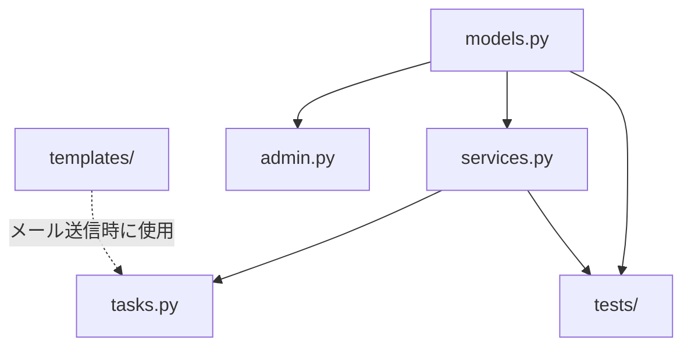

# 📁 kits.notifications - 実装の全体像

> **読了時間**: 約10分
>
> このドキュメントでは、kits.notificationsの**ファイル構成**と**各ファイルの役割**を解説します。
> 「どこに何が書いてあるか」が分かるようになります。

**最終更新**: 2025-10-05

---

## 🗂️ ディレクトリ構造

kits.notificationsは3つの場所にファイルが分散しています：

```
/home/hirok/work/school_diary/
│
├── kits/notifications/              # ← メインコード（合計1154行）
│   ├── __init__.py                 # パッケージ初期化
│   ├── apps.py                     # Django設定
│   ├── models.py                   # データモデル（289行）
│   ├── services.py                 # ビジネスロジック（約300行）
│   ├── tasks.py                    # Celeryタスク（約200行）
│   ├── admin.py                    # Django管理画面（約150行）
│   ├── signals.py                  # Djangoシグナル
│   ├── examples.py                 # 使用例
│   └── migrations/                 # データベースマイグレーション
│
├── school_diary/templates/notifications/ # ← HTMLテンプレート
│   └── emails/
│       ├── base_email.html        # 基本レイアウト
│       └── approval_request.html  # 承認申請メール例
│
└── tests/notifications/             # ← テストコード
    ├── test_models.py              # モデルテスト（7テスト）
    └── test_services.py            # サービステスト（4テスト）
```

### なぜ3箇所に分かれている？

**理由**: Djangoのベストプラクティスに従っているため

```
kits/         → 再利用可能なPythonコード
templates/    → HTML（プロジェクト全体で共有）
tests/        → テストコード（開発時のみ使用）
```

---

## 📄 各ファイルの役割

### 1. models.py（データモデル）

**役割**: データベースのテーブル定義

**何が定義されている？**
- `NotificationTemplate` - 通知テンプレート（型）
- `Notification` - 個々の通知
- ステータス、優先度、タイプの定義

**行数**: 289行

**データベースに作られるテーブル**:
```sql
-- テンプレートテーブル
CREATE TABLE kits_notification_templates (
    id SERIAL PRIMARY KEY,
    code VARCHAR(100) UNIQUE,  -- "welcome_email"など
    name VARCHAR(200),
    subject_template VARCHAR(255),
    body_template TEXT,
    ...
);

-- 通知テーブル
CREATE TABLE kits_notifications (
    id SERIAL PRIMARY KEY,
    recipient_id INTEGER REFERENCES auth_user(id),
    template_id INTEGER REFERENCES kits_notification_templates(id),
    status VARCHAR(20),  -- "pending", "sent", etc.
    subject VARCHAR(255),
    body TEXT,
    sent_at TIMESTAMP,
    ...
);
```

**初心者向け解説**:
```python
# models.pyに書いてあること = データの「箱」を定義

class NotificationTemplate(models.Model):
    code = models.CharField(...)  # 箱に何を入れるか定義
    name = models.CharField(...)

# Djangoが自動でデータベースのテーブルを作ってくれる
```

---

### 2. services.py（ビジネスロジック）

**役割**: 通知の作成・送信・レンダリングのロジック

**何が定義されている？**
- `NotificationService` - 通知操作のメインクラス
- `NotificationTemplateRenderer` - テンプレートレンダリング

**行数**: 約300行

**主なメソッド**:
```python
class NotificationService:
    def create_from_template(...)  # テンプレートから通知作成
    def send(...)                  # 通知送信
    def get_unread_count(...)      # 未読数取得
    def mark_all_as_read(...)      # 全て既読に

class NotificationTemplateRenderer:
    def render_subject(...)        # 件名レンダリング
    def render_body(...)           # 本文レンダリング
```

**初心者向け解説**:
```python
# services.pyに書いてあること = 「作業手順」を定義

# 例: 通知を作成する手順
def create_from_template(...):
    # 1. テンプレートを取得
    # 2. 変数を埋め込む
    # 3. 通知を保存
    # 4. 結果を返す
```

---

### 3. tasks.py（非同期処理）

**役割**: Celeryタスク（バックグラウンド処理）

**何が定義されている？**
- `send_notification_task` - メール送信タスク
- `send_scheduled_notifications` - 予約送信
- `cleanup_old_notifications` - 古い通知の削除
- `retry_failed_notifications` - 失敗した通知の再送

**行数**: 約200行

**初心者向け解説**:
```python
# tasks.pyに書いてあること = 「裏で動く仕事」を定義

@shared_task
def send_notification_task(notification_id):
    # この仕事は裏で実行される（ユーザーを待たせない）
    notification = Notification.objects.get(id=notification_id)
    send_email(notification)
```

**なぜ非同期？**
```python
❌ 同期処理: ユーザーを待たせる
user.click_button()
  → send_email()  # 5秒かかる😓
  → "送信完了！" # やっと表示

✅ 非同期処理: すぐ返す
user.click_button()
  → send_notification_task.delay()  # 0.1秒
  → "送信中です！" # すぐ表示
  → （裏でメール送信）
```

---

### 4. admin.py（Django管理画面）

**役割**: 管理画面のカスタマイズ

**何が定義されている？**
- `NotificationTemplateAdmin` - テンプレート管理画面
- `NotificationAdmin` - 通知一覧・詳細画面

**行数**: 約150行

**管理画面でできること**:
```
http://localhost:8000/admin/notifications/

├── 通知テンプレート
│   ├─ 一覧表示（コード、名前、有効/無効）
│   ├─ 新規作成
│   ├─ 編集
│   └─ 削除
│
└── 通知
    ├─ 一覧表示（受信者、件名、ステータス、送信日時）
    ├─ フィルター（ステータス別、日付別）
    ├─ 検索（件名、本文）
    └─ 詳細表示
```

**初心者向け解説**:
```python
# admin.pyに書いてあること = 管理画面の「見た目」をカスタマイズ

@admin.register(Notification)
class NotificationAdmin(admin.ModelAdmin):
    list_display = ["subject", "recipient", "status"]  # 一覧に表示する列
    list_filter = ["status", "created_at"]             # フィルター
    search_fields = ["subject", "body"]                # 検索対象
```

---

### 5. signals.py（Djangoシグナル）

**役割**: 他のイベントに反応して通知を送る

**何が定義されている？**
- イベントハンドラ（現在は空、将来の拡張用）

**行数**: 約50行

**使用例（将来）**:
```python
# ユーザーが登録されたら自動で歓迎メール
from django.db.models.signals import post_save
from django.contrib.auth import get_user_model

@receiver(post_save, sender=get_user_model())
def send_welcome_email(sender, instance, created, **kwargs):
    if created:  # 新規作成時のみ
        service = NotificationService()
        service.create_from_template("welcome_email", instance, {})
```

---

### 6. examples.py（使用例）

**役割**: 実際の使い方のサンプルコード

**何が定義されている？**
- シンプルな通知送信
- テンプレートを使った通知
- スケジュール送信の例

**行数**: 約100行

**初心者向け解説**:
```python
# examples.pyに書いてあること = 「使い方のお手本」

# コピー&ペーストで動くコードが書いてある
def example_simple_notification():
    """シンプルな通知の例"""
    service = NotificationService()
    notification = service.create(...)
```

---

### 7. apps.py（Django設定）

**役割**: Djangoアプリケーションの設定

**何が定義されている？**
- アプリ名、設定

**行数**: 約20行

**初心者向け解説**:
```python
# apps.pyに書いてあること = このアプリの「名札」

class NotificationsConfig(AppConfig):
    name = "kits.notifications"  # アプリ名
    verbose_name = "通知"        # 日本語名
```

---

### 8. migrations/（マイグレーション）

**役割**: データベース変更履歴

**何が入っている？**
- `0001_initial.py` - 初回のテーブル作成

**初心者向け解説**:
```python
# migrations/に書いてあること = データベースの「変更履歴」

# 0001_initial.py
# → NotificationTemplateテーブルを作成
# → Notificationテーブルを作成

# もし将来、フィールドを追加したら
# 0002_add_priority_field.py
# → priorityフィールドを追加
```

---

## 🎨 HTMLテンプレート

### school_diary/templates/notifications/emails/

**役割**: メールのHTML

**ファイル**:

#### base_email.html（基本レイアウト）
```html
<!DOCTYPE html>
<html>
<head>
    <meta charset="UTF-8">
    <title>{{ subject }}</title>
</head>
<body>
    <div class="header">
        <h1>school_diary</h1>
    </div>

    <div class="content">
        
    </div>

    <div class="footer">
        <p>このメールに心当たりがない場合は...</p>
    </div>
</body>
</html>
```

#### approval_request.html（承認申請メール例）
```html



<h2>新しい承認申請があります</h2>

<p>{{ approver.name }}さん</p>

<p>{{ requester.name }}さんから承認申請が届いています。</p>

<table>
    <tr>
        <th>申請日</th>
        <td>{{ request_date }}</td>
    </tr>
    <tr>
        <th>理由</th>
        <td>{{ reason }}</td>
    </tr>
</table>

<a href="{{ approval_url }}">承認画面へ</a>

```

**初心者向け解説**:
```
base_email.html = メールの「枠」（ヘッダー、フッター）
approval_request.html = メールの「中身」

Django Template言語:
  {{ 変数名 }}      → 変数を表示
     → 継承可能な部分
   → 親テンプレートを継承
```

---

## 🧪 テストコード

### tests/notifications/

**役割**: コードが正しく動くか確認

**ファイル**:

#### test_models.py（モデルテスト、7テスト）
```python
def test_notification_template_creation():
    """テンプレートが作成できるか"""
    template = NotificationTemplate.objects.create(...)
    assert template.code == "test"

def test_notification_mark_as_sent():
    """送信完了マークが正しく動くか"""
    notification.mark_as_sent()
    assert notification.status == "sent"

# ...全7テスト
```

#### test_services.py（サービステスト、4テスト）
```python
def test_create_from_template():
    """テンプレートから通知作成できるか"""
    service = NotificationService()
    notification = service.create_from_template(...)
    assert notification is not None

# ...全4テスト
```

**テスト実行コマンド**:
```bash
# 全テスト実行
docker-compose -f docker-compose.local.yml run --rm django \
    python manage.py test tests.notifications

# 結果:
# Ran 11 tests in 2.5s
# OK
```

---

## 🔗 ファイル間の依存関係



**依存関係の説明**:

1. **models.py**: すべての基盤（他のファイルに依存しない）
2. **services.py**: models.pyを使う
3. **tasks.py**: services.pyとmodels.pyを使う
4. **admin.py**: models.pyを使う
5. **tests/**: models.pyとservices.pyをテスト

**重要**: 循環依存がない（A→B→A のような依存がない）

---

## 📊 コード規模

| ファイル | 行数 | 役割の重要度 |
|---------|------|------------|
| models.py | 289行 | ⭐⭐⭐⭐⭐ (最重要) |
| services.py | ~300行 | ⭐⭐⭐⭐⭐ (最重要) |
| tasks.py | ~200行 | ⭐⭐⭐⭐ (重要) |
| admin.py | ~150行 | ⭐⭐⭐ (便利) |
| signals.py | ~50行 | ⭐ (将来用) |
| examples.py | ~100行 | ⭐⭐ (学習用) |
| apps.py | ~20行 | ⭐ (設定のみ) |
| **合計** | **~1154行** | |

**初心者が最初に読むべきファイル**:
1. examples.py - 使い方が分かる
2. models.py - データ構造が分かる
3. services.py - ロジックが分かる

---

## 💡 ファイル配置の設計原則

### 1. 単一責任の原則

```
models.py     → データ定義のみ
services.py   → ビジネスロジックのみ
tasks.py      → 非同期処理のみ
admin.py      → 管理画面のみ
```

各ファイルが1つの責務だけを持つ

### 2. 最小限のファイル数

```
✅ kits.notifications: 8ファイル（適切）

❌ 悪い例: 30ファイル
kits/notifications/
├── models/
│   ├── base.py
│   ├── template.py
│   ├── notification.py
│   └── ...
├── services/
│   ├── email_service.py
│   ├── sms_service.py
│   └── ...
└── ... (多すぎて分からない😓)
```

ファイルを細かく分けすぎない

### 3. Django標準に従う

```
kits/notifications/  ← Djangoアプリの標準構造
├── models.py       ← Djangoの慣習
├── admin.py        ← Djangoの慣習
├── apps.py         ← Djangoの慣習
└── ...
```

---

## 🚀 次のステップ

実装の全体像を理解したら：

1. **コードの詳細を学ぶ** → [04_コード解説.md](./04_コード解説.md)
   - 各ファイルのコードを詳しく解説

2. **実際に使ってみる** → [05_使い方ガイド.md](./05_使い方ガイド.md)
   - コピペで動く実例

3. **トラブル時** → [06_よくある質問.md](./06_よくある質問.md)
   - エラー対処法

---

## 📝 まとめ

### kits.notificationsのファイル構成

- **コア**: models.py, services.py, tasks.py（~800行）
- **管理**: admin.py, apps.py（~170行）
- **補助**: signals.py, examples.py（~150行）
- **テンプレート**: base_email.html, approval_request.html
- **テスト**: test_models.py, test_services.py（11テスト）

### 設計原則

1. ✅ ファイル数を最小限に（8ファイル）
2. ✅ 単一責任の原則
3. ✅ Django標準に従う
4. ✅ 循環依存なし

**「どこに何が書いてあるか」が分かれば、コードを読むのが楽になります！**

---

**作成者**: Claude Code + hirok
**バージョン**: 1.0.0
**関連ドキュメント**: [02_設計思想.md](./02_設計思想.md)

#notifications #architecture #structure #ファイル構成 #初心者向け
