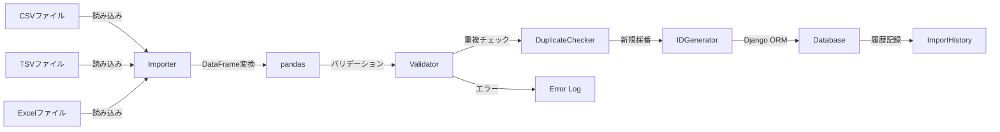

# kits.io 実装ガイド

> 💡 **このガイドを始める前に**
>
> プロジェクト全体の背景、なぜこの実装が必要なのか、現在の構成と目指す構成について理解するために、まず **[実装の背景とコンテキスト](KITS_CONTEXT.md)** をお読みください。
>
> このドキュメントには以下の情報が含まれています：
> - 📚 プロジェクト全体の背景（school_diaryとは何か）
> - 🎯 なぜkits.ioが必要なのか（過去課題4つの分析）
> - 🏗️ 現在のプロジェクト構成と目指す構成
> - 📊 実装の優先順位と戦略（Tier 1の3つ）
> - ⚙️ 技術的な制約と設計方針

---

## 📋 概要

このガイドでは、`kits.io`パッケージの実装方法を初心者にもわかりやすく、ステップバイステップで解説します。

**kits.ioとは？**
業務アプリケーションで必要なデータインポート/エクスポート機能（CSV/TSV/Excel読み込み、バリデーション、重複チェック、エクスポート）を提供する再利用可能なDjangoパッケージです。

**このパッケージが解決する課題**
- ✅ 過去2回分の記録.xlsxの取り込み（課題3: 野球部記録）
- ✅ 既存5システムからUTF-8 TSVインポート（課題4: 図書館システム）
- ✅ バーコードID重複の検出・新規採番（課題4: 図書館システム）

**主な機能**
- 📥 CSV/TSV/Excelインポート
- ✅ Djangoフォームベースのバリデーション
- 🔄 重複チェック・新規採番
- 📊 インポート履歴の記録
- 📤 CSV/Excelエクスポート
- 🛡️ エラーハンドリング

## 🎯 学習目標

このガイドを完了すると、以下ができるようになります：

- [ ] pandas/openpyxlを使ったファイル読み込みを実装できる
- [ ] Djangoフォームでのバリデーションを実装できる
- [ ] 重複チェックと新規採番のロジックを実装できる
- [ ] インポート履歴を記録する仕組みを実装できる
- [ ] 再利用可能なインポーターの設計パターンを学べる

## 📚 前提知識

**必須:**
- Python 3.12の基本文法
- Djangoの基礎（モデル、ビュー、テンプレート）
- Git/GitHub の基本操作
- CSV/Excelファイルの基本的な理解

**推奨:**
- pandas/DataFrameの基本操作
- Django Formsのバリデーション
- 文字コード（UTF-8、Shift-JIS）の知識

## 🏗️ アーキテクチャ概要

### 既存のkitsパッケージのパターン

school_diaryでは、kitsパッケージは**シンプルで最小限の構成**を維持しています：

```
kits/
├── accounts/          # 管理コマンド提供型
├── approvals/         # シグナル提供型
├── demos/             # 完全なDjangoアプリ型（モデル持ち）
├── notifications/     # 完全なDjangoアプリ型（モデル持ち）
├── reports/           # 完全なDjangoアプリ型（モデル持ち）
└── io/                # ← 今回実装（demosパターンを踏襲）
```

### ioの構成（demosパターンを踏襲）

```
kits/io/
├── __init__.py
├── apps.py               # Djangoアプリ設定
├── models.py             # ImportHistory, ImportMapping
├── admin.py              # Django管理画面
├── importers.py          # CSVImporter, TSVImporter, ExcelImporter
├── exporters.py          # CSVExporter, ExcelExporter
├── validators.py         # ImportValidator
├── serializers.py        # DRF serializers（オプション）
└── migrations/           # データベースマイグレーション

# 管理コマンドとテストは別の場所
kits/io/management/commands/  # 管理コマンド
    ├── __init__.py
    └── import_data.py        # 汎用インポートコマンド

tests/io/                      # ユニットテスト
    ├── test_models.py
    ├── test_importers.py
    ├── test_validators.py
    └── fixtures/              # テスト用データファイル
        ├── sample.csv
        ├── sample.tsv
        └── sample.xlsx
```

**設計方針:**
- ✅ **サブディレクトリを最小限に** - management/commandsのみ作成
- ✅ **ファイル数を最小限に** - 機能ごとに1ファイル
- ✅ **demosパターンを踏襲** - 既存の成功パターンに従う
- ✅ **pandas活用** - DataFrameで統一的に処理

### データフロー図



---

## 🚀 実装手順

### Step 1: プロジェクト構造の理解

#### 目的
kitsパッケージの構造と、ioモジュールの位置づけを理解します。

#### 実行コマンド

```bash
# 現在のkitsパッケージ構成を確認
cd /home/hirok/work/school_diary
tree -L 2 kits/
```

#### チェックリスト
- [ ] kitsディレクトリの場所を確認した
- [ ] kits/io/ディレクトリの存在を確認した（なければ作成）
- [ ] 他のkitsモジュール（demos, notifications, reports）の構成を参考にした

#### 💡 ポイント
- `kits`は再利用可能なDjangoアプリケーションの集合体です
- 各モジュールは独立して動作し、`pip install -e ~/work/school_diary`で他のプロジェクトから利用できます

---

### Step 2: 依存関係のインストールと設定

#### 目的
データI/O機能に必要なPythonパッケージをインストールし、Django設定を行います。

#### 実装内容

##### 2.1 requirements.txtへの追加

`requirements/base.txt`に以下を追加：

```txt
# Data Import/Export
pandas==2.2.2                  # データ分析・処理
openpyxl==3.1.5                # Excel読み書き
xlsxwriter==3.2.0              # Excel書き込み（高機能）
chardet==5.2.0                 # 文字コード自動検出
python-magic==0.4.27           # ファイルタイプ検出
```

**なぜこれらが必要？**
- `pandas`: CSV/TSV/Excelを統一的にDataFrameとして扱える
- `openpyxl`: Excelファイル（.xlsx）の読み書き
- `xlsxwriter`: Excelファイルの高度な書式設定
- `chardet`: Shift-JISやEUC-JPなど、文字コードを自動検出
- `python-magic`: ファイルの実際の形式を検出（拡張子偽装対策）

##### 2.2 システム依存パッケージのインストール（python-magic用）

python-magicはlibmagicに依存します：

```bash
# Ubuntu/Debian
sudo apt-get install -y libmagic1

# macOS
brew install libmagic
```

##### 2.3 Pythonパッケージのインストール

```bash
# 開発環境の場合
pip install -r requirements/local.txt

# または個別にインストール
pip install pandas openpyxl xlsxwriter chardet python-magic
```

##### 2.4 Django設定の更新

`config/settings/base.py`に追加：

```python
# INSTALLED_APPS に追加
INSTALLED_APPS = [
    # ...既存のアプリ...
    "kits.io",
]

# データI/O設定
IO_CONFIG = {
    "ENABLED": True,
    "UPLOAD_DIR": BASE_DIR / "media" / "imports",  # アップロード先
    "TEMP_DIR": BASE_DIR / "media" / "imports" / "temp",  # 一時ファイル
    "MAX_FILE_SIZE_MB": 100,  # 最大ファイルサイズ（MB）
    "ALLOWED_EXTENSIONS": ["csv", "tsv", "txt", "xlsx", "xls"],
    "DEFAULT_ENCODING": "utf-8",  # デフォルト文字コード
    "AUTO_DETECT_ENCODING": True,  # 文字コード自動検出
    "CHUNK_SIZE": 1000,  # チャンク処理のサイズ（行数）
    "VALIDATION_ENABLED": True,  # バリデーション有効化
    "DUPLICATE_STRATEGY": "skip",  # skip, update, renumber, error
}

# ファイルアップロード設定
FILE_UPLOAD_MAX_MEMORY_SIZE = 10 * 1024 * 1024  # 10MB
DATA_UPLOAD_MAX_MEMORY_SIZE = 10 * 1024 * 1024  # 10MB
```

ディレクトリを作成：

```bash
# インポートディレクトリを作成
mkdir -p /home/hirok/work/school_diary/media/imports/temp
```

#### チェックリスト
- [ ] requirements/base.txtにパッケージを追加した
- [ ] システム依存パッケージをインストールした（python-magic用）
- [ ] pip installでPythonパッケージをインストールした
- [ ] Django設定ファイルを更新した
- [ ] インポート保存ディレクトリを作成した
- [ ] 設定が反映されているか確認（`python manage.py check`）

#### ⚠️ よくあるエラー

**エラー1:** `ModuleNotFoundError: No module named 'pandas'`
→ **対処法:** `pip install pandas`を実行

**エラー2:** `ImportError: failed to find libmagic`
→ **対処法:** システムライブラリをインストール（上記2.2参照）

---

### Step 3: データモデルの設計と実装

#### 目的
インポート履歴とマッピング設定を保存するためのDjangoモデルを実装します。

#### 実装内容

`kits/io/models.py`を作成：

```python
"""
データI/Oシステムのデータモデル

このモジュールは、インポート履歴、マッピング設定、
エラーログの管理を担当します。
"""
from django.db import models
from django.contrib.auth import get_user_model
from django.utils import timezone
from django.utils.translation import gettext_lazy as _
from django.core.validators import FileExtensionValidator
import uuid

User = get_user_model()


class ImportStatus(models.TextChoices):
    """インポートの状態"""
    PENDING = "pending", _("処理待ち")
    PROCESSING = "processing", _("処理中")
    COMPLETED = "completed", _("完了")
    FAILED = "failed", _("失敗")
    PARTIAL = "partial", _("一部成功")


class DuplicateStrategy(models.TextChoices):
    """重複時の処理方法"""
    SKIP = "skip", _("スキップ")
    UPDATE = "update", _("更新")
    RENUMBER = "renumber", _("新規採番")
    ERROR = "error", _("エラー")


class ImportMapping(models.Model):
    """
    インポートマッピング設定

    CSVカラムとDjangoモデルフィールドの対応関係を保存します。
    再利用可能なマッピング設定を管理できます。
    """
    code = models.CharField(
        max_length=100,
        unique=True,
        verbose_name=_("マッピングコード"),
        help_text=_("システム内で使用する一意の識別子（例: book_import_mapping）"),
    )
    name = models.CharField(
        max_length=200,
        verbose_name=_("マッピング名"),
    )
    description = models.TextField(
        blank=True,
        verbose_name=_("説明"),
    )

    # 対象モデル
    model_name = models.CharField(
        max_length=200,
        verbose_name=_("モデル名"),
        help_text=_("例: library.Book"),
    )

    # マッピング定義（JSON）
    field_mapping = models.JSONField(
        default=dict,
        verbose_name=_("フィールドマッピング"),
        help_text=_("{'CSVカラム名': 'モデルフィールド名'}"),
    )

    # バリデーション設定
    validation_rules = models.JSONField(
        default=dict,
        verbose_name=_("バリデーションルール"),
        help_text=_("フィールドごとのバリデーション設定"),
    )

    # 重複チェック設定
    unique_fields = models.JSONField(
        default=list,
        verbose_name=_("一意フィールド"),
        help_text=_("重複チェックに使用するフィールドのリスト"),
    )
    duplicate_strategy = models.CharField(
        max_length=20,
        choices=DuplicateStrategy.choices,
        default=DuplicateStrategy.SKIP,
        verbose_name=_("重複時の処理"),
    )

    # 設定
    is_active = models.BooleanField(
        default=True,
        verbose_name=_("有効"),
    )

    # メタ情報
    created_at = models.DateTimeField(auto_now_add=True)
    updated_at = models.DateTimeField(auto_now=True)
    created_by = models.ForeignKey(
        User,
        on_delete=models.SET_NULL,
        null=True,
        related_name="created_import_mappings",
        verbose_name=_("作成者"),
    )

    class Meta:
        db_table = "kits_import_mappings"
        verbose_name = _("インポートマッピング")
        verbose_name_plural = _("インポートマッピング")
        ordering = ["code"]

    def __str__(self):
        return f"{self.code} - {self.name}"


class ImportHistory(models.Model):
    """
    インポート履歴

    個々のインポート実行結果を記録します。
    成功件数、失敗件数、エラー内容などを保存します。
    """
    id = models.UUIDField(
        primary_key=True,
        default=uuid.uuid4,
        editable=False,
    )

    # マッピング
    mapping = models.ForeignKey(
        ImportMapping,
        on_delete=models.SET_NULL,
        null=True,
        blank=True,
        related_name="import_histories",
        verbose_name=_("マッピング"),
    )

    # 実行者
    imported_by = models.ForeignKey(
        User,
        on_delete=models.SET_NULL,
        null=True,
        related_name="import_histories",
        verbose_name=_("実行者"),
    )

    # ファイル情報
    original_filename = models.CharField(
        max_length=255,
        verbose_name=_("元ファイル名"),
    )
    file = models.FileField(
        upload_to="imports/%Y/%m/%d/",
        blank=True,
        validators=[FileExtensionValidator(
            allowed_extensions=["csv", "tsv", "txt", "xlsx", "xls"]
        )],
        verbose_name=_("ファイル"),
    )
    file_size = models.PositiveBigIntegerField(
        default=0,
        verbose_name=_("ファイルサイズ（bytes）"),
    )
    encoding = models.CharField(
        max_length=50,
        default="utf-8",
        verbose_name=_("文字コード"),
    )

    # インポート設定
    model_name = models.CharField(
        max_length=200,
        verbose_name=_("モデル名"),
    )
    parameters = models.JSONField(
        default=dict,
        verbose_name=_("パラメータ"),
        help_text=_("インポート時の設定"),
    )

    # ステータス
    status = models.CharField(
        max_length=20,
        choices=ImportStatus.choices,
        default=ImportStatus.PENDING,
        verbose_name=_("ステータス"),
    )

    # 統計情報
    total_rows = models.PositiveIntegerField(
        default=0,
        verbose_name=_("総行数"),
    )
    success_count = models.PositiveIntegerField(
        default=0,
        verbose_name=_("成功件数"),
    )
    failed_count = models.PositiveIntegerField(
        default=0,
        verbose_name=_("失敗件数"),
    )
    skipped_count = models.PositiveIntegerField(
        default=0,
        verbose_name=_("スキップ件数"),
    )
    updated_count = models.PositiveIntegerField(
        default=0,
        verbose_name=_("更新件数"),
    )
    renumbered_count = models.PositiveIntegerField(
        default=0,
        verbose_name=_("新規採番件数"),
    )

    # タイムスタンプ
    started_at = models.DateTimeField(
        null=True,
        blank=True,
        verbose_name=_("開始日時"),
    )
    completed_at = models.DateTimeField(
        null=True,
        blank=True,
        verbose_name=_("完了日時"),
    )
    created_at = models.DateTimeField(auto_now_add=True)
    updated_at = models.DateTimeField(auto_now=True)

    # エラー情報
    error_message = models.TextField(
        blank=True,
        verbose_name=_("エラーメッセージ"),
    )
    error_details = models.JSONField(
        default=list,
        verbose_name=_("エラー詳細"),
        help_text=_("各行のエラー情報"),
    )

    class Meta:
        db_table = "kits_import_histories"
        verbose_name = _("インポート履歴")
        verbose_name_plural = _("インポート履歴")
        ordering = ["-created_at"]
        indexes = [
            models.Index(fields=["imported_by", "status"]),
            models.Index(fields=["created_at"]),
            models.Index(fields=["status"]),
        ]

    def __str__(self):
        return f"{self.original_filename} ({self.get_status_display()})"

    def mark_as_processing(self):
        """処理中としてマーク"""
        self.status = ImportStatus.PROCESSING
        self.started_at = timezone.now()
        self.save(update_fields=["status", "started_at", "updated_at"])

    def mark_as_completed(self, success_count: int, failed_count: int = 0,
                          skipped_count: int = 0, updated_count: int = 0,
                          renumbered_count: int = 0):
        """完了としてマーク"""
        self.status = ImportStatus.COMPLETED if failed_count == 0 else ImportStatus.PARTIAL
        self.success_count = success_count
        self.failed_count = failed_count
        self.skipped_count = skipped_count
        self.updated_count = updated_count
        self.renumbered_count = renumbered_count
        self.completed_at = timezone.now()
        self.save(update_fields=[
            "status", "success_count", "failed_count", "skipped_count",
            "updated_count", "renumbered_count", "completed_at", "updated_at"
        ])

    def mark_as_failed(self, error_message: str):
        """失敗としてマーク"""
        self.status = ImportStatus.FAILED
        self.error_message = error_message
        self.completed_at = timezone.now()
        self.save(update_fields=["status", "error_message", "completed_at", "updated_at"])

    def add_error(self, row_number: int, field: str, error: str):
        """エラーを追加"""
        self.error_details.append({
            'row': row_number,
            'field': field,
            'error': error,
        })
        self.save(update_fields=["error_details", "updated_at"])

    @property
    def success_rate(self) -> float:
        """成功率"""
        if self.total_rows == 0:
            return 0.0
        return (self.success_count / self.total_rows) * 100

    @property
    def duration(self):
        """処理時間"""
        if self.started_at and self.completed_at:
            return self.completed_at - self.started_at
        return None
```

#### データモデル設計のポイント

**1. ImportMappingとImportHistoryの分離**
- マッピングは再利用可能（1つのマッピングから複数のインポート実行）
- 履歴は個別のインスタンス（実行結果、エラー情報を保持）

**2. ステータス管理**
```
pending → processing → completed/failed/partial
```

**3. 詳細な統計情報**
- 成功件数、失敗件数、スキップ件数、更新件数、新規採番件数
- 成功率の自動計算
- 処理時間の記録

**4. エラー情報の構造化**
- 全体エラーメッセージ
- 行ごとのエラー詳細（JSON形式）

#### チェックリスト
- [ ] models.pyファイルを作成した
- [ ] ImportMappingモデルを実装した
- [ ] ImportHistoryモデルを実装した
- [ ] 各フィールドの意味を理解した

---

### Step 4: マイグレーションの作成と適用

#### 目的
データベースにテーブルを作成します。

#### 実行コマンド

```bash
# マイグレーションファイルの生成
python manage.py makemigrations io

# マイグレーション内容の確認（SQLを表示）
python manage.py sqlmigrate io 0001

# マイグレーションの適用
python manage.py migrate io
```

#### 予想される出力

```
Migrations for 'io':
  kits/io/migrations/0001_initial.py
    - Create model ImportMapping
    - Create model ImportHistory
    - Add index importhistory_imported_by_status_idx
    - Add index importhistory_created_idx
    - Add index importhistory_status_idx
```

#### チェックリスト
- [ ] マイグレーションファイルが生成された
- [ ] マイグレーションを適用した
- [ ] データベースにテーブルが作成されたか確認

---

### Step 5: インポーターの実装

#### 目的
CSV/TSV/Excelファイルを読み込むインポーターを実装します。

#### 実装内容

`kits/io/importers.py`を作成：

```python
"""
インポーター層

CSV/TSV/Excelファイルを読み込み、Djangoモデルに保存します。
"""
import logging
from typing import Optional, Dict, Any, List, Callable
from pathlib import Path
import pandas as pd
import chardet
from django.conf import settings
from django.apps import apps
from django.db import transaction
from django.core.exceptions import ValidationError

from .models import ImportHistory, ImportMapping, DuplicateStrategy, ImportStatus
from .validators import ImportValidator

logger = logging.getLogger(__name__)


class BaseImporter:
    """
    ベースインポーター

    共通のインポートロジックを提供します。
    """

    def __init__(
        self,
        model_name: str,
        mapping: Optional[Dict[str, str]] = None,
        mapping_code: Optional[str] = None,
        unique_fields: Optional[List[str]] = None,
        duplicate_strategy: str = DuplicateStrategy.SKIP,
        encoding: str = "utf-8",
        auto_detect_encoding: bool = True,
        chunk_size: int = 1000,
        validate: bool = True,
        user=None,
    ):
        """
        Args:
            model_name: モデル名（例: "library.Book"）
            mapping: フィールドマッピング {'CSVカラム': 'モデルフィールド'}
            mapping_code: ImportMappingのコード（mappingより優先）
            unique_fields: 重複チェックに使用するフィールド
            duplicate_strategy: 重複時の処理方法
            encoding: 文字コード
            auto_detect_encoding: 文字コード自動検出
            chunk_size: チャンク処理のサイズ
            validate: バリデーション有効化
            user: 実行ユーザー
        """
        self.model_name = model_name
        self.user = user

        # マッピング設定
        if mapping_code:
            mapping_obj = ImportMapping.objects.get(code=mapping_code, is_active=True)
            self.mapping = mapping_obj.field_mapping
            self.unique_fields = mapping_obj.unique_fields
            self.duplicate_strategy = mapping_obj.duplicate_strategy
        else:
            self.mapping = mapping or {}
            self.unique_fields = unique_fields or []
            self.duplicate_strategy = duplicate_strategy

        self.encoding = encoding
        self.auto_detect_encoding = auto_detect_encoding
        self.chunk_size = chunk_size
        self.validate = validate

        # モデルを取得
        try:
            app_label, model_class_name = model_name.split('.')
            self.model = apps.get_model(app_label, model_class_name)
        except (ValueError, LookupError) as e:
            raise ValueError(f"モデルが見つかりません: {model_name}")

        # バリデーター
        self.validator = ImportValidator(self.model) if validate else None

    def import_file(self, file_path: str) -> ImportHistory:
        """
        ファイルをインポート

        Args:
            file_path: インポートするファイルのパス

        Returns:
            インポート履歴オブジェクト
        """
        file_path = Path(file_path)

        # ImportHistoryを作成
        history = ImportHistory.objects.create(
            model_name=self.model_name,
            original_filename=file_path.name,
            file_size=file_path.stat().st_size,
            encoding=self.encoding,
            imported_by=self.user,
            parameters={
                'mapping': self.mapping,
                'unique_fields': self.unique_fields,
                'duplicate_strategy': self.duplicate_strategy,
            }
        )

        try:
            # 処理開始
            history.mark_as_processing()

            # ファイルを読み込み
            df = self._read_file(file_path)
            history.total_rows = len(df)
            history.save(update_fields=['total_rows'])

            # インポート実行
            result = self._import_dataframe(df, history)

            # 完了としてマーク
            history.mark_as_completed(
                success_count=result['success'],
                failed_count=result['failed'],
                skipped_count=result['skipped'],
                updated_count=result['updated'],
                renumbered_count=result['renumbered'],
            )

            logger.info(f"インポート完了: {history.id} - {result}")
            return history

        except Exception as e:
            # エラーハンドリング
            error_message = str(e)
            history.mark_as_failed(error_message)
            logger.error(f"インポート失敗: {history.id} - {error_message}")
            raise

    def _read_file(self, file_path: Path) -> pd.DataFrame:
        """
        ファイルを読み込み（サブクラスでオーバーライド）

        Args:
            file_path: ファイルパス

        Returns:
            DataFrame
        """
        raise NotImplementedError("サブクラスで実装してください")

    def _import_dataframe(self, df: pd.DataFrame, history: ImportHistory) -> Dict[str, int]:
        """
        DataFrameをインポート

        Args:
            df: インポートするDataFrame
            history: インポート履歴

        Returns:
            統計情報 {'success': 100, 'failed': 5, ...}
        """
        stats = {
            'success': 0,
            'failed': 0,
            'skipped': 0,
            'updated': 0,
            'renumbered': 0,
        }

        # マッピングに従ってカラム名を変更
        if self.mapping:
            df = df.rename(columns=self.mapping)

        # チャンク処理
        for chunk_start in range(0, len(df), self.chunk_size):
            chunk_end = min(chunk_start + self.chunk_size, len(df))
            chunk = df.iloc[chunk_start:chunk_end]

            with transaction.atomic():
                for idx, row in chunk.iterrows():
                    try:
                        result = self._import_row(row, idx + 2)  # +2: ヘッダー行 + 0-indexed
                        stats[result] += 1
                    except Exception as e:
                        stats['failed'] += 1
                        history.add_error(idx + 2, '', str(e))

        return stats

    def _import_row(self, row: pd.Series, row_number: int) -> str:
        """
        1行をインポート

        Args:
            row: 行データ
            row_number: 行番号（エラー表示用）

        Returns:
            'success', 'skipped', 'updated', 'renumbered'のいずれか
        """
        # NaN値をNoneに変換
        row_dict = row.where(pd.notna(row), None).to_dict()

        # バリデーション
        if self.validator:
            errors = self.validator.validate_row(row_dict)
            if errors:
                raise ValidationError(errors)

        # 重複チェック
        if self.unique_fields:
            lookup = {field: row_dict.get(field) for field in self.unique_fields}
            existing = self.model.objects.filter(**lookup).first()

            if existing:
                return self._handle_duplicate(existing, row_dict)

        # 新規作成
        instance = self.model(**row_dict)
        instance.full_clean()
        instance.save()
        return 'success'

    def _handle_duplicate(self, existing, row_dict: Dict[str, Any]) -> str:
        """
        重複時の処理

        Args:
            existing: 既存オブジェクト
            row_dict: 新規データ

        Returns:
            'skipped', 'updated', 'renumbered'のいずれか
        """
        if self.duplicate_strategy == DuplicateStrategy.SKIP:
            return 'skipped'

        elif self.duplicate_strategy == DuplicateStrategy.UPDATE:
            for field, value in row_dict.items():
                setattr(existing, field, value)
            existing.full_clean()
            existing.save()
            return 'updated'

        elif self.duplicate_strategy == DuplicateStrategy.RENUMBER:
            # 一意フィールドを新規採番
            row_dict = self._renumber_unique_fields(row_dict)
            instance = self.model(**row_dict)
            instance.full_clean()
            instance.save()
            return 'renumbered'

        elif self.duplicate_strategy == DuplicateStrategy.ERROR:
            raise ValidationError(f"重複データ: {self.unique_fields}")

        return 'skipped'

    def _renumber_unique_fields(self, row_dict: Dict[str, Any]) -> Dict[str, Any]:
        """
        一意フィールドを新規採番

        Args:
            row_dict: 行データ

        Returns:
            新規採番された行データ
        """
        # 簡易実装: フィールド値に連番を付加
        for field in self.unique_fields:
            original_value = row_dict.get(field)
            if original_value:
                # 既存の最大番号を取得
                max_obj = self.model.objects.filter(
                    **{f"{field}__startswith": f"{original_value}_"}
                ).order_by(f"-{field}").first()

                if max_obj:
                    # 既存の番号から次の番号を生成
                    max_value = getattr(max_obj, field)
                    try:
                        last_number = int(max_value.split('_')[-1])
                        new_number = last_number + 1
                    except (ValueError, IndexError):
                        new_number = 1
                else:
                    new_number = 1

                row_dict[field] = f"{original_value}_{new_number:05d}"

        return row_dict


class CSVImporter(BaseImporter):
    """CSV形式のインポーター"""

    def __init__(self, *args, delimiter: str = ',', **kwargs):
        super().__init__(*args, **kwargs)
        self.delimiter = delimiter

    def _read_file(self, file_path: Path) -> pd.DataFrame:
        """CSVファイルを読み込み"""
        # 文字コード検出
        if self.auto_detect_encoding:
            with open(file_path, 'rb') as f:
                result = chardet.detect(f.read())
                detected_encoding = result['encoding']
                logger.info(f"文字コード検出: {detected_encoding} (confidence: {result['confidence']})")
                encoding = detected_encoding or self.encoding
        else:
            encoding = self.encoding

        # CSV読み込み
        df = pd.read_csv(file_path, encoding=encoding, delimiter=self.delimiter)
        logger.info(f"CSV読み込み完了: {len(df)}行")
        return df


class TSVImporter(CSVImporter):
    """TSV形式のインポーター"""

    def __init__(self, *args, **kwargs):
        kwargs['delimiter'] = '\t'
        super().__init__(*args, **kwargs)


class ExcelImporter(BaseImporter):
    """Excel形式のインポーター"""

    def __init__(self, *args, sheet_name: str = 0, **kwargs):
        super().__init__(*args, **kwargs)
        self.sheet_name = sheet_name

    def _read_file(self, file_path: Path) -> pd.DataFrame:
        """Excelファイルを読み込み"""
        df = pd.read_excel(file_path, sheet_name=self.sheet_name, engine='openpyxl')
        logger.info(f"Excel読み込み完了: {len(df)}行")
        return df
```

#### インポーター設計のポイント

**1. ベースクラスパターン**
- BaseImporterで共通ロジック
- サブクラスで形式固有の処理（_read_file）

**2. チャンク処理**
- 大量データでもメモリ効率的
- トランザクション単位で処理

**3. 柔軟な重複処理**
- skip, update, renumber, errorの4戦略
- 課題4のバーコードID問題に対応

**4. エラーハンドリング**
- 行ごとのエラーを記録
- 一部失敗でも処理続行

#### チェックリスト
- [ ] importers.pyファイルを作成した
- [ ] BaseImporterクラスを実装した
- [ ] CSVImporter、TSVImporter、ExcelImporterを実装した
- [ ] 重複処理ロジックを実装した

---

### Step 6: バリデーターの実装

#### 目的
インポートデータのバリデーションを実装します。

#### 実装内容

`kits/io/validators.py`を作成：

```python
"""
バリデーター

インポートデータのバリデーションを担当します。
"""
import logging
from typing import Dict, Any, List
from django.core.exceptions import ValidationError
from django.forms import ModelForm

logger = logging.getLogger(__name__)


class ImportValidator:
    """
    インポートバリデーター

    Djangoモデルのバリデーションルールを使用してデータを検証します。
    """

    def __init__(self, model):
        """
        Args:
            model: Djangoモデルクラス
        """
        self.model = model

        # モデルフォームを動的に生成
        self.form_class = type(
            f'{model.__name__}ImportForm',
            (ModelForm,),
            {
                'Meta': type('Meta', (), {
                    'model': model,
                    'fields': '__all__',
                })
            }
        )

    def validate_row(self, row_dict: Dict[str, Any]) -> Dict[str, List[str]]:
        """
        1行をバリデーション

        Args:
            row_dict: 行データ

        Returns:
            エラー辞書 {'field_name': ['error1', 'error2'], ...}
        """
        form = self.form_class(data=row_dict)

        if form.is_valid():
            return {}

        # エラーを整形
        errors = {}
        for field, error_list in form.errors.items():
            errors[field] = [str(e) for e in error_list]

        return errors

    def validate_dataframe(self, df) -> List[Dict[str, Any]]:
        """
        DataFrame全体をバリデーション

        Args:
            df: pandas DataFrame

        Returns:
            エラーリスト [{'row': 1, 'field': 'name', 'error': '...'}, ...]
        """
        all_errors = []

        for idx, row in df.iterrows():
            row_dict = row.where(pd.notna(row), None).to_dict()
            errors = self.validate_row(row_dict)

            if errors:
                for field, error_messages in errors.items():
                    for error_msg in error_messages:
                        all_errors.append({
                            'row': idx + 2,  # +2: ヘッダー行 + 0-indexed
                            'field': field,
                            'error': error_msg,
                        })

        return all_errors


class CustomValidator:
    """
    カスタムバリデーター

    Djangoモデルのバリデーション以外の検証ロジックを追加できます。
    """

    def __init__(self):
        self.validators = []

    def add_validator(self, field: str, validator_func):
        """
        バリデーターを追加

        Args:
            field: フィールド名
            validator_func: バリデーション関数 (value) -> bool
        """
        self.validators.append((field, validator_func))

    def validate(self, row_dict: Dict[str, Any]) -> Dict[str, List[str]]:
        """
        カスタムバリデーション実行

        Args:
            row_dict: 行データ

        Returns:
            エラー辞書
        """
        errors = {}

        for field, validator_func in self.validators:
            value = row_dict.get(field)
            try:
                if not validator_func(value):
                    errors.setdefault(field, []).append(f"バリデーションエラー: {field}")
            except Exception as e:
                errors.setdefault(field, []).append(str(e))

        return errors
```

#### バリデーター設計のポイント

**1. Djangoフォームの活用**
- ModelFormで自動バリデーション
- モデル定義と一貫性

**2. カスタムバリデーション**
- 追加のビジネスロジック検証
- 柔軟な拡張性

#### チェックリスト
- [ ] validators.pyファイルを作成した
- [ ] ImportValidatorクラスを実装した
- [ ] CustomValidatorクラスを実装した

---

### Step 7: Django管理画面の実装

#### 目的
管理者がインポート履歴とマッピング設定を管理できるようにします。

#### 実装内容

`kits/io/admin.py`を作成：

```python
"""
Django管理画面設定
"""
from django.contrib import admin
from django.utils.html import format_html
from django.utils.safestring import mark_safe
from django.urls import reverse

from .models import ImportHistory, ImportMapping


@admin.register(ImportMapping)
class ImportMappingAdmin(admin.ModelAdmin):
    """インポートマッピング管理画面"""

    list_display = [
        'code',
        'name',
        'model_name',
        'duplicate_strategy',
        'is_active',
        'usage_count',
        'updated_at',
    ]
    list_filter = ['is_active', 'duplicate_strategy', 'updated_at']
    search_fields = ['code', 'name', 'model_name', 'description']
    readonly_fields = ['created_at', 'updated_at', 'usage_count']

    fieldsets = (
        ('基本情報', {
            'fields': ('code', 'name', 'description', 'model_name', 'is_active'),
        }),
        ('マッピング設定', {
            'fields': ('field_mapping', 'validation_rules'),
        }),
        ('重複処理', {
            'fields': ('unique_fields', 'duplicate_strategy'),
        }),
        ('メタ情報', {
            'fields': ('usage_count', 'created_by', 'created_at', 'updated_at'),
            'classes': ('collapse',),
        }),
    )

    def usage_count(self, obj):
        """使用回数を表示"""
        count = obj.import_histories.count()
        url = reverse('admin:io_importhistory_changelist') + f'?mapping__id__exact={obj.id}'
        return format_html('<a href="{}">{} 件</a>', url, count)
    usage_count.short_description = '使用回数'


@admin.register(ImportHistory)
class ImportHistoryAdmin(admin.ModelAdmin):
    """インポート履歴管理画面"""

    list_display = [
        'id',
        'original_filename',
        'model_name',
        'status_badge',
        'total_rows',
        'success_count',
        'failed_count',
        'success_rate_display',
        'duration_display',
        'imported_by',
        'created_at',
    ]
    list_filter = [
        'status',
        'model_name',
        'created_at',
    ]
    search_fields = [
        'id',
        'original_filename',
        'model_name',
        'imported_by__email',
    ]
    readonly_fields = [
        'id',
        'mapping',
        'imported_by',
        'file',
        'file_size_display',
        'encoding',
        'parameters_display',
        'total_rows',
        'success_count',
        'failed_count',
        'skipped_count',
        'updated_count',
        'renumbered_count',
        'success_rate_display',
        'duration_display',
        'error_details_display',
        'created_at',
        'updated_at',
        'started_at',
        'completed_at',
    ]
    date_hierarchy = 'created_at'

    fieldsets = (
        ('基本情報', {
            'fields': ('id', 'mapping', 'model_name', 'imported_by'),
        }),
        ('ファイル情報', {
            'fields': ('original_filename', 'file', 'file_size_display', 'encoding'),
        }),
        ('ステータス', {
            'fields': ('status', 'started_at', 'completed_at', 'duration_display'),
        }),
        ('統計情報', {
            'fields': (
                'total_rows',
                'success_count',
                'failed_count',
                'skipped_count',
                'updated_count',
                'renumbered_count',
                'success_rate_display',
            ),
        }),
        ('エラー情報', {
            'fields': ('error_message', 'error_details_display'),
            'classes': ('collapse',),
        }),
        ('パラメータ', {
            'fields': ('parameters_display',),
            'classes': ('collapse',),
        }),
    )

    def status_badge(self, obj):
        """ステータスをバッジ表示"""
        colors = {
            'pending': 'gray',
            'processing': 'blue',
            'completed': 'green',
            'failed': 'red',
            'partial': 'orange',
        }
        color = colors.get(obj.status, 'gray')
        return format_html(
            '<span style="background-color: {}; color: white; padding: 3px 10px; '
            'border-radius: 3px; font-size: 11px;">{}</span>',
            color,
            obj.get_status_display()
        )
    status_badge.short_description = 'ステータス'

    def file_size_display(self, obj):
        """ファイルサイズを人間が読める形式で表示"""
        size = obj.file_size
        for unit in ['B', 'KB', 'MB', 'GB']:
            if size < 1024.0:
                return f"{size:.1f} {unit}"
            size /= 1024.0
        return f"{size:.1f} TB"
    file_size_display.short_description = 'ファイルサイズ'

    def success_rate_display(self, obj):
        """成功率を表示"""
        return f"{obj.success_rate:.1f}%"
    success_rate_display.short_description = '成功率'

    def duration_display(self, obj):
        """処理時間を表示"""
        duration = obj.duration
        if duration:
            total_seconds = int(duration.total_seconds())
            minutes, seconds = divmod(total_seconds, 60)
            return f"{minutes}分{seconds}秒"
        return "-"
    duration_display.short_description = '処理時間'

    def parameters_display(self, obj):
        """パラメータを整形表示"""
        import json
        return mark_safe(f'<pre>{json.dumps(obj.parameters, indent=2, ensure_ascii=False)}</pre>')
    parameters_display.short_description = 'パラメータ'

    def error_details_display(self, obj):
        """エラー詳細を整形表示"""
        import json
        if obj.error_details:
            return mark_safe(f'<pre>{json.dumps(obj.error_details, indent=2, ensure_ascii=False)}</pre>')
        return "-"
    error_details_display.short_description = 'エラー詳細'
```

#### チェックリスト
- [ ] admin.pyファイルを作成した
- [ ] ImportMappingAdminを実装した
- [ ] ImportHistoryAdminを実装した
- [ ] 管理画面でインポート履歴を確認できることを確認した

---

### Step 8: 管理コマンドの実装

#### 目的
コマンドラインからインポートを実行できる管理コマンドを作成します。

#### 実装内容

ディレクトリ構造を作成：

```bash
mkdir -p /home/hirok/work/school_diary/kits/io/management/commands
touch /home/hirok/work/school_diary/kits/io/management/__init__.py
touch /home/hirok/work/school_diary/kits/io/management/commands/__init__.py
```

`kits/io/management/commands/import_data.py`を作成：

```python
"""
データインポート管理コマンド
"""
from django.core.management.base import BaseCommand, CommandError
from django.contrib.auth import get_user_model

from kits.io.importers import CSVImporter, TSVImporter, ExcelImporter
from kits.io.models import ImportMapping

User = get_user_model()


class Command(BaseCommand):
    help = 'CSVファイルからデータをインポート'

    def add_arguments(self, parser):
        parser.add_argument(
            'file_path',
            type=str,
            help='インポートするファイルのパス',
        )
        parser.add_argument(
            'model_name',
            type=str,
            help='モデル名（例: library.Book）',
        )
        parser.add_argument(
            '--format',
            type=str,
            choices=['csv', 'tsv', 'excel'],
            default='csv',
            help='ファイル形式（デフォルト: csv）',
        )
        parser.add_argument(
            '--mapping',
            type=str,
            help='ImportMappingのコード',
        )
        parser.add_argument(
            '--encoding',
            type=str,
            default='utf-8',
            help='文字コード（デフォルト: utf-8）',
        )
        parser.add_argument(
            '--delimiter',
            type=str,
            default=',',
            help='区切り文字（CSVのみ、デフォルト: ,）',
        )
        parser.add_argument(
            '--sheet',
            type=str,
            default='0',
            help='シート名またはインデックス（Excelのみ、デフォルト: 0）',
        )
        parser.add_argument(
            '--duplicate-strategy',
            type=str,
            choices=['skip', 'update', 'renumber', 'error'],
            default='skip',
            help='重複時の処理（デフォルト: skip）',
        )
        parser.add_argument(
            '--no-validate',
            action='store_true',
            help='バリデーションを無効化',
        )

    def handle(self, *args, **options):
        file_path = options['file_path']
        model_name = options['model_name']
        file_format = options['format']
        mapping_code = options.get('mapping')
        encoding = options['encoding']
        delimiter = options['delimiter']
        sheet_name = options['sheet']
        duplicate_strategy = options['duplicate_strategy']
        validate = not options['no_validate']

        # 管理者ユーザーを取得（コマンド実行用）
        user = User.objects.filter(is_superuser=True).first()

        self.stdout.write(self.style.SUCCESS(
            f'インポート開始: {file_path} → {model_name}'
        ))

        try:
            # インポーター選択
            if file_format == 'csv':
                importer = CSVImporter(
                    model_name=model_name,
                    mapping_code=mapping_code,
                    duplicate_strategy=duplicate_strategy,
                    encoding=encoding,
                    delimiter=delimiter,
                    validate=validate,
                    user=user,
                )
            elif file_format == 'tsv':
                importer = TSVImporter(
                    model_name=model_name,
                    mapping_code=mapping_code,
                    duplicate_strategy=duplicate_strategy,
                    encoding=encoding,
                    validate=validate,
                    user=user,
                )
            elif file_format == 'excel':
                # sheet_nameを整数に変換（可能なら）
                try:
                    sheet_name = int(sheet_name)
                except ValueError:
                    pass  # 文字列のまま（シート名として使用）

                importer = ExcelImporter(
                    model_name=model_name,
                    mapping_code=mapping_code,
                    duplicate_strategy=duplicate_strategy,
                    sheet_name=sheet_name,
                    validate=validate,
                    user=user,
                )
            else:
                raise CommandError(f'未対応の形式: {file_format}')

            # インポート実行
            history = importer.import_file(file_path)

            # 結果表示
            self.stdout.write(self.style.SUCCESS(
                f'\n✅ インポート完了 (ID: {history.id})\n'
            ))
            self.stdout.write(f'ステータス: {history.get_status_display()}')
            self.stdout.write(f'総行数: {history.total_rows}')
            self.stdout.write(f'成功: {history.success_count}')
            self.stdout.write(f'失敗: {history.failed_count}')
            self.stdout.write(f'スキップ: {history.skipped_count}')
            self.stdout.write(f'更新: {history.updated_count}')
            self.stdout.write(f'新規採番: {history.renumbered_count}')
            self.stdout.write(f'成功率: {history.success_rate:.1f}%')

            if history.error_message:
                self.stdout.write(self.style.ERROR(
                    f'\n❌ エラー: {history.error_message}'
                ))

            if history.error_details:
                self.stdout.write(self.style.WARNING(
                    f'\n⚠️  詳細エラー（最初の5件）:'
                ))
                for error in history.error_details[:5]:
                    self.stdout.write(
                        f"  行{error['row']}: {error['field']} - {error['error']}"
                    )

        except Exception as e:
            raise CommandError(f'インポート失敗: {str(e)}')
```

#### 管理コマンドの使用例

```bash
# CSVインポート
python manage.py import_data books.csv library.Book --format=csv

# TSVインポート（UTF-8）
python manage.py import_data books.tsv library.Book --format=tsv --encoding=utf-8

# Excelインポート（シート指定）
python manage.py import_data books.xlsx library.Book --format=excel --sheet=0

# マッピング設定を使用
python manage.py import_data books.csv library.Book --mapping=book_import_mapping

# 重複時に更新
python manage.py import_data books.csv library.Book --duplicate-strategy=update

# 重複時に新規採番
python manage.py import_data books.csv library.Book --duplicate-strategy=renumber
```

#### チェックリスト
- [ ] management/commands/import_data.pyを作成した
- [ ] コマンドライン引数を実装した
- [ ] エラーハンドリングを実装した
- [ ] 結果表示を実装した

---

### Step 9: ユニットテストの実装

#### 目的
実装した機能が正しく動作することを確認します。

#### 実装内容

テスト用のディレクトリとフィクスチャを作成：

```bash
mkdir -p /home/hirok/work/school_diary/tests/io/fixtures
```

`tests/io/fixtures/sample.csv`を作成：

```csv
title,author,isbn,price
Djangoの教科書,山田太郎,978-4-1234-5678-9,3000
Pythonクックブック,田中花子,978-4-9876-5432-1,3500
```

`tests/io/test_importers.py`を作成：

```python
"""
インポーターのテスト
"""
from django.test import TestCase
from django.contrib.auth import get_user_model
from pathlib import Path
import tempfile
import shutil

from kits.io.importers import CSVImporter, TSVImporter
from kits.io.models import ImportHistory, ImportStatus

User = get_user_model()


class CSVImporterTestCase(TestCase):
    """CSVImporterのテスト"""

    def setUp(self):
        self.user = User.objects.create_user(
            email='test@example.com',
            name='テストユーザー',
            password='password123'
        )

        # テスト用一時ディレクトリ
        self.temp_dir = tempfile.mkdtemp()

        # サンプルCSVファイル作成
        self.csv_path = Path(self.temp_dir) / 'test.csv'
        with open(self.csv_path, 'w', encoding='utf-8') as f:
            f.write('name,email\n')
            f.write('田中太郎,tanaka@example.com\n')
            f.write('鈴木花子,suzuki@example.com\n')

    def tearDown(self):
        # 一時ディレクトリを削除
        shutil.rmtree(self.temp_dir)

    def test_csv_import(self):
        """CSVインポートが成功する"""
        importer = CSVImporter(
            model_name='accounts.User',
            mapping={'name': 'name', 'email': 'email'},
            user=self.user,
            validate=False,  # 簡易テスト用
        )

        history = importer.import_file(str(self.csv_path))

        self.assertEqual(history.status, ImportStatus.COMPLETED)
        self.assertEqual(history.total_rows, 2)
        self.assertEqual(history.success_count, 2)
        self.assertEqual(history.failed_count, 0)

    def test_csv_import_with_errors(self):
        """エラーがあるCSVインポート"""
        # 無効なデータのCSV
        error_csv_path = Path(self.temp_dir) / 'error.csv'
        with open(error_csv_path, 'w', encoding='utf-8') as f:
            f.write('name,email\n')
            f.write('田中太郎,invalid-email\n')  # 無効なメール

        importer = CSVImporter(
            model_name='accounts.User',
            mapping={'name': 'name', 'email': 'email'},
            user=self.user,
            validate=True,
        )

        history = importer.import_file(str(error_csv_path))

        self.assertEqual(history.status, ImportStatus.PARTIAL)
        self.assertEqual(history.failed_count, 1)
        self.assertTrue(len(history.error_details) > 0)
```

#### チェックリスト
- [ ] test_importers.pyを作成した
- [ ] サンプルデータを作成した
- [ ] 正常系のテストを実装した
- [ ] 異常系のテストを実装した

---

### Step 10: 統合テストと動作確認

#### 目的
実際のアプリケーションからインポート機能を使ってみます。

#### 実装内容

`kits/io/examples.py`を作成：

```python
"""
使用例
"""
from django.contrib.auth import get_user_model
from kits.io.importers import CSVImporter, ExcelImporter
from kits.io.models import ImportMapping

User = get_user_model()


def example_1_simple_csv_import():
    """例1: シンプルなCSVインポート"""
    user = User.objects.first()

    importer = CSVImporter(
        model_name='library.Book',
        mapping={
            'タイトル': 'title',
            '著者': 'author',
            'ISBN': 'isbn',
            '価格': 'price',
        },
        user=user,
    )

    history = importer.import_file('/path/to/books.csv')
    print(f"インポート完了: {history.success_count}件")


def example_2_with_duplicate_handling():
    """例2: 重複処理付きインポート"""
    user = User.objects.first()

    importer = CSVImporter(
        model_name='library.Book',
        mapping={'ISBN': 'isbn', 'タイトル': 'title'},
        unique_fields=['isbn'],
        duplicate_strategy='update',  # 重複時は更新
        user=user,
    )

    history = importer.import_file('/path/to/books.csv')
    print(f"成功: {history.success_count}, 更新: {history.updated_count}")


def example_3_excel_import_with_renumbering():
    """例3: Excelインポート（新規採番）"""
    # 課題4: 図書館システムでの使用例
    user = User.objects.first()

    importer = ExcelImporter(
        model_name='library.Book',
        mapping={
            'タイトル': 'title',
            'バーコードID': 'barcode_id',
        },
        unique_fields=['barcode_id'],
        duplicate_strategy='renumber',  # 重複時は新規採番
        sheet_name=0,
        user=user,
    )

    history = importer.import_file('/path/to/school_a_books.xlsx')
    print(f"新規採番: {history.renumbered_count}件")


def example_4_with_mapping_config():
    """例4: マッピング設定を使用"""
    # 事前にImportMappingを作成
    mapping = ImportMapping.objects.create(
        code='book_import',
        name='図書インポート',
        model_name='library.Book',
        field_mapping={
            'タイトル': 'title',
            '著者': 'author',
            'ISBN': 'isbn',
        },
        unique_fields=['isbn'],
        duplicate_strategy='skip',
    )

    user = User.objects.first()

    # mapping_codeを指定するだけ
    importer = CSVImporter(
        model_name='library.Book',
        mapping_code='book_import',
        user=user,
    )

    history = importer.import_file('/path/to/books.csv')
    print(f"インポート完了: {history.id}")
```

#### Django Shellで動作確認

```bash
python manage.py shell
```

```python
# Shellで実行
from kits.io.examples import example_1_simple_csv_import

# インポート実行
example_1_simple_csv_import()

# 管理画面で履歴を確認
```

#### 管理コマンドで動作確認

```bash
# サンプルデータをインポート
python manage.py import_data tests/io/fixtures/sample.csv library.Book \
    --format=csv \
    --duplicate-strategy=skip

# 結果を確認
python manage.py shell
>>> from kits.io.models import ImportHistory
>>> history = ImportHistory.objects.latest('created_at')
>>> print(f"成功: {history.success_count}, 失敗: {history.failed_count}")
```

#### チェックリスト
- [ ] examples.pyを作成した
- [ ] Django Shellでインポートを実行できた
- [ ] 管理コマンドでインポートを実行できた
- [ ] 管理画面でインポート履歴を確認できた

---

## 🔧 トラブルシューティング

### 問題1: `ModuleNotFoundError: No module named 'kits.io'`

**原因:** Djangoの設定でINSTALLED_APPSに追加されていない

**解決方法:**
```python
# config/settings/base.py
INSTALLED_APPS = [
    # ...
    "kits.io",  # これを追加
]
```

### 問題2: 文字コードエラー

**原因:** ファイルの文字コードが正しく検出されていない

**解決方法:**
```python
# 明示的に文字コードを指定
importer = CSVImporter(
    model_name='library.Book',
    encoding='shift-jis',  # または 'euc-jp'
    auto_detect_encoding=False,
)
```

### 問題3: 重複チェックが動作しない

**原因:** unique_fieldsが正しく設定されていない

**解決方法:**
```python
importer = CSVImporter(
    model_name='library.Book',
    unique_fields=['isbn'],  # モデルフィールド名を指定
    duplicate_strategy='skip',
)
```

### 問題4: バリデーションエラーが多発

**原因:** マッピングが正しくない、またはデータが不正

**解決方法:**
```python
# バリデーションを無効化して確認
importer = CSVImporter(
    model_name='library.Book',
    validate=False,  # 一時的に無効化
)

# エラー詳細を確認
history = importer.import_file('books.csv')
print(history.error_details)
```

---

## 💡 ベストプラクティス

### 1. マッピング設定の再利用

```python
# ❌ 悪い例: 毎回マッピングを定義
importer = CSVImporter(
    model_name='library.Book',
    mapping={'タイトル': 'title', '著者': 'author', ...},  # 毎回書く
)

# ✅ 良い例: ImportMappingで管理
mapping = ImportMapping.objects.create(
    code='book_import',
    field_mapping={'タイトル': 'title', '著者': 'author', ...},
)

importer = CSVImporter(
    model_name='library.Book',
    mapping_code='book_import',  # コードで指定
)
```

### 2. エラーハンドリング

```python
try:
    history = importer.import_file('books.csv')

    if history.status == ImportStatus.FAILED:
        logger.error(f"インポート失敗: {history.error_message}")
    elif history.status == ImportStatus.PARTIAL:
        logger.warning(f"一部失敗: {history.failed_count}件")
    else:
        logger.info(f"インポート成功: {history.success_count}件")

except Exception as e:
    logger.error(f"予期しないエラー: {str(e)}")
```

### 3. 大量データの処理

```python
# チャンクサイズを調整
importer = CSVImporter(
    model_name='library.Book',
    chunk_size=500,  # デフォルトは1000
)
```

### 4. 新規採番のカスタマイズ

```python
# BaseImporterを継承してカスタマイズ
class CustomImporter(CSVImporter):
    def _renumber_unique_fields(self, row_dict):
        # 独自の採番ロジック
        # 例: プレフィックス + 連番
        for field in self.unique_fields:
            row_dict[field] = f"NEW_{uuid.uuid4().hex[:8].upper()}"
        return row_dict
```

---

## 🎓 次のステップ

### レベル1: 基本機能の拡張

- [ ] XML/JSONインポート対応
- [ ] ZIP圧縮ファイル対応
- [ ] 非同期インポート（Celery連携）

### レベル2: UI/UX改善

- [ ] Webインポート画面の実装
- [ ] プレビュー機能
- [ ] プログレスバー表示

### レベル3: 高度な機能

- [ ] データ変換機能（マッピング時に加工）
- [ ] インポート前のドライラン
- [ ] ロールバック機能

---

## 📚 参考リソース

### 公式ドキュメント

- [pandas Documentation](https://pandas.pydata.org/docs/)
- [openpyxl Documentation](https://openpyxl.readthedocs.io/)
- [chardet Documentation](https://chardet.readthedocs.io/)

### チュートリアル

- [Django + pandas Integration](https://realpython.com/django-pandas/)
- [CSV Import in Django](https://simpleisbetterthancomplex.com/tutorial/2016/07/29/how-to-export-to-excel.html)

---

## ✅ 完了チェックリスト

実装が完了したら、以下をチェックしてください：

- [ ] データモデル（ImportHistory, ImportMapping）が実装されている
- [ ] インポーター（CSV/TSV/Excel）が実装されている
- [ ] バリデーターが実装されている
- [ ] 重複チェック・新規採番が実装されている
- [ ] Django管理画面が設定されている
- [ ] 管理コマンドが実装されている
- [ ] ユニットテストが通過する
- [ ] 実際にファイルをインポートできる
- [ ] ドキュメントとコメントが適切に書かれている
- [ ] エラーハンドリングが適切に実装されている

---

**作成日:** 2025-10-04
**最終更新:** 2025-10-04
**バージョン:** 1.0.0
**著者:** Claude Code
**レビュー状態:** Draft

#kits #io #django #import #export #csv #excel #implementation #tutorial
