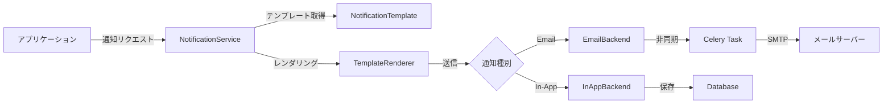

# kits.notifications 実装ガイド

> 💡 **このガイドを始める前に**
>
> プロジェクト全体の背景、なぜこの実装が必要なのか、現在の構成と目指す構成について理解するために、まず **[実装の背景とコンテキスト](KITS_CONTEXT.md)** をお読みください。
>
> このドキュメントには以下の情報が含まれています：
> - 📚 プロジェクト全体の背景（school_diaryとは何か）
> - 🎯 なぜkits.notificationsが必要なのか（過去課題4つの分析）
> - 🏗️ 現在のプロジェクト構成と目指す構成
> - 📊 実装の優先順位と戦略（Tier 1の3つ）
> - ⚙️ 技術的な制約と設計方針

---

## 📋 概要

このガイドでは、`kits.notifications`パッケージの実装方法を初心者にもわかりやすく、ステップバイステップで解説します。

**kits.notificationsとは？**
業務アプリケーションで必要な通知機能（メール送信、システム内通知、テンプレート管理）を提供する再利用可能なDjangoパッケージです。

**このパッケージが解決する課題**
- ✅ 承認依頼の通知（課題1: 残業管理）
- ✅ 健診・予防接種のリマインダー（課題2: 母子手帳）
- ✅ 図書館の予約通知・返却リマインド・延滞通知（課題4: 図書館システム）

詳細な背景と要件分析は **[KITS_NOTIFICATIONS_CONTEXT.md](KITS_NOTIFICATIONS_CONTEXT.md)** を参照してください。

## 🎯 学習目標

このガイドを完了すると、以下ができるようになります：

- [ ] Django通知システムのアーキテクチャを理解する
- [ ] django-anymailを使ったメール送信を実装できる
- [ ] テンプレートベースの通知システムを構築できる
- [ ] Celeryを使った非同期通知を実装できる
- [ ] 再利用可能なDjangoパッケージの設計パターンを学べる

## 📚 前提知識

**必須:**
- Python 3.12の基本文法
- Djangoの基礎（モデル、ビュー、テンプレート）
- Git/GitHub の基本操作

**推奨:**
- Celeryの基礎知識（非同期処理）
- メールサーバーの仕組み（SMTP）
- Django Rest Framework（API実装時）

## 🏗️ アーキテクチャ概要

### 既存のkitsパッケージのパターン

school_diaryでは、kitsパッケージは**シンプルで最小限の構成**を維持しています：

```
kits/
├── accounts/          # 管理コマンド提供型
│   ├── apps.py
│   └── management/commands/
│
├── approvals/         # シグナル提供型
│   ├── apps.py
│   └── signals.py
│
├── demos/             # 完全なDjangoアプリ型（モデル持ち）
│   ├── apps.py
│   ├── models.py
│   ├── admin.py
│   ├── serializers.py
│   └── migrations/
│
└── notifications/     # ← 今回実装（demosと同じパターン）
```

### notifications の構成（demosパターンを踏襲）

```
kits/notifications/
├── __init__.py
├── apps.py               # Djangoアプリ設定
├── models.py             # Notification, NotificationTemplate
├── admin.py              # Django管理画面
├── services.py           # NotificationService, TemplateRenderer
├── backends.py           # EmailBackend（1ファイルに集約）
├── tasks.py              # Celeryタスク
├── serializers.py        # DRF serializers（オプション）
└── migrations/           # データベースマイグレーション

# テンプレートとテストは別の場所
school_diary/templates/notifications/  # HTMLメールテンプレート
    └── emails/
        ├── base_email.html
        └── approval_request.html

tests/notifications/              # ユニットテスト
    ├── test_models.py
    ├── test_services.py
    └── test_tasks.py
```

**設計方針:**
- ✅ **サブディレクトリを作らない** - backends/, api/, tests/などは不要
- ✅ **ファイル数を最小限に** - 機能ごとに1ファイル
- ✅ **demosパターンを踏襲** - 既存の成功パターンに従う

### データフロー図



---

## 🚀 実装手順

### Step 1: プロジェクト構造の理解

#### 目的
kitsパッケージの構造と、notificationsモジュールの位置づけを理解します。

#### 実行コマンド

```bash
# 現在のkitsパッケージ構成を確認
cd /home/hirok/work/school_diary
tree -L 2 kits/
```

#### チェックリスト
- [ ] kitsディレクトリの場所を確認した
- [ ] kits/notifications/ディレクトリが存在することを確認した
- [ ] 他のkitsモジュール（accounts, approvals, audit）の構成を参考にした

#### 💡 ポイント
- `kits`は再利用可能なDjangoアプリケーションの集合体です
- 各モジュールは独立して動作し、`pip install -e ~/work/school_diary`で他のプロジェクトから利用できます

---

### Step 2: 依存関係のインストールと設定

#### 目的
通知機能に必要なPythonパッケージをインストールし、Django設定を行います。

#### 実装内容

##### 2.1 依存関係の追加

このプロジェクトは `pyproject.toml` で依存関係を管理しています。

`pyproject.toml` の `[project]` セクションの `dependencies` リストに以下を追加：

```toml
dependencies = [
    # ...既存の依存関係...
    "bleach==6.1.0",      # HTMLサニタイズ
    "markdown==3.6",      # Markdown → HTML変換
]
```

**注意:** `django-anymail` はすでにインストール済み（`django-anymail[amazon-ses]==13.1`）なので追加不要です。

**なぜこれらが必要？**
- `django-anymail`: 複数のメールサービス（Mailgun, SendGrid, AWS SESなど）を統一インターフェースで扱える（既にインストール済み）
- `bleach`: ユーザー入力のHTMLをサニタイズして、XSS攻撃を防ぐ
- `markdown`: Markdownで書いた通知テンプレートをHTMLに変換

##### 2.2 インストール

```bash
# uvを使用してインストール（推奨）
uv pip install bleach markdown

# またはpyproject.tomlから全ての依存関係を同期
uv sync
```

##### 2.3 Django設定の更新

`config/settings/base.py`に追加：

```python
# THIRD_PARTY_APPS に追加（既に "anymail" が含まれている場合はスキップ）
THIRD_PARTY_APPS = [
    # ...既存のアプリ...
    "anymail",  # 既に追加済みの場合は不要
]

# LOCAL_APPS に追加
LOCAL_APPS = [
    # ...既存のアプリ...
    "kits.notifications.apps.NotificationsConfig",
]
```

**メール設定の追加**：

`config/settings/base.py`の`EMAIL`セクション（230行目付近）に、`EMAIL_TIMEOUT = 5`の直後に追加：

```python
# EMAIL
# ------------------------------------------------------------------------------
# （既存の EMAIL_BACKEND と EMAIL_TIMEOUT はそのまま）

# https://docs.djangoproject.com/en/dev/ref/settings/#default-from-email
DEFAULT_FROM_EMAIL = "noreply@school_diary.local"
# https://docs.djangoproject.com/en/dev/ref/settings/#server-email
SERVER_EMAIL = "admin@school_diary.local"
```

**開発環境用の設定**：

`config/settings/local.py`に以下を追加（開発環境ではコンソールにメール内容を出力）：

```python
# メールをコンソールに出力（実際には送信しない）
EMAIL_BACKEND = "django.core.mail.backends.console.EmailBackend"
```

**通知機能の設定**：

`config/settings/base.py`の末尾（`REST_FRAMEWORK`の後など）に追加：

```python
# kits.notifications
# ------------------------------------------------------------------------------
NOTIFICATIONS_CONFIG = {
    "ENABLED": True,
    "DEFAULT_BACKEND": "email",  # email, in_app, push
    "BATCH_SIZE": 100,  # 一度に送信する通知の最大数
    "RETRY_ATTEMPTS": 3,  # 失敗時のリトライ回数
    "RETENTION_DAYS": 90,  # 通知履歴の保持期間（日）
}
```

`config/settings/production.py`に追加：

```python
# 本番環境：Mailgunを使用
EMAIL_BACKEND = "anymail.backends.mailgun.EmailBackend"

ANYMAIL = {
    "MAILGUN_API_KEY": env("MAILGUN_API_KEY"),
    "MAILGUN_SENDER_DOMAIN": env("MAILGUN_SENDER_DOMAIN"),
    "MAILGUN_API_URL": env("MAILGUN_API_URL", default="https://api.mailgun.net/v3"),
}
```

#### チェックリスト
- [ ] requirements/base.txtにパッケージを追加した
- [ ] pip installでインストールした
- [ ] Django設定ファイルを更新した
- [ ] 設定が反映されているか確認（`python manage.py check`）

#### ⚠️ よくあるエラー

**エラー1:** `ModuleNotFoundError: No module named 'anymail'`
→ **対処法:** `pip install django-anymail`を実行

**エラー2:** `ImproperlyConfigured: MAILGUN_API_KEY is required`
→ **対処法:** 本番環境では環境変数を設定。開発環境では`EMAIL_BACKEND`を`console`に変更

---

### Step 3: データモデルの設計と実装

#### 目的
通知データを保存するためのDjangoモデルを実装します。

#### 実装内容

`kits/notifications/models.py`を作成：

```python
"""
通知システムのデータモデル

このモジュールは、通知の保存、テンプレート管理、
送信履歴の記録を担当します。
"""
from django.db import models
from django.contrib.auth import get_user_model
from django.contrib.postgres.fields import ArrayField
from django.utils import timezone
from django.utils.translation import gettext_lazy as _

User = get_user_model()


class NotificationPriority(models.TextChoices):
    """通知の優先度"""
    LOW = "low", _("低")
    NORMAL = "normal", _("通常")
    HIGH = "high", _("高")
    URGENT = "urgent", _("緊急")


class NotificationStatus(models.TextChoices):
    """通知の送信状態"""
    PENDING = "pending", _("送信待ち")
    SENDING = "sending", _("送信中")
    SENT = "sent", _("送信完了")
    FAILED = "failed", _("送信失敗")
    READ = "read", _("既読")


class NotificationType(models.TextChoices):
    """通知の種類"""
    EMAIL = "email", _("メール")
    IN_APP = "in_app", _("アプリ内通知")
    PUSH = "push", _("プッシュ通知")
    SMS = "sms", _("SMS")


class NotificationTemplate(models.Model):
    """
    通知テンプレート

    再利用可能な通知テンプレートを管理します。
    Django Template言語を使用してパーソナライズされた通知を作成できます。
    """
    code = models.CharField(
        max_length=100,
        unique=True,
        verbose_name=_("テンプレートコード"),
        help_text=_("システム内で使用する一意の識別子（例: approval_request）"),
    )
    name = models.CharField(
        max_length=200,
        verbose_name=_("テンプレート名"),
    )
    description = models.TextField(
        blank=True,
        verbose_name=_("説明"),
    )

    # テンプレート内容
    subject_template = models.CharField(
        max_length=255,
        verbose_name=_("件名テンプレート"),
        help_text=_("Django Template構文が使えます: {{ user.name }}様"),
    )
    body_template = models.TextField(
        verbose_name=_("本文テンプレート"),
        help_text=_("プレーンテキストまたはMarkdown形式"),
    )
    html_template = models.TextField(
        blank=True,
        verbose_name=_("HTMLテンプレート"),
        help_text=_("HTMLメール用（オプショナル）"),
    )

    # 設定
    notification_types = ArrayField(
        models.CharField(max_length=20, choices=NotificationType.choices),
        default=list,
        verbose_name=_("通知タイプ"),
        help_text=_("このテンプレートが対応する通知タイプ"),
    )
    is_active = models.BooleanField(
        default=True,
        verbose_name=_("有効"),
    )

    # メタ情報
    created_at = models.DateTimeField(auto_now_add=True)
    updated_at = models.DateTimeField(auto_now=True)

    class Meta:
        db_table = "kits_notification_templates"
        verbose_name = _("通知テンプレート")
        verbose_name_plural = _("通知テンプレート")
        ordering = ["code"]

    def __str__(self):
        return f"{self.code} - {self.name}"


class Notification(models.Model):
    """
    通知レコード

    個々の通知を表します。送信履歴、既読状態、
    エラー情報などを記録します。
    """
    # 受信者情報
    recipient = models.ForeignKey(
        User,
        on_delete=models.CASCADE,
        related_name="notifications",
        verbose_name=_("受信者"),
    )
    recipient_email = models.EmailField(
        blank=True,
        verbose_name=_("受信者メールアドレス"),
        help_text=_("Userモデルのemailと異なる場合に使用"),
    )

    # テンプレート
    template = models.ForeignKey(
        NotificationTemplate,
        on_delete=models.SET_NULL,
        null=True,
        blank=True,
        related_name="notifications",
        verbose_name=_("テンプレート"),
    )

    # 通知内容
    notification_type = models.CharField(
        max_length=20,
        choices=NotificationType.choices,
        default=NotificationType.EMAIL,
        verbose_name=_("通知タイプ"),
    )
    priority = models.CharField(
        max_length=20,
        choices=NotificationPriority.choices,
        default=NotificationPriority.NORMAL,
        verbose_name=_("優先度"),
    )
    subject = models.CharField(
        max_length=255,
        verbose_name=_("件名"),
    )
    body = models.TextField(
        verbose_name=_("本文"),
    )
    html_body = models.TextField(
        blank=True,
        verbose_name=_("HTML本文"),
    )

    # コンテキストデータ（テンプレートレンダリング用）
    context_data = models.JSONField(
        default=dict,
        verbose_name=_("コンテキストデータ"),
        help_text=_("テンプレートに渡されたデータ"),
    )

    # 状態管理
    status = models.CharField(
        max_length=20,
        choices=NotificationStatus.choices,
        default=NotificationStatus.PENDING,
        verbose_name=_("ステータス"),
    )

    # タイムスタンプ
    scheduled_at = models.DateTimeField(
        null=True,
        blank=True,
        verbose_name=_("送信予定日時"),
        help_text=_("指定した場合、この日時に送信されます"),
    )
    sent_at = models.DateTimeField(
        null=True,
        blank=True,
        verbose_name=_("送信日時"),
    )
    read_at = models.DateTimeField(
        null=True,
        blank=True,
        verbose_name=_("既読日時"),
    )
    created_at = models.DateTimeField(auto_now_add=True)
    updated_at = models.DateTimeField(auto_now=True)

    # エラー情報
    error_message = models.TextField(
        blank=True,
        verbose_name=_("エラーメッセージ"),
    )
    retry_count = models.PositiveSmallIntegerField(
        default=0,
        verbose_name=_("リトライ回数"),
    )

    # 関連オブジェクト（ジェネリックリレーション）
    # 例: 承認申請、健診予約など
    related_object_type = models.CharField(
        max_length=100,
        blank=True,
        verbose_name=_("関連オブジェクトタイプ"),
    )
    related_object_id = models.CharField(
        max_length=100,
        blank=True,
        verbose_name=_("関連オブジェクトID"),
    )

    class Meta:
        db_table = "kits_notifications"
        verbose_name = _("通知")
        verbose_name_plural = _("通知")
        ordering = ["-created_at"]
        indexes = [
            models.Index(fields=["recipient", "status"]),
            models.Index(fields=["status", "scheduled_at"]),
            models.Index(fields=["created_at"]),
        ]

    def __str__(self):
        return f"{self.get_notification_type_display()}: {self.subject} → {self.recipient}"

    def mark_as_sent(self):
        """送信完了としてマーク"""
        self.status = NotificationStatus.SENT
        self.sent_at = timezone.now()
        self.save(update_fields=["status", "sent_at", "updated_at"])

    def mark_as_read(self):
        """既読としてマーク"""
        if self.status == NotificationStatus.SENT:
            self.status = NotificationStatus.READ
            self.read_at = timezone.now()
            self.save(update_fields=["status", "read_at", "updated_at"])

    def mark_as_failed(self, error_message: str):
        """送信失敗としてマーク"""
        self.status = NotificationStatus.FAILED
        self.error_message = error_message
        self.retry_count += 1
        self.save(update_fields=["status", "error_message", "retry_count", "updated_at"])

    @property
    def is_read(self) -> bool:
        """既読かどうか"""
        return self.status == NotificationStatus.READ

    @property
    def can_retry(self) -> bool:
        """リトライ可能かどうか"""
        from django.conf import settings
        max_retries = settings.NOTIFICATIONS_CONFIG.get("RETRY_ATTEMPTS", 3)
        return self.status == NotificationStatus.FAILED and self.retry_count < max_retries
```

#### データモデル設計のポイント

**1. NotificationTemplateとNotificationの分離**
- テンプレートは再利用可能（1つのテンプレートから複数の通知を生成）
- 通知は個別のインスタンス（送信履歴、既読状態を保持）

**2. ステータス管理**
```
pending → sending → sent → read
          ↓ (失敗時)
        failed → (リトライ) → sending
```

**3. 関連オブジェクトの保存**
- `related_object_type`: "approval_request", "health_checkup" など
- `related_object_id`: "123", "abc-def-ghi" など
- 通知から元のオブジェクトにトレースバック可能

#### チェックリスト
- [ ] models.pyファイルを作成した
- [ ] NotificationTemplateモデルを実装した
- [ ] Notificationモデルを実装した
- [ ] 各フィールドの意味を理解した

---

### Step 4: マイグレーションの作成と適用

#### 目的
データベースにテーブルを作成します。

#### 実行コマンド

```bash
# マイグレーションファイルの生成
python manage.py makemigrations notifications

# マイグレーション内容の確認（SQLを表示）
python manage.py sqlmigrate notifications 0001

# マイグレーションの適用
python manage.py migrate notifications
```

#### 予想される出力

```
Migrations for 'notifications':
  kits/notifications/migrations/0001_initial.py
    - Create model NotificationTemplate
    - Create model Notification
    - Add index notification_recipient_status_idx
    - Add index notification_status_scheduled_idx
    - Add index notification_created_idx
```

#### チェックリスト
- [ ] マイグレーションファイルが生成された
- [ ] マイグレーションを適用した
- [ ] データベースにテーブルが作成されたか確認（`python manage.py dbshell`で確認可）

#### ⚠️ よくあるエラー

**エラー:** `django.db.utils.ProgrammingError: relation "kits_notifications" already exists`
→ **対処法:** すでにテーブルが存在する場合は`python manage.py migrate --fake notifications`

---

### Step 5: 通知サービスの実装

#### 目的
通知を送信するためのビジネスロジックを実装します。

#### 実装内容

`kits/notifications/services.py`を作成：

```python
"""
通知サービス層

通知の作成、送信、テンプレートレンダリングを担当します。
"""
import logging
from typing import Optional, Dict, Any, List
from django.contrib.auth import get_user_model
from django.template import Context, Template
from django.utils import timezone
from django.conf import settings
import markdown
import bleach

from .models import Notification, NotificationTemplate, NotificationType, NotificationStatus

User = get_user_model()
logger = logging.getLogger(__name__)


class NotificationTemplateRenderer:
    """
    通知テンプレートのレンダリングを担当

    Django Template言語を使ってテンプレートをレンダリングし、
    Markdownの変換、HTMLのサニタイズを行います。
    """

    ALLOWED_TAGS = [
        'a', 'abbr', 'acronym', 'b', 'blockquote', 'code',
        'em', 'i', 'li', 'ol', 'p', 'strong', 'ul', 'h1',
        'h2', 'h3', 'h4', 'h5', 'h6', 'br', 'div', 'span',
    ]

    ALLOWED_ATTRIBUTES = {
        'a': ['href', 'title'],
        'abbr': ['title'],
        'acronym': ['title'],
    }

    @classmethod
    def render_subject(cls, template_str: str, context: Dict[str, Any]) -> str:
        """
        件名をレンダリング

        Args:
            template_str: テンプレート文字列
            context: コンテキストデータ

        Returns:
            レンダリング済みの件名
        """
        template = Template(template_str)
        rendered = template.render(Context(context))
        # 件名は1行のみ、余分な空白を削除
        return rendered.strip().replace('\n', ' ')

    @classmethod
    def render_body(cls, template_str: str, context: Dict[str, Any],
                   use_markdown: bool = True) -> str:
        """
        本文をレンダリング

        Args:
            template_str: テンプレート文字列
            context: コンテキストデータ
            use_markdown: Markdownを使用するか

        Returns:
            レンダリング済みの本文
        """
        template = Template(template_str)
        rendered = template.render(Context(context))

        if use_markdown:
            # MarkdownをHTMLに変換
            html = markdown.markdown(
                rendered,
                extensions=['extra', 'nl2br', 'sane_lists']
            )
            # HTMLをサニタイズ（XSS対策）
            safe_html = bleach.clean(
                html,
                tags=cls.ALLOWED_TAGS,
                attributes=cls.ALLOWED_ATTRIBUTES,
                strip=True
            )
            return safe_html

        return rendered


class NotificationService:
    """
    通知サービス

    通知の作成、送信、履歴管理を行います。
    """

    def __init__(self):
        self.config = getattr(settings, 'NOTIFICATIONS_CONFIG', {})
        self.enabled = self.config.get('ENABLED', True)

    def create_from_template(
        self,
        template_code: str,
        recipient: User,
        context: Dict[str, Any],
        notification_type: str = NotificationType.EMAIL,
        priority: str = "normal",
        scheduled_at: Optional[timezone.datetime] = None,
        related_object_type: str = "",
        related_object_id: str = "",
    ) -> Notification:
        """
        テンプレートから通知を作成

        Args:
            template_code: テンプレートコード
            recipient: 受信者
            context: テンプレートに渡すコンテキスト
            notification_type: 通知タイプ
            priority: 優先度
            scheduled_at: 送信予定日時
            related_object_type: 関連オブジェクトタイプ
            related_object_id: 関連オブジェクトID

        Returns:
            作成された通知オブジェクト

        Raises:
            NotificationTemplate.DoesNotExist: テンプレートが見つからない
        """
        # テンプレートを取得
        template = NotificationTemplate.objects.get(
            code=template_code,
            is_active=True
        )

        # ユーザー情報をコンテキストに追加
        context.setdefault('user', recipient)
        context.setdefault('site_name', 'school_diary')

        # テンプレートをレンダリング
        subject = NotificationTemplateRenderer.render_subject(
            template.subject_template,
            context
        )
        body = NotificationTemplateRenderer.render_body(
            template.body_template,
            context,
            use_markdown=True
        )

        # HTML本文（オプショナル）
        html_body = ""
        if template.html_template:
            html_body = NotificationTemplateRenderer.render_body(
                template.html_template,
                context,
                use_markdown=False
            )

        # JSONシリアライズ可能なcontext_dataを作成
        # Djangoモデルインスタンスなどのオブジェクトを除外
        serializable_context = {}
        for key, value in context.items():
            # Djangoモデルインスタンス(_metaを持つオブジェクト)をスキップ
            if not hasattr(value, '_meta'):
                serializable_context[key] = value

        # 通知オブジェクトを作成
        notification = Notification.objects.create(
            recipient=recipient,
            recipient_email=recipient.email,
            template=template,
            notification_type=notification_type,
            priority=priority,
            subject=subject,
            body=body,
            html_body=html_body,
            context_data=serializable_context,
            scheduled_at=scheduled_at,
            related_object_type=related_object_type,
            related_object_id=related_object_id,
        )

        logger.info(
            f"通知作成: {notification.id} - {template_code} → {recipient.email}"
        )

        return notification

    def send_notification(self, notification: Notification) -> bool:
        """
        通知を送信

        Args:
            notification: 送信する通知オブジェクト

        Returns:
            送信成功したかどうか
        """
        if not self.enabled:
            logger.warning("通知機能が無効化されています")
            return False

        # スケジュール確認
        if notification.scheduled_at and notification.scheduled_at > timezone.now():
            logger.info(f"通知 {notification.id} は {notification.scheduled_at} に送信予定")
            return False

        try:
            notification.status = NotificationStatus.SENDING
            notification.save(update_fields=['status'])

            # 通知タイプに応じて送信
            if notification.notification_type == NotificationType.EMAIL:
                self._send_email(notification)
            elif notification.notification_type == NotificationType.IN_APP:
                self._send_in_app(notification)
            else:
                raise NotImplementedError(
                    f"未実装の通知タイプ: {notification.notification_type}"
                )

            # 送信完了
            notification.mark_as_sent()
            logger.info(f"通知送信成功: {notification.id}")
            return True

        except Exception as e:
            # エラーハンドリング
            error_message = str(e)
            notification.mark_as_failed(error_message)
            logger.error(f"通知送信失敗: {notification.id} - {error_message}")
            return False

    def _send_email(self, notification: Notification):
        """メール送信"""
        from django.core.mail import EmailMultiAlternatives

        email = EmailMultiAlternatives(
            subject=notification.subject,
            body=notification.body,  # プレーンテキスト版
            from_email=settings.DEFAULT_FROM_EMAIL,
            to=[notification.recipient_email],
        )

        # HTML版があれば添付
        if notification.html_body:
            email.attach_alternative(notification.html_body, "text/html")

        email.send()

    def _send_in_app(self, notification: Notification):
        """アプリ内通知（データベースに保存するだけ）"""
        # すでにNotificationモデルに保存されているので、
        # ステータスを更新するだけ
        pass

    def send_batch(self, notifications: List[Notification]) -> Dict[str, int]:
        """
        通知を一括送信

        Args:
            notifications: 送信する通知のリスト

        Returns:
            送信結果の統計（成功数、失敗数）
        """
        batch_size = self.config.get('BATCH_SIZE', 100)
        success_count = 0
        failed_count = 0

        for notification in notifications[:batch_size]:
            if self.send_notification(notification):
                success_count += 1
            else:
                failed_count += 1

        return {
            'success': success_count,
            'failed': failed_count,
            'total': success_count + failed_count,
        }

    def get_unread_count(self, user: User) -> int:
        """未読通知数を取得"""
        return Notification.objects.filter(
            recipient=user,
            notification_type=NotificationType.IN_APP,
            status=NotificationStatus.SENT,
        ).count()

    def mark_all_as_read(self, user: User) -> int:
        """全ての通知を既読にする"""
        count = Notification.objects.filter(
            recipient=user,
            notification_type=NotificationType.IN_APP,
            status=NotificationStatus.SENT,
        ).update(
            status=NotificationStatus.READ,
            read_at=timezone.now(),
        )
        return count
```

#### サービス層の設計パターン

**1. 責務の分離**
- `NotificationTemplateRenderer`: テンプレートレンダリングのみ
- `NotificationService`: ビジネスロジック全般

**2. エラーハンドリング**
- 送信失敗時は自動的にステータスを更新
- リトライ回数を記録

**3. バッチ処理対応**
- `send_batch()`で一度に複数の通知を送信
- `BATCH_SIZE`で送信数を制限（メールサーバーの負荷対策）

**4. JSONシリアライズ対応**
- `context_data`フィールドは`JSONField`のため、JSONシリアライズ可能なデータのみ保存
- Djangoモデルインスタンス（User等）は`_meta`属性の有無でフィルタリング
- テンプレートレンダリング時には元のcontextを使用、DB保存時はシリアライズ可能なデータのみ保存

#### チェックリスト
- [ ] services.pyファイルを作成した
- [ ] NotificationTemplateRendererクラスを実装した
- [ ] NotificationServiceクラスを実装した
- [ ] 各メソッドの役割を理解した

---

### Step 6: Celeryタスクの実装（非同期処理）

#### 目的
通知送信を非同期で行い、アプリケーションのレスポンス速度を改善します。

#### 実装内容

`kits/notifications/tasks.py`を作成：

```python
"""
Celeryタスク

通知の非同期送信を担当します。
"""
import logging
from typing import List
from celery import shared_task
from django.utils import timezone
from django.db.models import Q

from .models import Notification, NotificationStatus
from .services import NotificationService

logger = logging.getLogger(__name__)


@shared_task(
    bind=True,
    max_retries=3,
    default_retry_delay=60,  # 1分後にリトライ
)
def send_notification_task(self, notification_id: int):
    """
    通知を非同期で送信

    Args:
        notification_id: 送信する通知のID
    """
    try:
        notification = Notification.objects.get(id=notification_id)
        service = NotificationService()
        success = service.send_notification(notification)

        if not success and notification.can_retry:
            # リトライ可能な場合は再試行
            raise self.retry(countdown=60 * (notification.retry_count + 1))

        return {
            'notification_id': notification_id,
            'status': notification.status,
            'success': success,
        }

    except Notification.DoesNotExist:
        logger.error(f"通知が見つかりません: ID={notification_id}")
        return {'error': 'Notification not found'}

    except Exception as e:
        logger.error(f"通知送信エラー: {notification_id} - {str(e)}")
        raise


@shared_task
def send_scheduled_notifications():
    """
    送信予定の通知を一括送信

    スケジュールされた通知のうち、送信時刻を過ぎたものを送信します。
    Celery Beatで定期実行することを想定（例: 5分ごと）
    """
    now = timezone.now()

    # 送信対象の通知を取得
    notifications = Notification.objects.filter(
        Q(scheduled_at__lte=now) | Q(scheduled_at__isnull=True),
        status=NotificationStatus.PENDING,
    ).order_by('priority', 'created_at')[:100]  # 最大100件

    logger.info(f"送信対象の通知: {notifications.count()}件")

    # 各通知を非同期タスクとして送信
    for notification in notifications:
        send_notification_task.delay(notification.id)

    return {
        'processed': notifications.count(),
        'timestamp': now.isoformat(),
    }


@shared_task
def cleanup_old_notifications(retention_days: int = 90):
    """
    古い通知を削除

    Args:
        retention_days: 保持期間（日数）

    送信済み・既読の通知のうち、retention_days日以上経過したものを削除します。
    """
    cutoff_date = timezone.now() - timezone.timedelta(days=retention_days)

    deleted_count, _ = Notification.objects.filter(
        status__in=[NotificationStatus.SENT, NotificationStatus.READ],
        created_at__lt=cutoff_date,
    ).delete()

    logger.info(f"古い通知を削除: {deleted_count}件")

    return {
        'deleted': deleted_count,
        'cutoff_date': cutoff_date.isoformat(),
    }


@shared_task
def retry_failed_notifications():
    """
    失敗した通知を再送信

    リトライ可能な失敗通知を再送信します。
    """
    from django.conf import settings
    max_retries = settings.NOTIFICATIONS_CONFIG.get('RETRY_ATTEMPTS', 3)

    # リトライ対象の通知を取得
    failed_notifications = Notification.objects.filter(
        status=NotificationStatus.FAILED,
        retry_count__lt=max_retries,
    )[:50]  # 最大50件

    logger.info(f"リトライ対象の通知: {failed_notifications.count()}件")

    for notification in failed_notifications:
        send_notification_task.delay(notification.id)

    return {
        'retried': failed_notifications.count(),
    }
```

#### Celeryタスクの設計ポイント

**1. タスクの種類**
- `send_notification_task`: 個別の通知を送信
- `send_scheduled_notifications`: 定期実行（Celery Beat）
- `cleanup_old_notifications`: データベースのメンテナンス
- `retry_failed_notifications`: エラーリカバリー

**2. リトライ戦略**
- 最大3回まで自動リトライ
- リトライ間隔は指数バックオフ（1分 → 2分 → 4分）

**3. バッチ処理**
- 一度に処理する件数を制限（100件、50件など）
- メモリ使用量とパフォーマンスのバランス

#### Celery Beatの設定

`config/settings/base.py`に追加：

```python
# Celery Beat設定（定期タスク）
from celery.schedules import crontab

CELERY_BEAT_SCHEDULE = {
    'send-scheduled-notifications': {
        'task': 'kits.notifications.tasks.send_scheduled_notifications',
        'schedule': 300.0,  # 5分ごと
    },
    'cleanup-old-notifications': {
        'task': 'kits.notifications.tasks.cleanup_old_notifications',
        'schedule': crontab(hour=3, minute=0),  # 毎日3:00AM
        'kwargs': {'retention_days': 90},
    },
    'retry-failed-notifications': {
        'task': 'kits.notifications.tasks.retry_failed_notifications',
        'schedule': 3600.0,  # 1時間ごと
    },
}
```

#### チェックリスト
- [ ] tasks.pyファイルを作成した
- [ ] 4つのタスクを実装した
- [ ] Celery Beat設定を追加した
- [ ] タスクの役割を理解した

---

### Step 7: Django管理画面の実装

#### 目的
管理者が通知テンプレートと通知履歴を管理できるようにします。

#### 実装内容

`kits/notifications/admin.py`を作成：

```python
"""
Django管理画面設定
"""
from django.contrib import admin
from django.utils.html import format_html
from django.urls import reverse
from django.utils.safestring import mark_safe

from .models import Notification, NotificationTemplate


@admin.register(NotificationTemplate)
class NotificationTemplateAdmin(admin.ModelAdmin):
    """通知テンプレート管理画面"""

    list_display = [
        'code',
        'name',
        'types_display',
        'is_active',
        'usage_count',
        'updated_at',
    ]
    list_filter = ['is_active', 'notification_types', 'updated_at']
    search_fields = ['code', 'name', 'description']
    readonly_fields = ['created_at', 'updated_at', 'usage_count']

    fieldsets = (
        ('基本情報', {
            'fields': ('code', 'name', 'description', 'is_active'),
        }),
        ('テンプレート', {
            'fields': ('subject_template', 'body_template', 'html_template'),
        }),
        ('設定', {
            'fields': ('notification_types',),
        }),
        ('メタ情報', {
            'fields': ('usage_count', 'created_at', 'updated_at'),
            'classes': ('collapse',),
        }),
    )

    def types_display(self, obj):
        """通知タイプを表示"""
        return ', '.join(obj.notification_types)
    types_display.short_description = '通知タイプ'

    def usage_count(self, obj):
        """使用回数を表示"""
        count = obj.notifications.count()
        url = reverse('admin:notifications_notification_changelist') + f'?template__id__exact={obj.id}'
        return format_html('<a href="{}">{} 件</a>', url, count)
    usage_count.short_description = '使用回数'


@admin.register(Notification)
class NotificationAdmin(admin.ModelAdmin):
    """通知管理画面"""

    list_display = [
        'id',
        'recipient',
        'subject',
        'notification_type',
        'priority',
        'status_badge',
        'sent_at',
        'read_at',
    ]
    list_filter = [
        'notification_type',
        'priority',
        'status',
        'sent_at',
        'created_at',
    ]
    search_fields = [
        'recipient__email',
        'recipient__name',
        'subject',
        'body',
    ]
    readonly_fields = [
        'template',
        'context_data_display',
        'created_at',
        'updated_at',
        'sent_at',
        'read_at',
        'retry_count',
    ]
    date_hierarchy = 'created_at'

    fieldsets = (
        ('受信者情報', {
            'fields': ('recipient', 'recipient_email'),
        }),
        ('通知内容', {
            'fields': (
                'notification_type',
                'priority',
                'template',
                'subject',
                'body',
                'html_body',
            ),
        }),
        ('ステータス', {
            'fields': (
                'status',
                'scheduled_at',
                'sent_at',
                'read_at',
                'error_message',
                'retry_count',
            ),
        }),
        ('関連情報', {
            'fields': (
                'related_object_type',
                'related_object_id',
                'context_data_display',
            ),
            'classes': ('collapse',),
        }),
        ('メタ情報', {
            'fields': ('created_at', 'updated_at'),
            'classes': ('collapse',),
        }),
    )

    actions = ['resend_notifications', 'mark_as_read']

    def status_badge(self, obj):
        """ステータスをバッジ表示"""
        colors = {
            'pending': 'gray',
            'sending': 'blue',
            'sent': 'green',
            'failed': 'red',
            'read': 'purple',
        }
        color = colors.get(obj.status, 'gray')
        return format_html(
            '<span style="background-color: {}; color: white; padding: 3px 10px; '
            'border-radius: 3px; font-size: 11px;">{}</span>',
            color,
            obj.get_status_display()
        )
    status_badge.short_description = 'ステータス'

    def context_data_display(self, obj):
        """コンテキストデータを整形表示"""
        import json
        return mark_safe(f'<pre>{json.dumps(obj.context_data, indent=2, ensure_ascii=False)}</pre>')
    context_data_display.short_description = 'コンテキストデータ'

    def resend_notifications(self, request, queryset):
        """選択した通知を再送信"""
        from .tasks import send_notification_task

        count = 0
        for notification in queryset:
            if notification.status in ['failed', 'pending']:
                send_notification_task.delay(notification.id)
                count += 1

        self.message_user(request, f'{count}件の通知を再送信キューに追加しました。')
    resend_notifications.short_description = '選択した通知を再送信'

    def mark_as_read(self, request, queryset):
        """選択した通知を既読にする"""
        count = queryset.filter(status='sent').update(
            status='read',
            read_at=timezone.now()
        )
        self.message_user(request, f'{count}件の通知を既読にしました。')
    mark_as_read.short_description = '選択した通知を既読にする'
```

#### 管理画面の便利機能

**1. カスタムフィルター**
- 通知タイプ、優先度、ステータスで絞り込み
- 日付階層（date_hierarchy）で期間絞り込み

**2. カスタムアクション**
- 再送信：失敗した通知を一括再送信
- 既読化：未読通知を一括既読化

**3. 視覚的な表示**
- ステータスバッジ（色分け）
- 使用回数のリンク（クリックで関連通知一覧へ）

#### チェックリスト
- [ ] admin.pyファイルを作成した
- [ ] NotificationTemplateAdminを実装した
- [ ] NotificationAdminを実装した
- [ ] 管理画面で通知を確認できることを確認した

---

### Step 8: テンプレートファイルの作成

#### 目的
メール通知用のHTMLテンプレートを作成します。

**重要:** school_diaryでは、テンプレートは `school_diary/templates/` に配置します（kitsパッケージ内ではありません）。

#### 実装内容

`school_diary/templates/notifications/emails/base_email.html`を作成：

```django
<!DOCTYPE html>
<html lang="ja">
<head>
    <meta charset="UTF-8">
    <meta name="viewport" content="width=device-width, initial-scale=1.0">
    <title>{{ subject }}</title>
    <style>
        body {
            font-family: 'Helvetica Neue', Arial, 'Hiragino Kaku Gothic ProN', 'Hiragino Sans', Meiryo, sans-serif;
            line-height: 1.6;
            color: #333;
            max-width: 600px;
            margin: 0 auto;
            padding: 20px;
        }
        .header {
            background-color: #4F46E5;
            color: white;
            padding: 20px;
            text-align: center;
            border-radius: 5px 5px 0 0;
        }
        .content {
            background-color: #f9fafb;
            padding: 30px;
            border-left: 1px solid #e5e7eb;
            border-right: 1px solid #e5e7eb;
        }
        .footer {
            background-color: #f3f4f6;
            padding: 20px;
            text-align: center;
            font-size: 12px;
            color: #6b7280;
            border-radius: 0 0 5px 5px;
            border: 1px solid #e5e7eb;
        }
        .button {
            display: inline-block;
            padding: 12px 24px;
            background-color: #4F46E5;
            color: white;
            text-decoration: none;
            border-radius: 5px;
            margin: 10px 0;
        }
        .button:hover {
            background-color: #4338CA;
        }
    </style>
</head>
<body>
    <div class="header">
        <h1>{{ site_name }}</h1>
    </div>

    <div class="content">
        
        <p>{{ body }}</p>
        
    </div>

    <div class="footer">
        
        <p>このメールは {{ site_name }} から自動送信されています。</p>
        <p>心当たりがない場合は、このメールを削除してください。</p>
        
    </div>
</body>
</html>
```

`school_diary/templates/notifications/emails/approval_request.html`を作成：

```django



<p>{{ user.name }} 様</p>

<p>新しい承認依頼が届いています。</p>

<div style="background-color: white; padding: 20px; border-radius: 5px; margin: 20px 0;">
    <h3>{{ request_title }}</h3>
    <p><strong>申請者:</strong> {{ requester_name }}</p>
    <p><strong>申請日:</strong> {{ request_date }}</p>
    <p><strong>内容:</strong> {{ request_description }}</p>
</div>

<p style="text-align: center;">
    <a href="{{ approval_url }}" class="button">承認画面を開く</a>
</p>

<p>承認期限: {{ deadline }}</p>

```

#### チェックリスト
- [ ] base_email.htmlを作成した
- [ ] サンプルテンプレート（approval_request.html）を作成した
- [ ] テンプレートの構造を理解した

---

### Step 9: ユニットテストの実装

#### 目的
実装した機能が正しく動作することを確認します。

**重要:** school_diaryでは、テストは プロジェクトルートの`tests/`に配置します（kitsパッケージ内ではありません）。

#### 実装内容

`tests/notifications/test_models.py`を作成：

```python
"""
モデルのテスト
"""
from django.test import TestCase
from django.contrib.auth import get_user_model
from django.utils import timezone

from kits.notifications.models import (
    Notification,
    NotificationTemplate,
    NotificationType,
    NotificationStatus,
)

User = get_user_model()


class NotificationTemplateTestCase(TestCase):
    """NotificationTemplateモデルのテスト"""

    def setUp(self):
        self.template = NotificationTemplate.objects.create(
            code='test_template',
            name='テストテンプレート',
            subject_template='{{ user.name }}様へのお知らせ',
            body_template='こんにちは、{{ user.name }}さん！',
            notification_types=[NotificationType.EMAIL],
        )

    def test_template_creation(self):
        """テンプレートが正しく作成できる"""
        self.assertEqual(self.template.code, 'test_template')
        self.assertTrue(self.template.is_active)

    def test_template_str(self):
        """__str__メソッドが正しく動作する"""
        expected = 'test_template - テストテンプレート'
        self.assertEqual(str(self.template), expected)


class NotificationTestCase(TestCase):
    """Notificationモデルのテスト"""

    def setUp(self):
        self.user = User.objects.create_user(
            email='test@example.com',
            name='テストユーザー',
            password='password123'
        )

        self.notification = Notification.objects.create(
            recipient=self.user,
            recipient_email=self.user.email,
            notification_type=NotificationType.EMAIL,
            subject='テスト通知',
            body='これはテストです',
        )

    def test_notification_creation(self):
        """通知が正しく作成できる"""
        self.assertEqual(self.notification.recipient, self.user)
        self.assertEqual(self.notification.status, NotificationStatus.PENDING)

    def test_mark_as_sent(self):
        """送信完了マークが正しく動作する"""
        self.notification.mark_as_sent()
        self.assertEqual(self.notification.status, NotificationStatus.SENT)
        self.assertIsNotNone(self.notification.sent_at)

    def test_mark_as_read(self):
        """既読マークが正しく動作する"""
        self.notification.mark_as_sent()
        self.notification.mark_as_read()
        self.assertEqual(self.notification.status, NotificationStatus.READ)
        self.assertIsNotNone(self.notification.read_at)

    def test_mark_as_failed(self):
        """失敗マークが正しく動作する"""
        error_msg = 'Test error'
        self.notification.mark_as_failed(error_msg)
        self.assertEqual(self.notification.status, NotificationStatus.FAILED)
        self.assertEqual(self.notification.error_message, error_msg)
        self.assertEqual(self.notification.retry_count, 1)

    def test_can_retry(self):
        """リトライ可否が正しく判定される"""
        # 初回失敗
        self.notification.mark_as_failed('Error')
        self.assertTrue(self.notification.can_retry)

        # 3回失敗（上限）
        self.notification.retry_count = 3
        self.notification.save()
        self.assertFalse(self.notification.can_retry)
```

`tests/notifications/test_services.py`を作成：

```python
"""
サービス層のテスト
"""
from django.test import TestCase
from django.contrib.auth import get_user_model

from kits.notifications.models import NotificationTemplate, NotificationType
from kits.notifications.services import (
    NotificationService,
    NotificationTemplateRenderer,
)

User = get_user_model()


class NotificationTemplateRendererTestCase(TestCase):
    """NotificationTemplateRendererのテスト"""

    def test_render_subject(self):
        """件名レンダリングが正しく動作する"""
        template = '{{ user.name }}様へのお知らせ'
        context = {'user': type('User', (), {'name': 'テスト太郎'})}

        result = NotificationTemplateRenderer.render_subject(template, context)
        self.assertEqual(result, 'テスト太郎様へのお知らせ')

    def test_render_body_with_markdown(self):
        """Markdown変換が正しく動作する"""
        template = '# 見出し\n\n**太字**のテキスト'
        result = NotificationTemplateRenderer.render_body(template, {})

        self.assertIn('<h1>見出し</h1>', result)
        self.assertIn('<strong>太字</strong>', result)


class NotificationServiceTestCase(TestCase):
    """NotificationServiceのテスト"""

    def setUp(self):
        self.user = User.objects.create_user(
            email='test@example.com',
            name='テストユーザー',
            password='password123'
        )

        self.template = NotificationTemplate.objects.create(
            code='test_notification',
            name='テスト通知',
            subject_template='{{ user.name }}様、{{ message }}',
            body_template='こんにちは、{{ user.name }}さん！\n\n{{ content }}',
            notification_types=[NotificationType.EMAIL],
        )

        self.service = NotificationService()

    def test_create_from_template(self):
        """テンプレートから通知が作成できる"""
        context = {
            'message': 'お知らせがあります',
            'content': 'テスト内容です',
        }

        notification = self.service.create_from_template(
            template_code='test_notification',
            recipient=self.user,
            context=context,
        )

        self.assertEqual(notification.recipient, self.user)
        self.assertIn('テストユーザー', notification.subject)
        self.assertIn('お知らせがあります', notification.subject)
        self.assertIn('テスト内容です', notification.body)

    def test_get_unread_count(self):
        """未読通知数が正しく取得できる"""
        # IN_APP通知を3件作成
        for i in range(3):
            notification = self.service.create_from_template(
                template_code='test_notification',
                recipient=self.user,
                context={'message': f'通知{i}', 'content': 'テスト'},
                notification_type=NotificationType.IN_APP,
            )
            # 送信済みステータスにする
            notification.mark_as_sent()

        count = self.service.get_unread_count(self.user)
        self.assertEqual(count, 3)
```

#### テストの実行

```bash
# 全てのテストを実行
python manage.py test tests.notifications

# 特定のテストクラスのみ実行
python manage.py test tests.notifications.test_models.NotificationTestCase

# カバレッジを測定
coverage run --source='kits.notifications' manage.py test tests.notifications
coverage report
coverage html  # HTMLレポート生成
```

#### チェックリスト
- [ ] test_models.pyを作成した
- [ ] test_services.pyを作成した
- [ ] 全てのテストがパスすることを確認した
- [ ] カバレッジが80%以上であることを確認した

---

### Step 10: 統合テストと動作確認

#### 目的
実際のアプリケーションから通知機能を使ってみます。

#### 実装内容

`kits/notifications/examples.py`を作成：

```python
"""
使用例

他のアプリケーションからkits.notificationsを使用する例
"""
from django.contrib.auth import get_user_model
from kits.notifications.services import NotificationService
from kits.notifications.models import NotificationTemplate, NotificationType
from kits.notifications.tasks import send_notification_task

User = get_user_model()


def example_1_simple_notification():
    """例1: シンプルな通知送信"""
    # テンプレートを作成
    template, created = NotificationTemplate.objects.get_or_create(
        code='welcome_email',
        defaults={
            'name': 'ウェルカムメール',
            'subject_template': '{{ site_name }}へようこそ、{{ user.name }}様！',
            'body_template': '''
# ようこそ！

{{ user.name }}様、{{ site_name }}へのご登録ありがとうございます。

## 次のステップ

1. プロフィールを設定する
2. 最初のプロジェクトを作成する
3. チームメンバーを招待する

ご不明な点がございましたら、お気軽にお問い合わせください。
            ''',
            'notification_types': [NotificationType.EMAIL],
        }
    )

    # ユーザーを取得
    user = User.objects.first()

    # 通知を作成して送信
    service = NotificationService()
    notification = service.create_from_template(
        template_code='welcome_email',
        recipient=user,
        context={
            'site_name': 'school_diary',
        }
    )

    # 同期送信
    service.send_notification(notification)

    # または非同期送信
    # send_notification_task.delay(notification.id)


def example_2_approval_request():
    """例2: 承認依頼通知"""
    # テンプレートを作成
    template, created = NotificationTemplate.objects.get_or_create(
        code='approval_request',
        defaults={
            'name': '承認依頼',
            'subject_template': '【要承認】{{ request_title }}',
            'body_template': '''
# 承認依頼

{{ approver.name }}様

{{ requester.name }}から承認依頼が届いています。

## 申請内容

**タイトル:** {{ request_title }}

**申請日:** {{ request_date }}

**内容:**
{{ request_description }}

**承認期限:** {{ deadline }}

[承認画面を開く]({{ approval_url }})
            ''',
            'notification_types': [NotificationType.EMAIL, NotificationType.IN_APP],
        }
    )

    # 承認者と申請者を取得
    approver = User.objects.get(email='approver@example.com')
    requester = User.objects.get(email='requester@example.com')

    # 通知を作成
    service = NotificationService()
    notification = service.create_from_template(
        template_code='approval_request',
        recipient=approver,
        context={
            'approver': approver,
            'requester': requester,
            'request_title': '残業申請（2025年10月分）',
            'request_date': '2025-10-04',
            'request_description': '緊急案件対応のため、10月に20時間の残業を申請します。',
            'deadline': '2025-10-07',
            'approval_url': 'https://school_diary.example.com/approvals/123',
        },
        notification_type=NotificationType.IN_APP,
        priority='high',
        related_object_type='approval_request',
        related_object_id='123',
    )

    # 非同期送信
    send_notification_task.delay(notification.id)


def example_3_bulk_reminder():
    """例3: 一括リマインダー送信"""
    # 返却期限が近い図書館利用者に一括通知
    from datetime import datetime, timedelta

    # テンプレート作成
    template, created = NotificationTemplate.objects.get_or_create(
        code='library_return_reminder',
        defaults={
            'name': '返却リマインダー',
            'subject_template': '【図書館】返却期限のお知らせ',
            'body_template': '''
{{ user.name }}様

以下の資料の返却期限が近づいています。


- {{ book.title }}（返却期限: {{ book.due_date }}）


期限までに返却をお願いいたします。
            ''',
            'notification_types': [NotificationType.EMAIL],
        }
    )

    # 返却期限が3日以内のユーザーを取得（仮）
    due_soon_users = [
        {
            'user': User.objects.get(id=1),
            'books': [
                {'title': 'Djangoの教科書', 'due_date': '2025-10-07'},
                {'title': 'Pythonクックブック', 'due_date': '2025-10-08'},
            ],
        },
        # ... 他のユーザー
    ]

    # 一括通知作成
    service = NotificationService()
    notifications = []

    for data in due_soon_users:
        notification = service.create_from_template(
            template_code='library_return_reminder',
            recipient=data['user'],
            context={'books': data['books']},
        )
        notifications.append(notification)

    # バッチ送信
    result = service.send_batch(notifications)
    print(f"送信成功: {result['success']}件、失敗: {result['failed']}件")
```

#### Django Shellで動作確認

```bash
python manage.py shell
```

```python
# Shellで実行
from kits.notifications.examples import example_1_simple_notification

# 通知を送信
example_1_simple_notification()

# コンソールにメールが出力されることを確認
```

#### 管理画面で確認

```bash
# 管理画面を起動
python manage.py runserver

# ブラウザで http://localhost:8000/admin/ を開く
# Notifications > 通知 で送信履歴を確認
```

#### チェックリスト
- [ ] examples.pyを作成した
- [ ] Django Shellで通知を送信できた
- [ ] 管理画面で通知履歴を確認できた
- [ ] メールがコンソールに出力された

---

## 🔧 トラブルシューティング

### 問題1: `ModuleNotFoundError: No module named 'kits.notifications'`

**原因:** Djangoの設定でINSTALLED_APPSに追加されていない

**解決方法:**
```python
# config/settings/base.py
INSTALLED_APPS = [
    # ...
    "kits.notifications",  # これを追加
]
```

### 問題2: メールが送信されない

**原因1:** Celeryが起動していない

**解決方法:**
```bash
# Celeryワーカーを起動
celery -A config.celery_app worker --loglevel=info

# Celery Beatを起動（定期タスク用）
celery -A config.celery_app beat --loglevel=info
```

**原因2:** EMAIL_BACKENDの設定が間違っている

**解決方法:**
```python
# 開発環境の場合
EMAIL_BACKEND = "django.core.mail.backends.console.EmailBackend"
```

### 問題3: テンプレートがレンダリングされない

**原因:** コンテキストの変数名が間違っている

**解決方法:**
```python
# テンプレート
subject_template='{{ user.name }}様'

# コンテキスト（誤）
context = {'username': 'テスト'}  # ❌ user.nameではなくusername

# コンテキスト（正）
context = {'user': user_obj}  # ✅ user.nameにアクセスできる
```

### 問題4: 通知が重複して送信される

**原因:** Celeryタスクが複数回実行されている

**解決方法:**
```python
# 通知送信前にステータスをチェック
if notification.status == NotificationStatus.PENDING:
    service.send_notification(notification)
```

### 問題5: `TypeError: Object of type User is not JSON serializable`

**原因:** `context_data`にDjangoモデルインスタンスが含まれている

**解決方法:**
```python
# ❌ 誤った実装
notification = Notification.objects.create(
    ...
    context_data=context,  # contextにuserオブジェクトが含まれている
)

# ✅ 正しい実装
# JSONシリアライズ可能なcontext_dataを作成
serializable_context = {}
for key, value in context.items():
    # Djangoモデルインスタンス(_metaを持つオブジェクト)をスキップ
    if not hasattr(value, '_meta'):
        serializable_context[key] = value

notification = Notification.objects.create(
    ...
    context_data=serializable_context,
)
```

**説明:**
- `context_data`フィールドは`JSONField`のため、JSONシリアライズ可能なデータのみ保存できます
- Djangoモデルインスタンス（User、Notificationなど）は直接保存できません
- テンプレートレンダリング時には`context`にUserオブジェクトを含めても問題ありませんが、DBに保存する際は除外する必要があります

### 問題6: テストで`get_unread_count`が0を返す

**原因:** 作成した通知のステータスが`PENDING`のままで、`get_unread_count`は`SENT`ステータスのみをカウント

**解決方法:**
```python
# ❌ 誤ったテスト
def test_get_unread_count(self):
    for i in range(3):
        self.service.create_from_template(
            template_code='test_notification',
            recipient=self.user,
            context={'message': f'通知{i}'},
            notification_type=NotificationType.IN_APP,
        )
    count = self.service.get_unread_count(self.user)
    self.assertEqual(count, 3)  # 実際は0が返される

# ✅ 正しいテスト
def test_get_unread_count(self):
    for i in range(3):
        notification = self.service.create_from_template(
            template_code='test_notification',
            recipient=self.user,
            context={'message': f'通知{i}'},
            notification_type=NotificationType.IN_APP,
        )
        # 送信済みステータスにする
        notification.mark_as_sent()

    count = self.service.get_unread_count(self.user)
    self.assertEqual(count, 3)  # 正しく3が返される
```

**説明:**
- `get_unread_count`は`status=SENT`の通知のみをカウントします
- 通知を作成しただけではステータスは`PENDING`のままです
- テストでは明示的に`mark_as_sent()`を呼ぶ必要があります

---

## 💡 ベストプラクティス

### 1. テンプレートコードの命名規則

```python
# 良い例
'approval_request'
'health_checkup_reminder'
'library_return_overdue'

# 悪い例
'template1'
'メール01'
'test'
```

### 2. エラーハンドリング

```python
try:
    notification = service.create_from_template(
        template_code='approval_request',
        recipient=user,
        context=context,
    )
    send_notification_task.delay(notification.id)
except NotificationTemplate.DoesNotExist:
    logger.error(f"テンプレートが見つかりません: approval_request")
except Exception as e:
    logger.error(f"通知作成エラー: {str(e)}")
```

### 3. コンテキストデータの検証

```python
# 必須フィールドをチェック
required_fields = ['request_title', 'requester_name', 'deadline']
missing_fields = [f for f in required_fields if f not in context]

if missing_fields:
    raise ValueError(f"必須フィールドが不足: {missing_fields}")
```

### 4. 通知のテスト送信

```python
# 本番環境で通知を送る前に、テストユーザーに送信
if settings.DEBUG:
    recipient = User.objects.get(email='test@example.com')
else:
    recipient = actual_user
```

---

## 🎓 次のステップ

### レベル1: 基本機能の拡張

- [ ] SMS通知の実装（Twilio連携）
- [ ] プッシュ通知の実装（Firebase Cloud Messaging）
- [ ] 通知の優先度に応じた送信順序の制御

### レベル2: UI/UX改善

- [ ] フロントエンド通知センターの実装
- [ ] リアルタイム通知（WebSocket）
- [ ] 通知設定画面（受信設定、頻度設定）

### レベル3: 高度な機能

- [ ] A/Bテスト機能（複数テンプレートの効果測定）
- [ ] 通知の開封率・クリック率トラッキング
- [ ] マルチチャネル通知（メール→SMS→プッシュの順に送信）

---

## 📚 参考リソース

### 公式ドキュメント

- [Django Email Documentation](https://docs.djangoproject.com/en/5.1/topics/email/)
- [django-anymail Documentation](https://anymail.dev/)
- [Celery Documentation](https://docs.celeryq.dev/)
- [Python Markdown Documentation](https://python-markdown.github.io/)

### 関連ガイド

- [[KITS_USAGE]] - kitsパッケージの使い方
- [[KITS_READINESS_ASSESSMENT]] - kits実装状況評価
- [[CELERY_SETUP]] - Celery環境構築ガイド

### チュートリアル

- [Django Email Best Practices](https://realpython.com/django-send-email/)
- [Building a Notification System](https://www.digitalocean.com/community/tutorials/how-to-build-a-notification-system-with-django)

---

## ✅ 完了チェックリスト

実装が完了したら、以下をチェックしてください：

- [ ] データモデル（Notification, NotificationTemplate）が実装されている
- [ ] サービス層（NotificationService）が実装されている
- [ ] Celeryタスクが実装されている
- [ ] Django管理画面が設定されている
- [ ] メールテンプレートが作成されている
- [ ] ユニットテストが80%以上のカバレッジで通過する
- [ ] 統合テストで実際に通知が送信できる
- [ ] ドキュメントとコメントが適切に書かれている
- [ ] エラーハンドリングが適切に実装されている
- [ ] ログ出力が適切に設定されている

---

**作成日:** 2025-10-04
**最終更新:** 2025-10-04
**バージョン:** 1.0.0
**著者:** Claude Code
**レビュー状態:** Draft

#kits #notifications #django #tutorial #implementation
