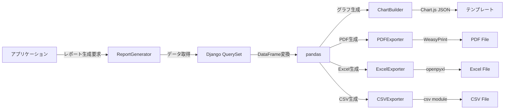

# kits.reports 実装ガイド

> 💡 **このガイドを始める前に**
>
> プロジェクト全体の背景、なぜこの実装が必要なのか、現在の構成と目指す構成について理解するために、まず **[実装の背景とコンテキスト](KITS_CONTEXT.md)** をお読みください。
>
> このドキュメントには以下の情報が含まれています：
> - 📚 プロジェクト全体の背景（school_diaryとは何か）
> - 🎯 なぜkits.reportsが必要なのか（過去課題4つの分析）
> - 🏗️ 現在のプロジェクト構成と目指す構成
> - 📊 実装の優先順位と戦略（Tier 1の3つ）
> - ⚙️ 技術的な制約と設計方針

---

## 💡 **このガイドについて**

このガイドでは、業務アプリケーションで必須となるレポート機能・データ可視化機能を提供する `kits.reports` パッケージの実装方法を、初心者にもわかりやすく、ステップバイステップで解説します。

---

## 📋 概要

このガイドでは、`kits.reports`パッケージの実装方法を初心者にもわかりやすく、ステップバイステップで解説します。

**kits.reportsとは？**
業務アプリケーションで必要なレポート機能（グラフ生成、PDF出力、CSV/Excelエクスポート、データ可視化）を提供する再利用可能なDjangoパッケージです。

**このパッケージが解決する課題**
- ✅ 残業時間の集計レポート・部門別グラフ（課題1: 残業管理）
- ✅ 成長曲線グラフ・予防接種記録の可視化（課題2: 母子手帳）
- ✅ 打撃成績・防御率・チームスタッツのグラフ化（課題3: 野球部記録）
- ✅ すべての課題で必要な印刷・エクスポート機能

**主な機能**
- 📊 Chart.jsを使ったインタラクティブなグラフ生成
- 📄 PDF形式でのレポート出力
- 📁 CSV/Excel形式でのデータエクスポート
- 🏷️ Djangoテンプレートタグによる簡単な統合
- 📅 レポートのスケジュール実行（週次・月次レポート）

## 🎯 学習目標

このガイドを完了すると、以下ができるようになります：

- [ ] Chart.jsを使ったグラフ生成を実装できる
- [ ] WeasyPrintを使ったPDF出力を実装できる
- [ ] pandas/openpyxlを使ったExcelエクスポートを実装できる
- [ ] Djangoカスタムテンプレートタグを作成できる
- [ ] 再利用可能なレポートシステムの設計パターンを学べる

## 📚 前提知識

**必須:**
- Python 3.12の基本文法
- Djangoの基礎（モデル、ビュー、テンプレート）
- Git/GitHub の基本操作
- 基本的なSQL（集計関数、GROUP BY）

**推奨:**
- Chart.jsの基礎知識（JavaScript）
- pandas/DataFrameの基本操作
- HTMLテンプレートの知識

## 🏗️ アーキテクチャ概要

### 既存のkitsパッケージのパターン

school_diaryでは、kitsパッケージは**シンプルで最小限の構成**を維持しています：

```
kits/
├── accounts/          # 管理コマンド提供型
├── approvals/         # シグナル提供型
├── demos/             # 完全なDjangoアプリ型（モデル持ち）
├── notifications/     # 完全なDjangoアプリ型（モデル持ち）
└── reports/           # ← 今回実装（demosパターンを踏襲）
```

### reportsの構成（demosパターンを踏襲）

```
kits/reports/
├── __init__.py
├── apps.py               # Djangoアプリ設定
├── models.py             # Report, ReportTemplate, ReportSchedule
├── admin.py              # Django管理画面
├── services.py           # ReportGenerator, ChartService
├── exporters.py          # PDFExporter, CSVExporter, ExcelExporter
├── charts.py             # ChartBuilder（Chart.js wrapper）
├── serializers.py        # DRF serializers（オプション）
├── templatetags/         # Djangoテンプレートタグ
│   ├── __init__.py
│   └── report_tags.py
└── migrations/           # データベースマイグレーション

# テンプレートとテストは別の場所
school_diary/templates/reports/  # レポートテンプレート
    ├── base_report.html
    ├── pdf_report.html
    └── partials/
        ├── chart_line.html
        └── chart_bar.html

school_diary/static/reports/     # Chart.js設定
    └── js/
        └── charts.js

tests/reports/              # ユニットテスト
    ├── test_models.py
    ├── test_services.py
    ├── test_exporters.py
    └── test_charts.py
```

**設計方針:**
- ✅ **サブディレクトリを最小限に** - templatetags/のみ作成
- ✅ **ファイル数を最小限に** - 機能ごとに1ファイル
- ✅ **demosパターンを踏襲** - 既存の成功パターンに従う
- ✅ **Chart.jsはCDN利用** - npmビルド不要、シンプルな統合

### データフロー図



---

## 🚀 実装手順

### Step 1: プロジェクト構造の理解

#### 目的
kitsパッケージの構造と、reportsモジュールの位置づけを理解します。

#### 実行コマンド

```bash
# 現在のkitsパッケージ構成を確認
cd /home/hirok/work/school_diary
tree -L 2 kits/
```

#### チェックリスト
- [ ] kitsディレクトリの場所を確認した
- [ ] kits/reports/ディレクトリの存在を確認した（なければ作成）
- [ ] 他のkitsモジュール（demos, notifications）の構成を参考にした

#### 💡 ポイント
- `kits`は再利用可能なDjangoアプリケーションの集合体です
- 各モジュールは独立して動作し、`pip install -e ~/work/school_diary`で他のプロジェクトから利用できます

---

### Step 2: 依存関係のインストールと設定

#### 目的
レポート機能に必要なPythonパッケージをインストールし、Django設定を行います。

#### 実装内容

##### 2.1 requirements.txtへの追加

`requirements/base.txt`に以下を追加：

```txt
# Reports & Data Visualization
pandas==2.2.2                  # データ分析・集計
openpyxl==3.1.5                # Excel読み書き
xlsxwriter==3.2.0              # Excel書き込み（高機能）
weasyprint==62.3               # HTML → PDF変換
pillow==10.4.0                 # 画像処理（WeasyPrint依存）
reportlab==4.2.2               # PDF生成（代替）
```

**なぜこれらが必要？**
- `pandas`: DjangoのQuerySetをDataFrameに変換し、集計・グループ化を簡単に実行
- `openpyxl`: Excelファイル（.xlsx）の読み書き
- `xlsxwriter`: Excelファイルの高度な書式設定（グラフ埋め込みなど）
- `weasyprint`: HTML/CSSをPDFに変換（印刷レイアウトそのままPDF化）
- `pillow`: 画像処理ライブラリ（WeasyPrintが依存）
- `reportlab`: PDFを直接生成（WeasyPrintの代替案）

##### 2.2 システム依存パッケージのインストール（WeasyPrint用）

WeasyPrintはシステムライブラリに依存します：

```bash
# Ubuntu/Debian
sudo apt-get update
sudo apt-get install -y \
    libpango-1.0-0 \
    libpangocairo-1.0-0 \
    libgdk-pixbuf2.0-0 \
    libffi-dev \
    shared-mime-info

# macOS
brew install pango gdk-pixbuf libffi
```

##### 2.3 Pythonパッケージのインストール

```bash
# 開発環境の場合
pip install -r requirements/local.txt

# または個別にインストール
pip install pandas openpyxl xlsxwriter weasyprint pillow reportlab
```

##### 2.4 Django設定の更新

`config/settings/base.py`に追加：

```python
# INSTALLED_APPS に追加
INSTALLED_APPS = [
    # ...既存のアプリ...
    "kits.reports",
]

# レポート設定
REPORTS_CONFIG = {
    "ENABLED": True,
    "OUTPUT_DIR": BASE_DIR / "media" / "reports",  # レポート保存先
    "TEMP_DIR": BASE_DIR / "media" / "reports" / "temp",  # 一時ファイル
    "RETENTION_DAYS": 30,  # レポートファイルの保持期間（日）
    "MAX_FILE_SIZE_MB": 50,  # 最大ファイルサイズ（MB）
    "ALLOWED_FORMATS": ["pdf", "csv", "xlsx"],  # 許可する形式
    "CHART_LIBRARY": "chartjs",  # chartjs または plotly
    "PDF_BACKEND": "weasyprint",  # weasyprint または reportlab
}

# WeasyPrint設定（オプション）
WEASYPRINT_BASEURL = "file://" + str(BASE_DIR)
```

ディレクトリを作成：

```bash
# レポート保存ディレクトリを作成
mkdir -p /home/hirok/work/school_diary/media/reports/temp
```

#### チェックリスト
- [ ] requirements/base.txtにパッケージを追加した
- [ ] システム依存パッケージをインストールした（WeasyPrint用）
- [ ] pip installでPythonパッケージをインストールした
- [ ] Django設定ファイルを更新した
- [ ] レポート保存ディレクトリを作成した
- [ ] 設定が反映されているか確認（`python manage.py check`）

#### ⚠️ よくあるエラー

**エラー1:** `OSError: cannot load library 'gobject-2.0-0'`
→ **対処法:** システムライブラリをインストール（上記2.2参照）

**エラー2:** `ModuleNotFoundError: No module named 'pandas'`
→ **対処法:** `pip install pandas`を実行

**エラー3:** WeasyPrintが動かない
→ **対処法:** `reportlab`を代替として使用（後述）

---

### Step 3: データモデルの設計と実装

#### 目的
レポートデータを保存するためのDjangoモデルを実装します。

#### 実装内容

`kits/reports/models.py`を作成：

```python
"""
レポートシステムのデータモデル

このモジュールは、レポートテンプレート、生成されたレポート、
スケジュール実行の管理を担当します。
"""
from django.db import models
from django.contrib.auth import get_user_model
from django.contrib.postgres.fields import ArrayField
from django.utils import timezone
from django.utils.translation import gettext_lazy as _
from django.core.validators import FileExtensionValidator
import uuid

User = get_user_model()


class ReportFormat(models.TextChoices):
    """レポートの出力形式"""
    PDF = "pdf", _("PDF")
    CSV = "csv", _("CSV")
    XLSX = "xlsx", _("Excel")
    HTML = "html", _("HTML")


class ReportStatus(models.TextChoices):
    """レポート生成の状態"""
    PENDING = "pending", _("生成待ち")
    GENERATING = "generating", _("生成中")
    COMPLETED = "completed", _("完了")
    FAILED = "failed", _("失敗")


class ChartType(models.TextChoices):
    """グラフの種類"""
    LINE = "line", _("折れ線グラフ")
    BAR = "bar", _("棒グラフ")
    PIE = "pie", _("円グラフ")
    DOUGHNUT = "doughnut", _("ドーナツグラフ")
    RADAR = "radar", _("レーダーチャート")
    SCATTER = "scatter", _("散布図")
    AREA = "area", _("面グラフ")


class ReportTemplate(models.Model):
    """
    レポートテンプレート

    再利用可能なレポートテンプレートを管理します。
    SQLクエリ、グラフ設定、レイアウトを定義できます。
    """
    code = models.CharField(
        max_length=100,
        unique=True,
        verbose_name=_("テンプレートコード"),
        help_text=_("システム内で使用する一意の識別子（例: monthly_overtime_report）"),
    )
    name = models.CharField(
        max_length=200,
        verbose_name=_("テンプレート名"),
    )
    description = models.TextField(
        blank=True,
        verbose_name=_("説明"),
    )

    # データソース設定
    model_name = models.CharField(
        max_length=200,
        blank=True,
        verbose_name=_("モデル名"),
        help_text=_("例: kits.demos.models.OvertimeRequest"),
    )
    query_template = models.TextField(
        blank=True,
        verbose_name=_("クエリテンプレート"),
        help_text=_("Django ORM形式のクエリ（Pythonコード）"),
    )

    # グラフ設定（JSON）
    chart_config = models.JSONField(
        default=dict,
        verbose_name=_("グラフ設定"),
        help_text=_("Chart.js設定（JSON形式）"),
    )

    # 出力設定
    supported_formats = ArrayField(
        models.CharField(max_length=10, choices=ReportFormat.choices),
        default=list,
        verbose_name=_("対応形式"),
    )
    default_format = models.CharField(
        max_length=10,
        choices=ReportFormat.choices,
        default=ReportFormat.PDF,
        verbose_name=_("デフォルト形式"),
    )

    # テンプレートファイル
    html_template = models.CharField(
        max_length=255,
        blank=True,
        verbose_name=_("HTMLテンプレートパス"),
        help_text=_("例: reports/monthly_overtime.html"),
    )

    # 設定
    is_active = models.BooleanField(
        default=True,
        verbose_name=_("有効"),
    )
    is_public = models.BooleanField(
        default=False,
        verbose_name=_("公開"),
        help_text=_("全ユーザーがアクセス可能か"),
    )

    # メタ情報
    created_at = models.DateTimeField(auto_now_add=True)
    updated_at = models.DateTimeField(auto_now=True)
    created_by = models.ForeignKey(
        User,
        on_delete=models.SET_NULL,
        null=True,
        related_name="created_report_templates",
        verbose_name=_("作成者"),
    )

    class Meta:
        db_table = "kits_report_templates"
        verbose_name = _("レポートテンプレート")
        verbose_name_plural = _("レポートテンプレート")
        ordering = ["code"]

    def __str__(self):
        return f"{self.code} - {self.name}"


class Report(models.Model):
    """
    生成されたレポート

    個々のレポート生成結果を表します。
    ファイルパス、生成パラメータ、エラー情報などを記録します。
    """
    id = models.UUIDField(
        primary_key=True,
        default=uuid.uuid4,
        editable=False,
    )

    # テンプレート
    template = models.ForeignKey(
        ReportTemplate,
        on_delete=models.SET_NULL,
        null=True,
        blank=True,
        related_name="reports",
        verbose_name=_("テンプレート"),
    )

    # 生成者
    generated_by = models.ForeignKey(
        User,
        on_delete=models.SET_NULL,
        null=True,
        related_name="generated_reports",
        verbose_name=_("生成者"),
    )

    # レポート情報
    title = models.CharField(
        max_length=255,
        verbose_name=_("タイトル"),
    )
    description = models.TextField(
        blank=True,
        verbose_name=_("説明"),
    )

    # 出力形式
    format = models.CharField(
        max_length=10,
        choices=ReportFormat.choices,
        default=ReportFormat.PDF,
        verbose_name=_("形式"),
    )

    # ファイル情報
    file = models.FileField(
        upload_to="reports/%Y/%m/%d/",
        blank=True,
        validators=[FileExtensionValidator(allowed_extensions=["pdf", "csv", "xlsx", "html"])],
        verbose_name=_("ファイル"),
    )
    file_size = models.PositiveBigIntegerField(
        default=0,
        verbose_name=_("ファイルサイズ（bytes）"),
    )

    # 生成パラメータ
    parameters = models.JSONField(
        default=dict,
        verbose_name=_("パラメータ"),
        help_text=_("レポート生成時のフィルタ条件など"),
    )

    # ステータス
    status = models.CharField(
        max_length=20,
        choices=ReportStatus.choices,
        default=ReportStatus.PENDING,
        verbose_name=_("ステータス"),
    )

    # タイムスタンプ
    generated_at = models.DateTimeField(
        null=True,
        blank=True,
        verbose_name=_("生成日時"),
    )
    expires_at = models.DateTimeField(
        null=True,
        blank=True,
        verbose_name=_("有効期限"),
    )
    created_at = models.DateTimeField(auto_now_add=True)
    updated_at = models.DateTimeField(auto_now=True)

    # エラー情報
    error_message = models.TextField(
        blank=True,
        verbose_name=_("エラーメッセージ"),
    )

    # 統計情報
    row_count = models.PositiveIntegerField(
        default=0,
        verbose_name=_("データ行数"),
    )
    download_count = models.PositiveIntegerField(
        default=0,
        verbose_name=_("ダウンロード回数"),
    )

    class Meta:
        db_table = "kits_reports"
        verbose_name = _("レポート")
        verbose_name_plural = _("レポート")
        ordering = ["-created_at"]
        indexes = [
            models.Index(fields=["generated_by", "status"]),
            models.Index(fields=["created_at"]),
            models.Index(fields=["expires_at"]),
        ]

    def __str__(self):
        return f"{self.title} ({self.get_format_display()})"

    def mark_as_completed(self, file_path: str, file_size: int, row_count: int = 0):
        """生成完了としてマーク"""
        self.status = ReportStatus.COMPLETED
        self.file = file_path
        self.file_size = file_size
        self.row_count = row_count
        self.generated_at = timezone.now()
        self.save(update_fields=[
            "status", "file", "file_size", "row_count", "generated_at", "updated_at"
        ])

    def mark_as_failed(self, error_message: str):
        """生成失敗としてマーク"""
        self.status = ReportStatus.FAILED
        self.error_message = error_message
        self.save(update_fields=["status", "error_message", "updated_at"])

    def increment_download_count(self):
        """ダウンロード回数をインクリメント"""
        self.download_count += 1
        self.save(update_fields=["download_count", "updated_at"])

    @property
    def is_expired(self) -> bool:
        """有効期限切れかどうか"""
        if not self.expires_at:
            return False
        return timezone.now() > self.expires_at

    @property
    def is_downloadable(self) -> bool:
        """ダウンロード可能かどうか"""
        return (
            self.status == ReportStatus.COMPLETED
            and bool(self.file)
            and not self.is_expired
        )


class ReportSchedule(models.Model):
    """
    レポートスケジュール

    定期的なレポート生成を設定します。
    週次・月次レポートなど。
    """
    template = models.ForeignKey(
        ReportTemplate,
        on_delete=models.CASCADE,
        related_name="schedules",
        verbose_name=_("テンプレート"),
    )

    name = models.CharField(
        max_length=200,
        verbose_name=_("スケジュール名"),
    )
    description = models.TextField(
        blank=True,
        verbose_name=_("説明"),
    )

    # Cron形式のスケジュール設定
    cron_expression = models.CharField(
        max_length=100,
        default="0 9 1 * *",  # 毎月1日の9:00AM
        verbose_name=_("Cron式"),
        help_text=_("例: '0 9 * * 1' = 毎週月曜日9:00AM"),
    )

    # パラメータ
    parameters = models.JSONField(
        default=dict,
        verbose_name=_("パラメータ"),
    )

    # 出力形式
    format = models.CharField(
        max_length=10,
        choices=ReportFormat.choices,
        default=ReportFormat.PDF,
        verbose_name=_("形式"),
    )

    # 送信設定
    send_to_users = models.ManyToManyField(
        User,
        blank=True,
        related_name="scheduled_reports",
        verbose_name=_("送信先ユーザー"),
    )
    send_to_emails = ArrayField(
        models.EmailField(),
        default=list,
        blank=True,
        verbose_name=_("送信先メールアドレス"),
    )

    # 設定
    is_active = models.BooleanField(
        default=True,
        verbose_name=_("有効"),
    )

    # タイムスタンプ
    last_run_at = models.DateTimeField(
        null=True,
        blank=True,
        verbose_name=_("最終実行日時"),
    )
    next_run_at = models.DateTimeField(
        null=True,
        blank=True,
        verbose_name=_("次回実行予定日時"),
    )
    created_at = models.DateTimeField(auto_now_add=True)
    updated_at = models.DateTimeField(auto_now=True)

    class Meta:
        db_table = "kits_report_schedules"
        verbose_name = _("レポートスケジュール")
        verbose_name_plural = _("レポートスケジュール")
        ordering = ["next_run_at"]

    def __str__(self):
        return f"{self.name} ({self.cron_expression})"
```

#### データモデル設計のポイント

**1. ReportTemplateとReportの分離**
- テンプレートは再利用可能（1つのテンプレートから複数のレポートを生成）
- レポートは個別のインスタンス（生成履歴、ファイルを保持）

**2. ステータス管理**
```
pending → generating → completed
          ↓ (失敗時)
        failed
```

**3. ファイル管理**
- UUIDをプライマリキーに使用（URLでのファイル推測を防ぐ）
- 有効期限（expires_at）で自動削除をサポート
- ダウンロード回数の追跡

**4. スケジュール実行**
- Cron式で柔軟なスケジュール設定
- 生成後のメール送信機能

#### チェックリスト
- [ ] models.pyファイルを作成した
- [ ] ReportTemplateモデルを実装した
- [ ] Reportモデルを実装した
- [ ] ReportScheduleモデルを実装した
- [ ] 各フィールドの意味を理解した

---

### Step 4: マイグレーションの作成と適用

#### 目的
データベースにテーブルを作成します。

#### 実行コマンド

```bash
# マイグレーションファイルの生成
python manage.py makemigrations reports

# マイグレーション内容の確認（SQLを表示）
python manage.py sqlmigrate reports 0001

# マイグレーションの適用
python manage.py migrate reports
```

#### 予想される出力

```
Migrations for 'reports':
  kits/reports/migrations/0001_initial.py
    - Create model ReportTemplate
    - Create model Report
    - Create model ReportSchedule
    - Add index report_generated_by_status_idx
    - Add index report_created_idx
    - Add index report_expires_idx
```

#### チェックリスト
- [ ] マイグレーションファイルが生成された
- [ ] マイグレーションを適用した
- [ ] データベースにテーブルが作成されたか確認

---

### Step 5: Chart.jsラッパーの実装

#### 目的
Chart.jsを簡単に使えるPythonラッパーを実装します。

#### 実装内容

`kits/reports/charts.py`を作成：

```python
"""
Chart.jsラッパー

Chart.jsのグラフ設定をPythonから簡単に生成するためのヘルパークラス
"""
from typing import List, Dict, Any, Optional
from dataclasses import dataclass, field, asdict
import json


@dataclass
class ChartDataset:
    """Chart.jsのデータセット"""
    label: str
    data: List[float]
    backgroundColor: Optional[List[str]] = None
    borderColor: Optional[str] = None
    borderWidth: int = 1
    fill: bool = False
    tension: float = 0.1  # 曲線の滑らかさ（折れ線グラフ用）

    def to_dict(self) -> Dict[str, Any]:
        """辞書形式に変換（NoneフィールドはJSONに含めない）"""
        return {k: v for k, v in asdict(self).items() if v is not None}


@dataclass
class ChartOptions:
    """Chart.jsのオプション"""
    responsive: bool = True
    maintainAspectRatio: bool = True
    plugins: Dict[str, Any] = field(default_factory=dict)
    scales: Dict[str, Any] = field(default_factory=dict)

    def to_dict(self) -> Dict[str, Any]:
        return asdict(self)


class ChartBuilder:
    """
    Chart.jsのグラフ設定を生成するビルダークラス

    使用例:
        chart = ChartBuilder.line(
            labels=['1月', '2月', '3月'],
            datasets=[{
                'label': '売上',
                'data': [100, 200, 150],
            }],
            title='月次売上推移'
        )
        chart_json = chart.to_json()
    """

    def __init__(self, chart_type: str):
        self.chart_type = chart_type
        self.labels: List[str] = []
        self.datasets: List[ChartDataset] = []
        self.options = ChartOptions()

    def set_labels(self, labels: List[str]) -> 'ChartBuilder':
        """ラベルを設定"""
        self.labels = labels
        return self

    def add_dataset(
        self,
        label: str,
        data: List[float],
        background_color: Optional[List[str]] = None,
        border_color: Optional[str] = None,
        **kwargs
    ) -> 'ChartBuilder':
        """データセットを追加"""
        dataset = ChartDataset(
            label=label,
            data=data,
            backgroundColor=background_color,
            borderColor=border_color,
            **kwargs
        )
        self.datasets.append(dataset)
        return self

    def set_title(self, title: str) -> 'ChartBuilder':
        """グラフタイトルを設定"""
        self.options.plugins['title'] = {
            'display': True,
            'text': title,
            'font': {'size': 16}
        }
        return self

    def set_legend(self, display: bool = True, position: str = 'top') -> 'ChartBuilder':
        """凡例を設定"""
        self.options.plugins['legend'] = {
            'display': display,
            'position': position,
        }
        return self

    def set_y_axis_label(self, label: str) -> 'ChartBuilder':
        """Y軸ラベルを設定"""
        self.options.scales['y'] = {
            'title': {
                'display': True,
                'text': label,
            }
        }
        return self

    def to_dict(self) -> Dict[str, Any]:
        """辞書形式に変換"""
        return {
            'type': self.chart_type,
            'data': {
                'labels': self.labels,
                'datasets': [ds.to_dict() for ds in self.datasets],
            },
            'options': self.options.to_dict(),
        }

    def to_json(self, indent: Optional[int] = None) -> str:
        """JSON形式に変換"""
        return json.dumps(self.to_dict(), ensure_ascii=False, indent=indent)

    @classmethod
    def line(
        cls,
        labels: List[str],
        datasets: List[Dict[str, Any]],
        title: str = "",
        y_axis_label: str = "",
    ) -> 'ChartBuilder':
        """折れ線グラフを作成"""
        builder = cls('line')
        builder.set_labels(labels)

        for ds_data in datasets:
            builder.add_dataset(
                label=ds_data.get('label', ''),
                data=ds_data.get('data', []),
                border_color=ds_data.get('borderColor', '#4F46E5'),
                background_color=None,
                fill=False,
                tension=0.1,
            )

        if title:
            builder.set_title(title)
        if y_axis_label:
            builder.set_y_axis_label(y_axis_label)

        return builder

    @classmethod
    def bar(
        cls,
        labels: List[str],
        datasets: List[Dict[str, Any]],
        title: str = "",
        y_axis_label: str = "",
    ) -> 'ChartBuilder':
        """棒グラフを作成"""
        builder = cls('bar')
        builder.set_labels(labels)

        colors = [
            '#4F46E5', '#10B981', '#F59E0B', '#EF4444',
            '#8B5CF6', '#06B6D4', '#EC4899', '#6366F1'
        ]

        for idx, ds_data in enumerate(datasets):
            builder.add_dataset(
                label=ds_data.get('label', ''),
                data=ds_data.get('data', []),
                background_color=ds_data.get('backgroundColor', [colors[idx % len(colors)]]),
                border_color=ds_data.get('borderColor'),
            )

        if title:
            builder.set_title(title)
        if y_axis_label:
            builder.set_y_axis_label(y_axis_label)

        return builder

    @classmethod
    def pie(
        cls,
        labels: List[str],
        data: List[float],
        title: str = "",
        background_colors: Optional[List[str]] = None,
    ) -> 'ChartBuilder':
        """円グラフを作成"""
        builder = cls('pie')
        builder.set_labels(labels)

        if not background_colors:
            background_colors = [
                '#4F46E5', '#10B981', '#F59E0B', '#EF4444',
                '#8B5CF6', '#06B6D4', '#EC4899', '#6366F1'
            ]

        builder.add_dataset(
            label='',
            data=data,
            background_color=background_colors[:len(data)],
        )

        if title:
            builder.set_title(title)

        return builder

    @classmethod
    def doughnut(
        cls,
        labels: List[str],
        data: List[float],
        title: str = "",
        background_colors: Optional[List[str]] = None,
    ) -> 'ChartBuilder':
        """ドーナツグラフを作成"""
        builder = cls('doughnut')
        builder.set_labels(labels)

        if not background_colors:
            background_colors = [
                '#4F46E5', '#10B981', '#F59E0B', '#EF4444',
                '#8B5CF6', '#06B6D4', '#EC4899', '#6366F1'
            ]

        builder.add_dataset(
            label='',
            data=data,
            background_color=background_colors[:len(data)],
        )

        if title:
            builder.set_title(title)

        return builder
```

#### Chart.js設計のポイント

**1. ビルダーパターン**
- メソッドチェーンで設定を積み重ねる
- 可読性が高く、柔軟な設定が可能

**2. クラスメソッドでの簡潔な生成**
```python
# 簡単な使い方
chart = ChartBuilder.line(
    labels=['1月', '2月', '3月'],
    datasets=[{'label': '売上', 'data': [100, 200, 150]}],
    title='月次売上'
)
```

**3. JSON出力**
- テンプレートに直接埋め込める形式
- Chart.jsが期待するフォーマットと完全互換

#### チェックリスト
- [ ] charts.pyファイルを作成した
- [ ] ChartBuilderクラスを実装した
- [ ] 各グラフタイプ（line, bar, pie, doughnut）を実装した

---

### Step 6: エクスポート機能の実装

#### 目的
PDF、CSV、Excelへのエクスポート機能を実装します。

#### 実装内容

`kits/reports/exporters.py`を作成：

```python
"""
エクスポート機能

DataFrame → PDF/CSV/Excelへの変換を担当
"""
import logging
from typing import Optional, Dict, Any
from pathlib import Path
from io import BytesIO
import pandas as pd
from django.conf import settings
from django.template.loader import render_to_string
from django.utils import timezone

logger = logging.getLogger(__name__)


class CSVExporter:
    """CSV形式でエクスポート"""

    @staticmethod
    def export(df: pd.DataFrame, file_path: str, **kwargs) -> int:
        """
        DataFrameをCSVファイルに出力

        Args:
            df: エクスポートするDataFrame
            file_path: 出力先ファイルパス
            **kwargs: pd.to_csvのオプション

        Returns:
            ファイルサイズ（bytes）
        """
        # デフォルト設定
        csv_options = {
            'index': False,
            'encoding': 'utf-8-sig',  # Excel対応のBOM付きUTF-8
            **kwargs
        }

        df.to_csv(file_path, **csv_options)

        file_size = Path(file_path).stat().st_size
        logger.info(f"CSV出力完了: {file_path} ({file_size} bytes)")
        return file_size


class ExcelExporter:
    """Excel形式でエクスポート"""

    @staticmethod
    def export(
        df: pd.DataFrame,
        file_path: str,
        sheet_name: str = 'Sheet1',
        include_chart: bool = False,
        chart_config: Optional[Dict[str, Any]] = None,
        **kwargs
    ) -> int:
        """
        DataFrameをExcelファイルに出力

        Args:
            df: エクスポートするDataFrame
            file_path: 出力先ファイルパス
            sheet_name: シート名
            include_chart: グラフを埋め込むか
            chart_config: グラフ設定（xlsxwriter形式）
            **kwargs: pd.to_excelのオプション

        Returns:
            ファイルサイズ（bytes）
        """
        # xlsxwriterを使用してグラフ付きExcelを生成
        if include_chart and chart_config:
            with pd.ExcelWriter(
                file_path,
                engine='xlsxwriter'
            ) as writer:
                df.to_excel(writer, sheet_name=sheet_name, index=False)

                # グラフを追加
                workbook = writer.book
                worksheet = writer.sheets[sheet_name]

                # グラフオブジェクトを作成
                chart = workbook.add_chart({'type': chart_config.get('type', 'column')})

                # データ範囲を設定
                row_count = len(df)
                for idx, col in enumerate(df.columns):
                    if col in chart_config.get('value_columns', []):
                        chart.add_series({
                            'name': col,
                            'categories': [sheet_name, 1, 0, row_count, 0],
                            'values': [sheet_name, 1, idx, row_count, idx],
                        })

                # グラフを配置
                chart.set_title({'name': chart_config.get('title', '')})
                worksheet.insert_chart('H2', chart)

        else:
            # シンプルなExcel出力
            with pd.ExcelWriter(file_path, engine='openpyxl') as writer:
                df.to_excel(writer, sheet_name=sheet_name, index=False, **kwargs)

        file_size = Path(file_path).stat().st_size
        logger.info(f"Excel出力完了: {file_path} ({file_size} bytes)")
        return file_size


class PDFExporter:
    """PDF形式でエクスポート"""

    @staticmethod
    def export(
        html_content: str,
        file_path: str,
        base_url: Optional[str] = None,
    ) -> int:
        """
        HTMLをPDFに変換

        Args:
            html_content: HTML文字列
            file_path: 出力先ファイルパス
            base_url: 相対パスの基準URL

        Returns:
            ファイルサイズ（bytes）
        """
        pdf_backend = getattr(settings, 'REPORTS_CONFIG', {}).get('PDF_BACKEND', 'weasyprint')

        if pdf_backend == 'weasyprint':
            return PDFExporter._export_weasyprint(html_content, file_path, base_url)
        elif pdf_backend == 'reportlab':
            return PDFExporter._export_reportlab(html_content, file_path)
        else:
            raise ValueError(f"未対応のPDFバックエンド: {pdf_backend}")

    @staticmethod
    def _export_weasyprint(html_content: str, file_path: str, base_url: Optional[str]) -> int:
        """WeasyPrintでPDF生成"""
        try:
            from weasyprint import HTML, CSS
            from weasyprint.text.fonts import FontConfiguration
        except ImportError:
            raise ImportError(
                "WeasyPrintがインストールされていません。"
                "pip install weasyprint を実行してください。"
            )

        if base_url is None:
            base_url = getattr(settings, 'WEASYPRINT_BASEURL', '')

        # フォント設定
        font_config = FontConfiguration()

        # PDF生成
        html = HTML(string=html_content, base_url=base_url)
        html.write_pdf(
            file_path,
            font_config=font_config,
        )

        file_size = Path(file_path).stat().st_size
        logger.info(f"PDF出力完了（WeasyPrint）: {file_path} ({file_size} bytes)")
        return file_size

    @staticmethod
    def _export_reportlab(html_content: str, file_path: str) -> int:
        """ReportLabでPDF生成（代替）"""
        try:
            from reportlab.lib.pagesizes import A4
            from reportlab.lib.styles import getSampleStyleSheet
            from reportlab.platypus import SimpleDocTemplate, Paragraph, Spacer
            from reportlab.lib.units import mm
        except ImportError:
            raise ImportError(
                "ReportLabがインストールされていません。"
                "pip install reportlab を実行してください。"
            )

        # 簡易的なHTML → テキスト変換（本格的にはhtml2textなどを使用）
        import re
        text_content = re.sub('<[^<]+?>', '', html_content)

        # PDF生成
        doc = SimpleDocTemplate(file_path, pagesize=A4)
        styles = getSampleStyleSheet()
        story = []

        for line in text_content.split('\n'):
            if line.strip():
                p = Paragraph(line, styles['Normal'])
                story.append(p)
                story.append(Spacer(1, 3*mm))

        doc.build(story)

        file_size = Path(file_path).stat().st_size
        logger.info(f"PDF出力完了（ReportLab）: {file_path} ({file_size} bytes)")
        return file_size

    @staticmethod
    def export_from_template(
        template_name: str,
        context: Dict[str, Any],
        file_path: str,
    ) -> int:
        """
        Djangoテンプレートから直接PDF生成

        Args:
            template_name: テンプレート名
            context: テンプレートコンテキスト
            file_path: 出力先ファイルパス

        Returns:
            ファイルサイズ（bytes）
        """
        # テンプレートをレンダリング
        html_content = render_to_string(template_name, context)

        # PDFに変換
        return PDFExporter.export(html_content, file_path)
```

#### エクスポート機能の設計ポイント

**1. 統一されたインターフェース**
- すべてのエクスポーターが`export()`メソッドを持つ
- ファイルサイズを返す（Reportモデルに保存するため）

**2. WeasyPrintとReportLabの両対応**
- WeasyPrint: HTML/CSSをそのままPDF化（推奨）
- ReportLab: システム依存がない代替案

**3. Excel高度機能**
- xlsxwriterでグラフ埋め込みに対応
- openpyxlで基本的なエクスポート

#### チェックリスト
- [ ] exporters.pyファイルを作成した
- [ ] CSVExporterを実装した
- [ ] ExcelExporterを実装した
- [ ] PDFExporterを実装した

---

### Step 7: レポートサービスの実装

#### 目的
レポート生成のビジネスロジックを実装します。

#### 実装内容

`kits/reports/services.py`を作成：

```python
"""
レポートサービス層

レポートの生成、データ集計、エクスポートを担当
"""
import logging
from typing import Optional, Dict, Any, List
from pathlib import Path
import pandas as pd
from django.contrib.auth import get_user_model
from django.utils import timezone
from django.conf import settings
from datetime import timedelta

from .models import Report, ReportTemplate, ReportFormat, ReportStatus
from .exporters import CSVExporter, ExcelExporter, PDFExporter
from .charts import ChartBuilder

User = get_user_model()
logger = logging.getLogger(__name__)


class ReportService:
    """
    レポートサービス

    レポートの生成、エクスポート、ファイル管理を行います。
    """

    def __init__(self):
        self.config = getattr(settings, 'REPORTS_CONFIG', {})
        self.output_dir = Path(self.config.get('OUTPUT_DIR', 'media/reports'))
        self.temp_dir = Path(self.config.get('TEMP_DIR', 'media/reports/temp'))

        # ディレクトリが存在しない場合は作成
        self.output_dir.mkdir(parents=True, exist_ok=True)
        self.temp_dir.mkdir(parents=True, exist_ok=True)

    def generate_report(
        self,
        template: ReportTemplate,
        user: User,
        parameters: Optional[Dict[str, Any]] = None,
        format: str = ReportFormat.PDF,
    ) -> Report:
        """
        レポートを生成

        Args:
            template: レポートテンプレート
            user: 生成者
            parameters: フィルタ条件などのパラメータ
            format: 出力形式

        Returns:
            生成されたレポートオブジェクト
        """
        if parameters is None:
            parameters = {}

        # Reportオブジェクトを作成
        report = Report.objects.create(
            template=template,
            generated_by=user,
            title=template.name,
            format=format,
            parameters=parameters,
            status=ReportStatus.PENDING,
            expires_at=timezone.now() + timedelta(
                days=self.config.get('RETENTION_DAYS', 30)
            ),
        )

        try:
            # ステータスを「生成中」に更新
            report.status = ReportStatus.GENERATING
            report.save(update_fields=['status'])

            # データを取得
            df = self._execute_query(template, parameters)

            if df.empty:
                raise ValueError("データが見つかりませんでした")

            # ファイル名を生成
            timestamp = timezone.now().strftime('%Y%m%d_%H%M%S')
            filename = f"{template.code}_{timestamp}.{format}"
            file_path = self.output_dir / filename

            # 形式に応じてエクスポート
            if format == ReportFormat.PDF:
                file_size = self._export_pdf(template, df, str(file_path), parameters)
            elif format == ReportFormat.CSV:
                file_size = CSVExporter.export(df, str(file_path))
            elif format == ReportFormat.XLSX:
                file_size = ExcelExporter.export(df, str(file_path))
            else:
                raise ValueError(f"未対応の形式: {format}")

            # 完了としてマーク
            report.mark_as_completed(
                file_path=f"reports/{filename}",
                file_size=file_size,
                row_count=len(df),
            )

            logger.info(f"レポート生成成功: {report.id} - {filename}")
            return report

        except Exception as e:
            # エラーハンドリング
            error_message = str(e)
            report.mark_as_failed(error_message)
            logger.error(f"レポート生成失敗: {report.id} - {error_message}")
            raise

    def _execute_query(
        self,
        template: ReportTemplate,
        parameters: Dict[str, Any]
    ) -> pd.DataFrame:
        """
        クエリを実行してDataFrameを取得

        Args:
            template: レポートテンプレート
            parameters: パラメータ

        Returns:
            DataFrame
        """
        # 簡易実装：model_nameからQuerySetを取得
        # 本格実装では、query_templateを安全に実行する仕組みが必要

        if not template.model_name:
            raise ValueError("model_nameが設定されていません")

        # モデルをインポート
        from django.apps import apps
        try:
            app_label, model_name = template.model_name.rsplit('.', 1)
            model = apps.get_model(app_label, model_name)
        except (ValueError, LookupError) as e:
            raise ValueError(f"モデルが見つかりません: {template.model_name}")

        # QuerySetを取得
        queryset = model.objects.all()

        # パラメータでフィルタ（例: date_from, date_to）
        if 'date_from' in parameters:
            queryset = queryset.filter(created_at__gte=parameters['date_from'])
        if 'date_to' in parameters:
            queryset = queryset.filter(created_at__lte=parameters['date_to'])

        # DataFrameに変換
        if not queryset.exists():
            return pd.DataFrame()

        df = pd.DataFrame(list(queryset.values()))
        return df

    def _export_pdf(
        self,
        template: ReportTemplate,
        df: pd.DataFrame,
        file_path: str,
        parameters: Dict[str, Any]
    ) -> int:
        """
        PDFとしてエクスポート

        Args:
            template: レポートテンプレート
            df: データ
            file_path: 出力先
            parameters: パラメータ

        Returns:
            ファイルサイズ
        """
        # テンプレートコンテキストを作成
        context = {
            'template': template,
            'parameters': parameters,
            'data': df.to_dict('records'),
            'row_count': len(df),
            'generated_at': timezone.now(),
        }

        # グラフがあれば追加
        if template.chart_config:
            chart_json = self._generate_chart(df, template.chart_config)
            context['chart_json'] = chart_json

        # テンプレートからPDF生成
        html_template = template.html_template or 'reports/base_report.html'
        return PDFExporter.export_from_template(html_template, context, file_path)

    def _generate_chart(self, df: pd.DataFrame, chart_config: Dict[str, Any]) -> str:
        """
        DataFrameからChart.js設定を生成

        Args:
            df: データ
            chart_config: グラフ設定

        Returns:
            Chart.js JSON文字列
        """
        chart_type = chart_config.get('type', 'bar')
        x_column = chart_config.get('x_column', df.columns[0])
        y_columns = chart_config.get('y_columns', [df.columns[1]])

        labels = df[x_column].astype(str).tolist()
        datasets = []

        for y_col in y_columns:
            datasets.append({
                'label': y_col,
                'data': df[y_col].tolist(),
            })

        # ChartBuilderで生成
        if chart_type == 'line':
            chart = ChartBuilder.line(
                labels=labels,
                datasets=datasets,
                title=chart_config.get('title', ''),
                y_axis_label=chart_config.get('y_axis_label', ''),
            )
        elif chart_type == 'bar':
            chart = ChartBuilder.bar(
                labels=labels,
                datasets=datasets,
                title=chart_config.get('title', ''),
                y_axis_label=chart_config.get('y_axis_label', ''),
            )
        elif chart_type == 'pie':
            # 円グラフは1つのデータセットのみ
            chart = ChartBuilder.pie(
                labels=labels,
                data=df[y_columns[0]].tolist(),
                title=chart_config.get('title', ''),
            )
        else:
            raise ValueError(f"未対応のグラフタイプ: {chart_type}")

        return chart.to_json()

    def cleanup_expired_reports(self) -> int:
        """
        有効期限切れのレポートを削除

        Returns:
            削除件数
        """
        expired_reports = Report.objects.filter(
            expires_at__lt=timezone.now(),
            status=ReportStatus.COMPLETED,
        )

        count = 0
        for report in expired_reports:
            # ファイルを削除
            if report.file:
                file_path = Path(settings.MEDIA_ROOT) / report.file.name
                if file_path.exists():
                    file_path.unlink()

            # DBレコードを削除
            report.delete()
            count += 1

        logger.info(f"期限切れレポートを削除: {count}件")
        return count
```

#### サービス層の設計パターン

**1. 責務の分離**
- `ReportService`: レポート生成全体の制御
- `Exporter`: 形式変換のみ
- `ChartBuilder`: グラフ設定のみ

**2. エラーハンドリング**
- 生成失敗時は自動的にステータスを更新
- エラーメッセージを記録

**3. ファイル管理**
- 自動的に有効期限を設定
- クリーンアップ機能で古いファイルを削除

#### チェックリスト
- [ ] services.pyファイルを作成した
- [ ] ReportServiceクラスを実装した
- [ ] generate_report()メソッドを実装した
- [ ] cleanup_expired_reports()メソッドを実装した

---

### Step 8: Djangoテンプレートタグの実装

#### 目的
テンプレートから簡単にグラフを表示できるカスタムタグを作成します。

#### 実装内容

`kits/reports/templatetags/report_tags.py`を作成：

```python
"""
レポート用テンプレートタグ
"""
from django import template
from django.utils.safestring import mark_safe
import json

register = template.Library()


@register.simple_tag
def render_chart(chart_json: str, canvas_id: str = "myChart", height: int = 400) -> str:
    """
    Chart.jsグラフをレンダリング

    使用例:
        
        

    Args:
        chart_json: Chart.js設定（JSON文字列）
        canvas_id: canvas要素のID
        height: グラフの高さ（px）

    Returns:
        HTMLマークアップ
    """
    html = f"""
    <div class="chart-container" style="position: relative; height:{height}px;">
        <canvas id="{canvas_id}"></canvas>
    </div>
    <script>
        document.addEventListener('DOMContentLoaded', function() {{
            const ctx = document.getElementById('{canvas_id}').getContext('2d');
            const config = {chart_json};
            new Chart(ctx, config);
        }});
    </script>
    """
    return mark_safe(html)


@register.inclusion_tag('reports/partials/data_table.html')
def render_data_table(data, columns=None):
    """
    データテーブルをレンダリング

    使用例:
        
        

    Args:
        data: 辞書のリスト
        columns: 表示するカラムのリスト（Noneの場合は全て）

    Returns:
        テンプレートコンテキスト
    """
    if not data:
        return {'data': [], 'columns': []}

    if columns is None:
        columns = list(data[0].keys())

    return {
        'data': data,
        'columns': columns,
    }


@register.filter
def format_number(value, decimals=0):
    """
    数値をフォーマット

    使用例:
        {{ 1234567|format_number }}  → 1,234,567
        {{ 3.14159|format_number:2 }} → 3.14

    Args:
        value: 数値
        decimals: 小数点以下の桁数

    Returns:
        フォーマット済み文字列
    """
    try:
        num = float(value)
        if decimals == 0:
            return f"{int(num):,}"
        else:
            return f"{num:,.{decimals}f}"
    except (ValueError, TypeError):
        return value


@register.filter
def to_json(value):
    """
    PythonオブジェクトをJSON文字列に変換

    使用例:
        <script>
            const data = {{ my_dict|to_json }};
        </script>

    Args:
        value: Pythonオブジェクト

    Returns:
        JSON文字列
    """
    return mark_safe(json.dumps(value, ensure_ascii=False))
```

`kits/reports/templatetags/__init__.py`を作成（空ファイル）：

```python
# Djangoがテンプレートタグとして認識するために必要
```

データテーブル用の部分テンプレート `school_diary/templates/reports/partials/data_table.html`を作成：

```django
<table class="table table-striped">
    <thead>
        <tr>
            
            <th>{{ column }}</th>
            
        </tr>
    </thead>
    <tbody>
        
        <tr>
            
            <td>{{ row|get_item:column }}</td>
            
        </tr>
        
    </tbody>
</table>
```

#### テンプレートタグの設計ポイント

**1. 使いやすさ重視**
- ``だけでグラフ表示
- Chart.jsの詳細を知らなくても使える

**2. 柔軟性**
- canvas_idを指定して複数グラフを配置可能
- 高さやスタイルをカスタマイズ可能

**3. 安全性**
- `mark_safe()`でXSS対策
- JSON出力時は`ensure_ascii=False`で日本語対応

#### チェックリスト
- [ ] templatetags/report_tags.pyを作成した
- [ ] render_chartタグを実装した
- [ ] render_data_tableタグを実装した
- [ ] フィルタ（format_number, to_json）を実装した

---

### Step 9: Django管理画面とテンプレートの実装

#### 目的
管理者がレポートを管理できるようにし、レポート表示用のテンプレートを作成します。

#### 実装内容

`kits/reports/admin.py`を作成：

```python
"""
Django管理画面設定
"""
from django.contrib import admin
from django.utils.html import format_html
from django.urls import reverse
from django.utils.safestring import mark_safe

from .models import Report, ReportTemplate, ReportSchedule


@admin.register(ReportTemplate)
class ReportTemplateAdmin(admin.ModelAdmin):
    """レポートテンプレート管理画面"""

    list_display = [
        'code',
        'name',
        'formats_display',
        'is_active',
        'is_public',
        'usage_count',
        'updated_at',
    ]
    list_filter = ['is_active', 'is_public', 'default_format', 'updated_at']
    search_fields = ['code', 'name', 'description']
    readonly_fields = ['created_at', 'updated_at', 'usage_count']

    fieldsets = (
        ('基本情報', {
            'fields': ('code', 'name', 'description', 'is_active', 'is_public'),
        }),
        ('データソース', {
            'fields': ('model_name', 'query_template'),
        }),
        ('出力設定', {
            'fields': ('supported_formats', 'default_format', 'html_template'),
        }),
        ('グラフ設定', {
            'fields': ('chart_config',),
        }),
        ('メタ情報', {
            'fields': ('usage_count', 'created_by', 'created_at', 'updated_at'),
            'classes': ('collapse',),
        }),
    )

    def formats_display(self, obj):
        """対応形式を表示"""
        return ', '.join(obj.supported_formats)
    formats_display.short_description = '対応形式'

    def usage_count(self, obj):
        """使用回数を表示"""
        count = obj.reports.count()
        url = reverse('admin:reports_report_changelist') + f'?template__id__exact={obj.id}'
        return format_html('<a href="{}">{} 件</a>', url, count)
    usage_count.short_description = '使用回数'


@admin.register(Report)
class ReportAdmin(admin.ModelAdmin):
    """レポート管理画面"""

    list_display = [
        'id',
        'title',
        'template',
        'format',
        'status_badge',
        'generated_by',
        'file_size_display',
        'row_count',
        'download_count',
        'generated_at',
    ]
    list_filter = [
        'format',
        'status',
        'generated_at',
        'created_at',
    ]
    search_fields = [
        'id',
        'title',
        'generated_by__email',
        'generated_by__name',
    ]
    readonly_fields = [
        'id',
        'template',
        'generated_by',
        'file',
        'file_size_display',
        'parameters_display',
        'created_at',
        'updated_at',
        'generated_at',
        'download_count',
    ]
    date_hierarchy = 'created_at'

    fieldsets = (
        ('基本情報', {
            'fields': ('id', 'template', 'title', 'description', 'generated_by'),
        }),
        ('ファイル情報', {
            'fields': ('format', 'file', 'file_size_display', 'row_count'),
        }),
        ('ステータス', {
            'fields': ('status', 'generated_at', 'expires_at', 'error_message'),
        }),
        ('統計情報', {
            'fields': ('download_count', 'parameters_display'),
        }),
        ('メタ情報', {
            'fields': ('created_at', 'updated_at'),
            'classes': ('collapse',),
        }),
    )

    actions = ['cleanup_files']

    def status_badge(self, obj):
        """ステータスをバッジ表示"""
        colors = {
            'pending': 'gray',
            'generating': 'blue',
            'completed': 'green',
            'failed': 'red',
        }
        color = colors.get(obj.status, 'gray')
        return format_html(
            '<span style="background-color: {}; color: white; padding: 3px 10px; '
            'border-radius: 3px; font-size: 11px;">{}</span>',
            color,
            obj.get_status_display()
        )
    status_badge.short_description = 'ステータス'

    def file_size_display(self, obj):
        """ファイルサイズを人間が読める形式で表示"""
        size = obj.file_size
        for unit in ['B', 'KB', 'MB', 'GB']:
            if size < 1024.0:
                return f"{size:.1f} {unit}"
            size /= 1024.0
        return f"{size:.1f} TB"
    file_size_display.short_description = 'ファイルサイズ'

    def parameters_display(self, obj):
        """パラメータを整形表示"""
        import json
        return mark_safe(f'<pre>{json.dumps(obj.parameters, indent=2, ensure_ascii=False)}</pre>')
    parameters_display.short_description = 'パラメータ'

    def cleanup_files(self, request, queryset):
        """選択したレポートのファイルを削除"""
        from pathlib import Path
        from django.conf import settings

        count = 0
        for report in queryset:
            if report.file:
                file_path = Path(settings.MEDIA_ROOT) / report.file.name
                if file_path.exists():
                    file_path.unlink()
                    count += 1

        self.message_user(request, f'{count}件のファイルを削除しました。')
    cleanup_files.short_description = '選択したレポートのファイルを削除'


@admin.register(ReportSchedule)
class ReportScheduleAdmin(admin.ModelAdmin):
    """レポートスケジュール管理画面"""

    list_display = [
        'name',
        'template',
        'cron_expression',
        'format',
        'is_active',
        'last_run_at',
        'next_run_at',
    ]
    list_filter = ['is_active', 'format', 'template']
    search_fields = ['name', 'description']
    filter_horizontal = ['send_to_users']

    fieldsets = (
        ('基本情報', {
            'fields': ('name', 'description', 'template', 'is_active'),
        }),
        ('スケジュール設定', {
            'fields': ('cron_expression', 'parameters', 'format'),
        }),
        ('送信設定', {
            'fields': ('send_to_users', 'send_to_emails'),
        }),
        ('実行履歴', {
            'fields': ('last_run_at', 'next_run_at'),
            'classes': ('collapse',),
        }),
    )
```

ベーステンプレート `school_diary/templates/reports/base_report.html`を作成：

```django
<!DOCTYPE html>
<html lang="ja">
<head>
    <meta charset="UTF-8">
    <meta name="viewport" content="width=device-width, initial-scale=1.0">
    <title>{{ template.name }}</title>
    <style>
        @page {
            size: A4;
            margin: 20mm;
        }
        body {
            font-family: 'Helvetica Neue', Arial, 'Hiragino Kaku Gothic ProN', sans-serif;
            line-height: 1.6;
            color: #333;
        }
        .report-header {
            border-bottom: 2px solid #4F46E5;
            padding-bottom: 10px;
            margin-bottom: 20px;
        }
        .report-title {
            font-size: 24px;
            font-weight: bold;
            color: #4F46E5;
        }
        .report-meta {
            font-size: 12px;
            color: #666;
            margin-top: 5px;
        }
        .chart-container {
            margin: 30px 0;
            page-break-inside: avoid;
        }
        table {
            width: 100%;
            border-collapse: collapse;
            margin: 20px 0;
        }
        th, td {
            border: 1px solid #ddd;
            padding: 8px;
            text-align: left;
        }
        th {
            background-color: #f3f4f6;
            font-weight: bold;
        }
        .footer {
            margin-top: 40px;
            padding-top: 20px;
            border-top: 1px solid #ddd;
            font-size: 10px;
            color: #999;
            text-align: center;
        }
    </style>
    <script src="https://cdn.jsdelivr.net/npm/chart.js@4.4.0/dist/chart.umd.min.js"></script>
</head>
<body>
    <div class="report-header">
        <div class="report-title">{{ template.name }}</div>
        <div class="report-meta">
            生成日時: {{ generated_at|date:"Y年m月d日 H:i" }} |
            データ件数: {{ row_count }}件
        </div>
    </div>

    
    
    <div class="chart-container">
        
        
    </div>
    

    
    <table>
        <thead>
            <tr>
                
                <th>{{ key }}</th>
                
            </tr>
        </thead>
        <tbody>
            
            <tr>
                
                <td>{{ value }}</td>
                
            </tr>
            
        </tbody>
    </table>
    
    

    <div class="footer">
        このレポートは自動生成されました。
    </div>
</body>
</html>
```

#### チェックリスト
- [ ] admin.pyファイルを作成した
- [ ] 3つのAdminクラスを実装した
- [ ] base_report.htmlテンプレートを作成した
- [ ] 管理画面でレポートを確認できることを確認した

---

### Step 10: ユニットテストと動作確認

#### 目的
実装した機能が正しく動作することを確認します。

#### 実装内容

`tests/reports/test_charts.py`を作成：

```python
"""
Chart.jsラッパーのテスト
"""
from django.test import TestCase
import json

from kits.reports.charts import ChartBuilder


class ChartBuilderTestCase(TestCase):
    """ChartBuilderのテスト"""

    def test_line_chart(self):
        """折れ線グラフが生成できる"""
        chart = ChartBuilder.line(
            labels=['1月', '2月', '3月'],
            datasets=[{
                'label': '売上',
                'data': [100, 200, 150],
            }],
            title='月次売上'
        )

        config = chart.to_dict()
        self.assertEqual(config['type'], 'line')
        self.assertEqual(config['data']['labels'], ['1月', '2月', '3月'])
        self.assertEqual(len(config['data']['datasets']), 1)
        self.assertEqual(config['options']['plugins']['title']['text'], '月次売上')

    def test_bar_chart(self):
        """棒グラフが生成できる"""
        chart = ChartBuilder.bar(
            labels=['A', 'B', 'C'],
            datasets=[{
                'label': 'カテゴリ1',
                'data': [10, 20, 30],
            }],
        )

        config = chart.to_dict()
        self.assertEqual(config['type'], 'bar')
        self.assertEqual(len(config['data']['datasets']), 1)

    def test_pie_chart(self):
        """円グラフが生成できる"""
        chart = ChartBuilder.pie(
            labels=['Red', 'Blue', 'Yellow'],
            data=[300, 50, 100],
            title='Color Distribution'
        )

        config = chart.to_dict()
        self.assertEqual(config['type'], 'pie')
        self.assertEqual(config['data']['datasets'][0]['data'], [300, 50, 100])

    def test_chart_to_json(self):
        """JSON変換が正しく動作する"""
        chart = ChartBuilder.bar(
            labels=['A', 'B'],
            datasets=[{'label': 'Test', 'data': [1, 2]}],
        )

        json_str = chart.to_json()
        parsed = json.loads(json_str)
        self.assertEqual(parsed['type'], 'bar')
```

使用例 `kits/reports/examples.py`を作成：

```python
"""
使用例
"""
from django.contrib.auth import get_user_model
from kits.reports.services import ReportService
from kits.reports.models import ReportTemplate, ReportFormat
from kits.reports.charts import ChartBuilder
import pandas as pd

User = get_user_model()


def example_1_simple_report():
    """例1: シンプルなレポート生成"""
    # テンプレートを作成
    template, created = ReportTemplate.objects.get_or_create(
        code='user_list',
        defaults={
            'name': 'ユーザー一覧レポート',
            'model_name': 'accounts.User',
            'supported_formats': [ReportFormat.CSV, ReportFormat.XLSX],
            'default_format': ReportFormat.CSV,
        }
    )

    # レポートを生成
    user = User.objects.first()
    service = ReportService()
    report = service.generate_report(
        template=template,
        user=user,
        format=ReportFormat.CSV,
    )

    print(f"レポート生成完了: {report.file.url}")


def example_2_chart_generation():
    """例2: グラフ生成"""
    # サンプルデータ
    data = {
        '月': ['1月', '2月', '3月', '4月', '5月', '6月'],
        '売上': [120, 190, 300, 250, 200, 310],
        '費用': [80, 100, 150, 120, 90, 180],
    }
    df = pd.DataFrame(data)

    # 折れ線グラフを生成
    chart = ChartBuilder.line(
        labels=df['月'].tolist(),
        datasets=[
            {'label': '売上', 'data': df['売上'].tolist()},
            {'label': '費用', 'data': df['費用'].tolist()},
        ],
        title='月次売上・費用推移',
        y_axis_label='金額（万円）',
    )

    print("Chart.js設定:")
    print(chart.to_json(indent=2))


def example_3_pdf_report():
    """例3: PDF付きグラフレポート"""
    # グラフ付きテンプレートを作成
    template, created = ReportTemplate.objects.get_or_create(
        code='monthly_sales_report',
        defaults={
            'name': '月次売上レポート',
            'model_name': 'demos.SalesRecord',
            'supported_formats': [ReportFormat.PDF],
            'default_format': ReportFormat.PDF,
            'html_template': 'reports/base_report.html',
            'chart_config': {
                'type': 'line',
                'x_column': 'month',
                'y_columns': ['amount'],
                'title': '月次売上推移',
                'y_axis_label': '売上（円）',
            }
        }
    )

    # レポート生成
    user = User.objects.first()
    service = ReportService()
    report = service.generate_report(
        template=template,
        user=user,
        format=ReportFormat.PDF,
        parameters={
            'date_from': '2025-01-01',
            'date_to': '2025-12-31',
        }
    )

    print(f"PDFレポート生成完了: {report.file.url}")
```

Django Shellで動作確認：

```bash
python manage.py shell
```

```python
# Shellで実行
from kits.reports.examples import example_2_chart_generation

# グラフ設定を出力
example_2_chart_generation()
```

#### チェックリスト
- [ ] test_charts.pyを作成した
- [ ] examples.pyを作成した
- [ ] Django Shellでグラフが生成できた
- [ ] 管理画面でレポートテンプレートが作成できた

---

## 🔧 トラブルシューティング

### 問題1: `ModuleNotFoundError: No module named 'kits.reports'`

**原因:** Djangoの設定でINSTALLED_APPSに追加されていない

**解決方法:**
```python
# config/settings/base.py
INSTALLED_APPS = [
    # ...
    "kits.reports",  # これを追加
]
```

### 問題2: WeasyPrintでPDFが生成できない

**原因1:** システムライブラリがインストールされていない

**解決方法:**
```bash
# Ubuntu/Debian
sudo apt-get install libpango-1.0-0 libpangocairo-1.0-0
```

**原因2:** フォントが見つからない

**解決方法:** ReportLabを代替として使用
```python
# config/settings/base.py
REPORTS_CONFIG = {
    'PDF_BACKEND': 'reportlab',  # weasyprint → reportlab
}
```

### 問題3: Chart.jsが表示されない

**原因:** テンプレートでCDNが読み込まれていない

**解決方法:**
```html
<!-- base_report.htmlに追加 -->
<script src="https://cdn.jsdelivr.net/npm/chart.js@4.4.0/dist/chart.umd.min.js"></script>
```

### 問題4: pandasでQuerySetが変換できない

**原因:** モデル名が間違っている

**解決方法:**
```python
# 正しいモデル名の形式
model_name = 'app_label.ModelName'  # 例: 'demos.OvertimeRequest'
```

---

## 💡 ベストプラクティス

### 1. テンプレートコードの命名規則

```python
# 良い例
'monthly_overtime_report'
'growth_chart_report'
'baseball_stats_summary'

# 悪い例
'report1'
'レポート01'
'test'
```

### 2. グラフの色選び

```python
# アクセシビリティを考慮した配色
CHART_COLORS = [
    '#4F46E5',  # Indigo（メイン）
    '#10B981',  # Green（成功）
    '#F59E0B',  # Amber（警告）
    '#EF4444',  # Red（エラー）
    '#8B5CF6',  # Purple
    '#06B6D4',  # Cyan
]
```

### 3. エラーハンドリング

```python
try:
    report = service.generate_report(template, user, parameters)
except ValueError as e:
    logger.error(f"レポート生成エラー: {str(e)}")
except Exception as e:
    logger.error(f"予期しないエラー: {str(e)}")
```

### 4. パフォーマンス最適化

```python
# 大量データの場合はチャンク処理
CHUNK_SIZE = 10000
for chunk in pd.read_sql(query, con, chunksize=CHUNK_SIZE):
    process_chunk(chunk)
```

---

## 🎓 次のステップ

### レベル1: 基本機能の拡張

- [ ] インタラクティブなグラフ（Plotly.js統合）
- [ ] レポートのスケジュール実行（Celery連携）
- [ ] Excel埋め込みグラフ（xlsxwriter活用）

### レベル2: UI/UX改善

- [ ] レポート生成画面の実装
- [ ] プレビュー機能
- [ ] ダッシュボード機能

### レベル3: 高度な機能

- [ ] リアルタイムレポート（WebSocket）
- [ ] レポートのバージョン管理
- [ ] A/Bテスト結果の可視化

---

## 📚 参考リソース

### 公式ドキュメント

- [Chart.js Documentation](https://www.chartjs.org/docs/)
- [pandas Documentation](https://pandas.pydata.org/docs/)
- [WeasyPrint Documentation](https://doc.courtbouillon.org/weasyprint/)
- [openpyxl Documentation](https://openpyxl.readthedocs.io/)

### チュートリアル

- [Django + Chart.js Integration](https://simpleisbetterthancomplex.com/tutorial/2020/01/19/how-to-use-chart-js-with-django.html)
- [PDF Generation in Django](https://www.codingforentrepreneurs.com/blog/pdf-generation-in-django/)

---

## ✅ 完了チェックリスト

実装が完了したら、以下をチェックしてください：

- [ ] データモデル（Report, ReportTemplate, ReportSchedule）が実装されている
- [ ] Chart.jsラッパー（ChartBuilder）が実装されている
- [ ] エクスポート機能（CSV/Excel/PDF）が実装されている
- [ ] レポートサービス（ReportService）が実装されている
- [ ] Djangoテンプレートタグが実装されている
- [ ] Django管理画面が設定されている
- [ ] ユニットテストが通過する
- [ ] 実際にレポートが生成できる
- [ ] ドキュメントとコメントが適切に書かれている
- [ ] エラーハンドリングが適切に実装されている

---

**作成日:** 2025-10-04
**最終更新:** 2025-10-04
**バージョン:** 1.0.0
**著者:** Claude Code
**レビュー状態:** Draft

#kits #reports #django #chartjs #pdf #visualization #tutorial #implementation
