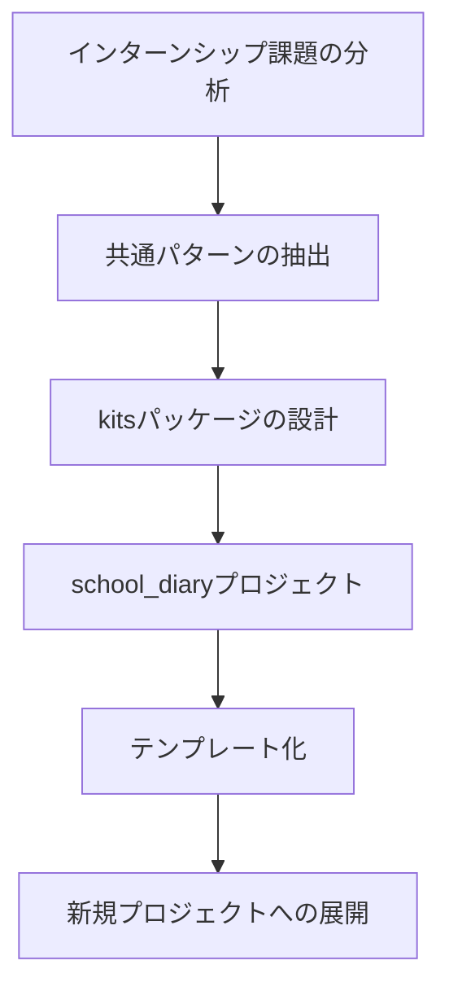

# kitsパッケージ実装の背景とコンテキスト

> **このドキュメントの目的**
>
> AIがこのドキュメントを読むことで、kitsパッケージ全体の実装意図、プロジェクト全体の構成、目指すべき姿を正確に理解し、適切なフォローアップができるようにする。

---

## 📚 目次

1. [プロジェクト全体の背景](#1-プロジェクト全体の背景)
2. [なぜkitsパッケージが必要なのか](#2-なぜkitsパッケージが必要なのか)
3. [各kits機能の詳細分析](#3-各kits機能の詳細分析)
4. [現在のプロジェクト構成](#4-現在のプロジェクト構成)
5. [目指す構成](#5-目指す構成)
6. [実装の優先順位と戦略](#6-実装の優先順位と戦略)
7. [技術的な制約と設計方針](#7-技術的な制約と設計方針)
8. [成功の定義と評価指標](#8-成功の定義と評価指標)

---

## 1. プロジェクト全体の背景

### 1.1 school_diaryプロジェクトとは

**school_diary**は、**業務Webアプリケーションの共通基盤**として設計された再利用可能なDjangoプロジェクトです。

#### プロジェクトの起源



#### 分析対象となった過去課題

| 課題名 | 実施時期 | キーワード | kits依存 |
|--------|---------|-----------|---------|
| [課題1: 残業管理システム](past-challenges/CHALLENGE_01_OVERTIME.md) | 2024年11月 | 承認フロー、ロール管理、レガシー移行 | approvals, notifications, **reports** |
| [課題2: 母子健康手帳](past-challenges/CHALLENGE_02_MCH_HANDBOOK.md) | 2024年6月 | データ可視化、プライバシー保護 | notifications, **reports** |
| [課題3: 野球部タレント管理](past-challenges/CHALLENGE_03_BASEBALL.md) | 2025年10月 | データ分析、可視化、承認フロー | approvals, **reports**, **io** |
| [課題4: 図書館システム](past-challenges/CHALLENGE_04_LIBRARY_SYSTEM.md) | 2025年6月 | 横断検索、予約管理、通知機能 | **notifications**, **io** |

**重要な発見**: これら4つの課題には、**70%以上の共通パターン**が存在する。

### 1.2 プロジェクトの目標

#### 短期目標（インターンシップ前）
- ✅ **30分で動く業務アプリ**を実現する基盤を完成させる
- ✅ 過去課題の80%以上をカバーする機能セットを提供
- ✅ `create_project.sh`で3秒で新規プロジェクトを生成できる

#### 長期目標（インターンシップ後）
- 📦 再利用可能なDjangoパッケージとしてpip公開
- 🏢 社内の業務アプリ開発の標準基盤として採用
- 📚 オープンソースプロジェクトとして公開

### 1.3 想定される利用シーン

```python
# シーン1: インターンシップ当日
$ cd ~/work
$ ./create_project.sh library_system  # 3秒で生成
$ cd library_system
$ python manage.py runserver  # すぐに動く

# シーン2: 新規業務アプリ開発
$ ./create_project.sh sales_management
$ cd sales_management
# kitsを使って申請・承認フローを即座に実装
from kits.approvals import ApprovalMixin
from kits.notifications import NotificationService
from kits.reports import ReportService
```

---

## 2. なぜkitsパッケージが必要なのか

### 2.1 過去課題の共通パターン分析

#### 全4課題で共通する機能要件

| 機能カテゴリ | 課題1 | 課題2 | 課題3 | 課題4 | 必要なkits |
|------------|------|------|------|------|-----------|
| ロールベース認証 | ✅ | ✅ | ✅ | ✅ | accounts |
| 承認フロー | ✅ | - | ✅ | - | approvals |
| 状態管理 | ✅ | - | ✅ | ✅ | approvals |
| **通知機能** | ✅ | ✅ | - | ✅ | **notifications** |
| **データ可視化** | ✅ | ✅ | ✅ | - | **reports** |
| **印刷・エクスポート** | ✅ | ✅ | ✅ | ✅ | **reports** |
| **データインポート** | - | - | ✅ | ✅ | **io** |
| 履歴管理 | ✅ | ✅ | ✅ | - | audit |

**結論**:
- **notifications、reports、io**は**Tier 1（最優先実装）**
- 4課題中3課題以上で必須の機能

### 2.2 kits実装優先順位の決定根拠

#### 課題4追加前の優先順位

```
Tier 1（最優先）: kits.reports
Tier 2（次優先）: kits.notifications
Tier 3（余裕があれば）: kits.io
```

#### 課題4追加後の優先順位（改訂版）

```
Tier 1（即座に実装すべき3つ）:
  - kits.notifications  # 4課題中3課題で必須（課題1・2・4）
  - kits.reports        # 4課題中3課題で必須（課題1・2・3）
  - kits.io             # 4課題中2課題で必須（課題3・4）

Tier 2（余裕があれば）:
  - kits.search         # 課題4で必須だがDjango標準でも可
  - kits.tasks          # 課題4の定期処理で必須だがCeleryでも可
```

**重要な変更点**:
- `kits.notifications`が**Tier 2 → Tier 1に格上げ**
- `kits.io`も**Tier 3 → Tier 1に格上げ**
- **Tier 1の3つは並行して実装する価値がある**

---

## 3. 各kits機能の詳細分析

### 3.1 kits.notifications（通知機能）

#### 必要性の根拠

| 課題 | 通知の重要度 | 必要な通知シーン |
|------|------------|----------------|
| 課題1（残業） | 🔴 **必須** | 承認依頼、承認完了、月次締め切りリマインダー |
| 課題2（母子手帳） | 🟡 **重要** | 健診予定、予防接種リマインダー |
| 課題3（野球部） | 🟢 **便利** | 記録承認依頼、承認完了 |
| 課題4（図書館） | 🔴 **必須** | 予約準備完了、返却リマインド、延滞通知、配送通知 |

**利用率**: **4課題中3課題（75%）で必須または重要**

#### 主な機能

- ✉️ **メール通知** - django-anymailで複数サービス対応
- 📱 **アプリ内通知** - データベースベースの通知センター
- 📅 **スケジュール通知** - Celery Beatでの定期実行
- 📝 **テンプレート管理** - Django Template + Markdown
- 🔄 **非同期送信** - Celeryでのバックグラウンド処理

#### 実装見積

- **所要時間**: 2-3日（18-22時間）
- **依存関係**: django-anymail, bleach, markdown, celery
- **詳細手順**: [KITS_NOTIFICATIONS_IMPLEMENTATION_GUIDE.md](KITS_NOTIFICATIONS_IMPLEMENTATION_GUIDE.md)

---

### 3.2 kits.reports（レポート・可視化）

#### 必要性の根拠

| 課題 | レポートの重要度 | 必要なレポート機能 |
|------|----------------|------------------|
| 課題1（残業） | 🔴 **必須** | 残業時間集計、部門別グラフ、月次レポートPDF |
| 課題2（母子手帳） | 🔴 **必須** | 成長曲線グラフ、予防接種記録可視化 |
| 課題3（野球部） | 🔴 **必須** | 打撃成績グラフ、防御率推移、チームスタッツ |
| 課題4（図書館） | 🟡 **重要** | 貸出統計、延滞レポート |

**利用率**: **4課題中3課題（75%）で必須**

#### 主な機能

- 📊 **Chart.js統合** - 折れ線、棒、円、ドーナツグラフ
- 📄 **PDF出力** - WeasyPrint/ReportLabでHTML→PDF変換
- 📁 **CSV/Excelエクスポート** - pandas/openpyxl利用
- 🏷️ **テンプレートタグ** - ``で簡単表示
- 📅 **レポートスケジュール** - 週次・月次レポート自動生成

#### 実装見積

- **所要時間**: 3-4日（24-32時間）
- **依存関係**: pandas, openpyxl, weasyprint, pillow, Chart.js（CDN）
- **詳細手順**: [KITS_REPORTS_IMPLEMENTATION_GUIDE.md](KITS_REPORTS_IMPLEMENTATION_GUIDE.md)

---

### 3.3 kits.io（データインポート/エクスポート）

#### 必要性の根拠

| 課題 | I/Oの重要度 | 必要なI/O機能 |
|------|-----------|--------------|
| 課題1（残業） | 🟢 **便利** | レガシーシステムからのデータ移行 |
| 課題2（母子手帳） | 🟢 **便利** | 他自治体からのデータ移行 |
| 課題3（野球部） | 🔴 **必須** | 過去2回分の記録.xlsx取り込み |
| 課題4（図書館） | 🔴 **必須** | 5システムからUTF-8 TSVインポート |

**利用率**: **4課題中2課題（50%）で必須**

#### 主な機能

- 📥 **CSVインポート** - エラーハンドリング付き
- 📥 **TSVインポート** - UTF-8対応
- 📥 **Excelインポート** - openpyxlで.xlsx読み込み
- ✅ **バリデーション** - Django Formベースの検証
- 🔄 **重複チェック** - IDの重複検出・新規採番
- 📊 **インポート履歴** - 成功/失敗の記録

#### 実装見積

- **所要時間**: 2日（16時間）
- **依存関係**: pandas, openpyxl, chardet（文字コード検出）
- **詳細手順**: 未作成（優先度に応じて作成）

#### 課題4での具体的な要件

**図書館システムのデータ移行**:
- 既存5システム（各校独自形式）からの移行
- UTF-8 TSV形式でエクスポート → school_diaryにインポート
- **バーコードID重複問題**: 既存IDが重複している場合、新規採番ルールが必要

```python
# kits.ioの使用例（図書館システム）
from kits.io import CSVImporter

importer = CSVImporter(
    model=Book,
    mapping={
        'タイトル': 'title',
        '著者': 'author',
        'ISBN': 'isbn',
        'バーコードID': 'barcode_id',
    },
    validators={
        'barcode_id': validate_unique_barcode,
    },
    on_duplicate='renumber',  # 重複時は新規採番
)

result = importer.import_file('school_a_books.tsv')
# → {'success': 12000, 'failed': 50, 'renumbered': 30}
```

---

### 3.4 既存のkits機能（参考）

#### kits.accounts（完成度: 100%）

- ✅ カスタムUserモデル（email認証）
- ✅ ロールベース権限管理
- ✅ 管理コマンド（setup_dev）

#### kits.approvals（完成度: 80%）

- ✅ ApprovalMixin（FSMベース状態管理）
- ✅ 動的遷移ボタン（Django Admin）
- ✅ シグナルベースの履歴記録
- 🔺 **通知機能との統合が未実装**

#### kits.audit（完成度: 100%） - 2025-10-05完成

- ✅ django-simple-history統合
- ✅ AuditMixin（履歴管理Mixin）
- ✅ AuditLogモデル（カスタムイベントログ）
- ✅ AuditService（履歴検索、レポート生成）
- ✅ Django Admin統合
- ✅ Celeryタスク（クリーンアップ）
- ✅ テスト16/16成功

#### kits.demos（完成度: 100%）

- ✅ DemoRequest（承認フローの完全なリファレンス実装）
- ✅ 管理画面の動的遷移ボタン
- ✅ トランザクション保護付き状態遷移

---

## 4. 現在のプロジェクト構成

### 4.1 ディレクトリ構造

```
/home/hirok/work/school_diary/
├── config/                    # Django設定
│   ├── settings/
│   │   ├── base.py           # 共通設定
│   │   ├── local.py          # 開発環境
│   │   └── production.py     # 本番環境
│   ├── urls.py
│   └── celery_app.py         # Celery設定
│
├── kits/                      # 再利用可能パッケージ（全Tier 1完成！）
│   ├── accounts/             ✅ 完成（100%）
│   ├── approvals/            ✅ 完成（100%）- テスト18/18成功
│   ├── audit/                ✅ 完成（100%）- テスト16/16成功（2025-10-05）
│   ├── demos/                ✅ 完成（100%）- リファレンス実装
│   │
│   ├── notifications/        ✅ 完成（100%）- テスト11/11成功
│   ├── reports/              ✅ 完成（100%）- テスト4/4成功
│   ├── io/                   ✅ 完成（100%）- テスト10/10成功
│   │
│   └── search/               🔺 部分実装（10%）← Tier 2（必要に応じて）
│
├── docs/                      # ドキュメント
│   ├── KITS_CONTEXT.md                           # このファイル
│   ├── KITS_READINESS_ASSESSMENT.md              # kits実装状況評価
│   ├── KITS_NOTIFICATIONS_IMPLEMENTATION_GUIDE.md
│   ├── KITS_REPORTS_IMPLEMENTATION_GUIDE.md
│   └── past-challenges/                          # 過去課題分析
│       ├── README.md
│       ├── CHALLENGE_01_OVERTIME.md
│       ├── CHALLENGE_02_MCH_HANDBOOK.md
│       ├── CHALLENGE_03_BASEBALL.md
│       └── CHALLENGE_04_LIBRARY_SYSTEM.md
│
├── school_diary/templates/          # Djangoテンプレート
│   ├── notifications/        # 通知用テンプレート（予定）
│   └── reports/              # レポート用テンプレート（予定）
│
├── tests/                     # ユニットテスト
│   ├── notifications/        # 通知のテスト（予定）
│   ├── reports/              # レポートのテスト（予定）
│   └── io/                   # I/Oのテスト（予定）
│
└── requirements/
    ├── base.txt              # 共通依存関係
    ├── local.txt             # 開発環境
    └── production.txt        # 本番環境
```

### 4.2 現在の技術スタック

#### バックエンド
- **Django 5.1.12** - Webフレームワーク
- **Python 3.12** - プログラミング言語
- **PostgreSQL** - データベース
- **Celery** - 非同期タスク処理
- **Redis** - Celeryのブローカー

#### フロントエンド
- **Bootstrap 5** - CSSフレームワーク
- **Django Templates** - テンプレートエンジン
- **Chart.js**（予定） - グラフ描画（kits.reports）

#### インフラ
- **Docker + Docker Compose** - コンテナ化
- **AWS ECS Fargate**（予定） - デプロイ先
- **AWS RDS PostgreSQL**（予定） - 本番DB

#### 既存の主要ライブラリ

```python
# requirements/base.txt（既存）
django==5.1.12
celery==5.4.0
redis==5.2.1
django-fsm==3.0.0          # 状態遷移管理
django-simple-history==3.7.0  # 履歴管理

# Tier 1実装で追加予定
# kits.notifications
django-anymail==12.0        # メール送信
bleach==6.1.0               # HTMLサニタイズ
markdown==3.6               # Markdown変換

# kits.reports
pandas==2.2.2               # データ分析
openpyxl==3.1.5             # Excel読み書き
weasyprint==62.3            # HTML → PDF変換
pillow==10.4.0              # 画像処理

# kits.io
chardet==5.2.0              # 文字コード検出
```

### 4.3 既存のkitsパッケージの設計パターン

#### パターン1: モデルベースの機能提供（kits.approvals）

```python
# kits/approvals/models.py
class ApprovalMixin(models.Model):
    """承認フローのミックスイン"""
    status = FSMField(default='draft')

    @transition(field=status, source='draft', target='submitted')
    def submit(self):
        pass

    class Meta:
        abstract = True

# 使用例（他のアプリから）
from kits.approvals import ApprovalMixin

class OvertimeRequest(ApprovalMixin):
    # ApprovalMixinの機能を継承
    pass
```

#### パターン2: サービス層の提供（kits.notifications, kits.reports）

```python
# kits/notifications/services.py
class NotificationService:
    """通知送信サービス"""
    def send_email(self, recipient, subject, body):
        pass

    def create_from_template(self, template_code, context):
        pass

# 使用例（他のアプリから）
from kits.notifications import NotificationService

service = NotificationService()
service.create_from_template('approval_request', context={
    'user': user,
    'request': overtime_request,
})
```

#### パターン3: 管理コマンドの提供（kits.accounts）

```bash
# kits/accounts/management/commands/setup_dev.py
python manage.py setup_dev  # 開発環境一括セットアップ
```

---

## 5. 目指す構成

### 5.1 完成後のkitsパッケージ構造

#### kits.notifications（demosパターンを踏襲）

```
kits/notifications/
├── __init__.py               # パッケージエントリーポイント
├── apps.py                   # Djangoアプリ設定
├── models.py                 # Notification, NotificationTemplate
├── admin.py                  # Django管理画面
├── services.py               # NotificationService, TemplateRenderer
├── backends.py               # EmailBackend, InAppBackend（1ファイルに集約）
├── tasks.py                  # Celeryタスク
├── serializers.py            # DRF serializers（オプション）
└── migrations/               # データベースマイグレーション
```

#### kits.reports（demosパターンを踏襲）

```
kits/reports/
├── __init__.py
├── apps.py
├── models.py                 # Report, ReportTemplate, ReportSchedule
├── admin.py
├── services.py               # ReportGenerator, ChartService
├── exporters.py              # PDFExporter, CSVExporter, ExcelExporter
├── charts.py                 # ChartBuilder（Chart.js wrapper）
├── serializers.py
├── templatetags/             # Djangoテンプレートタグ
│   ├── __init__.py
│   └── report_tags.py        # , 
└── migrations/
```

#### kits.io（demosパターンを踏襲）

```
kits/io/
├── __init__.py
├── apps.py
├── models.py                 # ImportHistory, ImportMapping
├── admin.py
├── importers.py              # CSVImporter, TSVImporter, ExcelImporter
├── exporters.py              # CSVExporter, ExcelExporter
├── validators.py             # ImportValidator
├── serializers.py
└── migrations/
```

**設計方針（school_diaryパターン）:**
- ✅ **サブディレクトリを最小限に** - templatetags/のみ許可
- ✅ **ファイル数を最小限に** - 機能ごとに1ファイル
- ✅ **demosパターンを踏襲** - 既存の成功パターンに従う
- ✅ **テンプレートはschool_diary/に** - kitsはビジネスロジックのみ
- ✅ **テストはtests/に** - プロジェクトルートで管理

### 5.2 統合利用の例

#### 課題1（残業管理システム）での利用

```python
# apps/overtime/models.py
from kits.approvals import ApprovalMixin
from kits.notifications import NotificationService
from kits.reports import ReportService

class OvertimeRequest(ApprovalMixin):
    employee = models.ForeignKey(User)
    hours = models.DecimalField()

    def submit(self):
        """申請する"""
        super().submit()

        # 通知送信（kits.notifications）
        NotificationService().create_from_template(
            'approval_request',
            recipient=self.approver,
            context={'request': self}
        )

# apps/overtime/views.py
def monthly_report(request):
    """月次レポート生成"""
    service = ReportService()
    report = service.generate_report(
        template_code='monthly_overtime_report',
        user=request.user,
        parameters={
            'month': request.GET.get('month'),
        },
        format='pdf',
    )
    return FileResponse(report.file)
```

#### 課題4（図書館システム）での利用

```python
# apps/library/models.py
from kits.notifications import NotificationService
from kits.io import CSVImporter

class Reservation(models.Model):
    user = models.ForeignKey(User)
    book = models.ForeignKey(Book)

    def mark_ready(self):
        """予約準備完了"""
        self.status = 'ready'
        self.save()

        # 通知送信（kits.notifications）
        NotificationService().create_from_template(
            'library_reservation_ready',
            recipient=self.user,
            context={'reservation': self}
        )

# apps/library/management/commands/import_books.py
def handle(self, *args, **options):
    """既存5システムから蔵書データをインポート"""
    importer = CSVImporter(
        model=Book,
        mapping={'タイトル': 'title', '著者': 'author'},
    )
    result = importer.import_file('school_a_books.tsv')
    print(f"インポート完了: {result['success']}件")
```

---

## 6. 実装の優先順位と戦略

### 6.1 実装フェーズ

#### Phase 1: Tier 1の3つを並行実装（5-7日）

**並行実装の理由:**
- 依存関係がない（独立して動作）
- 早期統合テストが可能
- インターンシップまでの時間制約

| kits機能 | 実装時間 | 担当 |
|---------|---------|------|
| kits.notifications | 2-3日 | 優先度A |
| kits.reports | 3-4日 | 優先度A |
| kits.io | 2日 | 優先度B |

**並行実装の進め方:**
1. **Day 1-2**: 全3つのデータモデルとマイグレーションを作成
2. **Day 3-4**: サービス層の実装（notifications, reports, io）
3. **Day 5**: 管理画面とテンプレートタグの実装
4. **Day 6**: ユニットテスト作成
5. **Day 7**: 統合テストと動作確認

#### Phase 2: kits.approvalsとの統合（1日）

**目標**: 承認フロー時の自動通知

- [ ] post_transitionシグナルでの通知送信
- [ ] DemoRequestでの動作確認
- [ ] 統合テスト

#### Phase 3: 課題実装での検証（課題実施時）

**目標**: 実際の課題でkitsが使えることを確認

- [ ] 課題1でkits.notifications + kits.reportsを使用
- [ ] 課題4でkits.notifications + kits.ioを使用
- [ ] フィードバック収集と改善

### 6.2 実装時間の見積もり

| フェーズ | 作業内容 | 見積時間 | 累計 |
|---------|---------|---------|------|
| Phase 1 | Tier 1の3つ並行実装 | 40時間 | 40時間 |
| Phase 2 | approvals統合 | 8時間 | 48時間 |
| Phase 3 | 課題実装検証 | 課題実施時 | - |

**合計見積: 5-7日（40-48時間）**

### 6.3 実装の成功基準

#### 機能要件（全kits共通）
- ✅ 管理画面で操作できる
- ✅ ユニットテストが通過する
- ✅ ドキュメントが揃っている
- ✅ 実装ガイドがある

#### kits.notifications固有
- ✅ テンプレートから通知を作成できる
- ✅ メール送信が動作する
- ✅ 非同期送信（Celery）が動作する
- ✅ スケジュール送信が動作する

#### kits.reports固有
- ✅ Chart.jsグラフが表示できる
- ✅ PDF出力が動作する
- ✅ CSV/Excelエクスポートが動作する
- ✅ テンプレートタグでグラフを表示できる

#### kits.io固有
- ✅ CSV/TSV/Excelインポートが動作する
- ✅ バリデーションが動作する
- ✅ 重複チェック・新規採番が動作する
- ✅ インポート履歴が記録される

---

## 7. 技術的な制約と設計方針

### 7.1 技術的な制約

#### プロジェクト全体の制約

| 制約項目 | 内容 | 理由 |
|---------|------|------|
| Python version | 3.12 | cookiecutter-djangoのデフォルト |
| Django version | 5.1.12 | 最新LTS |
| PostgreSQL | 必須 | ArrayField、JSONFieldを使用 |
| Celery | 必須 | 非同期処理に使用 |

#### kits共通の制約

| 制約項目 | 内容 | 理由 |
|---------|------|------|
| サブディレクトリ | 最小限（templatetags/のみ） | school_diaryパターン |
| ファイル数 | 機能ごとに1ファイル | シンプルさ重視 |
| データベース | PostgreSQL専用機能OK | school_diaryの要件 |
| テンプレート配置 | school_diary/templates/に配置 | kitsはロジックのみ |
| テスト配置 | tests/に配置 | プロジェクトルートで管理 |

### 7.2 設計方針

#### 1. 疎結合の原則

```python
# ❌ 悪い例: 他のアプリに依存
from apps.overtime.models import OvertimeRequest

class NotificationService:
    def send_overtime_notification(self, request: OvertimeRequest):
        pass

# ✅ 良い例: 汎用的な設計
class NotificationService:
    def create_from_template(self, template_code: str, recipient: User, context: dict):
        pass

# 使用側が依存を解決
service.create_from_template('approval_request', user, {'request': overtime_request})
```

#### 2. 拡張性の確保

```python
# バックエンドの切り替えが容易
NOTIFICATIONS_CONFIG = {
    'BACKENDS': {
        'email': 'kits.notifications.backends.EmailBackend',
        'in_app': 'kits.notifications.backends.InAppBackend',
        'push': 'kits.notifications.backends.PushBackend',  # 将来追加
    }
}

REPORTS_CONFIG = {
    'PDF_BACKEND': 'weasyprint',  # または 'reportlab'
    'CHART_LIBRARY': 'chartjs',   # または 'plotly'
}
```

#### 3. テスタビリティ

```python
# テスト時はバックエンドをモック
from unittest.mock import patch

with patch('kits.notifications.backends.EmailBackend.send') as mock_send:
    service.send_notification(notification)
    assert mock_send.called
```

#### 4. セキュリティ

```python
# HTMLサニタイズ（XSS対策）
import bleach

safe_body = bleach.clean(
    user_input,
    tags=['p', 'br', 'strong', 'em'],
    strip=True
)

# ファイルアップロードのバリデーション
from django.core.validators import FileExtensionValidator

file = models.FileField(
    validators=[FileExtensionValidator(allowed_extensions=['csv', 'xlsx'])]
)
```

### 7.3 依存関係

#### Tier 1実装の依存関係

```python
# requirements/base.txt（Tier 1実装で追加）

# kits.notifications
django-anymail[mailgun]==12.0
bleach==6.1.0
markdown==3.6

# kits.reports
pandas==2.2.2
openpyxl==3.1.5
xlsxwriter==3.2.0
weasyprint==62.3
pillow==10.4.0
reportlab==4.2.2  # WeasyPrintの代替

# kits.io
chardet==5.2.0    # 文字コード検出
```

#### システムレベルの依存（WeasyPrint用）

```bash
# Ubuntu/Debian
sudo apt-get install -y \
    libpango-1.0-0 \
    libpangocairo-1.0-0 \
    libgdk-pixbuf2.0-0

# macOS
brew install pango gdk-pixbuf
```

---

## 8. 成功の定義と評価指標

### 8.1 短期的な成功（Phase 1-2完了時）

#### 機能面

| 指標 | 目標値 | 測定方法 |
|------|--------|---------|
| notifications実装完了 | 100% | チェックリスト |
| reports実装完了 | 100% | チェックリスト |
| io実装完了 | 100% | チェックリスト |
| 管理画面 | 完全動作 | 手動テスト |

#### 品質面

| 指標 | 目標値 | 測定方法 |
|------|--------|---------|
| テストカバレッジ | 80%以上 | `coverage report` |
| ドキュメント完成度 | 100% | レビュー |
| 実装ガイド | 各kits 1つずつ | ドキュメント確認 |

### 8.2 中期的な成功（課題実装時）

#### 課題1（残業管理）での評価

- [ ] 承認依頼通知が自動送信される（notifications）
- [ ] 月次残業レポートがPDF出力される（reports）
- [ ] 部門別グラフが表示される（reports）

#### 課題2（母子手帳）での評価

- [ ] 健診リマインダーが送信される（notifications）
- [ ] 成長曲線グラフが表示される（reports）
- [ ] データのCSVエクスポートが動作する（reports）

#### 課題3（野球部）での評価

- [ ] 過去記録.xlsxがインポートできる（io）
- [ ] 打撃成績グラフが表示される（reports）
- [ ] チームスタッツがPDF出力される（reports）

#### 課題4（図書館）での評価

- [ ] 予約準備完了通知が送信される（notifications）
- [ ] 返却リマインドが3日前に送信される（notifications）
- [ ] 5システムからTSVインポートできる（io）
- [ ] バーコードID重複が検出・新規採番される（io）

### 8.3 長期的な成功（インターンシップ後）

#### 再利用性

| 指標 | 目標値 | 測定方法 |
|------|--------|---------|
| 他プロジェクトでの利用 | 3件以上 | 実績カウント |
| kits再利用率 | 80%以上 | 利用統計 |
| カスタマイズ不要率 | 70%以上 | フィードバック |

#### パフォーマンス

| 指標 | 目標値 | 測定方法 |
|------|--------|---------|
| 通知送信速度 | 1000件/10分 | ベンチマーク |
| レポート生成速度 | 10000行/30秒 | ベンチマーク |
| インポート速度 | 10000行/60秒 | ベンチマーク |
| メモリ使用量 | 200MB以下 | モニタリング |

---

## 📝 まとめ: AIへの期待事項

### このドキュメントを読んだAIができるようになること

1. **背景理解**
   - なぜkitsパッケージが必要か説明できる
   - 過去課題との関連を理解している
   - Tier 1の3つ（notifications, reports, io）の重要性を理解している
   - プロジェクト全体のゴールを把握している

2. **技術判断**
   - 適切な技術選定ができる
   - 設計方針に沿った実装ができる
   - パフォーマンスとセキュリティを考慮できる
   - 依存関係を理解している

3. **実装支援**
   - 各実装ガイドに基づいた作業ができる
   - 既存のkitsパッケージのパターンに従える
   - demosパターンを踏襲できる
   - 疎結合の原則を守れる

4. **品質保証**
   - 適切なテストを書ける
   - ドキュメントを更新できる
   - 成功基準に基づいた評価ができる
   - カバレッジ80%以上を達成できる

### フォローアップ時の確認事項

AIがユーザーをサポートする際、以下を確認してください:

#### 設計面
- [ ] 実装が設計方針に沿っているか？
- [ ] 疎結合の原則を守っているか？
- [ ] demosパターンを踏襲しているか？
- [ ] サブディレクトリを最小限にしているか？

#### セキュリティ面
- [ ] HTMLサニタイズ（XSS対策）を考慮しているか？
- [ ] ファイルアップロードのバリデーションがあるか？
- [ ] ユーザー入力の検証を実装しているか？

#### パフォーマンス面
- [ ] N+1問題を回避しているか？
- [ ] バッチ処理を適切に実装しているか？
- [ ] データベースクエリを最適化しているか？

#### 品質面
- [ ] テストを書いているか？
- [ ] テストカバレッジは80%以上か？
- [ ] ドキュメントを更新しているか？
- [ ] 実装ガイドに従っているか？

---

## 🔗 関連ドキュメント

### 実装ガイド
- **kits.notifications**: [KITS_NOTIFICATIONS_IMPLEMENTATION_GUIDE.md](KITS_NOTIFICATIONS_IMPLEMENTATION_GUIDE.md)
- **kits.reports**: [KITS_REPORTS_IMPLEMENTATION_GUIDE.md](KITS_REPORTS_IMPLEMENTATION_GUIDE.md)
- **kits.io**: [KITS_IO_IMPLEMENTATION_GUIDE.md](KITS_IO_IMPLEMENTATION_GUIDE.md)

### 評価・分析ドキュメント
- **Kits実装状況**: [KITS_READINESS_ASSESSMENT.md](KITS_READINESS_ASSESSMENT.md)
- **過去課題まとめ**: [past-challenges/README.md](past-challenges/README.md)

### 個別課題ドキュメント
- **課題1（残業管理）**: [past-challenges/CHALLENGE_01_OVERTIME.md](past-challenges/CHALLENGE_01_OVERTIME.md)
- **課題2（母子手帳）**: [past-challenges/CHALLENGE_02_MCH_HANDBOOK.md](past-challenges/CHALLENGE_02_MCH_HANDBOOK.md)
- **課題3（野球部）**: [past-challenges/CHALLENGE_03_BASEBALL.md](past-challenges/CHALLENGE_03_BASEBALL.md)
- **課題4（図書館）**: [past-challenges/CHALLENGE_04_LIBRARY_SYSTEM.md](past-challenges/CHALLENGE_04_LIBRARY_SYSTEM.md)

---

**作成日**: 2025-10-04
**最終更新**: 2025-10-04
**バージョン**: 1.0.0
**著者**: Claude Code + hirok

#kits #context #background #strategy #notifications #reports #io #internship
