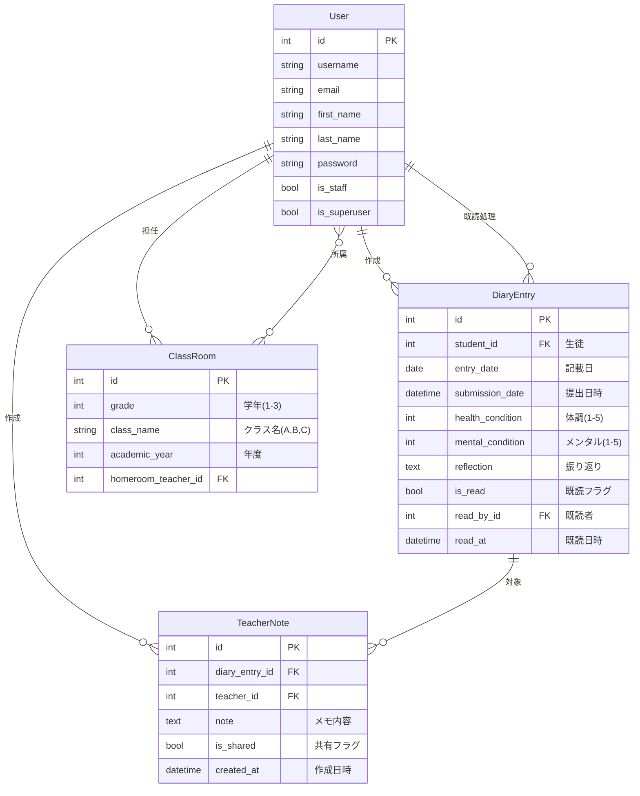

# 連絡帳管理システム データモデル設計書

> **作成日**: 2025-10-07
> **バージョン**: 1.0.0
> **ステータス**: Draft
> **対象**: 連絡帳管理システムPoC開発

---

## 📋 目次

1. [概要](#1-概要)
2. [ER図](#2-er図)
3. [テーブル定義](#3-テーブル定義)
4. [リレーション詳細](#4-リレーション詳細)
5. [データ整合性](#5-データ整合性)
6. [インデックス戦略](#6-インデックス戦略)

---

## 1. 概要

### 1.1 データモデルの方針

- **Django ORM**: Django標準のORMを使用
- **正規化**: 第三正規形まで正規化
- **柔軟性**: 将来の機能拡張に対応可能な設計
- **パフォーマンス**: 適切なインデックス設定

### 1.2 主要エンティティ

| エンティティ | 説明 | モデル名 |
|------------|------|---------|
| **ユーザー** | 生徒・担任・管理者の基本情報 | User（Django標準） |
| **クラス** | 学年・クラスの情報 | ClassRoom |
| **連絡帳エントリー** | 生徒の連絡帳記録 | DiaryEntry |
| **教師メモ** | 担任のメモ（課題2） | TeacherNote |

---

## 2. ER図

### 2.1 全体構成



### 2.2 リレーション概要

```
User (生徒) --< DiaryEntry (連絡帳)
User (担任) --< DiaryEntry (既読処理)
User (担任) --< ClassRoom (担任)
User (生徒) >--< ClassRoom (所属) [ManyToMany]
DiaryEntry --< TeacherNote (教師メモ)
User (担任) --< TeacherNote (作成者)
```

---

## 3. テーブル定義

### 3.1 User（ユーザー）

Django標準の`django.contrib.auth.models.User`を使用。

| カラム名 | 型 | 制約 | 説明 |
|---------|------|------|------|
| id | BigAutoField | PK | 主キー |
| username | CharField(150) | UNIQUE, NOT NULL | ユーザー名（ログインID） |
| email | EmailField(254) | UNIQUE | メールアドレス |
| first_name | CharField(150) | - | 名 |
| last_name | CharField(150) | - | 姓 |
| password | CharField(128) | NOT NULL | ハッシュ化パスワード |
| is_staff | BooleanField | NOT NULL, default=False | 管理画面アクセス権 |
| is_superuser | BooleanField | NOT NULL, default=False | スーパーユーザー権限 |
| is_active | BooleanField | NOT NULL, default=True | アクティブフラグ |
| date_joined | DateTimeField | NOT NULL | 登録日時 |

**ロール管理**:
- 生徒: `is_staff=False`, `is_superuser=False`
- 担任: `is_staff=True`, `is_superuser=False`
- 管理者: `is_staff=True`, `is_superuser=True`

**実装ファイル**: Django標準（カスタマイズなし）

---

### 3.2 ClassRoom（クラス）

学年・クラスの情報を管理。

| カラム名 | 型 | 制約 | 説明 |
|---------|------|------|------|
| id | BigAutoField | PK | 主キー |
| grade | IntegerField | NOT NULL, choices=(1-3) | 学年 |
| class_name | CharField(10) | NOT NULL, choices=(A,B,C) | クラス名 |
| academic_year | IntegerField | NOT NULL, default=2025 | 年度 |
| homeroom_teacher_id | ForeignKey(User) | NULL | 担任（User.id） |

**制約**:
- `unique_together = ["grade", "class_name", "academic_year"]`
  - 同じ年度・学年・クラス名は一意
- `ordering = ["academic_year", "grade", "class_name"]`

**ManyToManyリレーション**:
- `students`: 生徒一覧（User の ManyToMany）
  - 中間テーブル: `diary_classroom_students`

**choices定義**:
```python
GRADE_CHOICES = [
    (1, "1年"),
    (2, "2年"),
    (3, "3年"),
]

CLASS_NAME_CHOICES = [
    ("A", "A組"),
    ("B", "B組"),
    ("C", "C組"),
]
```

**プロパティ**:
- `student_count`: 生徒数を返す

**文字列表現**:
```python
def __str__(self):
    return f"{self.academic_year}年度 {self.get_grade_display()}{self.get_class_name_display()}"
    # 例: "2025年度 1年A組"
```

**実装ファイル**: `school_diary/diary/models.py`

---

### 3.3 DiaryEntry（連絡帳エントリー）

生徒の連絡帳記録を管理。課題1の中核となるモデル。

| カラム名 | 型 | 制約 | 説明 |
|---------|------|------|------|
| id | BigAutoField | PK | 主キー |
| student_id | ForeignKey(User) | NOT NULL | 生徒（User.id） |
| entry_date | DateField | NOT NULL | 記載日（前登校日の日付） |
| submission_date | DateTimeField | NOT NULL, default=now | 提出日時 |
| health_condition | IntegerField | NOT NULL, choices=(1-5), default=3 | 体調 |
| mental_condition | IntegerField | NOT NULL, choices=(1-5), default=3 | メンタル |
| reflection | TextField | NOT NULL | 振り返り内容 |
| is_read | BooleanField | NOT NULL, default=False | 既読フラグ |
| read_by_id | ForeignKey(User) | NULL | 既読者（担任のUser.id） |
| read_at | DateTimeField | NULL | 既読日時 |

**制約**:
- `unique_together = ["student", "entry_date"]`
  - 一人の生徒が一日に一つのエントリーのみ
- `ordering = ["-entry_date", "student__last_name", "student__first_name"]`
  - 新しい日付順、生徒名順

**インデックス**:
```python
indexes = [
    models.Index(fields=["entry_date"]),  # 日付検索の高速化
    models.Index(fields=["is_read"]),     # 未読検索の高速化
]
```

**choices定義**:
```python
CONDITION_CHOICES = [
    (1, "とても悪い"),
    (2, "悪い"),
    (3, "普通"),
    (4, "良い"),
    (5, "とても良い"),
]

MENTAL_CHOICES = [
    (1, "とても落ち込んでいる"),
    (2, "落ち込んでいる"),
    (3, "普通"),
    (4, "元気"),
    (5, "とても元気"),
]
```

**メソッド**:
```python
def mark_as_read(self, teacher):
    """既読処理（イイネスタンプ）"""
    self.is_read = True
    self.read_by = teacher
    self.read_at = timezone.now()
    self.save()
```

**プロパティ**:
```python
@property
def is_editable(self):
    """編集可能かどうか（既読前のみ編集可）"""
    return not self.is_read
```

**文字列表現**:
```python
def __str__(self):
    student_name = self.student.get_full_name() or self.student.username
    return f"{student_name} - {self.entry_date}"
    # 例: "山田太郎 - 2025-10-07"
```

**実装ファイル**: `school_diary/diary/models.py`

---

### 3.4 TeacherNote（教師メモ）

担任が気になった生徒にメモを残す機能（課題2）。

| カラム名 | 型 | 制約 | 説明 |
|---------|------|------|------|
| id | BigAutoField | PK | 主キー |
| diary_entry_id | ForeignKey(DiaryEntry) | NOT NULL | 連絡帳エントリー |
| teacher_id | ForeignKey(User) | NOT NULL | 担任（User.id） |
| note | TextField | NOT NULL | メモ内容 |
| is_shared | BooleanField | NOT NULL, default=False | 学年会議で共有フラグ |
| created_at | DateTimeField | NOT NULL, default=now | 作成日時 |

**制約**:
- `ordering = ["-created_at"]`
  - 新しいメモが上に表示

**文字列表現**:
```python
def __str__(self):
    teacher_name = self.teacher.get_full_name() or self.teacher.username
    student_name = self.diary_entry.student.get_full_name()
    return f"{teacher_name} → {student_name}"
    # 例: "佐藤先生 → 山田太郎"
```

**実装ファイル**: `school_diary/diary/models.py`

---

## 4. リレーション詳細

### 4.1 DiaryEntry と User（生徒）

**リレーション**: 多対一（N:1）

```python
student = models.ForeignKey(
    settings.AUTH_USER_MODEL,
    on_delete=models.CASCADE,  # 生徒削除時、エントリーも削除
    related_name="diary_entries",
    verbose_name="生徒",
)
```

**使用例**:
```python
# 生徒から連絡帳エントリーを取得
student = User.objects.get(username="student1a01")
entries = student.diary_entries.all()

# エントリーから生徒を取得
entry = DiaryEntry.objects.get(id=1)
student = entry.student
```

### 4.2 DiaryEntry と User（既読者）

**リレーション**: 多対一（N:1）

```python
read_by = models.ForeignKey(
    settings.AUTH_USER_MODEL,
    on_delete=models.SET_NULL,  # 担任削除時、NULL に設定
    related_name="read_diary_entries",
    null=True,
    blank=True,
    verbose_name="既読者(担任)",
)
```

**使用例**:
```python
# 担任が既読処理したエントリー一覧
teacher = User.objects.get(username="teacher1a")
read_entries = teacher.read_diary_entries.all()
```

### 4.3 ClassRoom と User（担任）

**リレーション**: 多対一（N:1）

```python
homeroom_teacher = models.ForeignKey(
    settings.AUTH_USER_MODEL,
    on_delete=models.SET_NULL,  # 担任削除時、NULL に設定
    related_name="homeroom_classes",
    null=True,
    blank=True,
    verbose_name="担任",
)
```

**使用例**:
```python
# 担任が受け持つクラス一覧
teacher = User.objects.get(username="teacher1a")
classes = teacher.homeroom_classes.all()

# クラスの担任を取得
classroom = ClassRoom.objects.get(grade=1, class_name="A")
teacher = classroom.homeroom_teacher
```

### 4.4 ClassRoom と User（生徒）

**リレーション**: 多対多（N:M）

```python
students = models.ManyToManyField(
    settings.AUTH_USER_MODEL,
    related_name="classes",
    verbose_name="生徒",
    blank=True,
)
```

**中間テーブル**: `diary_classroom_students`（Django自動生成）

| カラム名 | 型 | 制約 | 説明 |
|---------|------|------|------|
| id | BigAutoField | PK | 主キー |
| classroom_id | ForeignKey(ClassRoom) | NOT NULL | クラスID |
| user_id | ForeignKey(User) | NOT NULL | 生徒（UserID） |

**使用例**:
```python
# クラスの生徒一覧
classroom = ClassRoom.objects.get(grade=1, class_name="A")
students = classroom.students.all()

# 生徒が所属するクラス一覧
student = User.objects.get(username="student1a01")
classes = student.classes.all()

# 生徒をクラスに追加
classroom.students.add(student)
```

### 4.5 TeacherNote と DiaryEntry

**リレーション**: 多対一（N:1）

```python
diary_entry = models.ForeignKey(
    DiaryEntry,
    on_delete=models.CASCADE,  # エントリー削除時、メモも削除
    related_name="teacher_notes",
    verbose_name="連絡帳エントリー",
)
```

**使用例**:
```python
# エントリーに付けられたメモ一覧
entry = DiaryEntry.objects.get(id=1)
notes = entry.teacher_notes.all()
```

### 4.6 TeacherNote と User（担任）

**リレーション**: 多対一（N:1）

```python
teacher = models.ForeignKey(
    settings.AUTH_USER_MODEL,
    on_delete=models.CASCADE,  # 担任削除時、メモも削除
    related_name="teacher_notes",
    verbose_name="担任",
)
```

**使用例**:
```python
# 担任が作成したメモ一覧
teacher = User.objects.get(username="teacher1a")
notes = teacher.teacher_notes.all()
```

---

## 5. データ整合性

### 5.1 主キー制約

全テーブルで `BigAutoField` を使用：
- 自動インクリメント
- 64bit整数（約920京件まで対応）

### 5.2 外部キー制約

| リレーション | on_delete | 理由 |
|------------|-----------|------|
| DiaryEntry.student | CASCADE | 生徒削除時、連絡帳も削除 |
| DiaryEntry.read_by | SET_NULL | 担任削除時、既読情報は残す（NULL） |
| ClassRoom.homeroom_teacher | SET_NULL | 担任削除時、クラスは残す |
| TeacherNote.diary_entry | CASCADE | エントリー削除時、メモも削除 |
| TeacherNote.teacher | CASCADE | 担任削除時、メモも削除 |

### 5.3 ユニーク制約

| テーブル | ユニーク制約 | 目的 |
|---------|-------------|------|
| DiaryEntry | (student, entry_date) | 一人の生徒が一日に一つのエントリーのみ |
| ClassRoom | (grade, class_name, academic_year) | 同じ年度・学年・クラスは一つのみ |
| User | username | ログインIDの一意性 |

### 5.4 NOT NULL制約

**必須フィールド**:
- DiaryEntry: student, entry_date, health_condition, mental_condition, reflection
- ClassRoom: grade, class_name, academic_year
- TeacherNote: diary_entry, teacher, note

**NULLable フィールド**:
- DiaryEntry: read_by, read_at（未読の場合）
- ClassRoom: homeroom_teacher（担任未割り当ての場合）

### 5.5 デフォルト値

| テーブル | カラム | デフォルト値 | 理由 |
|---------|-------|------------|------|
| DiaryEntry | submission_date | timezone.now | 提出時刻を自動記録 |
| DiaryEntry | health_condition | 3 | 「普通」をデフォルト |
| DiaryEntry | mental_condition | 3 | 「普通」をデフォルト |
| DiaryEntry | is_read | False | 未読で作成 |
| ClassRoom | academic_year | 2025 | 現在年度 |
| TeacherNote | is_shared | False | 非共有で作成 |
| TeacherNote | created_at | timezone.now | 作成時刻を自動記録 |

---

## 6. インデックス戦略

### 6.1 DiaryEntry のインデックス

```python
indexes = [
    models.Index(fields=["entry_date"]),  # 日付検索の高速化
    models.Index(fields=["is_read"]),     # 未読検索の高速化
]
```

**想定クエリ**:
```python
# 特定日のエントリー一覧
DiaryEntry.objects.filter(entry_date='2025-10-07')

# 未読エントリー一覧
DiaryEntry.objects.filter(is_read=False)
```

### 6.2 外部キーの自動インデックス

Djangoは外部キーに自動的にインデックスを作成：
- `DiaryEntry.student_id`
- `DiaryEntry.read_by_id`
- `ClassRoom.homeroom_teacher_id`
- `TeacherNote.diary_entry_id`
- `TeacherNote.teacher_id`

### 6.3 パフォーマンス考慮

**N+1問題の回避**:
```python
# 悪い例（N+1問題）
entries = DiaryEntry.objects.all()
for entry in entries:
    print(entry.student.get_full_name())  # 毎回SQLクエリ

# 良い例（JOINを使用）
entries = DiaryEntry.objects.select_related('student').all()
for entry in entries:
    print(entry.student.get_full_name())  # 1回のクエリで取得
```

**推奨クエリ**:
```python
# DiaryEntry の取得時
DiaryEntry.objects.select_related('student', 'read_by')

# ClassRoom の取得時
ClassRoom.objects.prefetch_related('students')

# TeacherNote の取得時
TeacherNote.objects.select_related('diary_entry__student', 'teacher')
```

---

## 7. マイグレーション履歴

### 7.1 初期マイグレーション

- `school_diary/diary/migrations/0001_initial.py`
  - DiaryEntry、ClassRoom、TeacherNote の作成
  - インデックス、制約の設定

### 7.2 マイグレーション実行

```bash
# マイグレーションファイル作成
python manage.py makemigrations

# マイグレーション適用
python manage.py migrate

# マイグレーション状態確認
python manage.py showmigrations diary
```

---

## 8. サンプルデータ

### 8.1 テストデータの構成

| データ | 件数 | 説明 |
|-------|------|------|
| User（管理者） | 1 | admin@example.com |
| User（担任） | 2 | teacher1a, teacher1b |
| User（生徒） | 10 | 各クラス5名ずつ |
| ClassRoom | 2 | 1年A組、1年B組 |
| DiaryEntry | 20-30 | 各生徒2-3件のエントリー |
| TeacherNote | 5-10 | 一部のエントリーにメモ |

### 8.2 テストデータ作成コマンド

```bash
# Djangoの管理コマンドで作成
python manage.py setup_test_data
```

詳細は `テスト計画書.md` を参照。

---

## 9. 関連ドキュメント

| ドキュメント | ファイルパス |
|------------|-------------|
| 要件定義書 | `docs-private/要件定義書.md` |
| 機能仕様書 | `docs-private/機能仕様書.md` |
| システムアーキテクチャ設計書 | `docs-private/システムアーキテクチャ設計書.md` |
| テスト計画書 | `docs-private/テスト計画書.md` |
| モデル実装ファイル | `school_diary/diary/models.py` |

---

## 10. 変更履歴

| バージョン | 日付 | 変更内容 | 作成者 |
|-----------|------|---------|--------|
| 1.0.0 | 2025-10-07 | 初版作成 | AI + hirok |

---

**作成者**: AI (Claude Code) + hirok
**最終更新**: 2025-10-07
