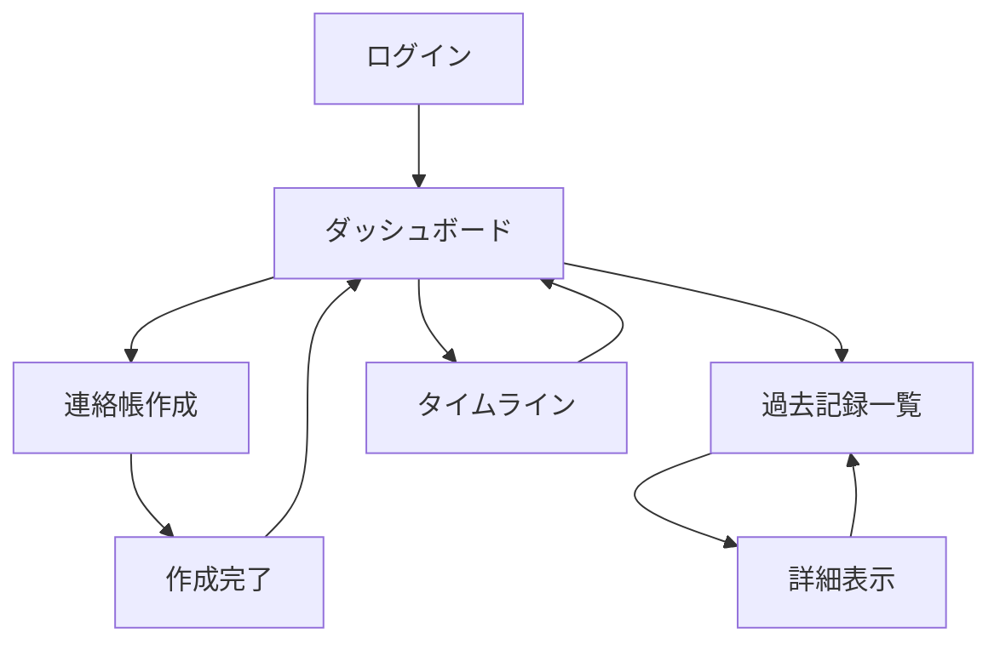
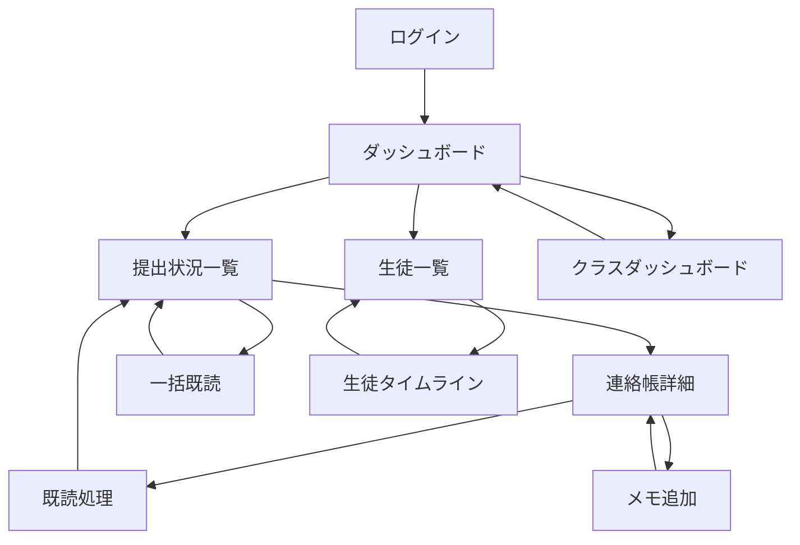
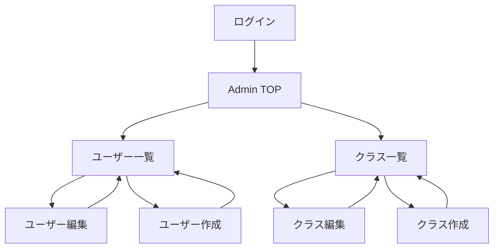

# 連絡帳管理システム 機能仕様書

> **作成日**: 2025-10-07
> **バージョン**: 1.0.0
> **ステータス**: Draft
> **対象**: 連絡帳管理システムPoC開発

---

## 📋 目次

1. [概要](#1-概要)
2. [ロール別機能一覧](#2-ロール別機能一覧)
3. [ユースケース詳細](#3-ユースケース詳細)
4. [画面遷移図](#4-画面遷移図)
5. [画面仕様](#5-画面仕様)

---

## 1. 概要

### 1.1 機能仕様書の目的

本ドキュメントは、連絡帳管理システムの各機能を詳細に定義し、実装の指針とする。

### 1.2 機能分類

| 分類 | 説明 | 対象ロール |
|-----|------|----------|
| **課題1（必須）** | 基本的な連絡帳管理機能 | 生徒、担任、管理者 |
| **課題2（改善提案）** | ヒアリングから抽出した改善機能 | 担任中心 |

---

## 2. ロール別機能一覧

### 2.1 生徒（Student）の機能

| 機能ID | 機能名 | 説明 | 画面 | 優先度 | 実装状況 |
|--------|--------|------|------|--------|---------|
| **S-01** | ダッシュボード表示 | 今日の提出状況、最新エントリー表示 | ダッシュボード | 必須 | 🔄 実装予定 |
| **S-02** | 連絡帳作成 | 前登校日の連絡帳を作成・提出 | 作成画面 | 必須 | 🔄 実装予定 |
| **S-03** | 連絡帳編集 | 未読の連絡帳を編集 | 編集画面 | 必須 | 🔄 実装予定 |
| **S-04** | 過去記録一覧 | 自分の過去記録を一覧表示 | 一覧画面 | 必須 | 🔄 実装予定 |
| **S-05** | 過去記録詳細 | 特定日のエントリー詳細表示 | 詳細画面 | 必須 | 🔄 実装予定 |
| **S-06** | タイムライン表示 | 体調・メンタルの推移グラフ | グラフ画面 | 課題2 | 📝 検討中 |
| **S-07** | 月次サマリー | 月間の振り返りレポート | サマリー画面 | 課題2 | 📝 検討中 |

### 2.2 担任（Homeroom Teacher）の機能

| 機能ID | 機能名 | 説明 | 画面 | 優先度 | 実装状況 |
|--------|--------|------|------|--------|---------|
| **T-01** | ダッシュボード表示 | 本日の提出状況、未読件数 | ダッシュボード | 必須 | 🔄 実装予定 |
| **T-02** | 提出状況一覧 | 日付別の提出・未提出一覧 | 一覧画面 | 必須 | 🔄 実装予定 |
| **T-03** | 連絡帳詳細閲覧 | 生徒の連絡帳内容を確認 | 詳細画面 | 必須 | 🔄 実装予定 |
| **T-04** | 個別既読処理 | イイネスタンプ（1件ずつ） | 詳細画面 | 必須 | ✅ 実装済み（Admin） |
| **T-05** | 一括既読処理 | 複数エントリーを一括既読 | 一覧画面 | 必須 | ✅ 実装済み（Admin） |
| **T-06** | 過去記録検索 | 担当クラスの過去記録を検索 | 検索画面 | 必須 | 📝 検討中 |
| **T-07** | 教師メモ作成 | 気になった生徒にメモ追加 | 詳細画面 | 課題2 | 🔄 実装予定 |
| **T-08** | 教師メモ共有 | 学年会議で共有フラグ設定 | メモ編集 | 課題2 | 🔄 実装予定 |
| **T-09** | クラスダッシュボード | 体調・メンタルの統計グラフ | ダッシュボード | 課題2 | 📝 検討中 |
| **T-10** | 生徒タイムライン | 個別生徒の時系列推移グラフ | グラフ画面 | 課題2 | 📝 検討中 |
| **T-11** | 提出状況フィルター | 未提出のみ表示等のフィルタ | 一覧画面 | 課題2 | 📝 検討中 |

### 2.3 管理者（Admin）の機能

| 機能ID | 機能名 | 説明 | 画面 | 優先度 | 実装状況 |
|--------|--------|------|------|--------|---------|
| **A-01** | ユーザー一覧 | 生徒・担任の一覧表示 | Admin画面 | 必須 | ✅ 実装済み |
| **A-02** | ユーザー作成 | 生徒・担任アカウントの作成 | Admin画面 | 必須 | ✅ 実装済み |
| **A-03** | ユーザー編集 | アカウント情報の編集 | Admin画面 | 必須 | ✅ 実装済み |
| **A-04** | クラス一覧 | クラスの一覧表示 | Admin画面 | 必須 | ✅ 実装済み |
| **A-05** | クラス作成 | 学年・クラスの作成 | Admin画面 | 必須 | ✅ 実装済み |
| **A-06** | クラス編集 | クラス情報・生徒割り当て | Admin画面 | 必須 | ✅ 実装済み |
| **A-07** | 担任割り当て | クラスへの担任割り当て | Admin画面 | 必須 | ✅ 実装済み |
| **A-08** | 生徒割り当て | クラスへの生徒割り当て | Admin画面 | 必須 | ✅ 実装済み |

**凡例**:
- ✅ 実装済み
- 🔄 実装予定
- 📝 検討中

---

## 3. ユースケース詳細

### 3.1 生徒の連絡帳作成・提出（S-02）

#### 基本情報

| 項目 | 内容 |
|-----|------|
| **ユースケースID** | UC-S-01 |
| **ユースケース名** | 生徒が連絡帳を作成・提出 |
| **アクター** | 生徒（Student） |
| **概要** | 前登校日の連絡帳を作成し、担任に提出する |

#### 前提条件

- 生徒がログイン済み
- 該当日（前登校日）のエントリーが未作成

#### 基本フロー

1. 生徒がダッシュボードから「連絡帳を書く」ボタンをクリック
2. システムが連絡帳作成画面を表示
3. システムが記載日（前登校日）を自動設定
4. 生徒が体調（1-5）を選択
5. 生徒がメンタル（1-5）を選択
6. 生徒が「今日の振り返り」を記入（テキストエリア）
7. 生徒が「提出」ボタンをクリック
8. システムがエントリーを保存（submission_date=現在時刻）
9. システムが成功メッセージを表示
10. システムがダッシュボードに遷移

#### 代替フロー

**3a. 同じ日のエントリーが既に存在する場合**
- システムが編集画面を表示（is_read=False の場合のみ）
- 生徒が内容を編集
- 7. に戻る

**7a. 必須フィールドが未入力の場合**
- システムがエラーメッセージを表示
- 生徒が入力を修正
- 7. に戻る

**7b. 既読処理済みのエントリーを編集しようとした場合**
- システムがエラーメッセージ「既読処理後は編集できません」を表示
- 処理を中断

#### 事後条件

- DiaryEntry レコードが作成される
- is_read = False（未読）
- submission_date = 現在時刻

---

### 3.2 担任の既読処理（T-04）

#### 基本情報

| 項目 | 内容 |
|-----|------|
| **ユースケースID** | UC-T-01 |
| **ユースケース名** | 担任が連絡帳を確認・既読処理 |
| **アクター** | 担任（Homeroom Teacher） |
| **概要** | 生徒の連絡帳を確認し、イイネスタンプ（既読）を押す |

#### 前提条件

- 担任がログイン済み
- 担当クラスに未読エントリーが存在

#### 基本フロー

1. 担任がダッシュボードから「提出状況」をクリック
2. システムが提出状況一覧を表示
   - 日付選択（デフォルト: 本日）
   - 生徒名、提出状態（提出済み/未提出）、既読状態（既読/未読）
3. 担任が未読の生徒名をクリック
4. システムが連絡帳詳細画面を表示
   - 生徒名、記載日
   - 体調、メンタル、振り返り内容
   - 「イイネ（既読）」ボタン
5. 担任が内容を確認
6. 担任が「イイネ（既読）」ボタンをクリック
7. システムが既読処理を実行
   - is_read = True
   - read_by = 担任のUser
   - read_at = 現在時刻
8. システムが成功メッセージ「既読処理が完了しました」を表示
9. システムが提出状況一覧に戻る

#### 代替フロー

**6a. 既に既読処理済みの場合**
- 「イイネ（既読）」ボタンが非活性
- 既読マーク（✓）が表示される
- 既読日時、既読者が表示される

**7a. 一括既読処理**
- 2. の提出状況一覧で複数エントリーを選択
- 「一括既読」ボタンをクリック
- システムが選択されたエントリー全てを既読処理
- 成功メッセージ「XX件を既読にしました」を表示

#### 事後条件

- DiaryEntry.is_read = True
- DiaryEntry.read_by = 担任
- DiaryEntry.read_at = 現在時刻
- エントリーが編集不可になる（is_editable = False）

---

### 3.3 担任の提出状況確認（T-02）

#### 基本情報

| 項目 | 内容 |
|-----|------|
| **ユースケースID** | UC-T-02 |
| **ユースケース名** | 担任が1日の提出状況を確認 |
| **アクター** | 担任（Homeroom Teacher） |
| **概要** | 担当クラスの生徒全員の提出状況を把握する |

#### 前提条件

- 担任がログイン済み
- 担当クラスが割り当てられている

#### 基本フロー

1. 担任がダッシュボードの「提出状況を見る」をクリック
2. システムが提出状況一覧を表示
   - デフォルト: 本日の日付
   - 日付選択ドロップダウン
3. システムが担当クラスの生徒一覧を表示
   - 生徒名（出席番号順）
   - 提出状態: 提出済み（✓）/ 未提出（×）
   - 既読状態: 既読（✓）/ 未読（未読マーク）
   - 体調・メンタルの数値（提出済みの場合）
4. 担任が日付を変更（任意）
5. システムが選択日の提出状況を再表示

#### 代替フロー

**4a. 未提出の生徒のみ表示**
- フィルター「未提出のみ」を選択
- システムが未提出の生徒のみ表示

**4b. 未読のみ表示**
- フィルター「未読のみ」を選択
- システムが未読エントリーのみ表示

#### 事後条件

- なし（閲覧のみ）

---

### 3.4 教師メモ作成・共有（T-07, T-08）

#### 基本情報

| 項目 | 内容 |
|-----|------|
| **ユースケースID** | UC-T-03 |
| **ユースケース名** | 担任が気になった生徒にメモを残す |
| **アクター** | 担任（Homeroom Teacher） |
| **概要** | 連絡帳を確認中に気になったことをメモし、必要に応じて学年会議で共有 |

#### 前提条件

- 担任がログイン済み
- 生徒の連絡帳詳細画面を表示中

#### 基本フロー

1. 担任が連絡帳詳細画面で「メモを追加」ボタンをクリック
2. システムがメモ入力フォームを表示
   - メモ内容（テキストエリア）
   - 「学年会議で共有する」チェックボックス
3. 担任がメモ内容を記入
4. 担任が共有の可否を選択（チェックボックス）
5. 担任が「保存」ボタンをクリック
6. システムがTeacherNoteレコードを作成
   - diary_entry: 現在のエントリー
   - teacher: 担任
   - note: メモ内容
   - is_shared: チェックボックスの状態
   - created_at: 現在時刻
7. システムが成功メッセージ「メモを保存しました」を表示
8. システムがメモ一覧を更新表示

#### 代替フロー

**3a. 既にメモが存在する場合**
- 既存のメモ一覧も表示
- 新しいメモを追加可能

**4a. 後から共有フラグを変更する場合**
- 既存メモの「編集」ボタンをクリック
- 共有フラグを変更
- 「更新」ボタンをクリック

#### 事後条件

- TeacherNote レコードが作成される
- 共有フラグがis_shared=True の場合、学年会議で参照可能

---

### 3.5 生徒タイムライン表示（T-10）

#### 基本情報

| 項目 | 内容 |
|-----|------|
| **ユースケースID** | UC-T-04 |
| **ユースケース名** | 担任が生徒の時系列推移を確認 |
| **アクター** | 担任（Homeroom Teacher） |
| **概要** | 特定生徒の体調・メンタルの推移をグラフで確認 |

#### 前提条件

- 担任がログイン済み
- 生徒に複数のエントリーが存在

#### 基本フロー

1. 担任が生徒一覧から生徒を選択
2. 担任が「タイムライン」タブをクリック
3. システムが体調・メンタルの折れ線グラフを表示
   - X軸: 日付
   - Y軸: 体調・メンタル（1-5）
   - 2本の折れ線（体調、メンタル）
4. システムが過去記録の一覧を時系列で表示
   - 日付、体調、メンタル、振り返りの抜粋
5. 担任が特定の日付をクリック
6. システムが該当日の詳細を表示

#### 代替フロー

**3a. 期間を指定する場合**
- 期間選択（最近7日間、最近30日間、全期間）
- システムが選択期間のグラフを表示

#### 事後条件

- なし（閲覧のみ）

---

### 3.6 管理者のクラス・ユーザー管理（A-01〜A-08）

#### 基本情報

| 項目 | 内容 |
|-----|------|
| **ユースケースID** | UC-A-01 |
| **ユースケース名** | 管理者がクラス・ユーザーを管理 |
| **アクター** | 管理者（Admin） |
| **概要** | Django Admin画面でクラス・ユーザー・割り当てを管理 |

#### 前提条件

- 管理者がログイン済み（is_superuser=True）

#### 基本フロー

**クラス作成**:
1. 管理者がAdmin画面の「クラス」をクリック
2. 「クラスを追加」ボタンをクリック
3. 学年、クラス名、年度を入力
4. 担任を選択（任意）
5. 「保存」ボタンをクリック
6. システムがClassRoomレコードを作成

**ユーザー作成**:
1. 管理者がAdmin画面の「ユーザー」をクリック
2. 「ユーザーを追加」ボタンをクリック
3. ユーザー名、パスワードを入力
4. 姓名、メールアドレスを入力
5. ロールを設定（is_staff、is_superuser）
6. 「保存」ボタンをクリック
7. システムがUserレコードを作成

**生徒割り当て**:
1. 管理者がAdmin画面の「クラス」から対象クラスを選択
2. 「生徒」のフィールドで生徒を複数選択
3. 「保存」ボタンをクリック
4. システムがManyToManyリレーションを更新

#### 事後条件

- クラス・ユーザーが作成される
- 割り当てが反映される

---

## 4. 画面遷移図

### 4.1 生徒の画面遷移



### 4.2 担任の画面遷移



### 4.3 管理者の画面遷移



---

## 5. 画面仕様

### 5.1 生徒 - ダッシュボード

#### 画面構成

```
+--------------------------------------------------+
| 連絡帳管理システム                  [ログアウト]    |
+--------------------------------------------------+
| ようこそ、山田太郎さん                              |
+--------------------------------------------------+
| 📊 今日の状況                                      |
| ・本日の連絡帳: 提出済み ✓                         |
| ・最新の提出日: 2025-10-07                        |
| ・未読: 0件                                       |
+--------------------------------------------------+
| [連絡帳を書く]  [過去の記録を見る]  [タイムライン]    |
+--------------------------------------------------+
| 📅 最近の提出履歴                                  |
| 2025-10-07 | 提出済み ✓ | 既読 ✓                  |
| 2025-10-04 | 提出済み ✓ | 既読 ✓                  |
| 2025-10-03 | 提出済み ✓ | 既読 ✓                  |
+--------------------------------------------------+
```

#### 主要要素

| 要素 | 説明 |
|-----|------|
| **今日の状況** | 本日の提出状況、最新提出日、未読件数 |
| **アクションボタン** | 連絡帳作成、過去記録、タイムライン |
| **最近の提出履歴** | 直近5件の提出履歴テーブル |

---

### 5.2 生徒 - 連絡帳作成画面

#### 画面構成

```
+--------------------------------------------------+
| 連絡帳を書く                          [戻る]       |
+--------------------------------------------------+
| 記載日: 2025-10-06（前登校日）                     |
+--------------------------------------------------+
| 体調:                                             |
| [1] とても悪い   [2] 悪い   [3] 普通              |
| [4] 良い         [5] とても良い                    |
+--------------------------------------------------+
| メンタル:                                         |
| [1] とても落ち込んでいる   [2] 落ち込んでいる      |
| [3] 普通   [4] 元気   [5] とても元気               |
+--------------------------------------------------+
| 今日の振り返り:                                    |
| +----------------------------------------------+ |
| |                                              | |
| |  （テキストエリア）                             | |
| |                                              | |
| +----------------------------------------------+ |
+--------------------------------------------------+
| [提出する]                                        |
+--------------------------------------------------+
```

#### 主要要素

| 要素 | 説明 |
|-----|------|
| **記載日** | 自動設定（前登校日） |
| **体調** | ラジオボタンまたはスライダー（1-5） |
| **メンタル** | ラジオボタンまたはスライダー（1-5） |
| **振り返り** | テキストエリア（500文字程度） |

---

### 5.3 担任 - 提出状況一覧

#### 画面構成

```
+--------------------------------------------------+
| 提出状況                              [戻る]       |
+--------------------------------------------------+
| 日付: [2025-10-07 ▼]  クラス: 1年A組              |
+--------------------------------------------------+
| フィルター: [全て ▼] [一括既読]                     |
+--------------------------------------------------+
| No | 生徒名   | 提出 | 既読 | 体調 | メンタル       |
|----|---------|------|------|------|--------------|
| 1  | 山田太郎  | ✓   | ✓   | 4    | 5           |
| 2  | 田中花子  | ✓   | -    | 3    | 3           |
| 3  | 佐藤次郎  | ×   | -    | -    | -           |
| 4  | 鈴木美咲  | ✓   | ✓   | 5    | 4           |
+--------------------------------------------------+
| 提出: 3/4名（75%）                                |
| 既読: 2/3件（67%）                                |
+--------------------------------------------------+
```

#### 主要要素

| 要素 | 説明 |
|-----|------|
| **日付選択** | ドロップダウンで日付変更 |
| **フィルター** | 全て/未提出のみ/未読のみ |
| **一括既読ボタン** | チェックボックスで選択後、一括処理 |
| **提出状況テーブル** | 生徒名、提出、既読、体調、メンタル |
| **統計情報** | 提出率、既読率 |

---

### 5.4 担任 - 連絡帳詳細画面

#### 画面構成

```
+--------------------------------------------------+
| 連絡帳詳細                            [戻る]       |
+--------------------------------------------------+
| 生徒: 山田太郎 (1年A組)                            |
| 記載日: 2025-10-06                                |
| 提出日時: 2025-10-07 08:30                        |
+--------------------------------------------------+
| 体調: ★★★★☆ (4 - 良い)                          |
| メンタル: ★★★★★ (5 - とても元気)                 |
+--------------------------------------------------+
| 今日の振り返り:                                    |
| 数学の授業で二次関数がでてきた。                    |
| 二次関数完全に理解した。                           |
| 部活ではバッティング練習を中心に行った。             |
+--------------------------------------------------+
| [イイネ（既読）]                                   |
+--------------------------------------------------+
| 教師メモ:                                         |
| +----------------------------------------------+ |
| | 2025-10-07 佐藤先生:                          | |
| | 数学の理解が進んでいる。引き続き見守る。         | |
| | [共有] ✓                                      | |
| +----------------------------------------------+ |
| [メモを追加]                                      |
+--------------------------------------------------+
```

#### 主要要素

| 要素 | 説明 |
|-----|------|
| **生徒情報** | 生徒名、クラス、記載日、提出日時 |
| **体調・メンタル** | 星マークで視覚化 |
| **振り返り内容** | テキスト表示 |
| **既読ボタン** | 未読の場合のみ表示 |
| **教師メモ** | 既存メモ一覧、追加フォーム |

---

### 5.5 担任 - 生徒タイムライン

#### 画面構成

```
+--------------------------------------------------+
| 生徒タイムライン                       [戻る]      |
+--------------------------------------------------+
| 生徒: 山田太郎 (1年A組)                            |
| 期間: [最近30日間 ▼]                              |
+--------------------------------------------------+
| 📈 体調・メンタルの推移                            |
| 5 |     ●---●           ●                        |
| 4 |   ●       ●     ●                            |
| 3 | ●           ●-●                               |
| 2 |                                               |
| 1 |                                               |
|   +---------------------------------------        |
|   10/1  10/5  10/10  10/15  10/20  10/25        |
|   体調: --- メンタル: ●                           |
+--------------------------------------------------+
| 📅 過去記録一覧                                    |
| 2025-10-07 | 体調: 4 | メンタル: 5              |
|   振り返り: 数学の授業で二次関数が...                |
| 2025-10-06 | 体調: 3 | メンタル: 4              |
|   振り返り: 体育で頑張り過ぎて...                    |
+--------------------------------------------------+
```

#### 主要要素

| 要素 | 説明 |
|-----|------|
| **グラフ** | Chart.jsで折れ線グラフ表示 |
| **期間選択** | 最近7日間、最近30日間、全期間 |
| **過去記録一覧** | 時系列でエントリー表示 |

---

### 5.6 管理者 - Django Admin画面

Django標準のAdmin画面を使用。

#### カスタマイズ内容

**ClassRoom Admin**:
- `list_display`: grade, class_name, academic_year, homeroom_teacher, student_count
- `list_filter`: grade, academic_year
- `search_fields`: homeroom_teacher__username
- `filter_horizontal`: students

**DiaryEntry Admin**:
- `list_display`: student, entry_date, health_condition, mental_condition, is_read
- `list_filter`: is_read, entry_date, health_condition, mental_condition
- `search_fields`: student__username, student__first_name, student__last_name
- `actions`: mark_as_read（一括既読アクション）

**TeacherNote Admin**:
- `list_display`: teacher, diary_entry, is_shared, created_at
- `list_filter`: is_shared, created_at
- `search_fields`: teacher__username, note

---

## 6. 関連ドキュメント

| ドキュメント | ファイルパス |
|------------|-------------|
| 要件定義書 | `docs-private/要件定義書.md` |
| データモデル設計書 | `docs-private/データモデル設計書.md` |
| システムアーキテクチャ設計書 | `docs-private/システムアーキテクチャ設計書.md` |
| テスト計画書 | `docs-private/テスト計画書.md` |

---

## 7. 変更履歴

| バージョン | 日付 | 変更内容 | 作成者 |
|-----------|------|---------|--------|
| 1.0.0 | 2025-10-07 | 初版作成 | AI + hirok |

---

**作成者**: AI (Claude Code) + hirok
**最終更新**: 2025-10-07
